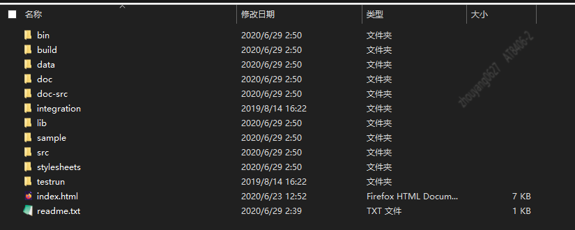

--In Blog
--Tags: HSQLDB

# HSQLDB源码环境搭建

>HSQLDB2.5.1,Java8

## 简介
HSQLDB（HyperSQL数据库）是用`Java`编写的领先的SQL关系数据库系统。它提供了一个小型，快速的`多线程事务型数据库引擎`，具有`基于内存`和`基于磁盘`的表，并支持嵌入式和服务器模式。它包括一个功能强大的命令行SQL工具和简单的GUI查询工具。     

HSQLDB支持在任何开源数据库引擎中看到的最广泛的SQL Standard功能：SQL：2016核心语言功能和SQL：2016可选功能的广泛列表。它支持完整的Advanced ANSI-92 SQL，只有两个例外。还支持标准的许多扩展，包括语法兼容模式和其他流行的数据库引擎的功能。    

HyperSQL是完全多线程的，并支持高性能2PL和MVCC（多版本并发控制）事务控制模型。请参阅最新版本的功能列表。     
HSQLDB经过20多年的不断发展，已在1700多个开源软件项目和许多商业产品中用作数据库和持久性引擎。最新版本非常稳定和可靠。它以其小巧的尺寸，完全或部分在内存中执行的能力，灵活性和速度而著称。    

`以下操作步骤，也可以参考官方文档`
http://hsqldb.org/doc/2.0/guide/building-app.html   

## 源码下载
SOURCEFORGE: https://sourceforge.net/projects/hsqldb/files/hsqldb/    hsqldb_2_5
`下载后的目录`


**src** 源码目录    
**lib** 包含客户端连接工具，这里可以先将lib重命名为 `libtools`  

> 注意: hsqldb项目是Ant编译，忽略项目中build关于Gradle的环境，因为它所依赖的Gradle版本过低，若使用Gradle作为编译环境，在导入项目过程中，会出现IDEA高版本不支持 Gradle太低的版本。   

## 导入IDEA
**1.** Open项目
IDEA操作步骤: File --> Open --> Open File or Project 选中hsqldb文件夹即可        
**2** 添加Ant build文件(build.xml)
添加 `build`文件夹下的`build.xml`


**3** 配置`Project Seetings`    
3.1 IDEA操作步骤：File --> Project Settings --> Project  配置Projct SDK、Project language level、Project compiler output。 我本地配置的是Java8      

3.2 添加缺失Libraries       
下载缺失的jar 请访问 https://github.com/xinzhuxiansheng/hsqldb main分支下的lib文件夹下 下载即可，并且将文件复制到项目的lib文件夹下。        
添加缺失的jar:  


## 启动main
**1.** 修改HSQLDB的启动端口     
修改 ServerConstants.java `请参考我的修改`   
```java
// default port for each protocol
int SC_DEFAULT_HSQL_SERVER_PORT  = 9701;
int SC_DEFAULT_HSQLS_SERVER_PORT = 554;
int SC_DEFAULT_HTTP_SERVER_PORT  = 9780;
int SC_DEFAULT_HTTPS_SERVER_PORT = 443;
int SC_DEFAULT_BER_SERVER_PORT   = 9101;
```

**2.** Server.java 启动main()
启动后，下面显示的成功启动后的日志输出：        
```java
[Server@2d209079]: Startup sequence initiated from main() method
[Server@2d209079]: Could not load properties from file
[Server@2d209079]: Using cli/default properties only
[Server@2d209079]: Initiating startup sequence...
[Server@2d209079]: Server socket opened successfully in 13 ms.
[Server@2d209079]: Database [index=0, id=0, db=file:test, alias=] opened successfully in 815 ms.
[Server@2d209079]: Startup sequence completed in 829 ms.
[Server@2d209079]: 2021-04-29 11:59:14.388 HSQLDB server 2.5.1 is online on port 9701
[Server@2d209079]: To close normally, connect and execute SHUTDOWN SQL
[Server@2d209079]: From command line, use [Ctrl]+[C] to abort abruptly
```

## 利用客户端连接服务端
**1.** 启动`GUI Client` 
cmd 进入项目的lib或者libtools文件夹下(前面我将源码的lib重命名，将缺失的jar分开存放) , 执行如下命令，启动`HSQL Database Manager`
```shell
Java -cp hsqldb.jar org.hsqldb.util.DatabaseManager
```
     
`注意，注意`    
**1.** Type:选择 HSQL Database Engine Server, 客户端连接的IDEA中启动的HSQL Server端。           
**2.** URL：jdbc:hsqldb:hsql://localhost:9701/  配置连接ip+端口 

点击**OK**即可  
**HSQL Database Manager 界面图**        
   


## SQL测试  
**1.** 创建user表
```shell
CREATE TABLE user (
  id int NOT NULL GENERATED BY DEFAULT AS IDENTITY,
  name varchar(255) DEFAULT NULL,
  PRIMARY KEY (id)
) ;
```

**2.** 添加user数据
```shell
insert into user values (null,'张三');
insert into user values (null,'李四');
insert into user values (null,'阿洋');
```

**3.** 查看user数据
```shell
select * from user;
```

      


>开发环境已经搭建完成并验证了。 从现在开始，让我们开始探索数据库相关的技术吧 :)。         

从阅读官网文档开始  
从调试单元测试开始
