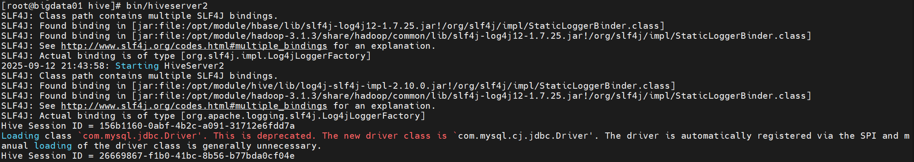
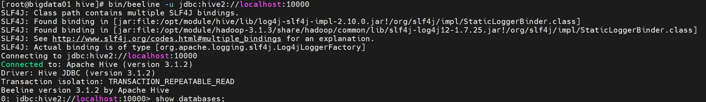

## 使用 Hive Cli 
在 hive 目录下执行 `bin/hive` 命令，启动 hive cli, 示例如下：   
```bash
bin/hive 
```

## 使用 beeline 客户端访问 hiveserver2 
执行 `bin/hiveserver2` 命令，启动 hivesererv2, 示例如下：  


执行 `bin/beeline -u jdbc:hive2://localhost:10000` 命令，连接 hiveserver2, 示例如下：    
