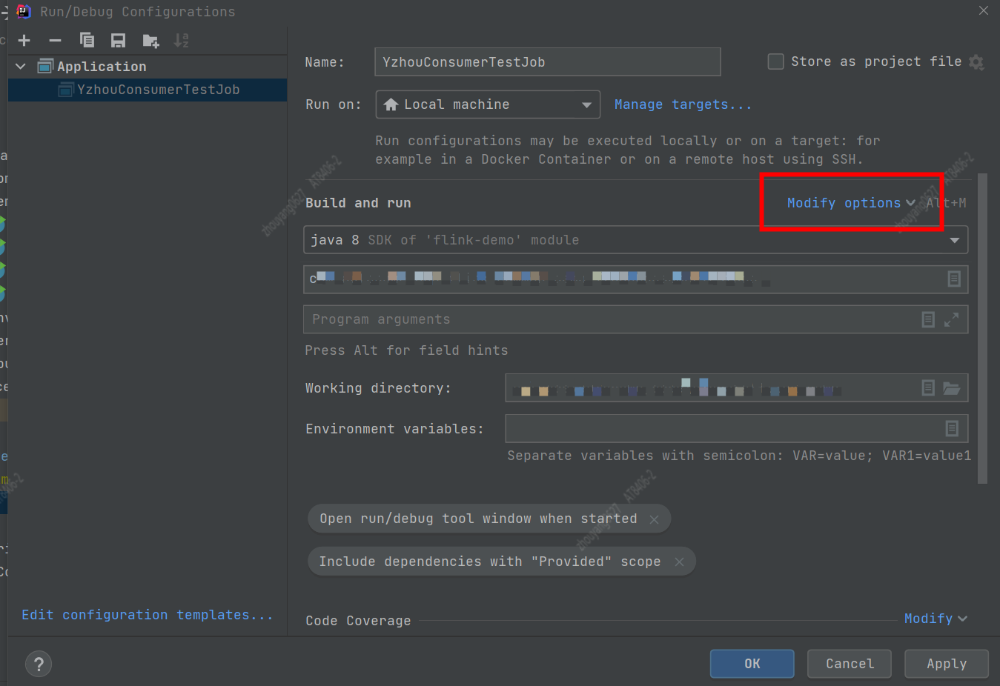
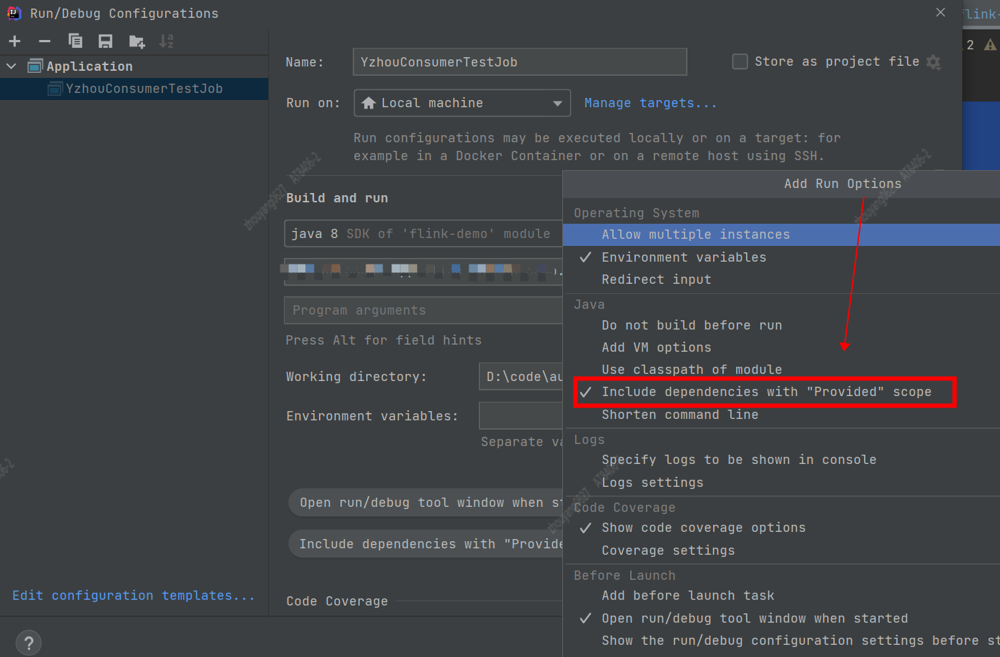

# Idea 配置Run/Debug Application包含Provided scope jar

## 1. 背景
以Maven作为依赖管理的Java项目中，Maven的dependency有6个依赖范围 
* compile(默认) 
* provided  
* runtime   
* test  
* system    
* import    

在很多情况，在项目`mvn clean package`过程中，有很多依赖不希望打进去，防止出现依赖冲突。 
在Flink的项目中，flink相关的依赖包不需要打进包中，所以需要将flink相关的jar配置scope为`provided`。   
```xml
<dependency>
    <groupId>org.apache.flink</groupId>
    <artifactId>flink-scala_${scala.binary.version}</artifactId>
    <version>${flink.version}</version>
    <scope>provided</scope>
</dependency>

<dependency>
    <groupId>org.apache.flink</groupId>
    <artifactId>flink-streaming-scala_${scala.binary.version}</artifactId>
    <version>${flink.version}</version>
    <scope>provided</scope>
</dependency>

<!--省略其他Flink jar-->
```

> 可在Idea中，执行run或者debug Flink的Application，又要将flink相关的jar设置成`compile`(默认是compile)。 频繁修改`pom.xml`中的scope配置很费事， 那如何能快速解决依赖生命周期切换问题？           

## 2. Idea 配置Run/Debug包含Provided scope jar
在Application的`Run/Debug Configurations`增加 `Include dependencies with "Provided scope"`配置项    
`操作步骤`



    


End !!!