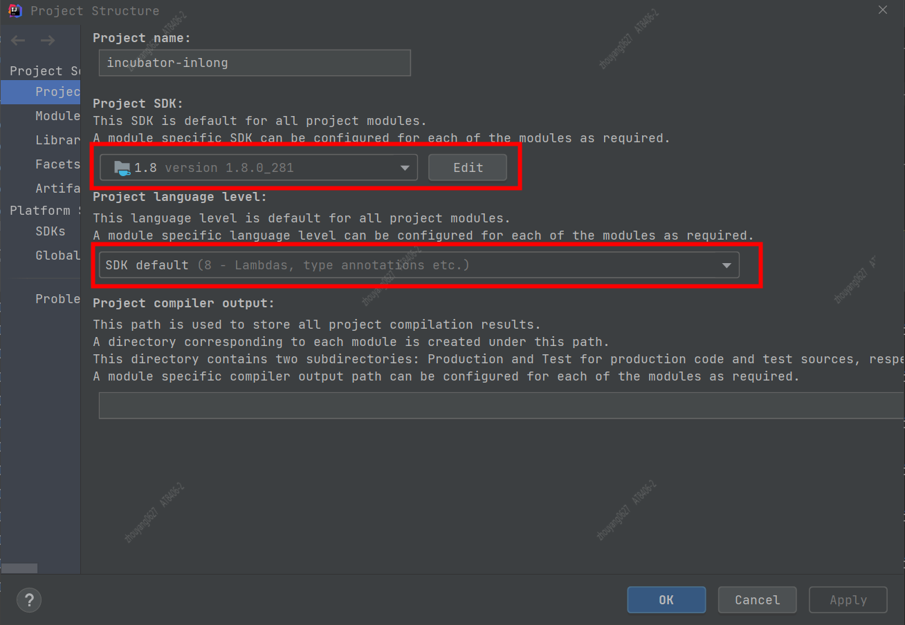
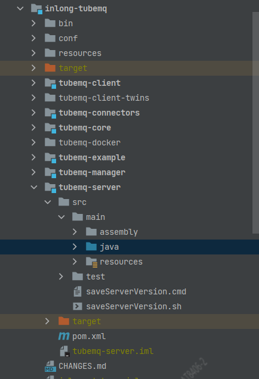
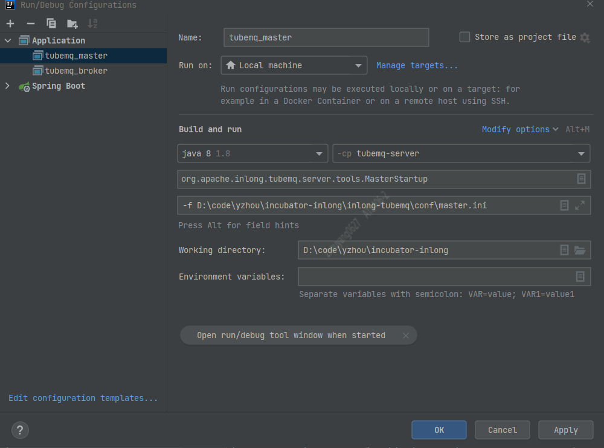

# Apache InLong - TubeMQ 源码环境搭建

## 1. clone + import

TubeMQ的项目： http://inlong.incubator.apache.org/zh-cn/docs/modules/tubemq/architecture.html

### 1.1 Download Apache InLong from github
Apache InLong的github地址： https://github.com/apache/incubator-inlong

```shell
git clone git@github.com:apache/incubator-inlong.git
```

### 1.2 Import into IDEA
根据 [快速开始 doc](http://inlong.incubator.apache.org/zh-cn/docs/modules/tubemq/quick_start.html)了解环境要求

**Require**
Java JDK 1.8
Maven 3.3+

**编译安装到本地Maven仓库**
```shell
mvn clean package -DskipTests
```

> 注意： 配置IDEA "Project Structure" 中"Project SDK","Project language level" 为JDK8即可



## 2 Install ZooKeeper 3.5+
Docker安装
ZooKeeper的DockerHub镜像地址：https://hub.docker.com/_/zookeeper?tab=tags&page=1&ordering=last_updated
```shell
// 拉取镜像
docker pull zookeeper:3.7.0

// 创建容器
docker run -d -p 2181:2181 --name zookeeper370 --restart=always <image id>

// 使用本机IP访问即可
```

## 3 Debug Configurations配置
TubeMQ区分Master\Broker角色，具体分工请参考官方文档

`参考 Master\Broker启动脚本，查找main方法`  
```shell
./tubemq.sh master start
./tubemq.sh broker start
```

`tubemq.sh 部分脚本代码`
```shell
case $SERVICE in
  master)
    SERVICE_CLASS="org.apache.inlong.tubemq.server.tools.MasterStartup"
    SERVICE_ARGS=$MASTER_ARGS
    ;;
  broker)
    SERVICE_CLASS="org.apache.inlong.tubemq.server.tools.BrokerStartup"
    SERVICE_ARGS=$BROKER_ARGS
    ;;
  *)
    help;
    exit 1;
    ;;
esac
```

### 3.1 TubeMQ项目结构介绍  
**1.** bin：sh脚本  
**2.** conf：tubemq的配置文件包含master.ini和broker.ini 
**3.** resources: tubemq的管理页面  
**4.** tubemq-server：该模块是Master、Broker的启动类

`inlong-tubemq的项目结构图`


### 3.2 log4j配置
在`tubemq-server`模块添加`resources`文件夹，并且添加**log4j.properties**  
`以下是配置内容:  `
```properties
log4j.rootLogger=INFO, stdout
log4j.appender.stdout=org.apache.log4j.ConsoleAppender
log4j.appender.stdout.layout=org.apache.log4j.PatternLayout
log4j.appender.stdout.layout.ConversionPattern=%-d{yyyy-MM-dd HH:mm:ss}  [ %C:%L ] - [ %p ]  %m%n
```

### 3.2 Master配置
**master.ini 配置**  
```shell
#以下只提到需要注意得配置项
hostName= (配置机器IP，非127.0.0.1)
webResourcePath= (resources绝对路径，注意它是章节3.1中提到的resources文件夹) eg: 代码绝对路径+/incubator-inlong/inlong-tubemq/resources
zkServerAddr= (章节2中搭建的ZooKeeper地址，针对Docker容器，通过机器IP+port访问，非127.0.0.1)
repHelperHost= (必须显示配置机器IP，非127.0.0.1)
```

**velocity.properties 配置**  
```shell
#以下只提到需要注意得配置项
file.resource.loader.path= (templates绝对路径)，eg： 代码绝对路径/incubator-inlong/inlong-tubemq/resources/templates
```

**tubemq_master Application启动配置**
`Programe arguments: `
```shell
-f D:\code\yzhou\incubator-inlong\inlong-tubemq\conf\master.ini
```


>通过启动，校验Master是否启动成功

### 3.3 Broker配置
**broker.ini 配置** 


## 参数： 

webResourcePath=D:\code\yzhou\incubator-inlong\inlong-tubemq\resources

repHelperHost 需要显示配置，不能使用缺省值

file.resource.loader.path=D:/code/yzhou/incubator-inlong/inlong-tubemq/resources/templates
