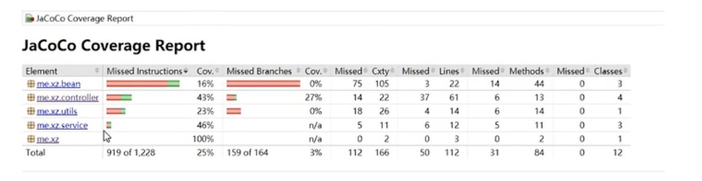
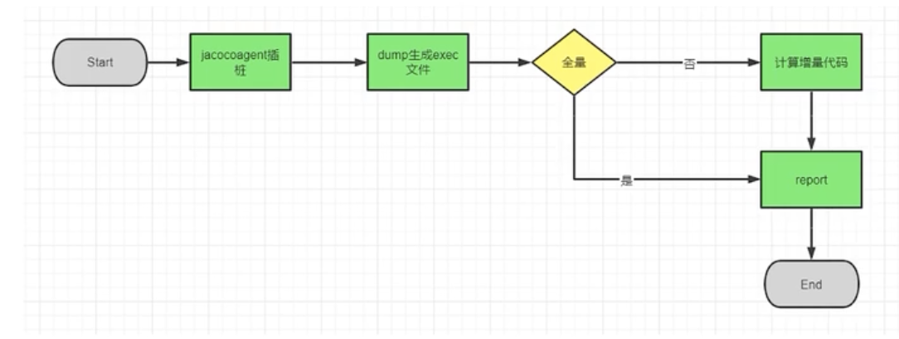

## JaCoCo   

### 1.什么是JaCoCo   
JaCoCo是一个免费、开源Java代码覆盖率工具    

### 2.什么是代码覆盖率  
覆盖率是用来衡量测试代码对功能代码的测试情况，通过统计测试中对功能代码中行、分支、类等模拟场景数量，来量化说明测试的充分度。代码覆盖率=代码的覆盖程度，一种度量方式     

覆盖率简单的说： 跑了一个测试用例，项目中哪些模块，文件，类，方法，行执行了。   
其中行覆盖率的最细粒度，其他覆盖率都可从行覆盖率情况计算出来。  

#### 行覆盖率        
当至少一个指令被指定源码行执行时，该源码行被认为已执行。    

#### 分支覆盖   
if 和 switch语句算作分支覆盖率，这个指标计算一个方法中的分支总数，并决定已执行和未执行的分支的数量。  
* 全部未覆盖：所有分支均为执行，红色标志
* 部分覆盖：部分分支被执行，黄色标志
* 全覆盖：所有分支已执行，绿色标志  

#### 方法覆盖   
当方法中至少有一个指定被执行，该方法被认为已执行，包括构造函数和静态初始化方法。    

#### 类覆盖 
当一个类至少有一个方法已执行，则该类被认为已执行，包括构造函数和静态初始化方法。    

### 3.代码覆盖率意义
分析未覆盖部分的代码，反推测试设计是否充分，没有覆盖到的代码是否存在测试设计盲点。  

### 4.覆盖率的误区  
若代码如下：
```java
if(i>100){
    j = 10/i
}else{
    j = 10/(i+2)
}
```
覆盖两个分支只需i==101和i==1，但对于找到i==-2没有作用。  
所以：  
* 不要简单的追求高的代码覆盖率  
* 高覆盖测试用例不等于测试用例有用 
* 没覆盖的分支相当于该分支上的任何错误肯定都测不到  

### 5.JaCoCO原理    
JaCoCo使用插桩的方式来记录覆盖率数据，是通过一个probe探针来注入。  
插桩模式有两种：  
**1.on-the-fly模式**
JVM中通过javaagent参数指定特定的jar文件启动Instrumentation的代理程序，代理程序在通过ClassLoader装载一个class前判断是否转换修改class文件，将统计代码插入class，测试覆盖分析可以在JVM执行测试代码的过程完成。 

**2.offline模式**  
在测试之前先对文件进行插桩，生成插过桩的class或jar包，测试插过桩的class和jar包，生成覆盖履信息到文件，最后统一处理，生成报告。      

**3.on-the-fly和offline对比**  
on-the-fly更方便简单，无需提前插桩，无需考虑classpath设置问题。  
存在以下情况不合适使用on-the-fly模式：  
* 不支持javaagent 
* 无法设置JVM参数 
* 字节码需要被转换成其他虚拟机 
* 动态修改字节码过程与其他agent冲突  
* 无法自定义用户加载类 

### 6.JaCoCo应用    
6.1 下载JaCoCo
下载地址： https://www.jacoco.org/jacoco/   

6.2 拷贝jar  

6.3 启动jacocoagent 
```shell
java -javaagent:jacocoagent.jar="includes=*,output=tcpserver,port=6300,address=localhost,append=true" -jar jacoco-demo-1.0-SNAPSHOT.jar 
```

6.4 cli包dump生成exec文件 
```shell
java -jar jacococli.jar dump --address 127.0.0.1 --port 6300 --destfile jacoco-demo.exec 
# --address 127.0.0.1 --port 6300 指向jacocoagent启动IP和端口   
# jacoco-demo.exec 为生成exec文件名 
```

6.5 cli包exec生成report报表 
```shell
java -jar jacococli.jar report jacoco-demo.exec --classfiles path/target/classes --sourcefiles path/src/java --html html-report --xml report.xml --encoding=utf-8 
# --sourcefiles 和 --classfile 为本地被检测项目源码和字节码路径 
```

6.6 覆盖率报告  
jacoco覆盖率，Cov表示覆盖率 
表格列依次是： 元素；未覆盖字节码行数；未覆盖的分支数；圈复杂度；行；方法；类； 
        

覆盖率标识： 
条件覆盖：红：表示未覆盖； 黄：表示部分覆盖； 绿：表示全部覆盖 
行覆盖： 全覆盖（绿色）； 未覆盖（红色）； 半覆盖（黄色）； 无视（白色）    


### 7.JaCoCo增量覆盖  
7.1 什么是增量覆盖 
增量覆盖： 两次提交之间有哪些代码或者分支没有被覆盖。 
目的： 检测同一个测试用例在修改前后代码上的行覆盖情况。 
假设两次提交变更如下： 
```java
if(x>100){
- print("luojie")
+ print("lemon")
}else{
- print("12345")
+ print("上山打老虎") 
}
```
没行代码有三种状态：+、-、不变。 
修改前后跑同一个测试用例，每行有四种状态：修改前覆盖/修改前未覆盖， 修改后覆盖/修改后未覆盖。 

所以增量覆盖总共有3*4=12种情况，比较重要有： 新增代码没有覆盖， 新增代码覆盖了，不变的代码修改前覆盖， 修改后未覆盖等等。 

7.2 增量应用 
jacoco二开： https://gitee.com/Dray/jacoco.git 
增量代码获取： https://gitee.com/Dray/code-diff.git  

增量原理：  
 

计算增量代码具体步骤： 
* 计算出两个版本的差异代码 
* 将差异代码在report阶段传给jacoco 
* 修改jacoco源码，生成报告时判断代码是否是增量代码，只有增量代码才去生成报告 

使用方法： 
1.jacoco客户端，收集信息 
```shell
java -javaagent:jacocoagent.jar="includes=*,output=tcpserver,port=6300,address=localhost,append=true" -jar jacoco-demo-1.0-SNAPSHOT.jar
```

2.二开cli包生成exec文件 
```shell
java -jar javacococli.jar dump --address 127.0.0.1 --port 6300 --destfile jacoco-demo.exec  
```

3.获取两次提交代码差异 
```shell
java -jar code-diff.jar 启动diff项目 
# 网址： http://127.0.0.1:8055/doc.html 
```

4.二开cli包生成report增量报表 
......

7.4 增量实战，整合jenkins 
......


refer   
1.https://www.bilibili.com/video/BV1tr4y1i7f1/?spm_id_from=333.337.search-card.all.click&vd_source=89b3f4bd088c6355f40a00df74cf8ffd 