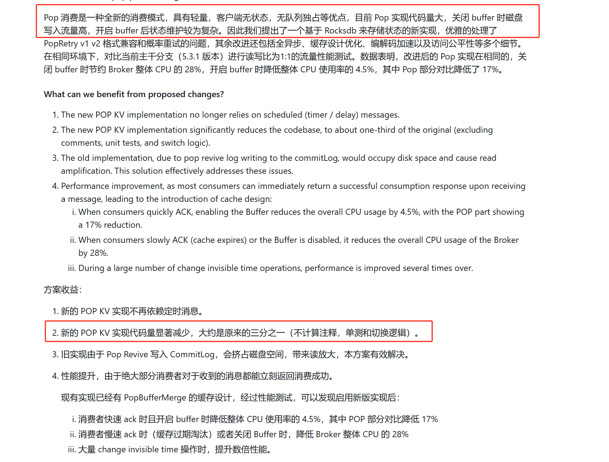

# JAVA - RocksDB - 探索 Queue on RocksDB 

>在`存储`方向，2025年怎么夸 `RocksDB` 都不为过 :）       

## 引言   
>若大家对 `RocksDB`不太了解，可访问 `RocksDB Wiki`(https://github.com/facebook/rocksdb/wiki)        

`RocksDB`被广泛用于`存储`系统中，它的优势，可在下面列举的两个案例中感受一波：         
* RIP-73，Pop Consumption Improvement Based on RocksDB （https://github.com/apache/rocketmq/wiki/%5BRIP%E2%80%9073%5D-Pop-Consumption-Improvement-Based-on-RocksDB）   
   

对于 `POP Consumer`为了解决 `Consumer Rebalance 给业务服务带来的不稳定性`以及`一对一队列占用无法扩展并发性`，这块博主暂时还没有跟进过细节，就不过多阐述，以免误导大家。     

重点可以关注 RocketMQ `develop`分支下的 `PopConsumerRocksdbStore` https://github.com/apache/rocketmq/blob/develop/broker/src/main/java/org/apache/rocketmq/broker/pop/PopConsumerRocksdbStore.java  

* RIP-75，Supports timer message on RocksDB （https://github.com/apache/rocketmq/issues/9141）  

  

在上面的案例，都是通过 RocksDB 优化存储问题。  

在之前的两篇 Blog `JAVA - Memory-mapped I/O - 探索构造 BigArray 读写 File 篇` 和 `JAVA - Memory-mapped I/O - 探索給 BigArray 加锁` 中，通过直接读写文件实现数据的存储和查询，那现在如果用 RocksDB 又是如何呢？      

  

## Queue on RocksDB  

refer   
1.https://github.com/facebook/rocksdb/wiki/Implement-Queue-Service-Using-RocksDB  
2.https://github.com/artiship/rocks-queue-java     
3.[RIP-73] https://github.com/apache/rocketmq/wiki/%5BRIP%E2%80%9073%5D-Pop-Consumption-Improvement-Based-on-RocksDB  
4.https://juejin.cn/post/7152768942195343390                
5.https://developer.aliyun.com/article/801815           
6.https://github.com/apache/rocketmq/issues/9141        
7.https://docs.google.com/document/d/1D6XWwY39p531c2aVi5HQll9iwzTUNT1haUFHqMoRkT0/edit?pli=1&tab=t.0#heading=h.hdivf7j4u03n           

