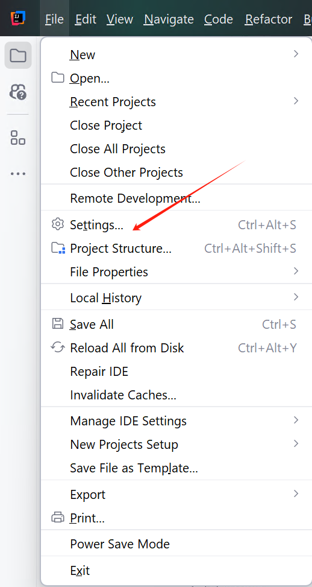
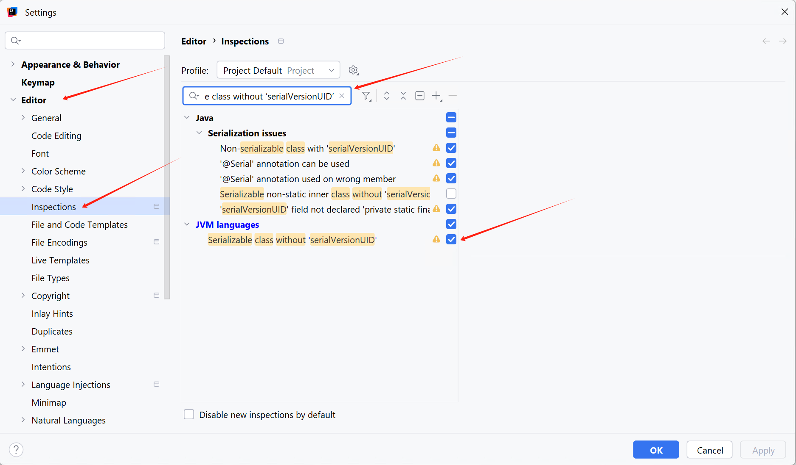
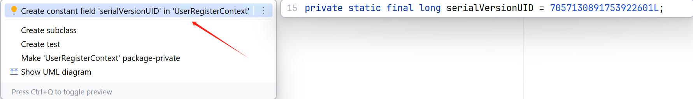

# JAVA - IDEA 快捷生成 Serializable 序列化 UID的方法 

## 配置 Idea  
打开 Idea Settings 设置  

选择 `Editor` --> `Inspections` --> 在输入框搜索 `Serializable class without 'serialVersionUID'`   

将其`勾选` 即可。  
  

## 生成 
打开 Class ，使用 Windows Idea 快捷键 `Alt + Enter`，创建 `serialVersionUID`  

  