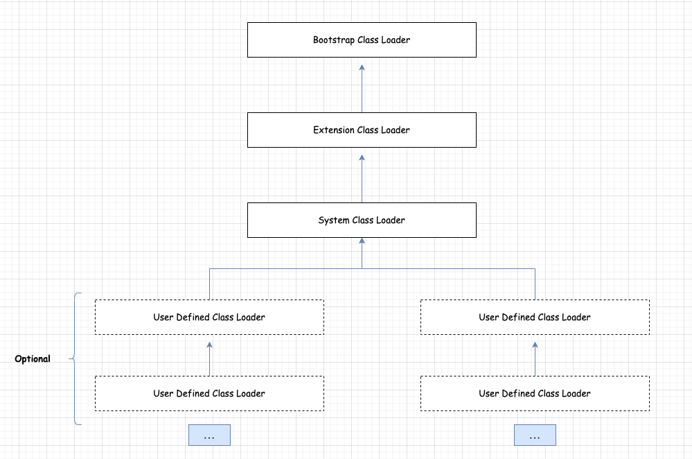

# 类加载器的分类        

## 分类 
1.启动类加载器（引导类加载器，Bootstrap ClassLoader）（C++实现）    
2.自定义类加载器（Java实现）
扩展类加载器    
系统类加载器    
用户自定义加载器        

      

## 启动类加载器（引导类加载器，Bootstrap ClassLoader）
1.这个类加载使用C/C++ 语言实现的，嵌套在JVM 内部    
2.它用来加载 Java 的核心库  
3.万物之祖，不继承其他类，没有父加载器      
4.加载扩展类和应用程序类加载器，并作为他们的父类加载器      
5.出于安全考虑，Bootstrap 启动类加载器只加载包名为 java、javax、sun等开头的类       


## 扩展类加载器（Extension ClassLoader）    
1.Java语言编写，由`sun.misc.Launcher$ExtClassLoader`实现        
2.派生于 ClassLoader 类 
3.从 java.ext.dirs 系统属于所指定的目录中加载类库，或从JDK 的安装目录的 jre/lib/ext 子目录（扩展目录）下加载类库     

在 JDK1.8 Launcher.java 源码中， 利用了单例模式保证了 ExtClassLoader 的唯一性。  
```java
public static ExtClassLoader getExtClassLoader() throws IOException {
    if (instance == null) {
        Class var0 = ExtClassLoader.class;
        synchronized(ExtClassLoader.class) {
            if (instance == null) {
                instance = createExtClassLoader();
            }
        }
    }

    return instance;
}
```

>注意，下面案例在 JDK1.8下执行  


>在下面的案例中，涉及到一些类加载器的路径，例如扩展类加载器的加载目录是`java.ext.dirs`, 这里是参考 JDK 中的 `Launcher#getExtDirs()` 方法，其他也是以此类推，例如 `AppClassLoader`加载器，它的加载目录是 java.class.path。               

## 验证 ClassLoader 之间的关系   

通过下面案例来说明 ClassLoader之间的关系：      
```java
public class ClassLoaderTest {
    public static void main(String[] args) {
        ClassLoader systemClassLoader = ClassLoader.getSystemClassLoader();
        System.out.println("Sys:" + systemClassLoader); // jdk.internal.loader.ClassLoaders$AppClassLoader@251a69d7

        ClassLoader extClassLoader = systemClassLoader.getParent();
        System.out.println("Ext:" + extClassLoader); // jdk.internal.loader.ClassLoaders$PlatformClassLoader@5305068a

        ClassLoader bootstrapClassloader = extClassLoader.getParent();
        System.out.println("Bootstap:" + bootstrapClassloader);
    }
}
``` 

Output log:     
```bash
Sys:jdk.internal.loader.ClassLoaders$AppClassLoader@251a69d7
Ext:jdk.internal.loader.ClassLoaders$PlatformClassLoader@5305068a
Bootstap:null
```     

## 验证 Class 是由哪个 ClassLoader 加载 
```java
public class ClassLoaderTest {
    public static void main(String[] args) {
        ClassLoader systemClassLoader = ClassLoader.getSystemClassLoader();
        System.out.println("Sys:" + systemClassLoader); // jdk.internal.loader.ClassLoaders$AppClassLoader@251a69d7

        ClassLoader extClassLoader = systemClassLoader.getParent();
        System.out.println("Ext:" + extClassLoader); // jdk.internal.loader.ClassLoaders$PlatformClassLoader@5305068a

        ClassLoader bootstrapClassloader = extClassLoader.getParent();
        System.out.println("Bootstap:" + bootstrapClassloader);

        ClassLoader classLoader = ClassLoaderTest.class.getClassLoader();
        System.out.println("User:" + classLoader);

        ClassLoader classLoader2 = SunEC.class.getClassLoader();
        System.out.println("Ext:" + classLoader2);

        ClassLoader classLoader1 = Boolean.class.getClassLoader();
        System.out.println("Bool:" + classLoader1);
    }
}
``` 
Output log:     
```bash
Sys:sun.misc.Launcher$AppClassLoader@18b4aac2
Ext:sun.misc.Launcher$ExtClassLoader@7960847b
Bootstap:null
User:sun.misc.Launcher$AppClassLoader@18b4aac2
Ext:sun.misc.Launcher$ExtClassLoader@7960847b
Bool:null
```

## 验证类加载器加载文件的路径  
```java
public class ClassLoaderPathTest {
    public static void main(String[] args) {
        System.out.println("引导类加载器");
        URL[] urLs = Launcher.getBootstrapClassPath().getURLs();
        for (URL url : urLs) {
            System.out.println(url.toExternalForm());
        }

        System.out.println("扩展类加载器");
        String extPath = System.getProperty("java.ext.dirs");
        System.out.println("extPath :" + extPath);
    }
}
``` 

