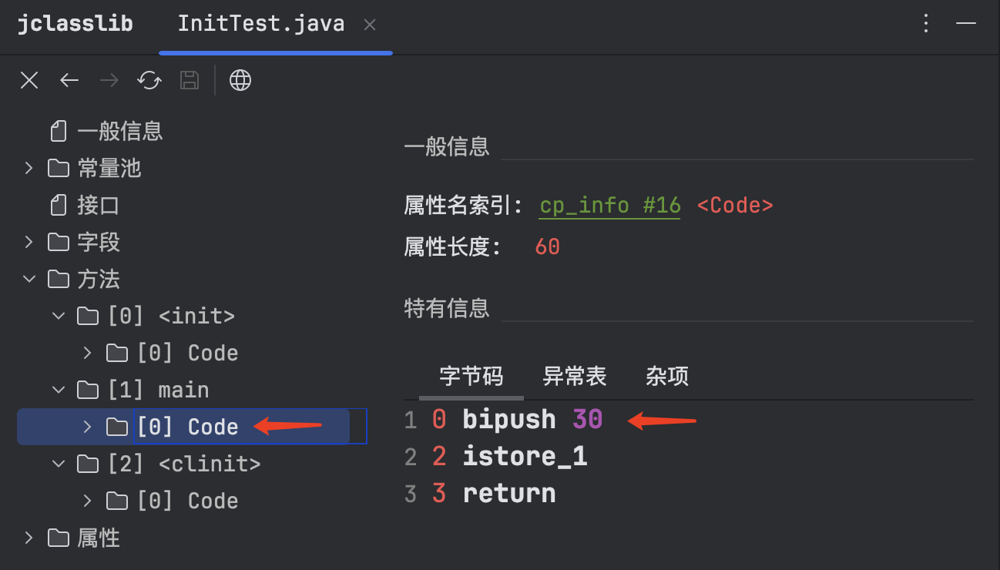

# JVM 透彻理解类加载子系统  

## 引言 
字节码文件，是如何被加载到 JVM 内存中的？   

```java
public class HelloApp {
    public static void main(String[] args) {
        System.out.println("hello world");
    }
}
```

### 字节码文件创建对象分析      
设计猜想：  
1.字节码文件也是文件，那就要先读取到内存才能使用        
2.从外部读入文件，那有必要对其进行校验  
3.要创建对象，必然先初始化，做必要的准备        
4.很多类是相互依赖的，需要将必要的链接进来          

### 类加载系统整体的工作过程    
基本过程：  
1.加载文件阶段，读入字节码文件并加载到内存  
2.链接阶段，验证字节码，符号引用转为直接引用等      
3.初始化阶段，为创建对象做必须要的准备      


### 加载阶段    
加载阶段：通过IO操作读入文件的过程  
1.通过类的全限定名获取二进制字节流，就是读文件的操作            
2.将这个字节流所代表的静态存储结构转化为内存结构        
3.在内存中生成一个代表这个类的 java.lang.Class 对象     

### 链接阶段    
链接阶段： 分为三个子阶段： 验证 -> 准备 -> 解析        

#### 链接阶段之一：验证阶段     
验证的内容： 文件格式、元数据、字节码和符合引用验证     

用编辑器打开 `HelloApp.class`, 内容如下:    
```bash     
cafe babe 0000 0034 0022 0a00 0200 0307
0004 0c00 0500 0601 0010 6a61 7661 2f6c
616e 672f 4f62 6a65 6374 0100 063c 696e
6974 3e01 0003 2829 5609 0008 0009 0700
0a0c 000b 000c 0100 106a 6176 612f 6c61
6e67 2f53 7973 7465 6d01 0003 6f75 7401
0015 4c6a 6176 612f 696f 2f50 7269 6e74
5374 7265 616d 3b08 000e 0100 0b68 656c
6c6f 2077 6f72 6c64 0a00 1000 1107 0012
0c00 1300 1401 0013 6a61 7661 2f69 6f2f
5072 696e 7453 7472 6561 6d01 0007 7072
696e 746c 6e01 0015 284c 6a61 7661 2f6c
616e 672f 5374 7269 6e67 3b29 5607 0016
0100 1963 6f6d 2f6a 6176 616d 6169 6e2f
746d 702f 4865 6c6c 6f41 7070 0100 0443
6f64 6501 000f 4c69 6e65 4e75 6d62 6572
5461 626c 6501 0012 4c6f 6361 6c56 6172
6961 626c 6554 6162 6c65 0100 0474 6869
7301 001b 4c63 6f6d 2f6a 6176 616d 6169
6e2f 746d 702f 4865 6c6c 6f41 7070 3b01
0004 6d61 696e 0100 1628 5b4c 6a61 7661
2f6c 616e 672f 5374 7269 6e67 3b29 5601
0004 6172 6773 0100 135b 4c6a 6176 612f
6c61 6e67 2f53 7472 696e 673b 0100 0a53
6f75 7263 6546 696c 6501 000d 4865 6c6c
6f41 7070 2e6a 6176 6100 2100 1500 0200
0000 0000 0200 0100 0500 0600 0100 1700
0000 2f00 0100 0100 0000 052a b700 01b1
0000 0002 0018 0000 0006 0001 0000 0003
0019 0000 000c 0001 0000 0005 001a 001b
0000 0009 001c 001d 0001 0017 0000 0037
0002 0001 0000 0009 b200 0712 0db6 000f
b100 0000 0200 1800 0000 0a00 0200 0000
0500 0800 0600 1900 0000 0c00 0100 0000
0900 1e00 1f00 0000 0100 2000 0000 0200
21
```   

可以看到编译好的 class 文件的开头是 cafe babe。 


#### 链接阶段之二：准备阶段     
1.为类变量（static 变量）分配内存并设置默认初始值，即零值       
2.不包含 final 修饰的 static，其在编译时就会分配好默认值        
3.如下，变量 a 在`准备阶段值为0`，到了`初始化阶段才被赋值为1`                  
```java
public class HelloApp {
    private static int a = 1;  // prepare: a = 0 ----> initial : a = 1 
    public static void main(String[] args) {
        System.out.println(a);  
    }
}
``` 

#### 链接阶段之三：解析阶段   
1.解析（Resolve）将`常量池内的符号引用转换为直接引用`的过程       
2.主要解析类或接口、字段、类方法、接口方法、方法类型等      

思考：  
1.房子的图纸与建房子是什么关系？    
字节码（常量池内的符号引用）等于是房子的图纸，但并不是真正的房子，而转换为直接引用后，那其实就是根据图纸来创建房子的过程。          

2.字节码的生成和执行分别在什么时候？        


### 初始化阶段  
1.不是创建对象，而是说 JVM开始执行类里面的 Java 代码        
2.主要是处理类变量和静态变量        
在下面的示例中，变量a 是 类变量，类变量无法直接使用，需先创建对象后才可使用， 变量b 是静态变量，可直接使用。        
```java
public class InitTest {
    public int a = 10;
    public static int b = 20;

    public static void main(String[] args) {
        int c = InitTest.b;
        // a变量无法使用，先创建对象后才可使用       
        
    }
}
```

在 Idea 中安装 `jclasslib is a bytecode viewer for Java class files` 插件， 通过下面代码示例，演示不同位置变量的赋值。      
```java 
public class InitTest {
    public int a = 10;
    public static int b = 20;

    public static void main(String[] args) {
        int c = 30;
    }
}
```

变量a的初始化:              
      

变量b的初始化：          
 
 
变量c的初始化：         
  

3.静态代码块的不同点        
示例代码如下：      
```java
public class InitTest {
    public static int a = 10;
    static {
        a = 20;
    }
    public static void main(String[] args) {
        System.out.println(InitTest.a);
    }
}
``` 

此时jclasslib 展示：    
          

main()输出的 结果是 20， 

此时将变量a 与 静态代码块 颠倒位置，如下：  
```java
public class InitTest {
    static {
        a = 20;
    }
    public static int a = 10;
    public static void main(String[] args) {
        System.out.println(InitTest.a);
    }
}
```

此时jclasslib 展示：    
     

main()输出的 结果是 10. 

通过上面的验证，可得到 `字节码的执行顺序是 自上往下的`。      


