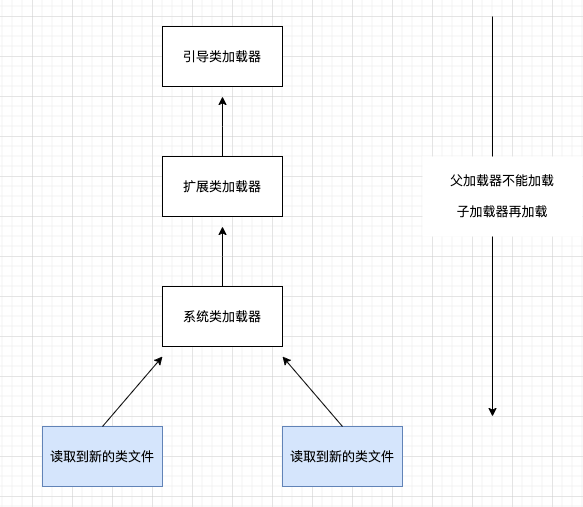
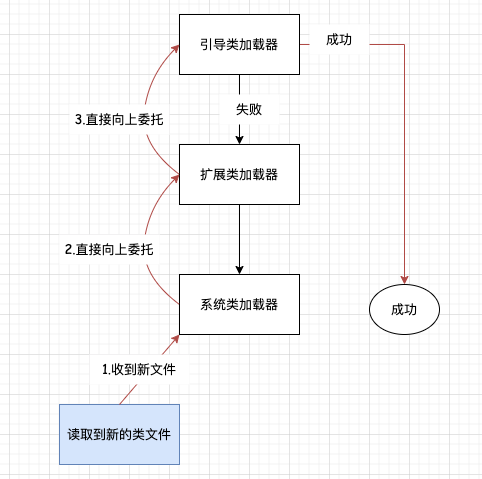
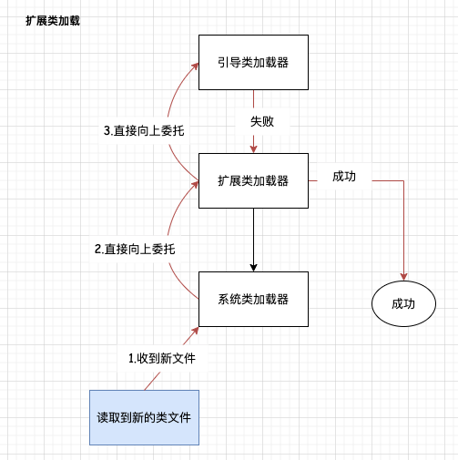
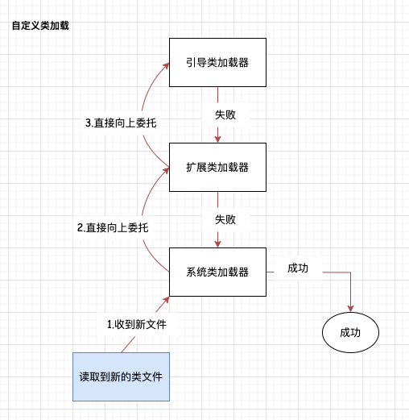
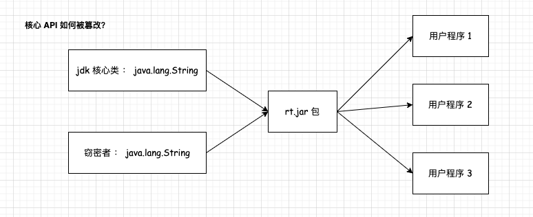

# JVM 双亲委派机制

## 定义 
各种类加载器之间的层次关系被称为类加载器的“双亲委派模型（Parents Delegation Model）”。双亲委派模型要求除了顶层的启动类加载器外，其余的类加载器都应有自己的父类加载器。不过这里类加载器之间的父子关系一般不是以继承（Inheritance）的关系来实现的，而是通常使用组合（Composition）关系来复用父加载器的代码。          

## 双亲委派过程 
双亲委派模型的工作过程是：如果一个类加载器收到了类加载的请求，它首先不会自己去尝试加载这个类，而是把这个请求委派给父类加载器去完成，每一个层次的类加载器都是如此，因此所有的加载请求最终都应该传送到最顶层的启动类加载器中，只有当父加载器反馈自己无法完成这个加载请求（它的搜索范围中没有找到所需的类）时，子加载器才会尝试自己去完成加载。        

使用双亲委派模型来组织类加载器之间的关系，一个显而易见的好处就是Java中的类随着它的类加载器一起具备了一种带有优先级的层次关系。例如类java.lang.Object，它存放在rt.jar之中，无论哪一个类加载器要加载这个类，最终都是委派给处于模型最顶端的启动类加载器进行加载，因此 Object 类在程序的各种类加载器环境中都能够保证是同一个类。`反之，如果没有使用双亲委派模型，都由各个类加载器自行去加载的话，如果用户自己也编写了一个名为java.lang.Object的类，并放在程序的 ClassPath中，那系统中就会出现多个不同的Object类，Java类型体系中最基础的行为也就无从保证，应用程序将会变得一片混乱`。如果读者有兴趣的话，可以尝试去写一个与rt.jar类库中已有类重名的Java类，将会发现它可以正常编译，但永远无法被加载运行。       

双亲委派模型对于保证Java程序的稳定运作极为重要。        

## 基本原理     
1.收到新的类，先一路上报到引导类加载器  
2.引导类若加载不了，下层在逐层加载，直到某层能够加载。      

  

### 流程示例解释    

**示例1：假如是JVM 核心类加载**     
            

**示例2：假如是JVM 扩展类加载**     
           

**示例3：假如是JVM 自定义类加载**     
          
   

## 为什么要使用双亲委派机制？   
主要原因：  
1.安全，防止核心 API 库被随意篡改           
分析案例如下：   
          

目前有人定义了 `java.lang.String`类，并且将其打包成`rt.jar`, 而用户程序1、用户程序2、用户程序3，就会这样被蒙骗过关么？      

答案肯定是`否定的`。 在JVM中 一个类的唯一性是由`类加载器 + 包名 + 类名` 决定的。 JVM 首先加载`启动类加载器`，所以 rt.jar中的 String 会被首先加载，当加载用户定义的 java.lang.String 则无法加载，当用户使用 String类时，只需关注它的唯一性即可。                                                                                 

2.避免重复加载：当父加载器已经加载过该类时，子加载器不再加载，保证被加载类的唯一性。                 
3.能够实现动态加载、按需加载。              


## JVM 是如何实现双亲委派机制       
以AppClassLoader类（Launcher类的内部类）的loadClass方法为起点 `Launcher#loadClass(String var1, boolean var2)方法` 。        

当未查询到的class 时，会去调用父类的loadClass()方法 `super.loadClass(var1, var2);` 。 
```java
public Class<?> loadClass(String var1, boolean var2) throws ClassNotFoundException {
    int var3 = var1.lastIndexOf(46);
    if (var3 != -1) {
        SecurityManager var4 = System.getSecurityManager();
        if (var4 != null) {
            var4.checkPackageAccess(var1.substring(0, var3));
        }
    }

    if (this.ucp.knownToNotExist(var1)) {
        Class var5 = this.findLoadedClass(var1);
        if (var5 != null) {
            if (var2) {
                this.resolveClass(var5);
            }

            return var5;
        } else {
            throw new ClassNotFoundException(var1);
        }
    } else {
        return super.loadClass(var1, var2);
    }
}
```


```java
protected Class<?> loadClass(String name, boolean resolve)
        throws ClassNotFoundException
{
    synchronized (getClassLoadingLock(name)) {
        // First, check if the class has already been loaded
        Class<?> c = findLoadedClass(name);
        if (c == null) {
            long t0 = System.nanoTime();
            try {
                if (parent != null) {
                    c = parent.loadClass(name, false);
                } else {
                    c = findBootstrapClassOrNull(name);
                }
            } catch (ClassNotFoundException e) {
                // ClassNotFoundException thrown if class not found
                // from the non-null parent class loader
            }

            if (c == null) {
                // If still not found, then invoke findClass in order
                // to find the class.
                long t1 = System.nanoTime();
                c = findClass(name);

                // this is the defining class loader; record the stats
                sun.misc.PerfCounter.getParentDelegationTime().addTime(t1 - t0);
                sun.misc.PerfCounter.getFindClassTime().addElapsedTimeFrom(t1);
                sun.misc.PerfCounter.getFindClasses().increment();
            }
        }
        if (resolve) {
            resolveClass(c);
        }
        return c;
    }
}
```


