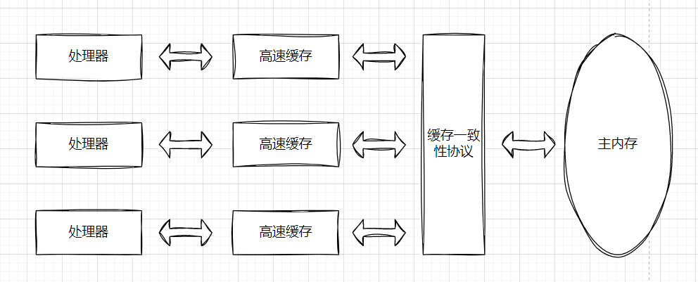
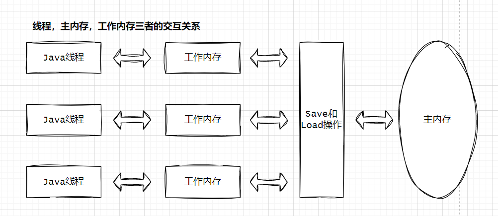
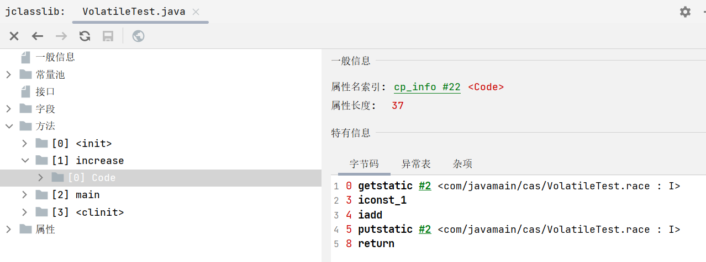

## Java CAS


### 引言
CAS全名：Compare-and-Swap （比较并交换），CAS指令需要有三个操作数，分别是内存位置（在Java中可以简单地理解为变量的内存地址，用V表示）、旧的预期值（用A表示）和准备设置的新值（用B表示）。CAS指令执行时，当且仅当V符合A时，处理器才会用B更新V的值，否则它就不执行更新。但是，不管是否更新了V的值，都会返回V的旧值，上述的处理过程是一个原子操作，执行期间不会被其他线程中断。

>看到这里，我想你也许会和博主一样懵逼，因为这非常像在操作MySQL加乐观锁一样，inser xxx where id = xxx and version = xxx，当version不一致，就将这次操作直接返回提示失败。那等于一次操作作废，这样可能会导致结果不一致呀，带着这个问题看下面。 

### 案例分析

下面我们通过一个多线程案例来分析：  
```java
public class AtomicTest {
    public static AtomicInteger race = new AtomicInteger(0);

    public static void increase() {
        race.incrementAndGet();
    }

    private static final int THREADS_COUNT = 20;

    public static void main(String[] args) {
        Thread[] threads = new Thread[THREADS_COUNT];
        for (int i = 0; i < THREADS_COUNT; i++) {
            threads[i] = new Thread(new Runnable() {
                @Override
                public void run() {
                    for (int i = 0; i < 10000; i++) {
                        increase();
                    }
                }
            });
            threads[i].start();
        }
        while (Thread.activeCount() > 1) {
            Thread.yield();
        }
        System.out.println(race);
    }
}
```
**输出结果**    
200000  

这段代码创建了20个线程来对race对象进行递增，通过多次测试，值一直都是`200000`,并没有因为多线程导致值被覆盖。那20个线程 add(1) where race = xxx, 这必然大概率会出现race=xxx 失败呀。那AtomicInteger类型是如何做到呢？


这是因为`AtomicInteger类型的incrementAndGet()方法是通过CAS自旋（无锁）保证并发写入`。 
下面我们来看下incrementAndGet()实现：  
```java
public final int getAndAddInt(Object var1, long var2, int var4) {
    int var5;
    do {
        var5 = this.getIntVolatile(var1, var2);
    } while(!this.compareAndSwapInt(var1, var2, var5, var5 + var4));

    return var5;
}
```
getAndAddInt 方法实现的是一个循环，直到 CAS（Compare and Swap）操作成功为止。其工作原理可以分解如下：
1.获取当前值：var5 = this.getIntVolatile(var1, var2); 这行代码从指定对象的指定字段获取当前的值，并将其存储在 var5 中。getIntVolatile 是一种读取操作，它可以确保读取的值不会被CPU缓存，即它能够看到其他线程对该字段最近的修改。  
2.CAS操作：this.compareAndSwapInt(var1, var2, var5, var5 + var4); 这行代码尝试使用新的值（var5 + var4）来更新字段，但前提是该字段的当前值仍然等于旧值（var5）。如果在这个过程中字段的值被其他线程修改了，那么 CAS 操作将失败。      
3.循环：如果 CAS 操作失败，那么就会继续循环，再次获取当前值并尝试 CAS 操作，直到 CAS 操作成功为止。这就是所谓的"自旋"。     
4.返回值：方法最后返回的是操作前字段的值。注意，由于这个方法是"get and add"，所以它应该返回增加前的值，而不是增加后的值。       

介绍到这里，仍然没有解惑我对`add(1) where race = xxx`,为什么race不会出现比较失败原因。更何况现在都是多核机器（多CPU）那咋办？，接下来需要介绍Java内存模型以及volatile关键字。      

### Java内存模型&volatile关键字
会介绍到这里，是因为race对象在new的时候，将0传给了AtomicInteger类型的value值，而value是int类型，但添加了volatile关键字，所以在了解volatile关键字的作用之前，需要了解Java内存模型才能更好的了解它。  
```java
// 1.创建AtomicInteger
AtomicInteger race = new AtomicInteger(0);

// 2.构造方法
public AtomicInteger(int initialValue) {
    value = initialValue;
}

// 3.value是int类型，但加了volatile关键字
private volatile int value;
```

>强烈建议读者阅读《深入理解Java虚拟机》第三版的第12章节。（以下篇幅理论部分摘抄该书）   

#### 概述
在正式讲解Java虚拟机并发相关的知识之前，我们先花费一点时间去了解一下物理计算机中的并发问题。物理机遇到的并发问题与虚拟机中的情况有很多相似之处，物理机对并发的处理方案对虚拟机的实现也有相当大的参考意义。  

“让计算机并发执行若干个运算任务”与“更充分地利用计算机处理器的效能”之间的因果关系，看起来理所当然，实际上它们之间的关系并没有想象中那么简单，其中一个重要的复杂性的来源是绝大多数的运算任务都不可能只靠处理器“计算”就能完成。处理器至少要与内存交互，如读取运算数据、存储运算结果等，这个I/O操作就是很难消除的（无法仅靠寄存器来完成所有运算任务)。由于计算机的存储设备与处理器的运算速度有着几个数量级的差距，所以现代计算机系统都不得不加入一层或多层读写速度尽可能接近处理器运算速度的高速缓存(Cache）来作为内存与处理器之间的缓冲:将运算需要使用的数据复制到缓存中，让运算能快速进行，当运算结束后再从缓存同步回内存之中，这样处理器就无须等待缓慢的内存读写了。 

基于高速缓存的存储交互很好地解决了处理器与内存速度之间的矛盾，但是也为计算机系统带来更高的复杂度，它引入了一个新的问题:缓存一致性(Cache Coherence)。在多路处理器系统中，每个处理器都有自己的高速缓存，而它们又共享同一主内存(Main Memory)，这种系统称为共享内存多核系统(Shared Memory Multiprocessors System)，如图12-1所示。当多个处理器的运算任务都涉及同一块主内存区域时，将可能导致各自的缓存数据不一致。如果真的发生这种情况，那同步回到主内存时该以谁的缓存数据为准呢?为了解决一致性的问题，需要各个处理器访问缓存时都遵循一些协议，在读写时要根据协议来进行操作，这类协议有MSI、MESI (Illinois Protocol)、MOSI、Synapse、Firefly及Dragon Protocol等。从本章开始，我们将会频繁见到“内存模型”一词，它可以理解为在特定的操作协议下，对特定的内存或高速缓存进行读写访问的过程抽象。不同架构的物理机器可以拥有不一样的内存模型，而Java虚拟机也有自己的内存模型，并且与这里介绍的内存访问操作及硬件的缓存访问操作具有高度的可类比性。  

  

除了增加高速缓存之外，为了使处理器内部的运算单元能尽量被充分利用，处理器可能会对输入代码进行乱序执行（Out-Of-Order Execution〉优化，处理器会在计算之后将乱序执行的结果重组，保证该结果与顺序执行的结果是一致的，但并不保证程序中各个语句计算的先后顺序与输入代码中的顺序一致，因此如果存在一个计算任务依赖另外一个计算任务的中间结果，那么其顺序性并不能靠代码的先后顺序来保证。与处理器的乱序执行优化类似，Java虚拟机的即时编译器中也有指令重排序( Instruction Reorder〉优化。 

#### Java内存模型
《Java虚拟机规范》[1l中曾试图定义一种"Java内存模型”2l (Java Memory Model，JMM）来屏蔽各种硬件和操作系统的内存访问差异，以实现让Java程序在各种平台下都能达到一致的内存访问效果。在此之前，主流程序语言（如C和C++等）直接使用物理硬件和操作系统的内存模型。因此，由于不同平台上内存模型的差异，有可能导致程序在一套平台上并发完全正常，而在另外一套平台上并发访问却经常出错，所以在某些场景下必须针对不同的平台来编写程序。   

定义Java内存模型并非一件容易的事情，这个模型必须定义得足够严谨，才能让Java的并发内存访问操作不会产生歧义;但是也必须定义得足够宽松，使得虚拟机的实现能有足够的自由空间去利用硬件的各种特性（寄存器、高速缓存和指令集中某些特有的指令）来获取更好的执行速度。经过长时间的验证和修补，直至JDK5(实现了JSR-133[3l)发布后，Java内存模型才终于成熟、完善起来了。

**主内存与工作内存**
Java内存模型的主要目的是定义程序中各种变量的访问规则，即关注在虚拟机中把变量值存储到内存和从内存中取出变量值这样的底层细节。此处的变量( Variables）与Java编程中所说的变量有所区别，它包括了实例字段、静态字段和构成数组对象的元素，但是不包括局部变量与方法参数，因为后者是线程私有的[l，不会被共享，自然就不会存在竞争问题。为了获得更好的执行效能，Java内存模型并没有限制执行引擎使用处理器的特定寄存器或缓存来和主内存进行交互，也没有限制即时编译器是否要进行调整代码执行顺序这类优化措施。
Java内存模型规定了所有的变量都存储在主内存(Main Memory)中(此处的主内存与介绍物理硬件时提到的主内存名字一样，两者也可以类比，但物理上它仅是虚拟机内存的一部分）。每条线程还有自己的工作内存(Working Memory，可与前面讲的处理器高速缓存类比)，线程的工作内存中保存了被该线程使用的变量的主内存副本l2]，线程对变量的所有操作（读取、赋值等）都必须在工作内存中进行，而不能直接读写主内存中的数据[3]。不同的线程之间也无法直接访问对方工作内存中的变量，线程间变量值的传递均需要通过主内存来完成，线程、主内存、工作内存三者的交互关系如下图所示：  

      

这里所讲的主内存、工作内存与第2章所讲的Java内存区域中的Java堆、栈、方法区等并不是同一个层次的对内存的划分，这两者基本上是没有任何关系的。如果两者一定要勉强对应起来，那么从变量、主内存、工作内存的定义来看，主内存主要对应于Java堆中的对象实例数据部分[4，而工作内存则对应于虚拟机栈中的部分区域。从更基础的层次上说，主内存直接对应于物理硬件的内存，而为了获取更好的运行速度，虚拟机(或者是硬件、操作系统本身的优化措施）可能会让工作内存优先存储于寄存器和高速缓存中，因为程序运行时主要访问的是工作内存。  


#### 对于volatile型变量的特殊规则
关键字volatile可以说是Java虚拟机提供的最轻量级的同步机制，但是它并不容易被正确、完整地理解，以至于许多程序员都习惯去避免使用它，遇到需要处理多线程数据竞争问题的时候一律使用sy nchronized来进行同步。了解volatile变量的语义对后面理解多线程操作的其他特性很有意义，在本节中我们将多花费一些篇幅介绍volatile到底意味着什么。     

Java内存模型为volatile专门定义了一些特殊的访问规则，在介绍这些比较拗口的规则定义之前，先用一些不那么正式，但通俗易懂的语言来介绍一下这个关键字的作用。  

当一个变量被定义成volat ile之后，它将具备两项特性:第一项是保证此变量对所有线程的可见性，这里的“可见性”是指当一条线程修改了这个变量的值，新值对于其他线程来说是可以立即得知的。而普通变量并不能做到这一点，普通变量的值在线程间传递时均需要通过主内存来完成。比如，线程A修改一个普通变量的值，然后向主内存进行回写，另外一条线程B在线程A回写完成了之后再对主内存进行读取操作，新变量值才会对线程B可见。      

关于volatile变量的可见性，经常会被开发人员误解，他们会误以为下面的描述是正确的:“volatile变量对所有线程是立即可见的，对volatile变量所有的写操作都能立刻反映到其他线程之中。换句话说，volatile变量在各个线程中是一致的，所以基于volatile变量的运算在并发下是线程安全的”。这句话的论据部分并没有错，但是由其论据并不能得出“基于volatile变量的运算在并发下是线程安全的""这样的结论。volatile变量在各个线程的工作内存中是不存在一致性问题的（从物理存储的角度看，各个线程的工作内存中volatile变量也可以存在不一致的情况，但由于每次使用之前都要先刷新，执行引擎看不到不一致的情况，因此可以认为不存在一致性问题)，但是Java里面的运算操作符并非原子操作，这导致volat ile变量的运算在并发下一样是不安全的，我们可以通过一段简单的演示来说明原因，请以下演示的例子。        

```java
public class VolatileTest {
    public static volatile int race = 0;

    public static void increase() {
        race++;
    }
    private static final int THREADS_COUNT = 20;

    public static void main(String[] args) {
        Thread[] threads = new Thread[THREADS_COUNT];
        for (int i = 0; i < THREADS_COUNT; i++) {
            threads[i] = new Thread(new Runnable() {
                @Override
                public void run() {
                    for (int i = 0; i < 10000; i++) {
                        increase();
                    }
                }
            });
            threads[i].start();
        }
        while (Thread.activeCount() > 1) {
            Thread.yield();
        }
        System.out.println(race);
    }
}
```
这段代码发起了20个线程，每个线程对race变量进行10000次自增操作，如果这段代码能够正确并发的话，最后输出的结果应该是200000。读者运行完这段代码之后，并不会获得期望的结果，而且会发现每次运行程序，输出的结果都不一样，都是一个小于200000的数字。这是为什么呢?  

问题就出在自增运算"race++”之中，我们用Javap反编译这段代码后会得到代码清单12-2所示，发现只有一行代码的increase()方法在Class文件中是由4条字节码指令构成(return指令不是由race++产生的，这条指令可以不计算)，从字节码层面上已经很容易分析出并发失败的原因了:当getstatic指令把race的值取到操作栈顶时，volatile关键字保证了race的值在此时是正确的，但是在执行iconst_1、iadd这些指令的时候，其他线程可能已经把race的值改变了，而操作栈顶的值就变成了过期的数据，所以putstatic指令执行后就可能把较小的race值同步回主内存之中。  

   

实事求是地说，笔者使用字节码来分析并发问题仍然是不严谨的，因为即使编译出来只有一条字节码指令，也并不意味执行这条指令就是一个原子操作。一条字节码指令在解释执行时，解释器要运行许多行代码才能实现它的语义。如果是编译执行，一条字节码指令也可能转化成若干条本地机器码指令。此处使用-XX:+PrintAssembly参数输出反汇编来分析才会更加严谨一些，但是考虑到读者阅读的方便性，并且字节码已经能很好地说明问题，所以此处使用字节码来解释。    

由于volatile变量只能保证可见性，在不符合以下两条规则的运算场景中，我们仍然要通过加锁(使用synchronized、java.util.concurrent中的锁或原子类）来保证原子性:    

* 运算结果并不依赖变量的当前值，或者能够确保只有单一的线程修改变量的值。    
* 变量不需要与其他的状态变量共同参与不变约束。  

而在像代码清单12-3所示的这类场景中就很适合使用volatile变量来控制并发，当shutdown()方法被调用时，能保证所有线程中执行的doWork()方法都立即停下来。    
```java
volatile boolean shutdownRequested;
public void shutdown(){
    shutdownRequested = true;
}
public void doWork(){
    while(!shutdownRequested){
        // 代码的业务逻辑
    }
}
```

使用volatile变量的第二个语义是禁止指令重排序优化，普通的变量仅会保证在该方法的执行过程中所有依赖赋值结果的地方都能获取到正确的结果，而不能保证变量赋值操作的顺序与程序代码中的执行顺序一致。因为在同一个线程的方法执行过程中无法感知到这点，这就是Java内存模型中描述的所谓“线程内表现为串行的语义”(Within-Thread As-If-Serial Semantics）。 

**指令重排序**
```java
Map configOptions;
char[] configText;
// 此变量必须定义为volatile
volatile boolean initialized = false;
// 假设以下代码在线程A中执行
// 模拟读取配置信息，当读取完成后
// 将initialized设置为true,通知其他线程配置可用
configOptions = new HashMap();
configText = readConfigFile(fileName);
processConfigOptions(configText, configOptions);
initialized = true;
// 假设以下代码在线程B中执行
// 等待initialized为true，代表线程A已经把配置信息初始化完成
while (!initialized) {
sleep();
}
// 使用线程A中初始化好的配置信息
doSomethingWithConfig();
```

代码清单12-4中所示的程序是一段伪代码，其中描述的场景是开发中常见配置读取过程，只是我们在处理配置文件时一般不会出现并发，所以没有察觉这会有问题。读者试想一下，如果定义initialized变量时没有使用volat ile修饰，就可能会由于指令重排序的优化，导致位于线程A中最后一条代码“initialized=true”被提前执行（这里虽然使用Java作为伪代码，但所指的重排序优化是机器级的优化操作，提前执行是指这条语句对应的汇编代码被提前执行〉，这样在线程B中使用配置信息的代码就可能出现错误，而volatile关键字则可以避免此类情况的发生[2]。     

指令重排序是并发编程中最容易导致开发人员产生疑惑的地方之一，除了上面伪代码的例子之外，笔者再举一个可以实际操作运行的例子来分析volatile关键字是如何禁止指令重排序优化的。代码清单所示是一段标准的双锁检测（Double Check Lock，DCL)单例3l代码，可以观察加入volatile和未加入volatile关键字时所生成的汇编代码的差别(如何获得即时编译的汇编代码?请参考第4章关于HSDIS插件的介绍）。
```java
public class Singleton {
    private volatile static Singleton instance;
    public static Singleton getInstance() {
        if (instance == null) {
            synchronized (Singleton.class) {
                if (instance == null) {
                    instance = new Singleton();
                }
            }
        }
        return instance;
    }
    public static void main(String[] args) {
        Singleton.getInstance();
    }
}
```
编译后，这段代码对instance变量赋值的部分如代码清单所示。        
代码清单 对instance变量赋值 
```shell
0x01a3de0f: mov $0x3375cdb0,%esi        ;...beb0cd75 33
                                        ; {oop('Singleton')}
0x01a3de14: mov %eax,0x150(%esi)        ;...89865001 0000
0x01a3de1a: shr $0x9,%esi               ;...c1ee09
0x01a3de1d: movb $0x0,0x1104800(%esi)   ;...c6860048 100100
0x01a3de24: lock addl $0x0,(%esp)       ;...f0830424 00
                                        ;*putstatic instance
                                        ; - Singleton::getInstance@24
```

通过对比发现，关键变化在于有volatile修饰的变量，赋值后（前面mov%eax，Ox150(%esi)这句便是赋值操作）多执行了一个“lock addlSOx0，(%esp)"操作，这个操作的作用相当于一个内存屏障(Memory Barrier或Memory Fence，指重排序时不能把后面的指令重排序到内存屏障之前的位置，注意不要与第3章中介绍的垃圾收集器用于捕获变量访问的内存屏障互相混淆），只有一个处理器访问内存时，并不需要内存屏障;但如果有两个或更多处理器访问同一块内存，且其中有一个在观测另一个，就需要内存屏障来保证一致性了。      

这句指令中的“addl$Ox0，(%esp)”(把ESP寄存器的值加O）显然是一个空操作，之所以用这个空操作而不是空操作专用指令nop，是因为IA32手册规定lock前缀不允许配合nop指令使用。这里的关键在于lock前缀，查询IA32手册可知，它的作用是将本处理器的缓存写入了内存，该写入动作也会引起别的处理器或者别的内核无效化(Invalidate）其缓存，这种操作相当于对缓存中的变量做了一次前面介绍Java内存模式中所说的"“store和write”操作4。所以通过这样一个空操作，可让前面volatile变量的修改对其他处理器立即可见。  


### 总结
以上介绍Java内存模型以及volatile关键字，回到本文主题中待解释的疑惑：        
`add(1) where race = xxx`,为什么race不会出现比较失败原因。更何况现在都是多核机器（多CPU）那咋办？   

我想大家应该有些明白，首先value被volatile关键字修饰，保证了内存可见性。在多CPU情况，利用`内存屏障`来保证一致性。


refer
1.《深入理解Java虚拟机》第三版
