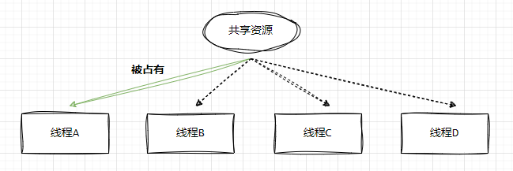
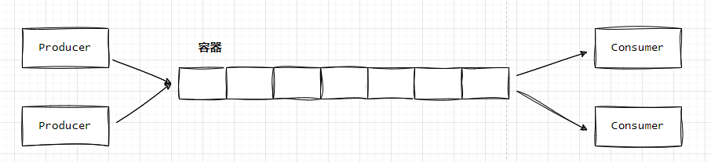
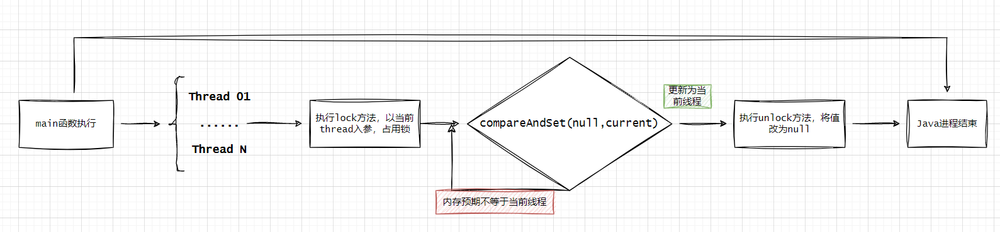
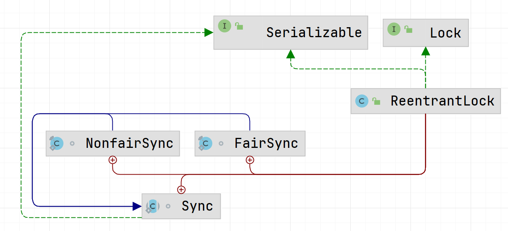

## AQS(AbstractQueuedSynchronizer抽象同步队列)

>注意：AQS知识偏JDK底层，该篇blog，博主也是阅读其他blog以及通过ReentrantLock案例调试，做一些分享心得，该文会有大篇幅在语言描述上摘抄refer的blog。    

### 引言
AbstractQueuedSynchronizer抽象同步队列简称AQS，它是实现同步器的基础组建，并发包中锁的底层就是使用AQS实现的，那既然了解它是属于锁的业务的范畴，那肯定脱离不了多线程场景，下面简单描述下场景：        

>**场景一** 有四个线程由于业务需求需要同时占用某资源，但该资源在同一个时刻只能被其中唯一线程所独占。那么此时应该如何标识该资源已经被独占，同时剩余无法获取该资源的线程又该何去何从呢？

  

```java
public class AtomicDemo {
    // 共享变量
    private static int count = 0;
    private static Lock lock = new ReentrantLock();

    // 操作共享变量的方法
    public static void incr() {
        // 为了演示效果  休眠一下子
        try {
            lock.lock();
            Thread.sleep(1);
            count++;
        } catch (InterruptedException e) {
            e.printStackTrace();
        } finally {
            lock.unlock();
        }
    }

    public static void main(String[] args) throws InterruptedException {
        for (int i = 0; i < 1000; i++) {
            new Thread(() -> AtomicDemo.incr()).start();
        }
        Thread.sleep(15000);
        System.out.println("result:" + count);
    }
}
```


>**场景二** 在生产者和消费者模式下，需要确保生产者不会再缓冲区已满时尝试将数据添加到缓冲区中，并且消费者不会尝试从空缓冲区中删除数据。    

  

这里就涉及到关于共享资源的竞争与同步关系。Java AQS正是为了解决这个问题而被设计出来。 `AQS 是一个集同步状态管理、线程阻塞、线程释放及队列管理功能与一身的同步框架。其核心思想是当多个线程竞争资源时会将未成功竞争到资源的线程构造为 Node 节点放置到一个双向 FIFO 队列中。被放入到该队列中的线程会保持阻塞直至被前驱节点唤醒。值得注意的是该队列中只有队首节点有资格被唤醒竞争锁。`   

为了更好了解AQS的实现逻辑，我们通过ReentrantLock来实现一个生产者和消费者的案例（上述场景二）： 代码如下： 

* Consumer线程负责消费Queue
* Producer线程负责生产数据添加到Queue中
* Queue队列是用LinkedList + ReentrantLock锁实现

```java
// Consumer:
public class Consumer<T> implements Runnable {
    private String name;
    private final Queue<T> queue;

    public Consumer(Queue<T> queue, String name) {
        this.queue = queue;
        this.name = name;
    }

    @Override
    public void run() {
        while (true) {
            T val = queue.take();
            System.out.println("threadName: " + name + " , Consumed : " + val);
        }
    }
}

// Producer
public class Producer<T> implements Runnable {
    private String name;
    private final Queue<T> queue;
    private final Random rand = new Random();

    public Producer(Queue<T> queue, String name) {
        this.queue = queue;
        this.name = name;
    }
    @Override
    public void run() {
        while (true) {
            Integer val = rand.nextInt(10);
            queue.put((T) val);
            System.out.println("threadName: " + name + " , Produced  " + val);
        }

    }
}

// Queue
public class Queue<T> {
    private final int capacity;
    private final LinkedList<T> list;
    private final ReentrantLock lock = new ReentrantLock();
    private final Condition notEmpty = lock.newCondition();
    private final Condition notFull = lock.newCondition();

    public Queue(int capacity) {
        this.capacity = capacity;
        list = new LinkedList<>();
    }

    public void put(T val) {
        lock.lock();
        try {
            if (this.list.size() == capacity) {
                notFull.await();
            }
            this.list.add(val);
            notEmpty.signalAll();
        } catch (InterruptedException e) {
            e.printStackTrace();
        } finally {
            lock.unlock();
        }
    }

    public T take() {
        lock.lock();
        T val = null;
        try {
            if (this.list.size() == 0) {
                notEmpty.await();
            }
            val = this.list.remove();
            notFull.signalAll();
        } catch (InterruptedException e) {
            e.printStackTrace();
        } finally {
            lock.unlock();
        }
        return val;
    }
}

// TestMain
public class TestMain {

    public static void main(String[] args) {
        Queue<Integer> queue = new Queue<>(10);
        Producer<Integer> producer01 = new Producer<Integer>(queue, "producer01");
        Producer<Integer> producer02 = new Producer<Integer>(queue, "producer02");
        Consumer<Integer> consumer01 = new Consumer<Integer>(queue, "consumer01");

        new Thread(producer01).start();
        new Thread(producer02).start();
        new Thread(consumer01).start();
    }
}
```

### 了解自旋锁 

**什么是自旋锁**    
自旋锁（spinlock）：是指当一个线程在获取锁的时候，如果锁已经被其它线程获取，那么该线程将循环等待，然后不断的判断锁是否能够被成功获取，直到获取到锁才会退出循环。    

获取锁的线程一直处于活跃状态，但是并没有执行任何有效的任务，使用这种锁会造成 busy-waiting（https://zh.wikipedia.org/wiki/%E5%BF%99%E7%A2%8C%E7%AD%89%E5%BE%85）。

**实现自旋锁**  
下面列举一个自旋锁的实现案例。  
```java
public class SpinLock {
    private static final Logger logger = LoggerFactory.getLogger(SpinLock.class);

    AtomicReference<Thread> atomicReference = new AtomicReference<>();

    public void myLock(){
        Thread thread = Thread.currentThread();
        logger.info("{} invoke myLock()", Thread.currentThread());
        while(!atomicReference.compareAndSet(null,thread)){

        }
    }

    public void myUnlock(){
        Thread thread = Thread.currentThread();
        atomicReference.compareAndSet(thread,null);
        logger.info("{} invoke myUnlock()");
    }

    public static void main(String[] args) {
        SpinLock spinLock = new SpinLock();
        new Thread(()->{
            spinLock.myLock();
            // do somethings

            spinLock.myUnlock();
        });
    }
}
```

 myLock()方法利用了CAS，当第一个线程获取锁的时候，能够成功获取到，不会进入while循环，如果此时线程没有释放锁，那另一个线程获取锁时，此时犹豫不满足CAS的判断要求，必须等于当前Thread，则会进入while循环，直到已经获取到锁的线程调用myUnlock()来释放锁，所以整个处理过程如下图：   

   

获取锁时，线程会对一个原子变量循环执行 compareAndSet 方法，直到该方法返回成功时即为成功获取锁。compareAndSet 方法底层是通用 compare-and-swap （下称 CAS）实现的。该操作通过将内存中的值与指定数据进行比较，当数值一样时将内存中的数据替换为新的值。该操作是原子操作。原子性保证了根据最新信息计算出新值，如果与此同时值已由另一个线程更新，则写入将失败。因此，这段代码可以实现互斥锁的功能。   

**自旋锁缺点**
自旋锁实现简单，同时避免了操作系统进程调度和线程上下文切换的开销，但他有两个缺点：  
* 第一个是锁饥饿问题。在锁竞争激烈的情况下，可能存在一个线程一直被其他线程”插队“而一直获取不到锁的情况。    
* 第二是性能问题。在实际的多处理上运行的自旋锁在锁竞争激烈时性能较差。  

>固AQS的出现是了解决以上缺点。  

### 调试ReentrantLock代码
在上面`引言`章节中的**场景一**案例代码中，lock是由ReentrantLock实例化得到，那先了解下ReentrantLock的构造方法：  
```java
/**
 * Creates an instance of {@code ReentrantLock}.
 * This is equivalent to using {@code ReentrantLock(false)}.
 */
public ReentrantLock() {
    sync = new NonfairSync();
}
```

   

`通过ReentrantLock的内部类关系可知， ReentrantLock区分非公平锁和公平锁（如何实现下面再说明），当无参或者new ReentrantLock(false)表示的是非公平锁，反之是公平锁。`   

**仍然在场景一的代码中，当线程调用lock()方法时，发生了什么？**  
```java
// NonfairSync.lock()
final void lock() {
    if (compareAndSetState(0, 1))
        setExclusiveOwnerThread(Thread.currentThread());
    else
        acquire(1);
}
```


## state

## CLH队列(Craig, Landin, and Hagersten lock queue)


## 方法介绍

### unsafe.objectFieldOffset()
```java
// AbstractQueuedSynchronizer.java
stateOffset = unsafe.objectFieldOffset
    (AbstractQueuedSynchronizer.class.getDeclaredField("state"));
```

objectFieldOffset()方法用于获取某个字段相对Java对象的“起始地址”的偏移量，也提供了getInt、getLong、getObject之类的方法可以使用前面获取的偏移量来访问某个Java对象的某个字段


### unsafe.compareAndSwapInt()
```java
// AbstractQueuedSynchronizer.java
protected final boolean compareAndSetState(int expect, int update) {
    // See below for intrinsics setup to support this
    return unsafe.compareAndSwapInt(this, stateOffset, expect, update);
}
```


### AbstractQueuedSynchronizer.Node
```java
static final class Node {
    // SHARED 共享模式 , EXCLUSIVE 独占模式
    /** Marker to indicate a node is waiting in shared mode */
    static final Node SHARED = new Node();
    /** Marker to indicate a node is waiting in exclusive mode */
    static final Node EXCLUSIVE = null;

    /** waitStatus value to indicate thread has cancelled */
    static final int CANCELLED =  1; // 节点被取消
    /** waitStatus value to indicate successor's thread needs unparking */
    static final int SIGNAL    = -1; // 代表后续节点需要被阻塞
    /** waitStatus value to indicate thread is waiting on condition */
    static final int CONDITION = -2; // 在条件队列中
    /**
        * waitStatus value to indicate the next acquireShared should
        * unconditionally propagate
        */
    static final int PROPAGATE = -3; // 用于共享模式，表示无条件传播

    /**
        * Status field, taking on only the values:
        *   SIGNAL:     The successor of this node is (or will soon be)
        *               blocked (via park), so the current node must
        *               unpark its successor when it releases or
        *               cancels. To avoid races, acquire methods must
        *               first indicate they need a signal,
        *               then retry the atomic acquire, and then,
        *               on failure, block.
        *   CANCELLED:  This node is cancelled due to timeout or interrupt.
        *               Nodes never leave this state. In particular,
        *               a thread with cancelled node never again blocks.
        *   CONDITION:  This node is currently on a condition queue.
        *               It will not be used as a sync queue node
        *               until transferred, at which time the status
        *               will be set to 0. (Use of this value here has
        *               nothing to do with the other uses of the
        *               field, but simplifies mechanics.)
        *   PROPAGATE:  A releaseShared should be propagated to other
        *               nodes. This is set (for head node only) in
        *               doReleaseShared to ensure propagation
        *               continues, even if other operations have
        *               since intervened.
        *   0:          None of the above
        *
        * The values are arranged numerically to simplify use.
        * Non-negative values mean that a node doesn't need to
        * signal. So, most code doesn't need to check for particular
        * values, just for sign.
        *
        * The field is initialized to 0 for normal sync nodes, and
        * CONDITION for condition nodes.  It is modified using CAS
        * (or when possible, unconditional volatile writes).
        */
    volatile int waitStatus; // 节点状态，用的就是上面四个字段

    /**
        * Link to predecessor node that current node/thread relies on
        * for checking waitStatus. Assigned during enqueuing, and nulled
        * out (for sake of GC) only upon dequeuing.  Also, upon
        * cancellation of a predecessor, we short-circuit while
        * finding a non-cancelled one, which will always exist
        * because the head node is never cancelled: A node becomes
        * head only as a result of successful acquire. A
        * cancelled thread never succeeds in acquiring, and a thread only
        * cancels itself, not any other node.
        */
    volatile Node prev; // 节点的前驱节点

    /**
        * Link to the successor node that the current node/thread
        * unparks upon release. Assigned during enqueuing, adjusted
        * when bypassing cancelled predecessors, and nulled out (for
        * sake of GC) when dequeued.  The enq operation does not
        * assign next field of a predecessor until after attachment,
        * so seeing a null next field does not necessarily mean that
        * node is at end of queue. However, if a next field appears
        * to be null, we can scan prev's from the tail to
        * double-check.  The next field of cancelled nodes is set to
        * point to the node itself instead of null, to make life
        * easier for isOnSyncQueue.
        */
    volatile Node next; // 后续节点

    /**
        * The thread that enqueued this node.  Initialized on
        * construction and nulled out after use.
        */
    volatile Thread thread; // 节点代表的线程

    /**
        * Link to next node waiting on condition, or the special
        * value SHARED.  Because condition queues are accessed only
        * when holding in exclusive mode, we just need a simple
        * linked queue to hold nodes while they are waiting on
        * conditions. They are then transferred to the queue to
        * re-acquire. And because conditions can only be exclusive,
        * we save a field by using special value to indicate shared
        * mode.
        */
    Node nextWaiter;

    /**
        * Returns true if node is waiting in shared mode.
        */
    final boolean isShared() {
        return nextWaiter == SHARED;
    }

    /**
        * Returns previous node, or throws NullPointerException if null.
        * Use when predecessor cannot be null.  The null check could
        * be elided, but is present to help the VM.
        *
        * @return the predecessor of this node
        */
    final Node predecessor() throws NullPointerException {
        Node p = prev;
        if (p == null)
            throw new NullPointerException();
        else
            return p;
    }

    Node() {    // Used to establish initial head or SHARED marker
    }

    Node(Thread thread, Node mode) {     // Used by addWaiter
        this.nextWaiter = mode;
        this.thread = thread;
    }

    Node(Thread thread, int waitStatus) { // Used by Condition
        this.waitStatus = waitStatus;
        this.thread = thread;
    }
}
```


```java
/**
    * Creates and enqueues node for current thread and given mode.
    *
    * @param mode Node.EXCLUSIVE for exclusive, Node.SHARED for shared
    * @return the new node
    */
// 节点插入到队尾的方法，mode是节点模式，共享/独占
private Node addWaiter(Node mode) {
    Node node = new Node(Thread.currentThread(), mode);
    // Try the fast path of enq; backup to full enq on failure
    Node pred = tail;
    if (pred != null) {
        node.prev = pred;
        if (compareAndSetTail(pred, node)) {
            pred.next = node;
            return node;
        }
    }
    enq(node);
    return node;
}
```


查看对象
https://openjdk.java.net/projects/code-tools/jol/
https://github.com/openjdk/jol

个人BLOG
https://www.iteye.com/blog/user/rednaxelafx


refer
1.https://tech.meituan.com/2019/12/05/aqs-theory-and-apply.html
2.https://zhuanlan.zhihu.com/p/308452402
3.https://www.processon.com/view/62b83b561e08531560736b67?fromnew=1
4.https://learnku.com/articles/49689