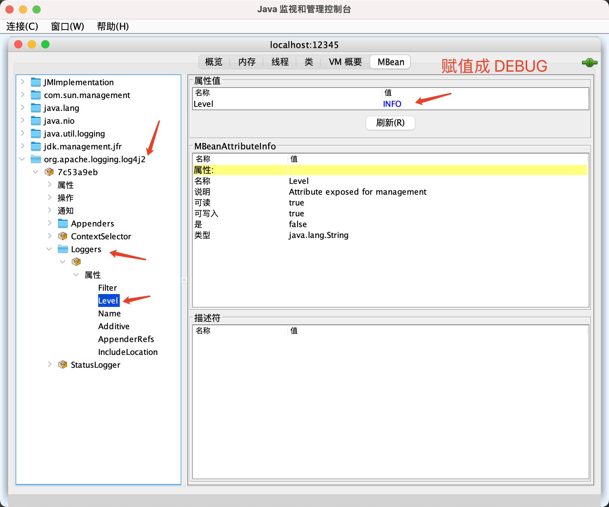

## Java 动态调整 log级别实战     

### 引言 
在 java 程序中，slf4j + log4j2 是我们常用的 log 组件，我们利用 log 级别来控制服务打印 log 的数据量大小以及 log 内容的重要性等。 所以当发现服务存在某些问题时，我们需要将log 由 info级别 改成 debug 级别，从而打印更多详细的日志来分析服务存在的问题。 而在实际排查问题过程中，也并非能达到预期的效果，例如：   
* 1.若重启服务，将 log 级别由 info 改成 debug，则现场环境丢失  
* 2.debug log 需提前埋点好，若没有友好的处理，也达不到事半功倍的效果   

其实该篇 Blog 只是从 `上面的 1 角度`去解决，做到在不重启服务的情况下，将 info 改成 debug。这样就不会存在现场环境丢失；至于 2 角度，仍需要开发人员具有良好的逻辑处理前瞻性，不然痛点还是会痛。 


接下来，我们就来介绍 `在不重启服务的情况，如何将 log 级别由 info 改成 debug`  

>注意：在服务部署中很多都是默认 info，所以由 info 改成 debug 表示的大多数场景下的操作，可以将任意级别互转，但这里必须要明确，服务的日志级别本身不应该低于 warn。     

### 动态调整 log 级别   

#### 案例环境搭建 
该测试案例采用 一般java 程序 + Jetty Server 提供接口， 目录如下： 
```shell
└── com
    └── yzhou
        └── log4j
            ├── log
            │   └── UserServlet.java
            └── web
                ├── Bootstrap.java
                ├── JettyServer.java
                └── LogServlet.java 
```

`Bootstrap#main()` 是程序的入口类，`UserServer.java` 定义了 GET 接口（localhost:8080/user）, 当请求过来时会根据当前的服务级别打印 log：   

```java
package com.yzhou.log4j.log;
...

public class UserServlet extends HttpServlet {
     private static final Logger logger = LoggerFactory.getLogger(UserServlet.class);
    private Gson gson = new Gson();
    @Override
    protected void doGet(HttpServletRequest req, HttpServletResponse resp) throws ServletException, IOException {

        logger.debug("doGet debug log");
        logger.info("doGet info log");

        Map<String,Object> result = new HashMap<>();
        result.put("code",0);

        resp.setContentType("application/json");
        resp.setStatus(HttpServletResponse.SC_OK);
        gson.toJson(result, resp.getWriter());
    }
}
```

在 `LogServlet.java `定义了 GET 接口（localhost:8080/log?logLevel=info/debug）,当 url 参数 logLevel 为 info或者 debug 时，则调整 对应资源下的log 级别，为什么这么说呢？  

在 log4j2 的API 中提供了 `Configurator#setLevel()` 方法，第一个参数 loggerName 可代表`类路径（package） 或者 具体某个类`， 你也可以通过 JMX调整 全局的 log 级别。 

```java
public class LogServlet extends HttpServlet {
    private static final Logger logger = LoggerFactory.getLogger(LogServlet.class);
    private Gson gson = new Gson();
    @Override
    protected void doGet(HttpServletRequest req, HttpServletResponse resp) throws ServletException, IOException {
        String logLevel = req.getParameter("logLevel");
        logger.info("修改 log 日志");
        Configurator.setLevel("com.yzhou.log4j.log.UserServlet", logLevel.equals("info") ? Level.INFO : Level.DEBUG);
        Configurator.setLevel("org.eclipse.jetty.servlet", logLevel.equals("info") ? Level.INFO : Level.DEBUG);

        Map<String, Object> result = new HashMap<>();
        result.put("code", 0);

        resp.setContentType("application/json");
        resp.setStatus(HttpServletResponse.SC_OK);
        gson.toJson(result, resp.getWriter());
    }
}
```

基于以上测试代码，可验证 动态调整log 级别。 为了案例完整，下面将其他 代码也展示出来：     

```java
public class Bootstrap {
    public static void main(String[] args) throws Exception {
        JettyServer jettyServer = new JettyServer();
        jettyServer.start();
    }
}
```

```java
public class JettyServer {

    public void start() throws Exception {
        Server server = new Server(8080);

        ServletContextHandler context = new ServletContextHandler(ServletContextHandler.SESSIONS);
        context.setContextPath("/");
        server.setHandler(context);

        context.addServlet(new ServletHolder(new UserServlet()), "/user");
        context.addServlet(new ServletHolder(new LogServlet()), "/log");

        server.start();
        server.join();
    }
}
```   

**log42.properties** 
```java
rootLogger.level = info
rootLogger.appenderRef.stdout.ref = Console
rootLogger.appenderRef.file.ref = File

appender.console.type = Console
appender.console.name = Console
appender.console.layout.type = PatternLayout
appender.console.layout.pattern = %d{yyyy-MM-dd HH:mm:ss} [%t] %-5level %logger{36} - %msg%n

appender.file.type = File
appender.file.name = File
appender.file.fileName = logs/app.log
appender.file.layout.type = PatternLayout
appender.file.layout.pattern = %d{yyyy-MM-dd HH:mm:ss} [%t] %-5level %logger{36} - %msg%n
``` 

**pom.xml** 
```xml
<dependency>
      <groupId>org.eclipse.jetty</groupId>
      <artifactId>jetty-server</artifactId>
      <version>9.4.44.v20210927</version>
   </dependency>
   <dependency>
      <groupId>org.eclipse.jetty</groupId>
      <artifactId>jetty-servlet</artifactId>
      <version>9.4.44.v20210927</version>
   </dependency>
   <dependency>
      <groupId>com.google.code.gson</groupId>
      <artifactId>gson</artifactId>
      <version>2.8.9</version>
   </dependency>


   <dependency>
      <groupId>org.apache.logging.log4j</groupId>
      <artifactId>log4j-core</artifactId>
      <version>2.20.0</version>
   </dependency>
   <!--        <dependency>-->
   <!--            <groupId>org.apache.logging.log4j</groupId>-->
   <!--            <artifactId>log4j-to-slf4j</artifactId>-->
   <!--            <version>2.20.0</version> &lt;!&ndash; 请检查最新版本 &ndash;&gt;-->
   <!--        </dependency>-->
   <dependency>
      <groupId>org.apache.logging.log4j</groupId>
      <artifactId>log4j-slf4j-impl</artifactId>
      <version>2.20.0</version>
   </dependency>

   <dependency>
      <groupId>org.slf4j</groupId>
      <artifactId>slf4j-api</artifactId>
      <version>1.7.30</version>
   </dependency>
   <dependency>
      <groupId>org.slf4j</groupId>
      <artifactId>jul-to-slf4j</artifactId>
      <version>1.7.30</version>
   </dependency>
```


### JMX 全局修改服务 Log 级别       
可通过 java/bin/Jconsole 全局修改 log 级别， 需做以下步骤：    

* 1.服务启动时需配置 JMX 启动参数 (VM Options)    
```shell
-Dcom.sun.management.jmxremote
-Dcom.sun.management.jmxremote.port=12345
-Dcom.sun.management.jmxremote.authenticate=false
-Dcom.sun.management.jmxremote.ssl=false
```

* 2.找到对应的 mbeanName，修改 Level    
修改成 Level 由 INFO 改成 DEBUG 即可 。  
      

refer          
1.https://logging.apache.org/log4j/2.x/faq.html#reconfig_level_from_code         
2.https://logging.apache.org/log4j/jmx-gui/latest/      