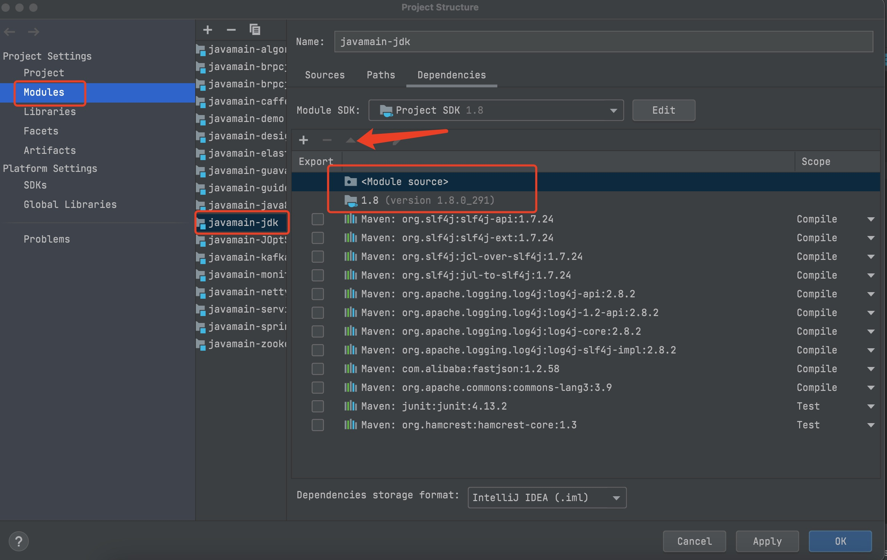

## 字节码入门篇(1)-javac实操

### JDK命令行工具介绍
在JDK的开发包中，除了大家熟知的java和javac外，还有一系列辅助工具。这些辅助工具位于JDK安装目录下的bin目录中，可以帮助开发人员很好地解决Java应用程序的一些"疑难杂症"。    
这些工具都是可执行文件，在windows系统的扩展是.exe，但事实上它们只是Java程序的一层包装，其真正的实现是在tools.jar中。

### javac源码环境搭建 (openJDK 1.8版本 tag:jdk8-b120)   
1. `openJDK在9后将tools给删除` 按照9的模块化重新构建源代码（具体参考 https://openjdk.java.net/jeps/220) ,将openJDK1.8目录下 `langtools/src/share/classes`的com文件夹拷贝到 src目录下       
`如图所示`     


2. 调整idea的module 依赖顺序    
打开 Project Structure页面(File -> Project Structure),选择Dependencies选项卡，把<Module source>顺序调整到项目JDK上面    
`如图所示`  



简单说明 tools目录下，常用的两个目录：javac编译器，javap反编译字节码

### javac实操
javac是java编写的，它执行命令：javac -d descdir srcFile   
* -d descdir: 指定存放编译生成的.class文件的路径
当前目录可以用"."来表示，即： java -d . srcFile
* srcFile: 指源文件.java文件的路径  

```
# javac参数命令解释
用法: javac <options> <source files>
其中, 可能的选项包括:
-g                         生成所有调试信息
-g:none                    不生成任何调试信息
-g:{lines,vars,source}     只生成某些调试信息
-nowarn                    不生成任何警告
-verbose                   输出有关编译器正在执行的操作的消息
-deprecation               输出使用已过时的 API 的源位置
-classpath <路径>            指定查找用户类文件和注释处理程序的位置
-cp <路径>                   指定查找用户类文件和注释处理程序的位置
-sourcepath <路径>           指定查找输入源文件的位置
-bootclasspath <路径>        覆盖引导类文件的位置
-extdirs <目录>              覆盖所安装扩展的位置
-endorseddirs <目录>         覆盖签名的标准路径的位置
-proc:{none,only}          控制是否执行注释处理和/或编译。
-processor <class1>[,<class2>,<class3>...] 要运行的注释处理程序的名称; 绕过默认的搜索进程
-processorpath <路径>        指定查找注释处理程序的位置
-parameters                生成元数据以用于方法参数的反射
-d <目录>                    指定放置生成的类文件的位置
-s <目录>                    指定放置生成的源文件的位置
-h <目录>                    指定放置生成的本机标头文件的位置
-implicit:{none,class}     指定是否为隐式引用文件生成类文件
-encoding <编码>             指定源文件使用的字符编码
-source <发行版>              提供与指定发行版的源兼容性
-target <发行版>              生成特定 VM 版本的类文件
-profile <配置文件>            请确保使用的 API 在指定的配置文件中可用
-version                   版本信息
-help                      输出标准选项的提要
-A关键字[=值]                  传递给注释处理程序的选项
-X                         输出非标准选项的提要
-J<标记>                     直接将 <标记> 传递给运行时系统
-Werror                    出现警告时终止编译
@<文件名>                     从文件读取选项和文件名
```
**1. 在终端编译java，在执行**   
在Idea中创建Test01.java，代码如下： 
```java
package com.javamain.bytecode;

public class Test01 {
    public static void main(String[] args) {
        int a = 1;
        int b = 1;
        System.out.println(a + b);
    }
}
```
```shell
#利用Idea Terminal工具，进入Test01.java的所在目录
cd 进入目录
#将.java编译成class
javac -d . Test01.java
#注意Test01.java 是有包名的,需要指定全限定类名
java com.javamain.bytecode.Test01
``` 

### 认识字节码
* 认识重要的字节码，如方法调用相关的字节码，这些部分会涉及到方法的动态分派、Lambda表达式等实现  
* 基于栈的指令设计，所以与机器指令的编码规则相比比较简单，降低了编写前端编译器的复杂度，同时也更有利于在字节码层面做增强和改写  
* 字节码有助于跨平台(移植性好)，在虚拟机上的语言有Java，Groovy，Scala等，所以这些语言也是跨平台的   


### 实践分析


1. 解语法糖
在com.sun.tools.javac.main.JavaCompiler的desugar()方法中加入打印语句对解语法糖后的结果进行打印，可直观看到解语法糖后的效果

* 枚举类语法糖
* switch的条件语句类型为Enum
* switch的条件语句类型为String 
    


### 认识抽象语法树

### 插入式注解的实现原理

### 自定义注解小实例

### 仿lombok插件自动生成get/set方法