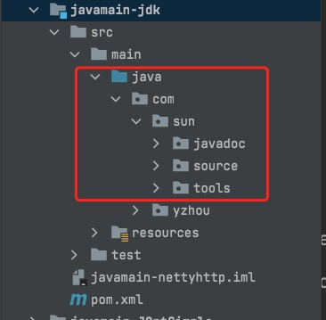

## 字节码入门篇(1)-javac实操

### JDK命令行工具介绍
在JDK的开发包中，除了大家熟知的java和javac外，还有一系列辅助工具。这些辅助工具位于JDK安装目录下的bin目录中，可以帮助开发人员很好地解决Java应用程序的一些"疑难杂症"。    
这些工具都是可执行文件，在windows系统的扩展是.exe，但事实上它们只是Java程序的一层包装，其真正的实现是在tools.jar中。

### javac源码环境搭建 (1.8)
`openJDK在9后将tools给删除`
将openJDK目录下 `langtools/src/share/classes`的com文件夹拷贝到 src目录下    
`如图所示`     

javac是java编写的，执行命令：javac -d descdir srcFile   
* -d descdir: 指定存放编译生成的.class文件的路径
当前目录可以用"."来表示，即： java -d . srcFile
* srcFile: 指源文件.java文件的路径

