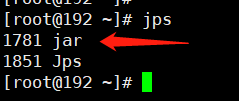
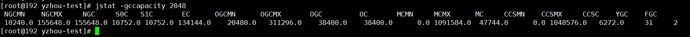

## JVM调优

### 引言
在开发过程中，需要使用一些jdk命令来进行程序的调优及问题排查，接下来介绍一些常用的命令

### jps
使用jps查看其进程id



### jmap
可以用来查看内存信息，实例个数以及占用内存大小
```shell
jmap -histo 1781 > jmap.log
```


打开log.txt，文件内容如下：    
* num: 序号
* instances: 实例数量
* bytes: 占用空间大小
* class name: 类名称（[C is a char[]，[S is a short[]，[I is a int[]，[B is a byte[]，[[I is a int[][]）


#### 堆信息
```shell
jmap -heap 1781
```
用于获取 Java 堆的详细信息，包括堆配置、使用情况以及垃圾回收相关的信息  


它将输出 Java 堆的信息，例如：      
* 使用的垃圾回收器（如 G1、Parallel、CMS 等）       
* 各代的内存使用情况（包括新生代、老年代等）        
* Java 堆的总容量和已使用容量       

#### 堆内存dump
```shell
# 特别注意file配置的目录权限，强烈建议配置在当前用户下的目录，避免出现“Error attaching to core file: cannot open binary file”异常信息
jmap ‐dump:format=b,file=/root/yzhoutest.hprof 1781
```

也可以设置内存溢出自动导出dump文件(内存很大的时候，可能会导不出来)  
* -XX:+HeapDumpOnOutOfMemoryError   
* -XX:HeapDumpPath=./ （路径）  


### jstack
用jstack加进程id查找死锁


#### jstack找出占用cpu最高的线程堆栈信息
1. 使用命令 top -p <pid>, 显示java进程的内存情况，pid是java进程号


2. 按“H”(大写)，获取每个线程的内存情况


3. 找到内存和CPU占用最高的线程tid，例如 2875


4. 将tid 转为十六进
```shell
# 注意printf打印不包含十六进制标识 0x
printf '%x\n' tid
```
所以示例中的2875，最后得到的十六进制是 **0xb3b**。

5. 执行`jstack <pid>|grep -A 10 <tid十六进制>`，得到线程堆栈信息中的tid这个线程所在行的后面10行 
```shell
# 示例
jstack 2848|grep -A 10 0xb3b
```


6. 查看线程对应的堆栈信息找出可能存在问题的代码


### jinfo
查看正在运行的java应用程序的扩展参数    
```shell
jinfo -flags <pid>
```


查看java系统参数    
```shell
jinfo -sysprops <pid>
```


### jstat
jstat命令可以查看堆内存各部分的使用量，以及加载类的数量。命令的格式如下：
jstat [-命令选项] [vmid] [间隔时间(毫秒)] [查询次数]
注意：使用的jdk版本是jdk8   


#### 垃圾回收统计
`jstat -gc <pid>`最常用，可以评估程序内存使用以及GC压力整体情况 
```shell
# 示例
jstat -gc <pid>
```
  
* S0C：第一个幸存区的大小，单位KB   
* S1C：第二个幸存区的大小 
* S0U：第一个幸存区的使用大小 
* S1U：第二个幸存区的使用大小 
* EC：伊甸园区的大小  
* EU：伊甸园区的使用大小  
* OC：老年代大小  
* OU：老年代使用大小  
* MC：方法区大小(元空间)  
* MU：方法区使用大小  
* CCSC:压缩类空间大小 
* CCSU:压缩类空间使用大小 
* YGC：年轻代垃圾回收次数 
* YGCT：年轻代垃圾回收消耗时间，单位s 
* FGC：老年代垃圾回收次数 
* FGCT：老年代垃圾回收消耗时间，单位s 
* GCT：垃圾回收消耗总时间，单位s  

#### 堆内存统计
```shell
jstat -gccapacity <pid>
```
  
* NGCMN：新生代最小容量 
* NGCMX：新生代最大容量 
* NGC：当前新生代容量   
* S0C：第一个幸存区大小 
* S1C：第二个幸存区的大小   
* EC：伊甸园区的大小    
* OGCMN：老年代最小容量 
* OGCMX：老年代最大容量 
* OGC：当前老年代大小   
* OC:当前老年代大小 
* MCMN:最小元数据容量   
* MCMX：最大元数据容量  
* MC：当前元数据空间大小    
* CCSMN：最小压缩类空间大小 
* CCSMX：最大压缩类空间大小 
* CCSC：当前压缩类空间大小  
* YGC：年轻代gc次数 
* FGC：老年代GC次数 

#### 新生代垃圾回收统计
```shell
jstat -gcnew <pid>
```
  
* S0C：第一个幸存区的大小   
* S1C：第二个幸存区的大小   
* S0U：第一个幸存区的使用大小   
* S1U：第二个幸存区的使用大小   
* TT:对象在新生代存活的次数 
* MTT:对象在新生代存活的最大次数    
* DSS:期望的幸存区大小  
* EC：伊甸园区的大小    
* EU：伊甸园区的使用大小    
* YGC：年轻代垃圾回收次数   
* YGCT：年轻代垃圾回收消耗时间  

#### 新生代内存统计
```shell
jstat -gcnewcapacity <pid>
```
  
* NGCMN：新生代最小容量 
* NGCMX：新生代最大容量 
* NGC：当前新生代容量   
* S0CMX：最大幸存1区大小    
* S0C：当前幸存1区大小  
* S1CMX：最大幸存2区大小    
* S1C：当前幸存2区大小  
* ECMX：最大伊甸园区大小    
* EC：当前伊甸园区大小  
* YGC：年轻代垃圾回收次数   
* FGC：老年代回收次数   

#### 老年代垃圾回收统计
```shell
jstat -gcold <pid>
```
  
* MC：方法区大小    
* MU：方法区使用大小    
* CCSC:压缩类空间大小   
* CCSU:压缩类空间使用大小   
* OC：老年代大小    
* OU：老年代使用大小    
* YGC：年轻代垃圾回收次数   
* FGC：老年代垃圾回收次数   
* FGCT：老年代垃圾回收消耗时间  
* GCT：垃圾回收消耗总时间   

#### 老年代内存统计
```shell
jstat -gcoldcapacity <pid>
```
  
* OGCMN：老年代最小容量 
* OGCMX：老年代最大容量 
* OGC：当前老年代大小   
* OC：老年代大小    
* YGC：年轻代垃圾回收次数   
* FGC：老年代垃圾回收次数   
* FGCT：老年代垃圾回收消耗时间  
* GCT：垃圾回收消耗总时间   

#### 元数据空间统计
```shell
jstat -gcmetacapacity <pid>
```
* MCMN:最小元数据容量   
* MCMX：最大元数据容量  
* MC：当前元数据空间大小    
* CCSMN：最小压缩类空间大小 
* CCSMX：最大压缩类空间大小 
* CCSC：当前压缩类空间大小  
* YGC：年轻代垃圾回收次数   
* FGC：老年代垃圾回收次数   
* FGCT：老年代垃圾回收消耗时间  
* GCT：垃圾回收消耗总时间   

#### 整体查看
```shell
jstat -gcutil <pid>
```
* S0：幸存1区当前使用比例   
* S1：幸存2区当前使用比例   
* E：伊甸园区使用比例   
* O：老年代使用比例 
* M：元数据区使用比例   
* CCS：压缩使用比例 
* YGC：年轻代垃圾回收次数   
* FGC：老年代垃圾回收次数   
* FGCT：老年代垃圾回收消耗时间  
* GCT：垃圾回收消耗总时间   


### JVM运行情况预估
用 jstat gc -pid 命令可以计算出如下一些关键数据，有了这些数据就可以采用之前介绍过的优化思路，先给自己的系统设置一些初始性的
JVM参数，比如堆内存大小，年轻代大小，Eden和Survivor的比例，老年代的大小，大对象的阈值，大龄对象进入老年代的阈值等。

**年轻代对象增长的速率**
可以执行命令 jstat -gc pid 1000 10 (每隔1秒执行1次命令，共执行10次)，通过观察EU(eden区的使用)来估算每秒eden大概新增多少对
象，如果系统负载不高，可以把频率1秒换成1分钟，甚至10分钟来观察整体情况。注意，一般系统可能有高峰期和日常期，所以需要在不
同的时间分别估算不同情况下对象增长速率。    

**Young GC的触发频率和每次耗时** 
知道年轻代对象增长速率我们就能推根据eden区的大小推算出Young GC大概多久触发一次，Young GC的平均耗时可以通过 YGCT/YGC
公式算出，根据结果我们大概就能知道系统大概多久会因为Young GC的执行而卡顿多久。

**每次Young GC后有多少对象存活和进入老年代**
这个因为之前已经大概知道Young GC的频率，假设是每5分钟一次，那么可以执行命令 jstat -gc pid 300000 10 ，观察每次结果eden，
survivor和老年代使用的变化情况，在每次gc后eden区使用一般会大幅减少，survivor和老年代都有可能增长，这些增长的对象就是每次
Young GC后存活的对象，同时还可以看出每次Young GC后进去老年代大概多少对象，从而可以推算出老年代对象增长速率。    

**Full GC的触发频率和每次耗时** 
知道了老年代对象的增长速率就可以推算出Full GC的触发频率了，Full GC的每次耗时可以用公式 FGCT/FGC 计算得出。
优化思路其实简单来说就是尽量让每次Young GC后的存活对象小于Survivor区域的50%，都留存在年轻代里。尽量别让对象进入老年
代。尽量减少Full GC的频率，避免频繁Full GC对JVM性能的影响