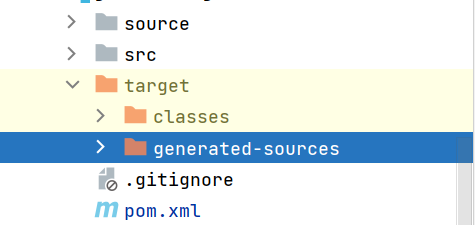
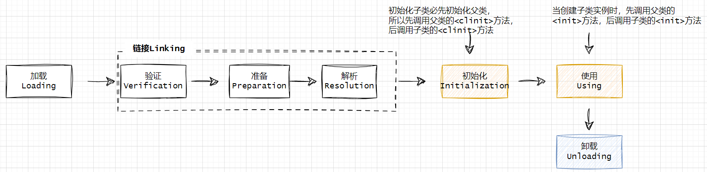

## 类的加载机制

### 引言
JVM 是 Java Virtual Machine（Java 虚拟机）的缩写，它是整个 java实现跨平台的最核心的部分，所有的 java程序会首先被编译为.class 的类文件，这种类文件可以在虚拟机上执行，也就是说 class 并不直接与机器的操作系统相对应，而是经过虚拟机间接与操作系统交互，由虚拟机将程序解释。  

当我们把java程序通过maven、gradle或者其他编译工具处理，可以看到*.jar、*.war、idea中的“target/*.class”文件。 如果想看jar、war里面文件仅通过解压工具解压即可。 但有点必须明确知晓“class文件”也并非特质某个存在与具体磁盘中的文件，而应当是一串二进制字节流，无论其以何种形式存在，包括但不限于磁盘文件、网络、数据库、内存或者动态产生等。**因为在实际工作中，总能碰到一些方法读取不同形式的class，后续会介绍**   

    
要查看*.class文件内容，可以通过“idea IDE”、“jd-gui（https://github.com/java-decompiler/jd-gui）”、“ClassViewer（https://github.com/ClassViewer/ClassViewer）”工具查看。  

>剩下能做的仅能靠JVM去做（这句话不全对，大伙也能出点力）。下面来探索class在jvm中是如何处理？      

### 概述
`Java虚拟机把描述类的数据从**Class**文件加载到内存，并对数据进行校验、转换解析和初始化，最终形成可以被虚拟机直接使用的Java类型，这个过程被称作虚拟机的类加载机制`。与那些在编译时需要进行连接的语言不同，在Java语言里面，类型的加载、连接和初始化过程都是在程序运行期间完成的，这种策略让Java语言进行提前编译会面临额外的困难，也会让类加载时稍微增加一些性能开销，但是却为Java应用提供了极高的扩展性和灵活性，Java天生可以动态扩展的语言特性就是依赖运行期动态加载和动态连接这个特点实现的。   

例如，编写一个面向接口的应用程序，可以等到运行时再指定其实际的实现类，用户可以通过Java预置的或自定义类加载器，让某个本地的应用程序在运行时从网络或其他地方上加载一个二进制流作为其程序代码的一部分。这种动态组装应用的方式目前已广泛应用于Java程序之中，从最基础的Applet、JSP到相对复杂的OSGi技术，都依赖着Java语言运行期类加载才得以诞生。

### 类加载的阶段
一个类型从被加载到虚拟机内存中开始，到卸载出内存为止，它的整个生命周期将会经历加载(Loading)、验证（ Verification)、准备（Preparation）、解析(Resolution)、初始化(Initialization)、使用(Using)和卸载(Unloading)七个阶段，其中验证、准备、解析三个部分统称为连接(Linking) 。这七个阶段的发生顺序如图所示。    

  

图中，**加载**、**验证**、**准备**、**初始化**和**卸载**这五个阶段的顺序是确定的，类型的加载过程必须按照这种顺序按部就班地开始，而解析阶段则不一定:它在某些情况下可以在初始化阶段之后再开始，这是为了支持Java语言的运行时绑定特性（也称为动态绑定或晚期绑定）。请注意，这里笔者写的是按部就班地"开始”，而不是按部就班地"进行”或按部就班地“完成”，强调这点是因为这些阶段通常都是互相交叉地混合进行的，会在一个阶段执行的过程中调用、激活另一个阶段。  

refer
1.《深入理解Java虚拟机》第三版