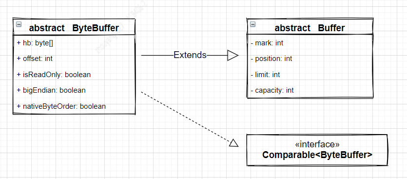
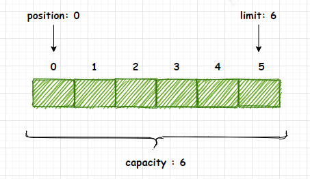
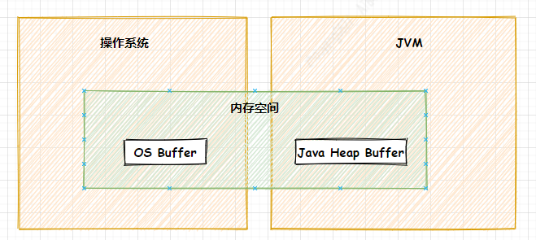
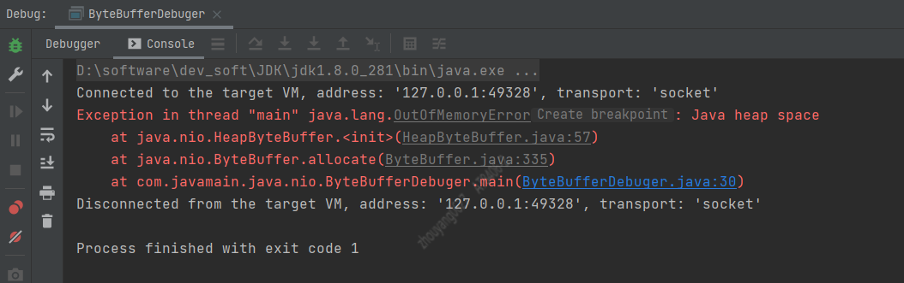
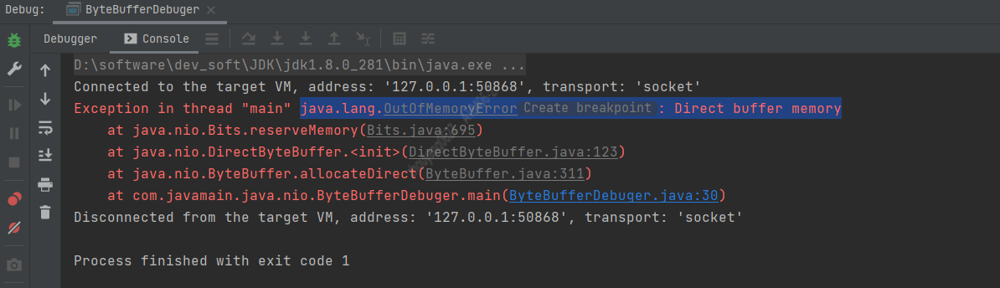

# Java ByteBuffer讲解

>Kafka的网络的通信是基于Java NIO实现的。它的Producer、Broker、Consumer有太多的地方直接使用ByteBuffer以及它的方法。
`下面我们举例一些Kafka中使用的案例： `  

## 1. Producer案例 
**1.1** Producer发送消息数据过程会通过BufferPool的allocateByteBuffer()方法，使用ByteBuffer的allocate()方法，创建size大小的缓冲区。
```java
//ByteBuffer.java allocateByteBuffer()方法
protected ByteBuffer allocateByteBuffer(int size) {
    return ByteBuffer.allocate(size);
}
```

**1.2** Producer的Sender线程，在构建ProduceRequest过程中会获取可以发送的ProducerBatch数据，并且利用它会创建MemoryRecords类型的records。
```java
// MemoryRecordsBuilder.java build()方法
public MemoryRecords build() {
    if (aborted) {
        throw new IllegalStateException("Attempting to build an aborted record batch");
    }
    close();
    return builtRecords;
}

// MemoryRecordsBuilder.java close()方法
ByteBuffer buffer = buffer().duplicate();
buffer.flip();
buffer.position(initialPosition);
builtRecords = MemoryRecords.readableRecords(buffer.slice());
```
## 2. Broker案例 
**2.1** Broker处理ProduceRequest获取RecordBatch，而它的实现类是DefaultRecordBatch.java。以下仅仅只是举例，不会全部列举： 
```java
//DefaultRecordBatch
@Override
public long baseOffset() {
    return buffer.getLong(BASE_OFFSET_OFFSET);
}
private int count() {
    return buffer.getInt(RECORDS_COUNT_OFFSET);
}
// ...等等
```

`以上案例：是为了让读者了解Kafka中使用了ByteBuffer， 下面会介绍Java ByteBuffer`

## 3. 介绍
ByteBuffer.java是JDK提供的，它的package是`java.nio`，它被用于存储NIO服务或线程发送和接受的数据对象，并且也提供了数据读取和写入的相关方法。它继承了Buffer。根据Buffer.java 类的注释定义(https://github.com/openjdk/jdk/blob/739769c8fc4b496f08a92225a12d07414537b6c0/src/java.base/share/classes/java/nio/Buffer.java), **A buffer is a linear, finite sequence of elements of a specific primitive type 缓冲区是特定基元类型元素的线性有限序列 (机器翻译)**。     
**3.1** 从定义可知： Buffer是在IO相关的基础类型类似于Java的八大基本类型，他是线性有限的类似于不可变数组。     
**3.2** Buffer拥有4个重要属性：Capacity、Limit、Position、Mark，下面介绍Buffer的4个属性的含义。  
Capacity : 存储在缓冲区中的数据的容量(长度)。该容量是在创建缓冲区时指定的，以后不能更改。 
Limit : 不能被读写的以第一个元素的从0开始的索引。它标识缓冲区中“活动”数据的容量(长度)。 
Position : 可以读取的下一个数据的从零开始的索引或可以写入该数据的位置。 
Mark : 标记缓冲区的position索引值。 当缓冲区调用reset()方法时会将缓冲区的position重置到当初标记的mark位置。   
**3.3** 在任何时候都必须应用以下不变式：0 <= position <= limit <= capacity

下面图3-1是ByteBuffer的继承关系。
`图3-1`   


`图3-2`   



## 4. 创建字节缓冲区
根据Java8 doc的ByteBuffer可知(https://docs.oracle.com/javase/8/docs/api/index.html), ByteBuffer的创建方式有2种：一种是直接缓冲期，另一种非直接缓冲区。 直接与非直接缓冲区的区别在于缓冲区的存储位置不同。直接缓冲区是直接存储在操作系统的内存中（非JVM的堆内存中）， 非直接缓冲区是存储在JVM的堆内存中。为了确保最高性能而不影响JVM堆，可以利用创建直接缓冲区，尽管直接缓冲区具有更高的分配成本，但使用它们读取和写入数据的效率更高，因为不想产生GC的干扰。
`图4-1`   

```java
// 非直接缓冲区
int size = 1024*1024*20;
//以size为空间大小的创建ByteBuffer对象
ByteBuffer bf01 = ByteBuffer.allocate(size);
logger.info("position: {} , limit: {} , capacity: {}",bf01.position(),bf01.limit(),bf01.capacity());

// 直接缓冲区
int size = 1024*1024*20;
//以size为空间大小的创建ByteBuffer对象
ByteBuffer bf02 = ByteBuffer.allocateDirect(size);
logger.info("position: {} , limit: {} , capacity: {}",bf02.position(),bf02.limit(),bf02.capacity());
```
`以下是部分ByteBuffer关于Java8 doc的摘要:` 
 **Direct vs. non-direct buffers**

A byte buffer is either direct or non-direct. Given a direct byte buffer, the Java virtual machine will make a best effort to perform native I/O operations directly upon it. That is, it will attempt to avoid copying the buffer's content to (or from) an intermediate buffer before (or after) each invocation of one of the underlying operating system's native I/O operations.

A direct byte buffer may be created by invoking the allocateDirect factory method of this class. The buffers returned by this method typically have somewhat higher allocation and deallocation costs than non-direct buffers. The contents of direct buffers may reside outside of the normal garbage-collected heap, and so their impact upon the memory footprint of an application might not be obvious. It is therefore recommended that direct buffers be allocated primarily for large, long-lived buffers that are subject to the underlying system's native I/O operations. In general it is best to allocate direct buffers only when they yield a measureable gain in program performance.

A direct byte buffer may also be created by mapping a region of a file directly into memory. An implementation of the Java platform may optionally support the creation of direct byte buffers from native code via JNI. If an instance of one of these kinds of buffers refers to an inaccessible region of memory then an attempt to access that region will not change the buffer's content and will cause an unspecified exception to be thrown either at the time of the access or at some later time.

Whether a byte buffer is direct or non-direct may be determined by invoking its isDirect method. This method is provided so that explicit buffer management can be done in performance-critical code. 


## 4.1 创建 - 案例

**JVM 大小： -Xms10m -Xmx10m**

**4.1.1.** 创建非直接缓冲区 allocate()
JVM默认堆大小最大，最小都是10M。 使用allocate()方法创建20M的非直接缓冲区，结果会怎么样？ 
```java
int size = 1024*1024*20;  // 20M
//以size为空间大小的创建ByteBuffer对象
ByteBuffer bf01 = ByteBuffer.allocate(size);
logger.info("position: {} , limit: {} , capacity: {}",bf01.position(),bf01.limit(),bf01.capacity());
```



>结果： Java堆内存溢出，JVM最大10M堆内存

**4.1.2.** 创建直接缓冲区 allocateDirect()
JVM默认堆大小最大，最小都是10M。 使用allocateDirect()方法创建20M的直接缓冲区，结果会怎么样？
```java
int size = 1024*1024*20;
//以size为空间大小的创建ByteBuffer对象
ByteBuffer bf01 = ByteBuffer.allocateDirect(size);
logger.info("position: {} , limit: {} , capacity: {}",bf01.position(),bf01.limit(),bf01.capacity());
```



>结果： 当JVM配置堆的最大存储参数-Xmx，而应用所能分配的直接堆内存默认是`Runtime.getRuntime().maxMemory()`值。 也可以通过在JVM的启动参数-XX:MaxDirectMemorySize=xxxx 设置直接堆内存大小。

## 5. Buffer的翻转
Buffer的定义中它是线性有限的，而position表示它可读写的以0作为第一个元素的索引。 当Buffer处理写入场景时，position会随着写入字节而向后移动，表示可以写入索引。 当Buffer写入完成后，需要读取时，需要将Buffer的position设置为0,而Buffer提供了flip()，可以让Buffer从写入模式变成读取模式。 下面查看案例5-1：
`示例5.1`   
```java
int size01 = 6;
//以size为空间大小的创建ByteBuffer对象
ByteBuffer bf01 = ByteBuffer.allocate(size01);
bf01.putInt(5); // 占用4个字节
bf01.put((byte)1); // 占用1个字节
logger.info("write position: {} , limit: {} , capacity: {}",bf01.position(),bf01.limit(),bf01.capacity());

bf01.flip();
logger.info("buffer 翻转之后");
logger.info("read position: {} , limit: {} , capacity: {}",bf01.position(),bf01.limit(),bf01.capacity());
```
`输出日志:` 
2021-06-01 19:40:02  [ ByteBufferDebuger.java:44 ] - [ INFO ]  write position: 5 , limit: 6 , capacity: 6
2021-06-01 19:40:02  [ ByteBufferDebuger.java:47 ] - [ INFO ]  buffer 翻转之后
2021-06-01 19:40:02  [ ByteBufferDebuger.java:48 ] - [ INFO ]  read position: 0 , limit: 5 , capacity: 6


`图5-1`


`Buffer.flip()`
```java
public final Buffer flip() {
    limit = position;
    position = 0;
    mark = -1;
    return this;
}
```

## 6. Buffer写入数据
使用put()方法将数据写入ByteBuffer中。
```java
int size01 = 6;
//以size为空间大小的创建ByteBuffer对象
ByteBuffer bf01 = ByteBuffer.allocate(size01);
bf01.putInt(5); // 占用4个字节
bf01.put((byte)1); // 占用1个字节
logger.info("write position: {} , limit: {} , capacity: {}",bf01.position(),bf01.limit(),bf01.capacity());
```

## 7. Buffer读取数据
使用get()方法从ByteBuffer中读取数据
```java
int size01 = 6;
//以size为空间大小的创建ByteBuffer对象
ByteBuffer bf01 = ByteBuffer.allocate(size01);
bf01.putInt(5);
bf01.put((byte)1);
logger.info("write position: {} , limit: {} , capacity: {}",bf01.position(),bf01.limit(),bf01.capacity());

bf01.flip();
logger.info("buffer 翻转之后");
logger.info("read position: {} , limit: {} , capacity: {}",bf01.position(),bf01.limit(),bf01.capacity());

logger.info("从buffer中读取数据");
bf01.getInt();
logger.info("read position: {} , limit: {} , capacity: {}",bf01.position(),bf01.limit(),bf01.capacity());
bf01.get();
logger.info("read position: {} , limit: {} , capacity: {}",bf01.position(),bf01.limit(),bf01.capacity());
```

还可以通过检查hasRemaining()方法来判断是否还有剩余空间，一直达到缓冲区的limit。
```java
while (buffer.hasRemaining())
    System.out.println(buffer.get());
```

> Buffer中很多方法会对buffer的position和limit两个属性值调整大小， 希望读者能意识到，buffer的读写索引位置都与position和limit有关 ，若在不清楚方法作用的情况随意调用，可能会导致数据读写出现混乱导致`数据丢失`。

## 8. mark()和reset()
Buffer提供mark()方法用于标记当前 Buffer的position，reset()方法根据mark重置position。当我们操作Buffer之后，有可能需要回到以前的位置，这个时候，只需要先mark() 再操作，操作完之后再reset()即可。
```java
logger.info("从buffer中读取数据");
bf01.mark();
bf01.getInt();
logger.info("read position: {} , limit: {} , capacity: {}",bf01.position(),bf01.limit(),bf01.capacity());
bf01.reset();
logger.info("read position: {} , limit: {} , capacity: {}",bf01.position(),bf01.limit(),bf01.capacity());
```
`输出日志:`
2021-06-02 01:55:26  [ ByteBufferDebuger.java:50 ] - [ INFO ]  从buffer中读取数据
2021-06-02 01:55:26  [ ByteBufferDebuger.java:53 ] - [ INFO ]  read position: 4 , limit: 5 , capacity: 6
2021-06-02 01:55:26  [ ByteBufferDebuger.java:55 ] - [ INFO ]  read position: 0 , limit: 5 , capacity: 6

## 9. 其他重要的方法
### 9.1 duplicate()
duplicate()方法 会创建一个共享该缓冲区内容的**新**字节缓冲区。  
`示例 9.1`
```java
int size01 = 6;
//以size为空间大小的创建ByteBuffer对象
ByteBuffer bf01 = ByteBuffer.allocate(size01);
bf01.putInt(5);
logger.info("bf01 position: {} , limit: {} , capacity: {}",bf01.position(),bf01.limit(),bf01.capacity());

ByteBuffer bf02 = bf01.duplicate();
logger.info("duplicate bf02 position: {} , limit: {} , capacity: {}",bf02.position(),bf02.limit(),bf02.capacity());

logger.info("bf02 添加数据");
bf01.put((byte) 1);
logger.info("bf01 position: {} , limit: {} , capacity: {}",bf01.position(),bf01.limit(),bf01.capacity());
logger.info("bf02 position: {} , limit: {} , capacity: {}",bf02.position(),bf02.limit(),bf02.capacity());

bf01.flip();
bf02.flip();
logger.info("read bf01 数据1: {} , 数据2: {} .",bf01.getInt(),bf01.get());
logger.info("read bf02 数据1: {} , 数据2: {} .",bf02.getInt(),bf02.get());
```
`输出日志:`
2021-06-04 02:45:17  [ ByteBufferDebuger.java:76 ] - [ INFO ]  bf01 position: 4 , limit: 6 , capacity: 6
2021-06-04 02:45:17  [ ByteBufferDebuger.java:79 ] - [ INFO ]  duplicate bf02 position: 4 , limit: 6 , capacity: 6
2021-06-04 02:45:17  [ ByteBufferDebuger.java:81 ] - [ INFO ]  bf02 添加数据
2021-06-04 02:45:17  [ ByteBufferDebuger.java:83 ] - [ INFO ]  bf01 position: 5 , limit: 6 , capacity: 6
2021-06-04 02:45:17  [ ByteBufferDebuger.java:84 ] - [ INFO ]  bf02 position: 4 , limit: 6 , capacity: 6
2021-06-04 02:45:17  [ ByteBufferDebuger.java:88 ] - [ INFO ]  read bf01 数据1: 5 , 数据2: 1 .
Exception in thread "main" java.nio.BufferUnderflowException
	at java.nio.Buffer.nextGetIndex(Buffer.java:524)
	at java.nio.DirectByteBuffer.get(DirectByteBuffer.java:248)
	at com.javamain.java.nio.ByteBufferDebuger.main(ByteBufferDebuger.java:89)


### 9.2 slice()

### 9.3 clear()
是重置Buffer的position=0和limit=capacity，与reset()不同的。
```java
public final Buffer clear() {
    position = 0;
    limit = capacity;
    mark = -1;
    return this;
}
```

### 9.4 compact()


## 案例实战
请参考学习 **creating-a-java-off-heap-in-memory-database**(https://blogs.oracle.com/javamagazine/creating-a-java-off-heap-in-memory-database),这篇Blog的代码中存在一些问题，但是不影响读者阅读。 @ericjbruno的Blog说的挺详细的，它是构建直接缓冲区的K-V数据库。

>如果对ByteBuffer还不清楚的读者，希望能细品，再细品。 

博主已将代码推送到github中(https://github.com/xinzhuxiansheng/javamain-services/tree/main/javamain-jdk/src/main/java/com/javamain/java/nio/noheapdb) , 也增加了单元测试, 
`单元测试代码如下：`
```java
private static final Logger logger = LoggerFactory.getLogger(NoHeapDBTest.class);
    private NoHeapDB database = null;
    private String tableName = "user_info";

    @Before
    public void initNoHeapDB() throws Exception {

        //获取项目resources绝对路径
        Path resourcesPath = Paths.get("src","test","resources");
        logger.info("databases path: {} . ",resourcesPath.toAbsolutePath());
        //构建NoHeapDB
        database = new NoHeapDB(resourcesPath.toAbsolutePath().toString());
        //构建数据库
        // In Memory
        database.createStore(tableName, DataStore.Storage.PERSISTED, 4);
    }

    @Test
    public void insertDataWithNoHeapDB() throws InterruptedException {
        logger.info("写入测试");
        User user01 = new User();
        //String id = UUID.randomUUID().toString();
        String id = "61923144445555";
        logger.info("用户身份id: {} .",id);
        user01.setId(id);
        user01.setName("阿洋");
        user01.setAddress("中国-北京");
        database.putString(tableName,id, JSONObject.toJSONString(user01));

        logger.info("用户信息: {} 。",database.getStore(tableName).getString(id));
        logger.info("用户总数: {} 。",database.getStore(tableName).getRecordCount());

        Thread.sleep(3000);
    }

    @Test
    public void queryUserInfoWithNoHeapDB() throws InterruptedException {
        logger.info("查询测试");
        String userId = "61923144445555";  // id是根据 insertDataWithNoHeapDB()方法生成，记录下来的

        logger.info("用户信息: {} 。",database.getStore(tableName).getString(userId));

        Thread.sleep(3000);
    }

    /**
     * 别忘记 insertDataWithNoHeapDB(),初始化用户数据
     * @throws InterruptedException
     */
    @Test
    public void deleteUserInfoWithNoHeapDB() throws InterruptedException {
        logger.info("删除测试");
        User user01 = new User();
        String userId = "61923144445555";  // id是根据 insertDataWithNoHeapDB()方法生成，记录下来的

        logger.info("用户信息: {} 。",database.getStore(tableName).getString(userId));

        logger.info("执行删除后");
        database.getStore(tableName).remove(userId);
        logger.info("用户信息: {} 。",database.getStore(tableName).getString(userId));

        Thread.sleep(3000);
    }
```


## 9. 总结
ByteBuffer针对字节处理的缓冲区，它继承了Buffer的4个重要对象(capacity,limit,position,mark), 针对Buffer操作的时候，需要特别区分是写入还是读取，因为position、limit需要使用flip()做翻转。 Buffer的读写操作非常类似不可变数组。 直接缓冲区虽使用系统内存，也同样有空间大小边界值，也有可能出现OOM情况，不管直接缓冲区还是非直接缓冲区，它们的创建也是消耗性能的。 所以缓冲区的池化可以很大的优化性能，请参考Kafka Producer的BufferPool缓冲池，它避免重复创建非直接缓冲区。


# Reference 
https://docs.oracle.com/javase/8/docs/api/index.html
https://blog.csdn.net/mrliuzhao/article/details/89453082
[create](https://blogs.oracle.com/javamagazine/creating-a-java-off-heap-in-memory-database)
