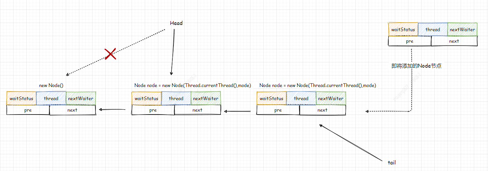
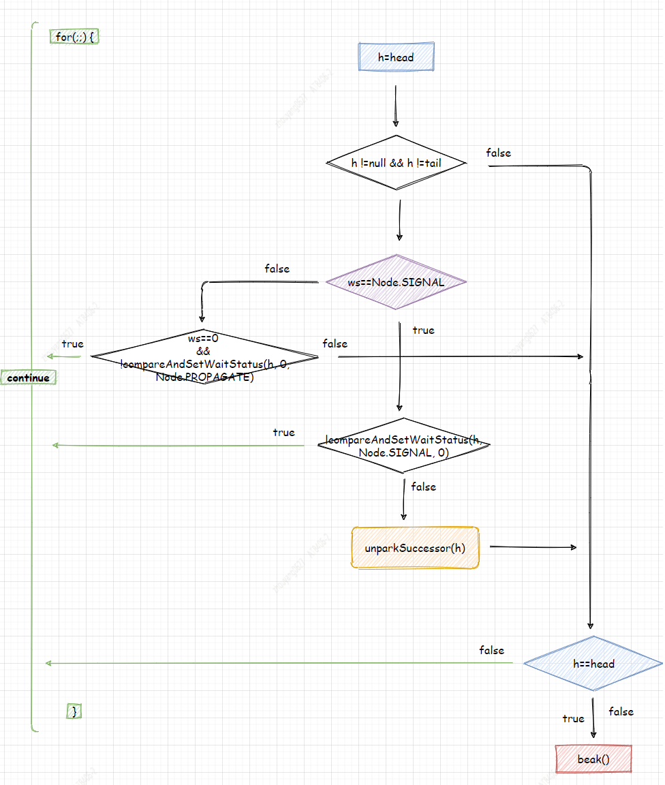

# CountDownLatch

## 1. CountDownLatch使用
以下章节1.1和章节1.2提供了CountDownLatch的使用。    
**1.1代码** 利用Main Thread执行await()，等待Work线程执行完成，在HandleWork类的run()，处理完Work线程逻辑后调用countDown()。


> 这里模拟了主线程等待所有工作线程执行完成后，再执行主线程后续逻辑。

**1.2代码** 利用Work Thread执行await()，等待Main线程执行它的逻辑后，再通知所有Work线程开始执行逻辑。


> 注意 Main Thread是非守护线程，并且Work Thread没有设置守护线程，所以主线程执行完成，工作线程仍然可以执行。

**1.3** 通过以上两个示例，已了解CountDownLatch的使用，首先使用带count参数的构造方法来创建CountDownLatch，再需要阻塞线程的地方调用await()方法， 并且count值要与countDown()调用次数保持一致。 

### 1.1 Main Thread等待
```java
public class CountDownLatchMainThreadBlockDebug {
    private static Logger logger = LoggerFactory.getLogger(CountDownLatchMainThreadBlockDebug.class);

    public static void main(String[] args) {
        try {
            CountDownLatch countDownLatch = new CountDownLatch(3);

            for (int i = 0; i < 3; i++) {
                HandleWork handleWork = new HandleWork("threadName-" + i, countDownLatch);
                new Thread(handleWork).start();
            }

            logger.info("等待thread执行完");
            countDownLatch.await();
            logger.info("所有线程执行结束");
        } catch (Exception e) {
            logger.error("", e);
        }
    }
}

class HandleWork implements Runnable {
    private static Logger logger = LoggerFactory.getLogger(HandleWork.class);

    private String threadName;
    private CountDownLatch countDownLatch;

    public HandleWork(String threadName, CountDownLatch countDownLatch) {
        this.threadName = threadName;
        this.countDownLatch = countDownLatch;
    }

    @Override
    public void run() {
        try {
            Random random = new Random();
            Thread.sleep(10000);
            logger.info("threadName: {} 任务完成", threadName);
            countDownLatch.countDown();
        } catch (InterruptedException e) {
            logger.error("", e);
        }
    }
}
```

### 1.2 Work Thread等待
```java
public class CountDownLatchWorkThreadBlockDebug {
    private static Logger logger = LoggerFactory.getLogger(CountDownLatchWorkThreadBlockDebug.class);

    public static void main(String[] args) {
        try {
            CountDownLatch countDownLatch = new CountDownLatch(1);

            for (int i = 0; i < 3; i++) {
                HandleWork handleWork = new HandleWork("threadName-" + i, countDownLatch);
                new Thread(handleWork).start();
            }

            logger.info("主线程开始处理 sleep 10000");
            Thread.sleep(10000);
            countDownLatch.countDown();
            logger.info("主线程执行结束");
        } catch (Exception e) {
            logger.error("", e);
        }
    }
}

class HandleWork implements Runnable {
    private static Logger logger = LoggerFactory.getLogger(HandleWork.class);

    private String threadName;
    private CountDownLatch countDownLatch;

    public HandleWork(String threadName, CountDownLatch countDownLatch) {
        this.threadName = threadName;
        this.countDownLatch = countDownLatch;
    }

    @Override
    public void run() {
        try {
            countDownLatch.await();
            logger.info("threadName: {} 任务开始", threadName);
            Random random = new Random();
            Thread.sleep(random.nextInt(10000));
            logger.info("threadName: {} 任务完成", threadName);
        } catch (InterruptedException e) {
            logger.error("", e);
        }
    }
}
```
> 后面的章节会利用 `1.1 代码`和`1.2 代码`示例对部分参数具体化   

## 2. CountDownLatch(int count)
构造方法中实例化Sync对象，而Sync是CountDownLatch的内部类，它并且extends AbstractQueuedSynchronizer，通过`2.1 Sync UML图`可知，Sync没有定义字段。 `new Sync(count)`是将count赋值给AbstractQueuedSynchronizer的`state`字段。 在`章节1 1.1代码中` 传入的Count是3。


```java
public CountDownLatch(int count) {
    if (count < 0) throw new IllegalArgumentException("count < 0");
    this.sync = new Sync(count);
}
```

`2.1 Sync UML图`      


## 3. await()
`3.1 await()流程图`, 显示await()方法调用`AbstractQueuedSynchronizer的tryAcquireShared(arg)和doAcquireSharedInterruptibly(arg)`。 **接下来分析这两个方法**。

`3.1 await()流程图`     


### 3.1 tryAcquireShared(arg)
getState()方法返回的是`state`字段值，由`章节2`可知，state的值是通过CountDownLatch的构造方法赋值的。 在`章节1 1.1代码中` 传入的Count是3，state=3; 可知**tryAcquireShared()仅是判断state值是否等于0，若等于返回1,否则返回-1**。 所以将state=3，代入方法返回的是-1，因为小于0，所以会继续调用doAcquireSharedInterruptibly(arg)。
`AbstractQueuedSynchronizer.tryAcquireShared(arg)`
```java
protected int tryAcquireShared(int acquires) {
    return (getState() == 0) ? 1 : -1;
}
```
### 3.2 doAcquireSharedInterruptibly(arg)

`3.2 doAcquireSharedInterruptibly()流程图`  


#### 3.2.1 addWaiter(Node.SHARED)
addWaiter()通过自旋+CAS创建一个以空节点为head的队列，并且将新节点每次都添加到队尾。会将当前线程赋值给Node， 为了说明addWaiter(Node mode), 根据章节1中的**1.1代码** 会在Main Thread中调用`countDownLatch.await();`，利用参数代入法


```java
private Node addWaiter(Node mode) {
    //注意 mode会赋值给node.nextWaiter
    Node node = new Node(Thread.currentThread(), mode);
    // Try the fast path of enq; backup to full enq on failure
    // 
    Node pred = tail;
    if (pred != null) {
        node.prev = pred;
        // CAS 队尾添加新节点，返回新节点，这里不能保证原子性，所以不符合预期值时，
        // 调用enq()方法，利用for(;;) 自旋一直循环达到预期值，在进行赋值
        if (compareAndSetTail(pred, node)) { 
            pred.next = node;
            return node;
        }
    }
    // 自旋 + CAS将新节点添加到队尾
    enq(node); 
    return node;
}

private Node enq(final Node node) {
    // for(;;) 表示CAS自旋，直到队尾成功添加新节点
    for (;;) {
        Node t = tail;
        if (t == null) { // Must initialize
            // CAS 若队列为空则创建空节点，作为head，tail
            if (compareAndSetHead(new Node()))
                tail = head;
        } else {
            node.prev = t;
            // CAS 队尾添加新节点，并且返回node节点
            if (compareAndSetTail(t, node)) {
                t.next = node;
                return t;
            }
        }
    }
}
```

#### 3.2.2 predecessor() 
predecessor()方法获取的是当前node节点的前置节点，由`章节3.2.1`可知，假设一共只调用一次addWaiter(),那么队列中会存在2个节点，head是空节点，tail是新增加的节点, 所以node的prev节点总是head节点,当addWaiter()方法被**并行**调用，所以`p==head`也不是总成立， 这里若队列node都已添加到队尾，在不再动态修改这段期间，也就有且仅有1个node的前置节点才能等于head， 希望大家也注意到`3.2 doAcquireSharedInterruptibly()流程图` 整个 doAcquireSharedInterruptibly()的自旋(for(;; )), 也只有2个两地方才能break； 这里希望读者细想, addWaiter()方法应该会从`返回点1`处，return。**那么预期的现象是head会变**。 

`addWaiter() 返回点`
**返回点1.** p == head && r >=0 才能return
```java
if (p == head) {
    int r = tryAcquireShared(arg);
    if (r >= 0) {
        setHeadAndPropagate(node, r);
        p.next = null; // help GC
        failed = false;
        return;
    }
}
```
**返回点2.** 抛出InterruptedException()异常
```java
if (shouldParkAfterFailedAcquire(p, node) &&
                    parkAndCheckInterrupt())
                    throw new InterruptedException();
```


#### 3.2.3 shouldParkAfterFailedAcquire(p, node)
所有node的waitStatus默认是0， shouldParkAfterFailedAcquire()将node的pre节点，初始化waitStatus赋值为Node.SIGNAL，再下一次循环将当前线程阻塞。

#### 3.2.4 parkAndCheckInterrupt()
```java
private final boolean parkAndCheckInterrupt() {
    //将shouldParkAfterFailedAcquire()将waitStatus=Node.SIGNAL线程睡眠
    LockSupport.park(this);
    //若线程唤醒时，需要判断当前线程是否中断。若中断则抛出InterruptedException异常
    return Thread.interrupted();
}
```

#### 3.2.5 setHeadAndPropagate(node,r)
*node*： addWaiter()方法返回的`是当时最新(不代表一定是当前最新)`的tail节点  
*r*： tryAcquireShared(arg)，因为r>=0, 所以r =1, state一定等于0   
根据`源码3.2.5.1`，node会赋值给head，p是node的pre节点, 当node的pre节点等于head节点，node被重新指向head， 所以在doAcquireSharedInterruptibly()的自旋情况下，head在变，也总有一个node.pre == head ，一直到head==tail。   



`代码3.2.5.1 setHeadAndPropagate()`
```java
// doAcquireSharedInterruptibly()
final Node p = node.predecessor();
if (p == head) {
    ...
    setHeadAndPropagate(node, r);
    ...
}
// setHeadAndPropagate()
Node h = head; // Record old head for check below
setHead(node);
```

#### 3.2.6 doReleaseShared()
propagate = r = 1, 这里if(propagate>0)一直是true，后面的判断逻辑都不会执行。node也仅仅是`当时最新的tail`，node.next可能是null, 若node.next不为null，根据`章节3.2.1 addWaiter(Node.SHARED)`,除初始化head为空节点外，其他node都是共享节点，`nextWaiter == SHARED`, 所以doReleaseShared()会一定执行。

`代码3.2.6.1`
```java
private void setHeadAndPropagate(Node node, int propagate) {
    Node h = head; // Record old head for check below
    setHead(node);
    if (propagate > 0 || h == null || h.waitStatus < 0 ||
        (h = head) == null || h.waitStatus < 0) {
        Node s = node.next;
        if (s == null || s.isShared())
            doReleaseShared();
    }
}
```

doReleaseShared()方法主要作用是为了将挂起的线程释放，让其继续执行， 由`章节3.2.3`可知，Node.SIGNAL会被阻塞。 `compareAndSetWaitStatus(h, Node.SIGNAL, 0)`保证后续逻辑处理原子性，一定是Node.SIGNAL节点,unparkSuccessors()方法，先将node.waitStatus赋值为0，再通过LockSupport.unpark(s.thread)，将node.next继续执行。

`doReleaseShared流程图` 


`代码3.2.6.2`
```java
private void doReleaseShared() {
    for (;;) {
        Node h = head;
        if (h != null && h != tail) {
            int ws = h.waitStatus;
            if (ws == Node.SIGNAL) {
                if (!compareAndSetWaitStatus(h, Node.SIGNAL, 0))
                    continue;            // loop to recheck cases
                unparkSuccessor(h);
            }
            else if (ws == 0 &&
                        !compareAndSetWaitStatus(h, 0, Node.PROPAGATE))
                continue;                // loop on failed CAS
        }
        if (h == head)                   // loop if head changed
            break;
    }
}
```

`unparkSuccessors()`
```java
private void unparkSuccessor(Node node) {
    int ws = node.waitStatus;
    if (ws < 0)
        compareAndSetWaitStatus(node, ws, 0);

    Node s = node.next;
    //这段逻辑，无需关心，CountDownLatch不会执行
    if (s == null || s.waitStatus > 0) {
        s = null;
        for (Node t = tail; t != null && t != node; t = t.prev)
            if (t.waitStatus <= 0)
                s = t;
    }
    if (s != null)
        LockSupport.unpark(s.thread);
}
```


## 4. CountDown()
tryReleaseShared()方法利用自旋+CAS，获取当前state-1。 若递减成功判断state是否 == 0，再根据`章节3.2.6`提到的doReleaseShared() 判断ws==Node.SIGNAL的线程唤醒。

```java
public final boolean releaseShared(int arg) {
    if (tryReleaseShared(arg)) {
        doReleaseShared();
        return true;
    }
    return false;
}
```


## 5. 总结
以上逻辑，阐述了await()和countDown()的底层逻辑实现 ；
1. await()方法会构建一个已空节点为head的队列，await()会在state !=0的情况下，将队列中节点的waitStatus由默认值0设置为Node.SIGNAL,通过自旋判断将初始化后的waitStatus为Node.SIGNAL线程挂起。
这里的挂起不是用的Thread.Sleep()， 而是 `LockSupport.park(this);`。 
2. countDown() 将state在原子性情况下 -1，当state=0时，，先将head.next.waitStatus设置为0，再执行LockSupport.unpark(s.thread); 唤醒head.next线程。 
3. 唤醒的Node线程会继续执行await()方法，`Thread.interrupted()` 判断线程状态是否中断，若不中断，会根据await()方法中的for(;; ) 依次head=node，依次唤醒head以后的node线程。
4. 若出现线程中断，则在finally中cancelAcquire() 跳过中断的线程，继续唤醒剩余节点线程。 

