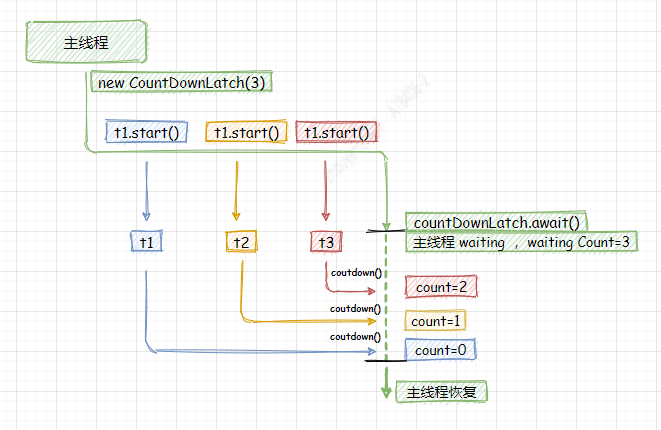
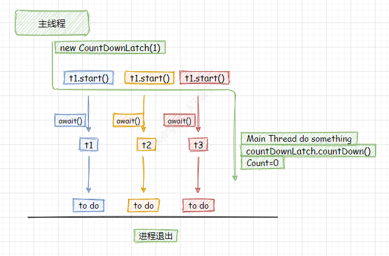
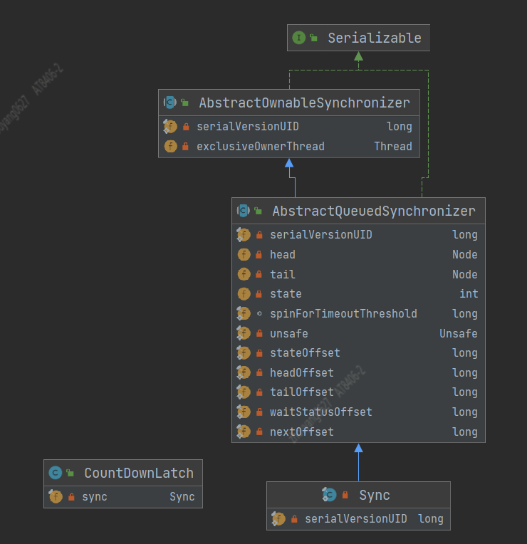
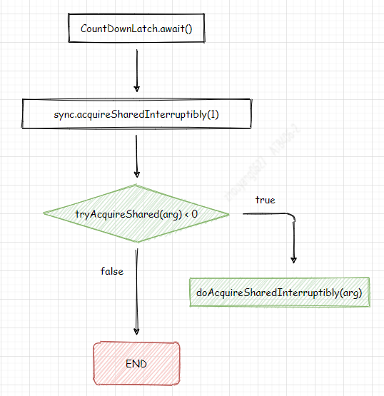
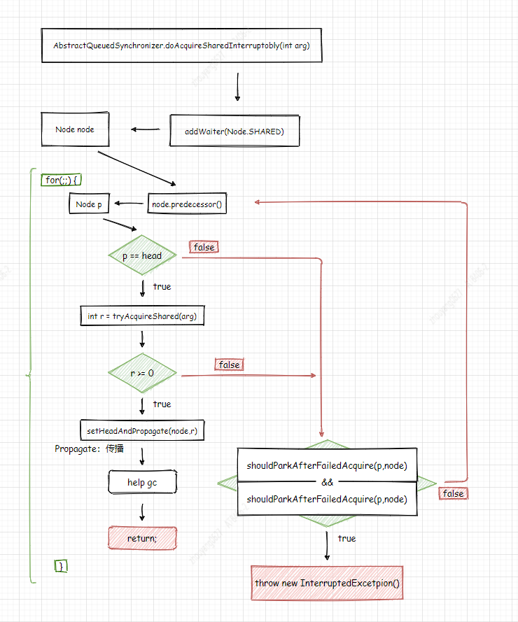
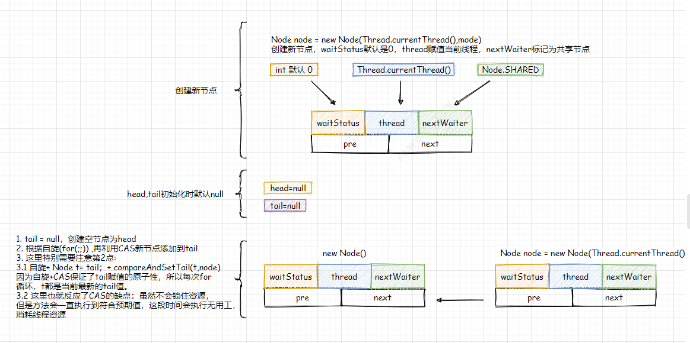
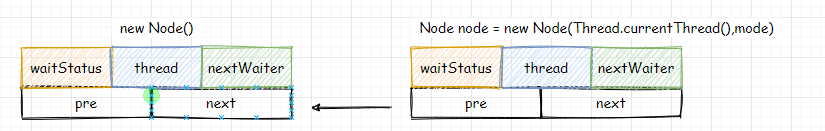

# CountDownLatch

## 1. CountDownLatch使用
以下章节1.1和章节1.2提供了CountDownLatch的使用。    
**1.1代码** 利用Main Thread执行await()，等待Work线程执行完成，在HandleWork类的run()，处理完Work线程逻辑后调用countDown()。


> 这里模拟了主线程等待所有工作线程执行完成后，再执行主线程后续逻辑。

**1.2代码** 利用Work Thread执行await()，等待Main线程执行它的逻辑后，再通知所有Work线程开始执行逻辑。


> 注意 Main Thread是非守护线程，并且Work Thread没有设置守护线程，所以主线程执行完成，工作线程仍然可以执行。

**1.3** 通过以上两个示例，已了解CountDownLatch的使用，首先使用带count参数的构造方法来创建CountDownLatch，再需要阻塞线程的地方调用await()方法， 并且count值要与countDown()调用次数保持一致。 

### 1.1 Main Thread等待
```java
public class CountDownLatchMainThreadBlockDebug {
    private static Logger logger = LoggerFactory.getLogger(CountDownLatchMainThreadBlockDebug.class);

    public static void main(String[] args) {
        try {
            CountDownLatch countDownLatch = new CountDownLatch(3);

            for (int i = 0; i < 3; i++) {
                HandleWork handleWork = new HandleWork("threadName-" + i, countDownLatch);
                new Thread(handleWork).start();
            }

            logger.info("等待thread执行完");
            countDownLatch.await();
            logger.info("所有线程执行结束");
        } catch (Exception e) {
            logger.error("", e);
        }
    }
}

class HandleWork implements Runnable {
    private static Logger logger = LoggerFactory.getLogger(HandleWork.class);

    private String threadName;
    private CountDownLatch countDownLatch;

    public HandleWork(String threadName, CountDownLatch countDownLatch) {
        this.threadName = threadName;
        this.countDownLatch = countDownLatch;
    }

    @Override
    public void run() {
        try {
            Random random = new Random();
            Thread.sleep(10000);
            logger.info("threadName: {} 任务完成", threadName);
            countDownLatch.countDown();
        } catch (InterruptedException e) {
            logger.error("", e);
        }
    }
}
```

### 1.2 Work Thread等待
```java
public class CountDownLatchWorkThreadBlockDebug {
    private static Logger logger = LoggerFactory.getLogger(CountDownLatchWorkThreadBlockDebug.class);

    public static void main(String[] args) {
        try {
            CountDownLatch countDownLatch = new CountDownLatch(1);

            for (int i = 0; i < 3; i++) {
                HandleWork handleWork = new HandleWork("threadName-" + i, countDownLatch);
                new Thread(handleWork).start();
            }

            logger.info("主线程开始处理 sleep 10000");
            Thread.sleep(10000);
            countDownLatch.countDown();
            logger.info("主线程执行结束");
        } catch (Exception e) {
            logger.error("", e);
        }
    }
}

class HandleWork implements Runnable {
    private static Logger logger = LoggerFactory.getLogger(HandleWork.class);

    private String threadName;
    private CountDownLatch countDownLatch;

    public HandleWork(String threadName, CountDownLatch countDownLatch) {
        this.threadName = threadName;
        this.countDownLatch = countDownLatch;
    }

    @Override
    public void run() {
        try {
            countDownLatch.await();
            logger.info("threadName: {} 任务开始", threadName);
            Random random = new Random();
            Thread.sleep(random.nextInt(10000));
            logger.info("threadName: {} 任务完成", threadName);
        } catch (InterruptedException e) {
            logger.error("", e);
        }
    }
}
```
> 后面的章节会利用 `1.1 代码`和`1.2 代码`示例对部分参数具体化   

## 2. CountDownLatch(int count)
构造方法中实例化Sync对象，而Sync是CountDownLatch的内部类，它并且extends AbstractQueuedSynchronizer，通过`2.1 Sync UML图`可知，Sync没有定义字段。 `new Sync(count)`是将count赋值给AbstractQueuedSynchronizer的`state`字段。 在`章节1 1.1代码中` 传入的Count是3。


```java
public CountDownLatch(int count) {
    if (count < 0) throw new IllegalArgumentException("count < 0");
    this.sync = new Sync(count);
}
```

`2.1 Sync UML图`      



## 3. await()
`3.1 await()流程图`, 显示await()方法调用`AbstractQueuedSynchronizer的tryAcquireShared(arg)和doAcquireSharedInterruptibly(arg)`。 **接下来分析这两个方法**。

`3.1 await()流程图`     


### 3.1 tryAcquireShared(arg)
getState()方法返回的是`state`字段值，由`章节2`可知，state的值是通过CountDownLatch的构造方法赋值的。 在`章节1 1.1代码中` 传入的Count是3，state=3; 可知**tryAcquireShared()仅是判断state值是否等于0，若等于返回1,否则返回-1**。 所以将state=3，代入方法返回的是-1，因为小于0，所以会继续调用doAcquireSharedInterruptibly(arg)。
`AbstractQueuedSynchronizer.tryAcquireShared(arg)`
```java
protected int tryAcquireShared(int acquires) {
    return (getState() == 0) ? 1 : -1;
}
```
### 3.2 doAcquireSharedInterruptibly(arg)

`3.2 doAcquireSharedInterruptibly()流程图`  


#### 3.2.1 addWaiter(Node.SHARED)
addWaiter()通过自旋+CAS创建一个以空节点为head的队列，并且将新节点每次都添加到队尾。会将当前线程赋值给Node， 为了说明addWaiter(Node mode), 根据章节1中的**1.1代码** 会在Main Thread中调用`countDownLatch.await();`，利用参数代入法


```java
private Node addWaiter(Node mode) {
    //注意 mode会赋值给node.nextWaiter
    Node node = new Node(Thread.currentThread(), mode);
    // Try the fast path of enq; backup to full enq on failure
    // 
    Node pred = tail;
    if (pred != null) {
        node.prev = pred;
        // CAS 队尾添加新节点，返回新节点，这里不能保证原子性，所以不符合预期值时，
        // 调用enq()方法，利用for(;;) 自旋一直循环达到预期值，在进行赋值
        if (compareAndSetTail(pred, node)) { 
            pred.next = node;
            return node;
        }
    }
    // 自旋 + CAS将新节点添加到队尾
    enq(node); 
    return node;
}

private Node enq(final Node node) {
    // for(;;) 表示CAS自旋，直到队尾成功添加新节点
    for (;;) {
        Node t = tail;
        if (t == null) { // Must initialize
            // CAS 若队列为空则创建空节点，作为head，tail
            if (compareAndSetHead(new Node()))
                tail = head;
        } else {
            node.prev = t;
            // CAS 队尾添加新节点，并且返回node节点
            if (compareAndSetTail(t, node)) {
                t.next = node;
                return t;
            }
        }
    }
}
```

#### 3.2.2 predecessor() 
predecessor()方法获取的是当前node节点的前置节点，由`章节3.2.1`可知，假设一共只调用一次addWaiter(),那么队列中会存在2个节点，head是空节点，tail是新增加的节点, 所以node的prev节点总是head节点



`AbstractQueuedSynchronizer.doAcquireSharedInterruptibly(arg)`  
```java
private void doAcquireSharedInterruptibly(int arg)
    throws InterruptedException {
    final Node node = addWaiter(Node.SHARED);
    boolean failed = true;
    try {
        for (;;) {
            final Node p = node.predecessor();
            if (p == head) {
                int r = tryAcquireShared(arg);
                if (r >= 0) {
                    setHeadAndPropagate(node, r);
                    p.next = null; // help GC
                    failed = false;
                    return;
                }
            }
            if (shouldParkAfterFailedAcquire(p, node) &&
                parkAndCheckInterrupt())
                throw new InterruptedException();
        }
    } finally {
        if (failed)
            cancelAcquire(node);
    }
}


```


## CountDown()


