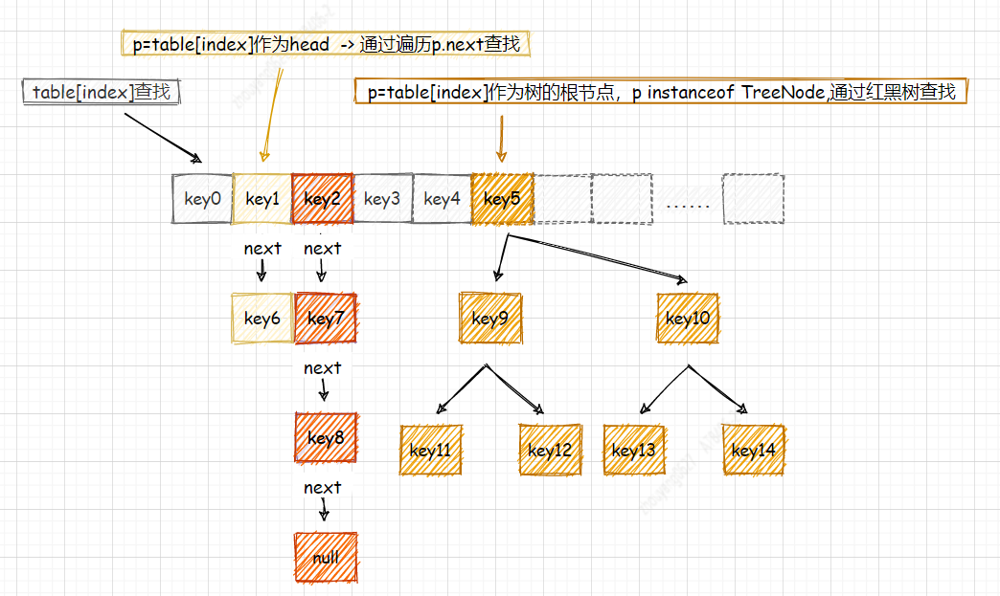
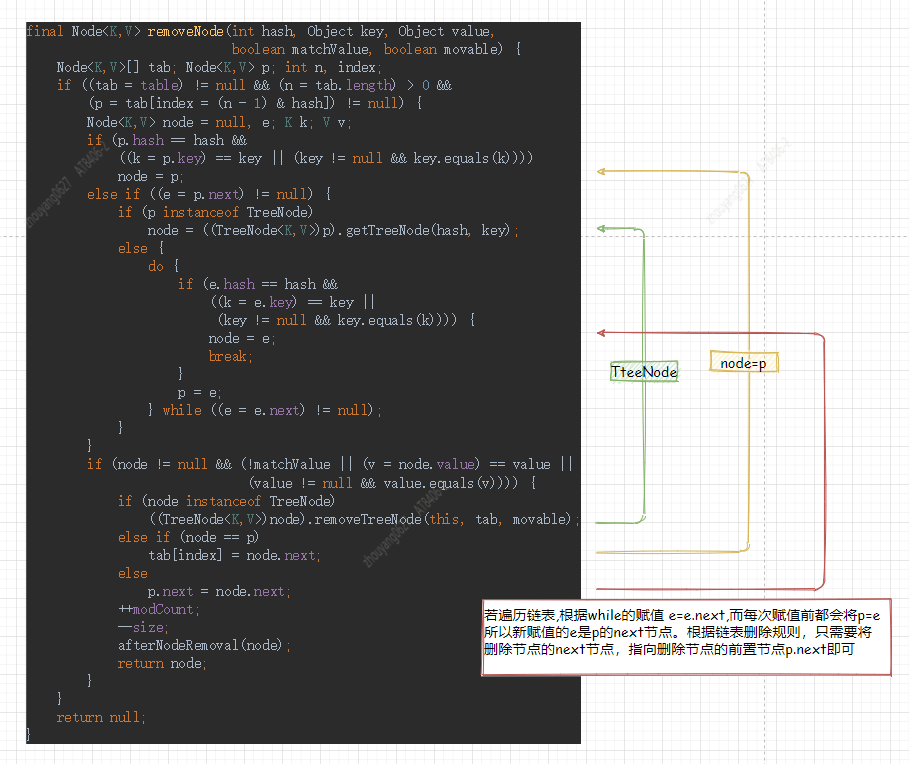

# HashMap讲解

`JDK1.8`

## 1. 简介
HashMap是一个散列表，它存储的内容是键值对(key-value)映射，它实现了Map接口，根据key的HashCode进行位运算存储数据，支持key=null，value=null存储。HashMap是无序的且不是线程安全。

## 2. HashMap使用
以下代码示例 部分展示HashMap API使用
```java
Map<String,String> map = new HashMap<>();
// 添加元素
map.put("name","young");
// 查询元素
String name = map.get("name");
// 删除元素
map.remove("name");
// 获取map size大小
System.out.println("map size: "+map.size());
```

> HashMap讲解

### 2.1 HashMap构造方法
HashMap的构造方法中将`loadFactor`(负载因子)默认赋值是0.75。
```java
Map<String,String>  map = new HashMap<>();

public HashMap() {
    this.loadFactor = DEFAULT_LOAD_FACTOR; // all other fields defaulted
}
```

`2.1 HashMap结构图` 



### 2.2 put()处理流程
```java
map.put("name","young");
```

`流程介绍`
**step01.** 判断table数组是否为null或者空，如果为null或者为空则调用resize()方法进行初始化
```java
final Node<K,V>[] resize() {
        Node<K,V>[] oldTab = table;
        int oldCap = (oldTab == null) ? 0 : oldTab.length;
        int oldThr = threshold;
        int newCap, newThr = 0;
        if (oldCap > 0) {
            if (oldCap >= MAXIMUM_CAPACITY) {
                threshold = Integer.MAX_VALUE;
                return oldTab;
            }
            else if ((newCap = oldCap << 1) < MAXIMUM_CAPACITY &&
                     oldCap >= DEFAULT_INITIAL_CAPACITY)
                newThr = oldThr << 1; // double threshold
        }
        else if (oldThr > 0) // initial capacity was placed in threshold
            newCap = oldThr;
        else {               // zero initial threshold signifies using defaults
            newCap = DEFAULT_INITIAL_CAPACITY;
            newThr = (int)(DEFAULT_LOAD_FACTOR * DEFAULT_INITIAL_CAPACITY);
        }
        if (newThr == 0) {
            float ft = (float)newCap * loadFactor;
            newThr = (newCap < MAXIMUM_CAPACITY && ft < (float)MAXIMUM_CAPACITY ?
                      (int)ft : Integer.MAX_VALUE);
        }
        threshold = newThr;
        @SuppressWarnings({"rawtypes","unchecked"})
        Node<K,V>[] newTab = (Node<K,V>[])new Node[newCap];
        table = newTab;
        if (oldTab != null) {
            for (int j = 0; j < oldCap; ++j) {
                Node<K,V> e;
                if ((e = oldTab[j]) != null) {
                    oldTab[j] = null;
                    if (e.next == null)
                        newTab[e.hash & (newCap - 1)] = e;
                    else if (e instanceof TreeNode)
                        ((TreeNode<K,V>)e).split(this, newTab, j, oldCap);
                    else { // preserve order
                        Node<K,V> loHead = null, loTail = null;
                        Node<K,V> hiHead = null, hiTail = null;
                        Node<K,V> next;
                        do {
                            next = e.next;
                            if ((e.hash & oldCap) == 0) {
                                if (loTail == null)
                                    loHead = e;
                                else
                                    loTail.next = e;
                                loTail = e;
                            }
                            else {
                                if (hiTail == null)
                                    hiHead = e;
                                else
                                    hiTail.next = e;
                                hiTail = e;
                            }
                        } while ((e = next) != null);
                        if (loTail != null) {
                            loTail.next = null;
                            newTab[j] = loHead;
                        }
                        if (hiTail != null) {
                            hiTail.next = null;
                            newTab[j + oldCap] = hiHead;
                        }
                    }
                }
            }
        }
        return newTab;
    }
```
**step02.** 根据key的hash计算其在数组中的位置
```java
// 1.利用高位与key的hash值进行异或运算
(h = key.hashCode()) ^ (h >>> 16) 

// 2.数组容量值进行与运算 (& 两者都为1，才为1)
(p = tab[i = (n - 1) & hash]) 
```
> p表示的是 map.put("name","young")，所要插入的数组下标的对象   

**step03.** 如果p为空则新建一个节点放入该数组下标   

**step04.** 如果p不为空，判断当前的hash、key所引用的内存地址或者key的值是否相等。 若相等，则将p赋值给临时节点e  

**step05.** 判断p是否是红黑树则插入树中，如果p是链表则插入队尾，因为e=p.next， for循环最后一行又将e赋值给p, 所以这是一个从head遍历到队尾的操作。 遍历过程中会判断是否到队尾`p.next == null`，或者当前节点的hash值、key的内存引用地址、key的值是否与即将添加的key的hash以及key是否相等。

`新节点插入队尾`
```java
for (int binCount = 0; ; ++binCount) {
    if ((e = p.next) == null) {
        p.next = newNode(hash, key, value, null);
    }
    if (e.hash == hash &&
        ((k = e.key) == key || (key != null && key.equals(k))))
        break;
    p = e;
}
```

**step06.** 链表尾部插入完成后判断当前链表长度是否大于等于8，若是链表构建成红黑树。     
binCount用于记录链表遍历的次数， 若p.next =null，那么就等于已经遍历到队尾了，这时会在队尾插入新节点，此时`if (binCount >= TREEIFY_THRESHOLD - 1)`,由于binCount是从0开始，所以链表长度>=8,且table长度达到64 `(n = tab.length) < MIN_TREEIFY_CAPACITY)`，才会将tab对应的hash值得链表数据转成红黑树。
```java
for (int binCount = 0; ; ++binCount) {
    if ((e = p.next) == null) {
        p.next = newNode(hash, key, value, null);
        if (binCount >= TREEIFY_THRESHOLD - 1) // -1 for 1st
            treeifyBin(tab, hash);
        break;
    }
    // ...省略部分代码
}

final void treeifyBin(Node<K,V>[] tab, int hash) {
    int n, index; Node<K,V> e;
    if (tab == null || (n = tab.length) < MIN_TREEIFY_CAPACITY)
        resize();
    else if ((e = tab[index = (n - 1) & hash]) != null) {
       // 省略部分代码
    }
}
```

**step07.** 如果p.key已存在则返回旧的value。    

**step08.** 如果是新插入的key，则modCount++, 当map个数大于安全阈值,则进行扩容，再返回null。     


```java
final V putVal(int hash, K key, V value, boolean onlyIfAbsent,
                boolean evict) {
    Node<K,V>[] tab; Node<K,V> p; int n, i;
    // step01
    if ((tab = table) == null || (n = tab.length) == 0)
        n = (tab = resize()).length;
    // step02
    if ((p = tab[i = (n - 1) & hash]) == null)
        // step03
        tab[i] = newNode(hash, key, value, null);
    else {
        Node<K,V> e; K k;
        // step04
        if (p.hash == hash &&
            ((k = p.key) == key || (key != null && key.equals(k))))
            e = p;
        // step05
        else if (p instanceof TreeNode)
            e = ((TreeNode<K,V>)p).putTreeVal(this, tab, hash, key, value);
        else {
            for (int binCount = 0; ; ++binCount) {
                if ((e = p.next) == null) {
                    p.next = newNode(hash, key, value, null);
                    // step06
                    if (binCount >= TREEIFY_THRESHOLD - 1) // -1 for 1st
                        treeifyBin(tab, hash);
                    break;
                }
                if (e.hash == hash &&
                    ((k = e.key) == key || (key != null && key.equals(k))))
                    break;
                p = e;
            }
        }
        // step07
        if (e != null) { // existing mapping for key
            V oldValue = e.value;
            if (!onlyIfAbsent || oldValue == null)
                e.value = value;
            afterNodeAccess(e);
            return oldValue;
        }
    }
    // step08
    ++modCount;
    if (++size > threshold)
        resize();
    afterNodeInsertion(evict);
    return null;
}
```

### 2.3 remove()处理流程
**step01.** removeNode()方法，判断table是否为null或者为空，且table[index=(n-1)&hash]是否为null。 
**step02.** 参考`2.1 HashMap结构图`，根据key的hash，分别在3种不同数据结构情况(1. table[index]; 2. 编译以table[index]为head的链表; 3. 红黑树查找)下，查找与key，value相同的节点。   
**step03.** 参考`2.3 remove()处理图`查找到对应节点，同样在3种不同数据结构情况下，删除节点。 这里特别说明链表结构，若遍历链表,根据while的赋值 e=e.next,而每次赋值前都会将p=e所以新赋值的e是p的next节点。根据链表删除规则，只需要将删除节点的next节点，指向删除节点的前置节点p.next即可。 
**step04.** modCount+1，容器size-1，并且返回node。

`2.3 remove()处理图`


```java
public V remove(Object key) {
    Node<K,V> e;
    return (e = removeNode(hash(key), key, null, false, true)) == null ?
        null : e.value;
}

final Node<K,V> removeNode(int hash, Object key, Object value,
                            boolean matchValue, boolean movable) {
    Node<K,V>[] tab; Node<K,V> p; int n, index;
    if ((tab = table) != null && (n = tab.length) > 0 &&
        (p = tab[index = (n - 1) & hash]) != null) {
        Node<K,V> node = null, e; K k; V v;
        if (p.hash == hash &&
            ((k = p.key) == key || (key != null && key.equals(k))))
            node = p;
        else if ((e = p.next) != null) {
            if (p instanceof TreeNode)
                node = ((TreeNode<K,V>)p).getTreeNode(hash, key);
            else {
                do {
                    if (e.hash == hash &&
                        ((k = e.key) == key ||
                            (key != null && key.equals(k)))) {
                        node = e;
                        break;
                    }
                    p = e;
                } while ((e = e.next) != null);
            }
        }
        if (node != null && (!matchValue || (v = node.value) == value ||
                                (value != null && value.equals(v)))) {
            if (node instanceof TreeNode)
                ((TreeNode<K,V>)node).removeTreeNode(this, tab, movable);
            else if (node == p)
                tab[index] = node.next;
            else
                p.next = node.next;
            ++modCount;
            --size;
            afterNodeRemoval(node);
            return node;
        }
    }
    return null;
}
```

## 3. HashMap注解

`HashMap 注解`
```java
/*
* Implementation notes.
*
* This map usually acts as a binned (bucketed) hash table, but
* when bins get too large, they are transformed into bins of
* TreeNodes, each structured similarly to those in
* java.util.TreeMap. Most methods try to use normal bins, but
* relay to TreeNode methods when applicable (simply by checking
* instanceof a node).  Bins of TreeNodes may be traversed and
* used like any others, but additionally support faster lookup
* when overpopulated. However, since the vast majority of bins in
* normal use are not overpopulated, checking for existence of
* tree bins may be delayed in the course of table methods.
*
* Tree bins (i.e., bins whose elements are all TreeNodes) are
* ordered primarily by hashCode, but in the case of ties, if two
* elements are of the same "class C implements Comparable<C>",
* type then their compareTo method is used for ordering. (We
* conservatively check generic types via reflection to validate
* this -- see method comparableClassFor).  The added complexity
* of tree bins is worthwhile in providing worst-case O(log n)
* operations when keys either have distinct hashes or are
* orderable, Thus, performance degrades gracefully under
* accidental or malicious usages in which hashCode() methods
* return values that are poorly distributed, as well as those in
* which many keys share a hashCode, so long as they are also
* Comparable. (If neither of these apply, we may waste about a
* factor of two in time and space compared to taking no
* precautions. But the only known cases stem from poor user
* programming practices that are already so slow that this makes
* little difference.)
*
* Because TreeNodes are about twice the size of regular nodes, we
* use them only when bins contain enough nodes to warrant use
* (see TREEIFY_THRESHOLD). And when they become too small (due to
* removal or resizing) they are converted back to plain bins.  In
* usages with well-distributed user hashCodes, tree bins are
* rarely used.  Ideally, under random hashCodes, the frequency of
* nodes in bins follows a Poisson distribution
* (http://en.wikipedia.org/wiki/Poisson_distribution) with a
* parameter of about 0.5 on average for the default resizing
* threshold of 0.75, although with a large variance because of
* resizing granularity. Ignoring variance, the expected
* occurrences of list size k are (exp(-0.5) * pow(0.5, k) /
* factorial(k)). The first values are:
*
* 0:    0.60653066
* 1:    0.30326533
* 2:    0.07581633
* 3:    0.01263606
* 4:    0.00157952
* 5:    0.00015795
* 6:    0.00001316
* 7:    0.00000094
* 8:    0.00000006
* more: less than 1 in ten million
*
* The root of a tree bin is normally its first node.  However,
* sometimes (currently only upon Iterator.remove), the root might
* be elsewhere, but can be recovered following parent links
* (method TreeNode.root()).
*
* All applicable internal methods accept a hash code as an
* argument (as normally supplied from a public method), allowing
* them to call each other without recomputing user hashCodes.
* Most internal methods also accept a "tab" argument, that is
* normally the current table, but may be a new or old one when
* resizing or converting.
*
* When bin lists are treeified, split, or untreeified, we keep
* them in the same relative access/traversal order (i.e., field
* Node.next) to better preserve locality, and to slightly
* simplify handling of splits and traversals that invoke
* iterator.remove. When using comparators on insertion, to keep a
* total ordering (or as close as is required here) across
* rebalancings, we compare classes and identityHashCodes as
* tie-breakers.
*
* The use and transitions among plain vs tree modes is
* complicated by the existence of subclass LinkedHashMap. See
* below for hook methods defined to be invoked upon insertion,
* removal and access that allow LinkedHashMap internals to
* otherwise remain independent of these mechanics. (This also
* requires that a map instance be passed to some utility methods
* that may create new nodes.)
*
* The concurrent-programming-like SSA-based coding style helps
* avoid aliasing errors amid all of the twisty pointer operations.
*/
```
`中文翻译`
```java
/*
* 实施说明。
*
* 这个地图通常作为一个分仓（bucketed）的哈希表，但
* 当桶变得太大，它们就会被转化成由树状节点组成的桶。
* TreeNodes，每个节点的结构类似于在
* java.util.TreeMap。大多数方法尝试使用正常的bin，但是
* 在适用的情况下转接到TreeNode方法（仅仅通过检查
* 一个节点的实例）。)  树节点的仓可以被遍历和使用。
* 像其他方法一样使用，但在人口过多的情况下，还支持更快的查找。
*当人口过多时。然而，由于绝大多数的Bins在
* 正常使用时并没有超载，检查是否存在
* 在表格方法的过程中，树状分类可能会被延迟。
*
* 树状表（即其元素都是TreeNodes的表）是
* 主要通过hashCode排序，但在平局的情况下，如果两个
* 元素属于相同的 "C类实现可比较<C>"。
* 类型，那么它们的compareTo方法就会被用于排序。(我们
* 保守地通过反射检查通用类型来验证
* 这一点--见方法comparableClassFor）。)  增加的复杂性
在提供最坏情况下的O(log n)*操作方面，树形缓冲区是值得的。
* 当键有不同的哈希值或者是可排序的时候，树形分类的额外复杂性是值得的。
* 因此，在以下情况下，性能会优雅地下降
* 意外的或恶意的使用，其中hashCode()方法
* 返回分布不均的值，以及在那些
* 许多键共享一个hashCode，只要它们也是
* 可比的。(如果这两种情况都不适用，我们可能会浪费大约
* 与不采取任何预防措施相比，我们可能会在时间和空间上浪费大约两倍的时间。
* 预防措施。但唯一已知的情况是来自于不良的用户
* 的编程方法，这些方法已经很慢了，所以这没有什么区别。
* 差异不大）。)
*
* 因为TreeNodes的大小是普通节点的两倍，所以我们
* 只有当仓内有足够多的节点时才会使用它们。
* (见 TREEIFY_THRESHOLD)。而当它们变得太小时（由于
* 移除或调整大小），它们会被转换回普通的bins。 在
* 分布良好的用户哈希代码的使用中，树状缓存很少被使用。
* 很少使用。 理想情况下，在随机哈希码的情况下，树状分类中的节点的频率符合
* 分组中的节点遵循泊松分布
* (http://en.wikipedia.org/wiki/Poisson_distribution)，参数为
* 在默认调整大小的情况下，参数平均约为0.5
* 阈值为0.75，但由于调整粒度的原因，有很大的差异。
* 调整大小的颗粒度。忽略方差，预计
* 列表大小k的发生率为（exp(-0.5) * pow(0.5, k) /
* 阶乘（k））。第一个值是。
*
* 0: 0.60653066
* 1: 0.30326533
* 2: 0.07581633
* 3: 0.01263606
* 4: 0.00157952
* 5: 0.00015795
* 6: 0.00001316
* 7: 0.00000094
* 8: 0.00000006
*更多：小于千万分之一
*
* 一个树仓的根通常是它的第一个节点。 然而。
* 有时（目前只有在Iterator.remove时），根可能在其他地方。
* 在其他地方，但可以通过父链接来恢复
* （方法TreeNode.root()）。
*
* 所有适用的内部方法都接受一个哈希代码作为一个
* 所有适用的内部方法都接受哈希码作为参数（通常由公共方法提供），允许
* 它们可以相互调用而不需要重新计算用户的哈希码。
* 大多数内部方法也接受一个 "tab "参数，也就是
* 通常是当前的表，但在调整或转换时可能是一个新的或旧的表。
* 调整大小或转换。
*
* 当bin列表被树化、拆分或未树化时，我们保持
* 它们处于相同的相对访问/遍历顺序（即，字段
* Node.next），以更好地保存位置性，并略微
* 简化对分割和遍历的处理，调用
* iterator.remove。当在插入时使用比较器时，要保持一个
* 总的顺序（或尽可能接近这里的要求）。
* 重新平衡，我们比较类和identityHashCodes作为
* 打平局。
*
* 普通模式与树模式之间的使用和转换是
* 由于子类LinkedHashMap的存在而变得复杂。参见
* 下面是定义在插入时调用的钩子方法。
* 移除和访问，允许LinkedHashMap的内部人员
* 否则就会与这些机制保持独立。(这也
* 这也需要将一个地图实例传递给一些可能创建新节点的实用方法。
* 可能会创建新的节点）。)
*
* 类似于并发编程的基于SSA的编码风格有助于
* 避免在所有曲折的指针操作中出现别名错误。
*/
通过www.DeepL.com/Translator（免费版）翻译
```

## 4. Q&A

### 4.1 为什么要转红黑树
根据`2.1 HashMap结构图`, table[index=(n-1)&hash]发生碰撞，会将新节点数据添加到链表队尾， 若要从链表读取元素的话是head节点一直遍历比较，直到查找到需要的节点，这个过程它的复杂度是O(n), 而红黑树是近似二叉查找树，它的复杂度为O(logN),所以，当碰撞hash过多时，用红黑树存储节点可以提高查询效率。     

> 需要注意得是： 红黑树虽然增加了查询效率，根据HashMap注解( TreeNodes are about twice the size of regular nodes) ,TreeNode节点存储大小是普通节点的2倍。 

说到碰撞=key的hash计算相等， 特殊场景：Map的key定义成实体类，例如`Map<实体类,String> = new HashMap<>();` ，并且开发人员重新实现hashCode()，如果跟以下的示例一样糟糕的话，那会导致大量的hash出现碰撞，这样会导致HashMap的hash不均匀分布，所以在使用HashMap时，需要注意hashCode()是否合理。

`重写hashCode()方法`
```java
@Override
public int hashCode() {
    return 1;
}
```

### 4.2 节点遵循泊松分布(链表长度达到8，转红黑树)
这里对于博主来说，此处省略`Integer.MAX_VALUE`字。 hash()值得分布均匀度的话，会遵循`泊松分布`,导致红黑树转换的机率低。根据注解标明的`8: 0.00000006`概率。    

### 4.3 红黑树转变成链表
根据HashMap中的`UNTREEIFY_THRESHOLD`值=6，若树的节点个数<=6时则将红黑树转变成链表，这里读者是参考别人理解:"假设阈值是7的话，删除一个节点红黑树则变成链表，若新增一个节点又会转变成红黑树，这样频繁的转换会降低性能，所以默认设置为6。           
**感觉说的很有道理**    
这里博主联想到 二叉搜索树中`AVL树`和`红黑树`，两者最大的不同是 红黑树没有遵守AVL树的`每个节点存 balance factor = {-1,0,1}`，它放弃追求完全平衡，避免二叉树旋转所带来的性能损耗(四种基本旋转: 左旋，右旋，左右旋，右左旋)。   
```java
if (lc <= UNTREEIFY_THRESHOLD)
    tab[index] = loHead.untreeify(map);
    //省略部分代码
```

### 4.4 为什么容量总是2的次幂   
https://blog.csdn.net/u010841296/article/details/82832166


https://cdgeass.github.io/2021/04/29/jdk-hashmap.html


https://javahungry.blogspot.com/2013/08/hashing-how-hash-map-works-in-java-or.html


Q&A
https://www.cnblogs.com/yeya/p/13247070.html
https://zhuanlan.zhihu.com/p/95518988
https://www.huaweicloud.com/zhishi/arc-8360144.html


