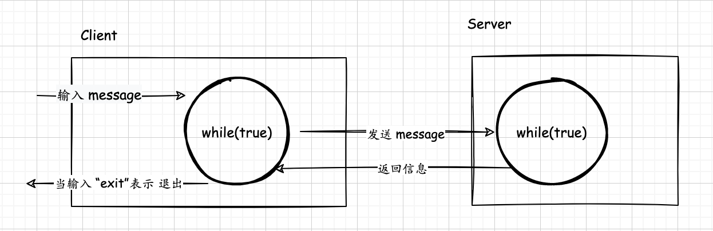
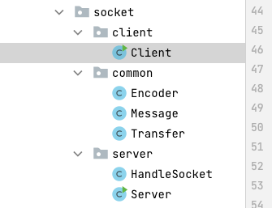

## Socket简单使用

### 设计架构图


思路： 

Java网络编程可以使用JDK的Socket相关类来实现，本篇不过多介绍Socket的理论知识。



### 客户端
模拟像shell终端一样，通过Scanner + while(true)来模拟不断输入的过程

**Client**
```java
public class Client {
    private static final Logger logger = LoggerFactory.getLogger(Client.class);

    public static void main(String[] args) {
        Scanner sc = null;
        try {
            Socket socket = new Socket("127.0.0.1", 9999);
            // 工具类
            Transfer transfer = new Transfer(socket);
            sc = new Scanner(System.in);
            while (true) {
                System.out.print("client:");
                String statStr = sc.nextLine();
                if ("exit".equals(statStr)) {
                    break;
                }
                try {
                    Message resp = request(transfer, statStr.getBytes());
                    System.out.println(new String(resp.getData()));
                } catch (Exception e) {
                    System.out.println(e.getMessage());
                }
            }
        } catch (IOException e) {
            logger.error("Client端发生异常", e);
        } finally {
            sc.close();
        }
    }

    private static Message request(Transfer transfer, byte[] requestData) throws Exception {
        Message requestMsg = new Message(requestData);
        transfer.send(Encoder.encode(requestMsg));
        byte[] respData = transfer.receive();
        Message respMsg = Encoder.decode(respData);
        return respMsg;
    }
}
```

**Encoder**
Encoder是序列化和反序列化的工具类， 这里特别说明下`Bytes.concat(new byte[]{0}, msg.getData())`方法，拼接一个为0字节的数组，它的目的仅仅是做个标识，模拟的场景:`服务端可根据协议好的字节判断消息是否合法`...等作用

```java
public class Encoder {

    public static byte[] encode(Message msg) {
        return Bytes.concat(new byte[]{0}, msg.getData());
    }

    public static Message decode(byte[] data) {
        if (data.length < 1) {
            throw new IllegalArgumentException("无效消息");
        }
        if (data[0] == 0) {
            return new Message(Arrays.copyOfRange(data, 1, data.length));
        } else {
            throw new IllegalArgumentException("无效消息");
        }
    }
}
```

**Message**
```java
public class Message {
    byte[] data;

    public Message(byte[] data) {
        this.data = data;
    }

    public byte[] getData() {
        return data;
    }

    public void setData(byte[] data) {
        this.data = data;
    }

}
```

**Transfer**
```java
public class Transfer {
    private Socket socket;
    private BufferedReader reader;
    private BufferedWriter writer;

    public Transfer(Socket socket) throws IOException {
        this.socket = socket;
        this.reader = new BufferedReader(new InputStreamReader(socket.getInputStream()));
        this.writer = new BufferedWriter(new OutputStreamWriter(socket.getOutputStream()));
    }

    public void send(byte[] data) throws Exception {
        String raw = hexEncode(data);
        writer.write(raw);
        writer.flush();
    }

    public byte[] receive() throws Exception {
        String line = reader.readLine();
        if(line == null) {
            close();
        }
        return hexDecode(line);
    }

    public void close() throws IOException {
        writer.close();
        reader.close();
        socket.close();
    }

    private String hexEncode(byte[] buf) {
        return Hex.encodeHexString(buf, true)+"\n";
    }

    private byte[] hexDecode(String buf) throws DecoderException {
        return Hex.decodeHex(buf);
    }
}
```

### 服务端

**Server**
```java
public class Server {
    private static Logger logger = LoggerFactory.getLogger(Server.class);

    public static void main(String[] args) throws IOException {
        Integer port = 9999;
        ServerSocket serverSocket = new ServerSocket(port);
        logger.info("Server listen to port: {}", port);
        ThreadPoolExecutor poolExecutor = new ThreadPoolExecutor(10, 20, 1L, TimeUnit.SECONDS, new ArrayBlockingQueue<>(100), new ThreadPoolExecutor.CallerRunsPolicy());
        try {
            while (true) {
                Socket socket = serverSocket.accept();
                Runnable worker = new HandleSocket(socket);
                poolExecutor.execute(worker);
            }
        } catch (IOException e) {
            e.printStackTrace();
        } finally {
            try {
                serverSocket.close();
            } catch (IOException e) {
                e.printStackTrace();
            }
        }
    }
}
```

**HandleSocket**
```java
public class HandleSocket implements Runnable {
    private static final Logger logger = LoggerFactory.getLogger(HandleSocket.class);

    private Socket socket;
    BufferedReader reader;
    BufferedWriter writer;

    public HandleSocket(Socket socket) throws IOException {
        this.socket = socket;
        this.reader = new BufferedReader(new InputStreamReader(socket.getInputStream()));
        this.writer = new BufferedWriter(new OutputStreamWriter(socket.getOutputStream()));
    }

    @Override
    public void run() {
        InetSocketAddress address = (InetSocketAddress) socket.getRemoteSocketAddress();
        logger.info("Client connection info {}", address.getAddress().getHostAddress() + ":" + address.getPort());
        try {
            Transfer t = new Transfer(socket);

            while (true) {
                try {
                    byte[] requestData = t.receive();
                    Message message = Encoder.decode(requestData);
                    System.out.println("Client: " + new String(message.getData()));
                    String respStr = "消息已接受到，请指示";
                    t.send(Encoder.encode(new Message(respStr.getBytes(StandardCharsets.UTF_8))));
                } catch (Exception e) {
                    e.printStackTrace();
                    break;
                }
            }
        } catch (Exception e) {
            e.printStackTrace();
            try {
                socket.close();
            } catch (IOException e1) {
                e1.printStackTrace();
            }
            return;
        } finally {
            try {
                close();
            } catch (IOException e) {
                e.printStackTrace();
            }
        }
    }

    public void close() throws IOException {
        writer.close();
        reader.close();
        socket.close();
    }
}
```
