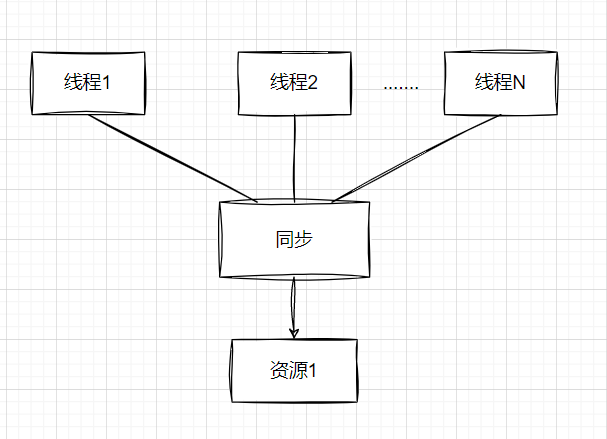
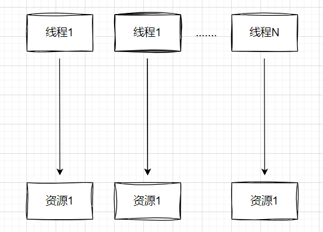
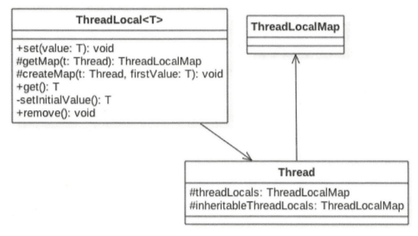

## ThreadLocal讲解

### 定义
多线程访问同一个共享变量时特别容易出现并发问题，特别是在多个线程需要对一个共享变量进行写入时，为了保证线程安全，一般使用者在访问共享变量时需要进行适当的同步。

同步的措施一般是加锁，这就需要使用者对锁有一定的了解，这显然加重了使用者的负担。那么有没有一种方式可以做到，当创建一个变量后，每个线程对其进行访问的时候访问的是自己线程的变量呢?其实ThreadLocal就可以做这件事情，虽然ThreadLocal并不是为了解决这个问题而出现的。



ThreadLocal是JDK包提供的，它提供了线程本地变量，也就是如果你创建了一个ThreadLocal变量，那么访问这个变量的每个线程都会有这个变量的一个本地副本。当多个线程操作这个变量时，实际操作的是自己本地内存里面的变量，从而避免了线程安全问题。创建一个ThreadLocal变量后,每个线程都会复制一个变量到自己的本地内存。   



### ThreadLocal使用示例
```java
public class ThreadLocalTest {
    //(1)打印函数
    static void print(String str) {
        //1.1  打印当前线程本地内存中localVariable变量的值
        System.out.println(str + ":" + localVariable.get());
        //1.2 清除当前线程本地内存中localVariable变量
        //localVariable.remove();
    }

    //(2) 创建ThreadLocal变量
    static ThreadLocal<String> localVariable = new ThreadLocal<>();

    public static void main(String[] args) {

        //(3) 创建线程one
        Thread threadOne = new Thread(new Runnable() {
            public void run() {
                //3.1 设置线程one中本地变量localVariable的值
                localVariable.set("threadOne local variable");
                //3.2 调用打印函数
                print("threadOne");
                //3.3打印本地变量值
                System.out.println("threadOne remove after" + ":" + localVariable.get());

            }
        });
        //(4) 创建线程two
        Thread threadTwo = new Thread(new Runnable() {
            public void run() {
                //4.1 设置线程one中本地变量localVariable的值
                localVariable.set("threadTwo local variable");
                //4.2 调用打印函数
                print("threadTwo");
                //4.3打印本地变量值
                System.out.println("threadTwo remove after" + ":" + localVariable.get());

            }
        });
        //(5)启动线程
        threadOne.start();
        threadTwo.start();
    }
}
```

### ThreadLocal的实现原理
首先看一下ThreadLocal相关类的类图结构：


由该图可知，Thread类中有一个threadLocals和一个inheritableThreadLocals，它们都是ThreadLocalMap类型的变量，而ThreadLocalMap是一个定制化的Hashmap。在默认情况下，每个线程中的这两个变量都为null，只有当前线程第一次调用ThreadLocal 的set或者get方法时才会创建它们。其实每个线程的本地变量不是存放在ThreadLocal实例里面，而是存放在调用线程的threadLocals变量里面。也就是说，ThreadLocal类型的本地变量存放在具体的线程内存空间中。ThreadLocal就是一个工具壳，它通过set方法把value值放入调用线程的threadLocals里面并存放起来，当调用线程调用它的get方法时，再从当前线程的threadLocals变量里面将其拿出来使用。如果调用线程一直不终止，那么这个本地变量会一直存放在调用线程的threadLocals变量里面，所以当不需要使用本地变量时可以通过调用ThreadLocal变量的remove方法,从当前线程的threadLocals里面删除该本地变量。  

另外，Thread里面的threadLocals为何被设计为map结构?很明显是因为每个线程可以关联多个ThreadLocal变量。


**总结:** 在每个线程内部都有一个名为threadLocals的成员变量，该变量的类型为HashMap，其中 key为我们定义的ThreadLocal变量的this引用，value则为我们使用set方法设置的值。每个线程的本地变量存放在线程自己的内存变量threadLocals中，如果当前线程一直不消亡，那么这些本地变量会一直存在，所以可能会造成内存溢出，因此使用完毕后要记得调用ThreadLocal的remove方法删除对应线程的threadLocals中的本地变量。


## 一致性问题
* 发生在多个主体对同一份数据无法达成共识
* 包括：分布式一致性问题，并发问题等
* 特点：场景多、问题复杂、难以察觉  --- 需要严密的思考甚至数学论证

## 一致性问题解决办法
* 排队(例如：锁、互斥量、管程、屏障等) 
* 投票（例如：Paxos、Raft等）
 
* 避免（例如：ThreadLocal等）


## ThreadLocal
* 定义：提供线程局部变量；一个线程局部变量在多个线程中，分别有独立的值(副本)
* 特点：简单（开箱即用）、快速（无额外开销）、安全（线程安全）
* 场景：多线程场景（资源持有、线程一致性、并发计算、线程安全等场景）
  
* 实现原理：Java中用哈希表实现
* 应用范围：几乎所有提供多线程的语言


