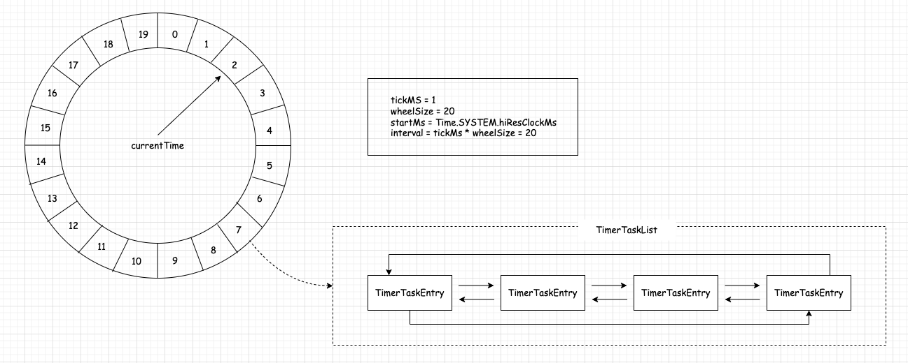
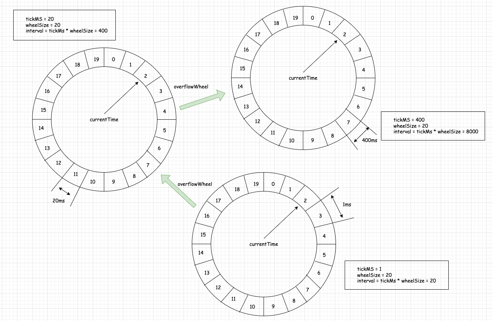
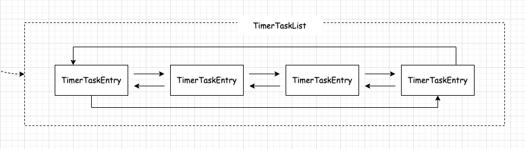

## Java 实现时间轮算法      

>该篇Blog很多理论，大部分存在参考Blog 下面的 refer 部分。 文本的主要核心在于对通过 代码带入，帮助大家理解。     

### 基本概念    
>时间轮 是一种 实现延迟功能（定时器） 的 巧妙算法。如果一个系统存在大量的任务调度，时间轮可以高效的利用线程资源来进行批量化调度。把大批量的调度任务全部都绑定时间轮上，通过时间轮进行所有任务的管理，触发以及运行。能够高效地管理各种延时任务，周期任务，通知任务等。                   
相比于 JDK 自带的 Timer、DelayQueue + ScheduledThreadPool 来说，时间轮算法是一种非常高效的调度模型。不过，时间轮调度器的时间精度可能不是很高，对于精度要求特别高的调度任务可能不太适合，因为时间轮算法的精度取决于时间段“指针”单元的最小粒度大小。比如时间轮的格子是一秒跳一次，那么调度精度小于一秒的任务就无法被时间轮所调度。                       

### 绝对时间和相对时间  
定时的任务调度 分两种： 
* 相对时间：一段时间后执行      
* 绝对时间：指定某个确定的时间执行      
当然，这两者之间是可以相互转换的，例如当前时间是12点，定时在5分钟之后执行，其实绝对时间就是：12:05；定时在12:05执行，相对时间就是5分钟之后执行。                

时间轮（TimingWheel）是一个 存储定时任务的环形队列，底层采用数组实现，数组中的每个元素可以存放一个定时任务列表（TimerTaskList）。TimerTaskList 是一个环形的双向链表，链表中的每一项表示的都是定时任务项（TimerTaskEntry），其中封装了真正的定时任务 TimerTask。         

                

### 基本模型构成    

* tickMs（基本时间跨度）：时间轮由多个时间格组成，每个时间格代表当前时间轮的基本时间跨度（tickMs）。        
* wheelSize（时间单位个数）：时间轮的时间格个数是固定的，可用（wheelSize）来表示，那么整个时间轮的总体时间跨度（interval）可以通过公式 tickMs × wheelSize计算得出。         
* currentTime（当前所处时间）：时间轮还有一个表盘指针（currentTime），用来表示时间轮当前所处的时间，currentTime 是 tickMs 的整数倍。currentTime 可以将整个时间轮划分为到期部分和未到期部分，currentTime 当前指向的时间格也属于到期部分，表示刚好到期，需要处理此时间格所对应的 TimerTaskList 的所有任务。    

### 处理流程分析        
> 通过以上介绍，我想大家应该有初步的了解，提出 “时间轮”的概念，再后续的介绍中会提到 `单层时间轮`，`多层时间轮`。 接下来通过示例来了解时间轮是如何处理?              

1.若时间轮的 tickMs=1ms，wheelSize=20，那么可以计算得出 interval 为 20ms；        
2.初始情况下表盘指针 currentTime 指向时间格 0，此时有一个定时为 2ms 的任务插入进来会存放到时间格为 2 的 TimerTaskList 中；          
3.随着时间的不断推移，指针 currentTime 不断向前推进，过了 2ms 之后，当到达时间格 2 时，就需要将时间格 2 所对应的 TimeTaskList 中的任务做相应的到期操作；        
4.此时若又有一个定时为 8ms 的任务插入进来，则会存放到时间格 10 中，currentTime 再过 8ms 后会指向时间格 10；           

**当到达时间格 2 时，如果同时有一个定时为 19ms 的任务插入进来怎么办？**     
新来的 TimerTaskEntry 会复用原来的 TimerTaskList，所以它会插入到原本已经到期的时间格 1 中（一个显而易见的环形结构）。           
总之，整个时间轮的总体跨度是不变的，随着指针 currentTime 的不断推进，当前时间轮所能处理的时间段也在不断后移。           

> currentTime = 2，同时有一个定时为19ms的任务插入，那么 将时间轮从而2移动19个时间隔, 因为是环形数据结构，会落到 时间隔为1 上(数组来表示时间轮的时间隔下标)。 `每个任务的插入是基于 currentTime为起点推进`  

### 问题再次深入            
如果此时有个定时为 350ms 的任务该如何处理？直接扩充 wheelSize 的大小么？        
很多业务场景不乏几万甚至几十万毫秒的定时任务，这个 wheelSize 的扩充没有底线，就算将所有的定时任务的到期时间都设定一个上限，比如 100 万毫秒，那么这个 wheelSize 为 100 万毫秒的时间轮不仅占用很大的内存空间，而且效率也会拉低。所以 层级时间轮（类似十进制/二进制的计数方式）的概念应运而生，`当任务的到期时间超过了当前时间轮所表示的时间范围时，就会尝试添加到上层时间轮中。`      

      

>注意：在上图中 `overflowWheel`, `overflow`表示溢出的意思，在这里就类似于时钟一样，当指针转动60s，就会增加1分钟，所以 在实际数据结构中，TimeWheel里面包含 overflowWheel 和 tickMs 字段，而 overflowWheel 里面也包含 overflowWheel 和 tickMs 字段，这样，这样可以表达出多层时间轮的附属关系。    

复用之前的案例，第一层的时间轮 tickMs=1ms, wheelSize=20, interval=20ms。第二层的时间轮的 tickMs 为第一层时间轮的 interval，即为 20ms。每一层时间轮的 wheelSize 是固定的，都是 20，那么第二层的时间轮的总体时间跨度 interval 为 400ms。以此类推，这个 400ms 也是第三层的 tickMs 的大小，第三层的时间轮的总体时间跨度为 8000ms。                      

### 流程再次分析        
1.当到达时间格 2 时，如果此时有个定时为 350ms 的任务，显然第一层时间轮不能满足条件，所以就 时间轮升级 到第二层时间轮中，最终被插入到第二层时间轮中时间格 17 所对应的 TimerTaskList 中；     
2.如果此时又有一个定时为 450ms 的任务，那么显然第二层时间轮也无法满足条件，所以又升级到第三层时间轮中，最终被插入到第三层时间轮中时间格 1 的 TimerTaskList 中；               
3.注意 到期时间在 [400ms,800ms) 区间的多个任务（比如446ms、455ms以及473ms的定时任务）都会被放入到第三层时间轮的时间格 1 中，时间格 1 对应的TimerTaskList的超时时间为400ms；          
4.随着时间的流逝，当次 TimerTaskList 到期之时，原本定时为 450ms 的任务还剩下 50ms 的时间，还不能执行这个任务的到期操作。这里就有一个 时间轮`降级` 的操作，会将这个剩余时间为 50ms 的定时任务重新提交到层级时间轮中，此时第一层时间轮的总体时间跨度不够，而第二层足够，所以该任务被放到第二层时间轮到期时间为 [40ms,60ms) 的时间格中；             
5.再经历了 40ms 之后，此时这个任务又被“察觉”到，不过还剩余 10ms，还是不能立即执行到期操作。所以还要再有一次时间轮的`降级`，此任务被添加到第一层时间轮到期时间为 [10ms,11ms) 的时间格中，之后再经历 10ms 后，此任务真正到期，最终执行相应的到期操作。              

>注意： 请特别注意一个逻辑 “降级”

### 具体实现优化    

* 除了第一层时间轮的起始时间(startMs)，其余高层时间轮的起始时间(startMs)都设置为创建此层时间轮时前面第一轮的 currentTime。
每一层的 currentTime 都必须是 tickMs 的整数倍，如果不满足则会将 currentTime 修剪为 tickMs 的整数倍，以此与时间轮中的时间格的到期时间范围对应起来。 修剪方法为：currentTime = startMs - (startMs % tickMs)。currentTime 会随着时间推移而推进，但是不会改变为 tickMs 的整数倍的既定事实。若某一时刻的时间为 timeMs，那么此时时间轮的 currentTime = timeMs - (timeMs % tickMs)，时间每推进一次，每个层级的时间轮的 currentTime 都会依据此公式推进。          

>若上面公式你暂时无感，不着急，等我们带入代码逻辑，我想会更简单的多。   

* 定时器只需持有TimingWheel的第一层时间轮的引用，并不会直接持有其他高层的时间轮，但是每一层时间轮都会有一个引用（overflowWheel）指向更高一层的应用，以此层级调用而可以实现定时器间接持有各个层级时间轮的引用。       

* 借助了JDK中的DelayQueue来协助推进时间轮。具体做法是对于每个使用到的TimerTaskList都会加入到DelayQueue中，DelayQueue会根据TimerTaskList对应的超时时间expiration来排序，最短expiration的TimerTaskList会被排在DelayQueue的队头。         
**DelayQueue介绍**          
```
DelayQueue 是 Java 的 java.util.concurrent 包中提供的一个并发数据结构。它是一个无界的线程安全的阻塞队列，用于存储实现了 Delayed 接口的元素。只有在元素的延迟时间过去后，该元素才能从队列中取走。            

这里有一些关于 DelayQueue 的关键点：        
* Delayed接口: 为了能放入 DelayQueue，对象必须实现 Delayed 接口，这意味着必须提供一个 getDelay(TimeUnit unit) 方法来定义延迟时间。      
* 线程安全: DelayQueue 是线程安全的，因为其内部使用了锁来确保数据的一致性。     
* 无界队列: 这意味着队列的大小没有上限，但要注意，如果不加以控制，它可能会导致 OutOfMemoryError。           
* 阻塞队列: 如果尝试从队列中获取元素但没有元素已达到其延迟时间，那么线程将被阻塞，直到一个元素的延迟过去。        
* 应用场景: 该队列通常用于定时任务、缓存系统（其中对象过期后需要被删除）等场景。          
```

试想一下，DelayQueue中的第一个超时任务列表的expiration为200ms，第二个超时任务为840ms，这里获取DelayQueue的队头只需要O(1)的时间复杂度。`如果采用每秒定时推进，那么获取到第一个超时的任务列表时执行的200次推进中有199次属于“空推进”，而获取到第二个超时任务时有需要执行639次“空推进”，这样会无故空耗机器的性能资源`。                    

这里采用DelayQueue来辅助以少量空间换时间，从而做到了“精准推进”。获取到DelayQueue中的超时的任务列表TimerTaskList之后，既可以根据TimerTaskList的expiration来推进时间轮的时间，也可以就获取到的TimerTaskList执行相应的操作。           

### Java实现        
>在上面内容中，刻意强调过，                     
1.`定时器只需只有TimingWheel的第一层轮的对象引用，并不是直接持有其他高层的时间轮....`                   
2.类似时钟但又非时钟，例如 当秒钟从1秒到60秒时，从而分钟需要+1，这是问题的，但就怕大家会贴合实际太强，举一个反例： 如果当前秒钟在30秒 那么等到60秒时，“时钟会必然进行单位换算，分钟+1”，而在时间轮算法中， 需要强调是 不管当前是几秒，必须执行了60s（秒钟转动60次）才能`分钟+1`,  这点非常重要                              
3.多层时间轮中，第一层的间隔表示“点”，当层数越高则间隔表示“区间”, 左闭右开 "[20,40)"，所以在 DelayQueue<TimerTaskList> 容器中，`TimerTaskList`的`expiration`必须是最小值           

**TimerTaskEntry.java**     
```java
/**
 * 封装定时任务
 */
public class TimerTaskEntry implements Comparable<TimerTaskEntry> {


    private volatile TimerTaskList list;

    public TimerTaskEntry next;

    public TimerTaskEntry prev;

    private TimerTask timerTask;

    private Long expirationMs;

    public TimerTaskEntry() {
    }

    /**
     * 构造器
     *
     * @param timerTask    定时任务
     * @param expirationMs 到期时间
     */
    public TimerTaskEntry(TimerTask timerTask, Long expirationMs) {
        if (timerTask != null) {
            timerTask.setTimerTaskEntry(this);
        }
        this.timerTask = timerTask;
        this.expirationMs = expirationMs;

    }


    public boolean cancelled() {
        return timerTask.getTimerTaskEntry() != this;
    }

    /**
     * 双向链表 清空
     */
    public void remove() {
        TimerTaskList currentList = list;
        while (currentList != null) {
            currentList.remove(this);
            currentList = list;
        }
    }

    /**
     * 处理延迟队列中的排序问题，保证 poll() 获取的是最早过期项
     * @param that the object to be compared.
     * @return
     */
    @Override
    public int compareTo(TimerTaskEntry that) {
        if (that == null) {
            throw new NullPointerException("TimerTaskEntry is null");
        }
        return Long.compare(this.expirationMs, that.expirationMs);
    }


    public Long getExpirationMs() {
        return expirationMs;
    }

    public TimerTask getTimerTask() {
        return timerTask;
    }

    public TimerTaskList getList() {
        return list;
    }

    public void setList(TimerTaskList list) {
        this.list = list;
    }
}
```

**TimerTaskEntryList.java**   
```java
/**
 * TimerTaskList 除了包含 TimerTaskEntry root哨兵节点外，还包含其他参数，例如 最小过期时间，任务数，所以它非常重要
 */
@ThreadSafe
class TimerTaskList implements Delayed {


    private AtomicInteger taskCounter;
    /**
     * 哨兵节点
     */
    private TimerTaskEntry root;

    private AtomicLong expiration;

    public TimerTaskList() {
    }

    public TimerTaskList(AtomicInteger taskCounter) {
        // TimerTaskList forms a doubly linked cyclic list using a dummy root entry
        // root.next points to the head
        // root.prev points to the tail
        this.taskCounter = taskCounter;
        this.root = new TimerTaskEntry(null, -1L);
        this.root.next = root;
        this.root.prev = root;
        this.expiration = new AtomicLong(-1L);
    }

    /**
     * 设置过期时间
     */
    public boolean setExpiration(Long expirationMs) {
        return expiration.getAndSet(expirationMs) != expirationMs;
    }

    /**
     * 获取过期时间
     */
    public Long getExpiration() {
        return expiration.get();
    }

    /**
     * 遍历任务
     */
    public void foreach(Function<TimerTask, Void> f) {
        synchronized (this) {
            TimerTaskEntry entry = root.next;
            while (entry != root) {
                TimerTaskEntry nextEntry = entry.next;

                if (!entry.cancelled()) {
                    f.apply(entry.getTimerTask());
                }

                entry = nextEntry;
            }
        }
    }

    /**
     * 插入 entry
     */
    public void add(TimerTaskEntry timerTaskEntry) {
        boolean done = false;
        while (!done) {
            // remove() 的作用是为了清空 timerTaskEntry的链表引用关系，保证它是 single
            timerTaskEntry.remove();
            synchronized (this) {
                synchronized (timerTaskEntry) {
                    // 插入之前 必须确保 当前的 timerTaskEntry 无任何引用关系
                    if (timerTaskEntry.getList() == null) {
                        // put the timer task entry to the end of the list. (root.prev points to the tail entry)
                        TimerTaskEntry tail = root.prev;
                        timerTaskEntry.next = root;
                        timerTaskEntry.prev = tail;
                        timerTaskEntry.setList(this);
                        tail.next = timerTaskEntry;
                        root.prev = timerTaskEntry;
                        taskCounter.incrementAndGet();
                        done = true;
                    }
                }
            }
        }
    }

    /**
     * 移除某个 entry
     */
    public void remove(TimerTaskEntry timerTaskEntry) {
        synchronized (this) {
            synchronized (timerTaskEntry) {
                if (timerTaskEntry.getList() == this) {
                    timerTaskEntry.next.prev = timerTaskEntry.prev;
                    timerTaskEntry.prev.next = timerTaskEntry.next;
                    timerTaskEntry.next = null;
                    timerTaskEntry.prev = null;
                    timerTaskEntry.setList(null);
                    taskCounter.decrementAndGet();
                }
            }
        }
    }

    /**
     * 移除当前双向链表的 所有项，并且使用 f.aaply() 来处理 时间轮降级插入，而降级的判断标准是 entry的过期时间是否 小于 （当前时间 + 当前时间轮的一圈时间）
     */
    public void flush(Function<TimerTaskEntry, Void> f) {
        synchronized (this) {
            TimerTaskEntry head = root.next;
            while (head != root) {
                remove(head);
                f.apply(head);
                head = root.next;
            }
            expiration.set(-1L);
        }
    }

    /*
        DelayQueue是一个支持延迟获取元素的无界阻塞队列。 队列中的元素只有在其延迟到期时才能从队列中获取。
        Delayed 接口中的 getDelay(TimeUint unit) 方法用于返回与次对象相关的剩余延迟时间，给定的时间单位是作为方法参数传入。
        返回的值为正，则延迟尚未过期，返回的值为0或者为负值，则延迟已过期。

        使用poll()方法，取出过期的元素，如果没有元素过期，它会返回null。
     */
    @Override
    public long getDelay(TimeUnit unit) {
        return unit.convert(Long.max(getExpiration() - Time.getHiresClockMs(), 0), TimeUnit.MILLISECONDS);
    }

    /**
     * 处理延迟队列中的排序问题，保证 poll() 获取的是最早过期项
     */
    @Override
    public int compareTo(Delayed d) {
        TimerTaskList other;
        if (d instanceof TimerTaskList) {
            other = (TimerTaskList) d;
        } else {
            throw new ClassCastException("can not cast to TimerTaskList");
        }
        return Long.compare(getExpiration(), other.getExpiration());
    }
}
```

>注意 TimerTaskList.java 和 TimerTaskEntry.java 构造了时间轮中的任务数据结构    
      


**TimingWheel.java**    
```java
@NotThreadSafe
public class TimingWheel {

    /**
     * 每一格时间
     */
    private Long tickMs;
    /**
     * 格子数
     */
    private Integer wheelSize;

    private Long interval;

    private Long startMs;

    private AtomicInteger taskCounter;

    private DelayQueue<TimerTaskList> queue;  // 时间轮的任务

    private Long currentTime;

    private volatile TimingWheel overflowWheel;

    private TimerTaskList[] buckets;  // 就是时间轮

    public TimingWheel() {
    }

    public TimingWheel(Long tickMs, Integer wheelSize, Long startMs, AtomicInteger taskCounter, DelayQueue<TimerTaskList> queue) {
        this.tickMs = tickMs;
        this.wheelSize = wheelSize;
        this.startMs = startMs;
        this.taskCounter = taskCounter;
        this.queue = queue;
        this.interval = tickMs * wheelSize;
        this.currentTime = startMs - (startMs % tickMs);
        this.buckets = new TimerTaskList[wheelSize];
        for (int i = 0; i < buckets.length; i++) {
            buckets[i] = new TimerTaskList(taskCounter);
        }
    }

    public boolean add(TimerTaskEntry timerTaskEntry) {
        long expiration = timerTaskEntry.getExpirationMs();

        // 判断是否取消
        if (timerTaskEntry.cancelled()) {
            // Cancelled
            return false;
        } else if (expiration < currentTime + tickMs) { // 判断是否过期
            // Already expired
            return false;
        } else if (expiration < currentTime + interval) { // 当前时间轮
            // Put in its own bucket
            long virtualId = expiration / tickMs;  // 确定虚拟槽位
            TimerTaskList bucket = buckets[(int) (virtualId % wheelSize)];
            bucket.add(timerTaskEntry);

            // 设置过期时间
            if (bucket.setExpiration(virtualId * tickMs)) {
                queue.offer(bucket);
            }
            return true;
        } else {
            // 时间轮溢出，这需要将其设置到 父时间轮中去。
            if (overflowWheel == null) {
                addOverflowWheel();
            }
            return overflowWheel.add(timerTaskEntry);
        }
    }

    /**
     * Try to advance the clock
     */
    public void advanceClock(Long timeMs) {
        if (timeMs >= currentTime + tickMs) {
            currentTime = timeMs - (timeMs % tickMs);

            // Try to advance the clock of the overflow wheel if present
            if (overflowWheel != null) {
                overflowWheel.advanceClock(currentTime);
            }
        }
    }


    /**
     * 增加溢出时间轮
     */
    private void addOverflowWheel() {
        synchronized (this) {
            if (overflowWheel == null) {
                overflowWheel = new TimingWheel(interval, wheelSize, currentTime, taskCounter, queue);
            }
        }
    }
}   
```
> TimingWheel的`TimingWheel overflowWheel`字段 使其构建了多层时间的关系。 而`TimerTaskList[] buckets` 构建了时间轮，有人会问 时间轮看上去更像是链表，但请注意 你要是找到数据下标规律计算，同样是循环的。 `DelayQueue<TimerTaskList> queue`字段 不要与TimerTaskList[] buckets 混淆，每层的时间轮的TimerTaskList 存储在 buckets 并且 每层存储是隔离的，而 queue是全局的，只要是 TimertaskList 都会存储在 queue中， 其 queue的核心作用是 利用延迟队列的延迟出队逻辑来推进当前时间，而不是 从0ms while循环一直 执行 到期的任务，这样会进行大量的线程空跑现象。      

**TimerTask.java**          
```java
/**
 * 任务线程
 */
public abstract class TimerTask implements Runnable {

    /**
     * timestamp in millisecond
     */
    protected Long delayMs = 30000L;

    protected TimerTaskEntry timerTaskEntry;

    public void cancel() {
        synchronized (this) {
            if (timerTaskEntry != null) {
                timerTaskEntry.remove();
            }
            timerTaskEntry = null;
        }
    }

    public void setTimerTaskEntry(TimerTaskEntry entry) {
        synchronized (this) {
            if (timerTaskEntry != null && timerTaskEntry != entry) {
                timerTaskEntry.remove();
            }
            timerTaskEntry = entry;
        }
    }

    public TimerTaskEntry getTimerTaskEntry() {
        return timerTaskEntry;
    }

    public Long getDelayMs() {
        return delayMs;
    }
}
``` 
**DelayedOperation.java**       
```java
public class DelayedOperation extends TimerTask {

    public DelayedOperation(long delayMs) {
        super.delayMs = delayMs;
    }

    @Override
    public void run() {
        System.out.println(" do the job" + new Date());
    }
}
```
> 任务子线程, 利用线程池，异步处理，避免任务阻塞 ,`DelayedOperation.java` 是用来区分任务的类别以及实现不同内容，无特殊含义。    


**Timer.java**  
```java
/**
 * 用来定义 SystemTimer的行为接口
 */
public interface Timer {

    void add(TimerTask timerTask);

    boolean advanceClock(long timeoutMs);

    int size();

    void shutdown();
}
```

**SystemTimer.java**
```java
public class SystemTimer implements Timer, Function<TimerTaskEntry, Void> {

    private final ExecutorService taskExecutor;

    // DelayQueue 是 Java 并发库中的一个特殊类型的无界阻塞队列，它只允许其中的元素在其延迟过期后被取出。
    // 这就意味着只有当元素的延迟为0或者为负数时，才能从队列中获取该元素
    private final DelayQueue<TimerTaskList> delayQueue = new DelayQueue<>();

    private final AtomicInteger taskCounter = new AtomicInteger(0);

    private final TimingWheel timingWheel;

    /**
     * Locks used to protect data structures while ticking
     */
    private final ReentrantReadWriteLock readWriteLock = new ReentrantReadWriteLock();

    private final ReentrantReadWriteLock.ReadLock readLock = readWriteLock.readLock();

    private final ReentrantReadWriteLock.WriteLock writeLock = readWriteLock.writeLock();

    public SystemTimer(String executeName) {
        Long tickMs = 1L;
        Integer wheelSize = 20;
        Long startMs = Time.getHiresClockMs();
        taskExecutor = new ThreadPoolExecutor(1, 1,
                0L, TimeUnit.MILLISECONDS,
                new LinkedBlockingQueue<>(Integer.MAX_VALUE), r -> new Thread(r, "executor" + executeName));
        timingWheel = new TimingWheel(tickMs, wheelSize, startMs, taskCounter, delayQueue);
    }

    /*
        添加任务
     */
    @Override
    public void add(TimerTask timerTask) {
        readLock.lock();
        try {
            // getHiresClockMs() 返回的是当前时间 + getDelayMs() 延迟时长 = 下一次执行的间隔时长
            addTimerTaskEntry(new TimerTaskEntry(timerTask, timerTask.getDelayMs() + Time.getHiresClockMs()));
        } finally {
            readLock.unlock();
        }
    }

    /**
     * 独立线程中 推进时间前进
     */
    @Override
    public boolean advanceClock(long timeoutMs) {
        try {
            // timeoutMs：等待的最大时间，若没有到期的元素，它会等待最多 timeoutMs 毫秒，
            // 有元素到期，他会返回这个元素；否则，当超时后，它会返回 null
            TimerTaskList bucket = delayQueue.poll(timeoutMs, TimeUnit.MILLISECONDS); // 可知道 队列中
            if (bucket != null) {
                writeLock.lock();
                try {
                    // delayQueue调用 poll()方法，每次只能获取一个，当知晓存在 过期的元素，
                    // 那么从需 遍历
                    while (bucket != null) {
                        timingWheel.advanceClock(bucket.getExpiration());
                        // 遍历双向链表
                        bucket.flush(this);
                        bucket = delayQueue.poll();
                    }
                } finally {
                    writeLock.unlock();
                }
                return true;
            } else {
                return false;
            }
        } catch (InterruptedException e) {
            e.printStackTrace();
        }
        return false;
    }

    @Override
    public int size() {
        return taskCounter.get();
    }

    @Override
    public void shutdown() {
        taskExecutor.shutdown();
    }

    private void addTimerTaskEntry(TimerTaskEntry timerTaskEntry) {
        if (!timingWheel.add(timerTaskEntry)) {
            // Already expired or cancelled
            if (!timerTaskEntry.cancelled()) {
                taskExecutor.submit(timerTaskEntry.getTimerTask());
            }
        }
    }

    /*
       该方法主要处理2个方面
       前提，你必须意识到一点：
       3.注意 到期时间在 [400ms,800ms) 区间的多个任务（比如446ms、455ms以及473ms的定时任务）都会被放入到第三层时间轮的时间格 1 中，时间格 1 对应的TimerTaskList的超时时间为400ms；
       4.随着时间的流逝，当次 TimerTaskList 到期之时，原本定时为 450ms 的任务还剩下 50ms 的时间，还不能执行这个任务的到期操作。这里就有一个 时间轮`降级` 的操作，会将这个剩余时间为 50ms 的定时任务重新提交到层级时间轮中，此时第一层时间轮的总体时间跨度不够，而第二层足够，所以该任务被放到第二层时间轮到期时间为 [40ms,60ms) 的时间格中；
       5.再经历了 40ms 之后，此时这个任务又被“察觉”到，不过还剩余 10ms，还是不能立即执行到期操作。所以还要再有一次时间轮的`降级`，此任务被添加到第一层时间轮到期时间为 [10ms,11ms) 的时间格中，之后再经历 10ms 后，此任务真正到期，最终执行相应的到期操作。

       所以当多层的时间轮某个间隔出现了entry 过期，并不意味着该 "双向链表" 全部都需要执行，这里反而需要对未过期的 entry 进行 降级操作。
     */
    @Override
    public Void apply(TimerTaskEntry timerTaskEntry) {
        addTimerTaskEntry(timerTaskEntry);
        return null;
    }
}
``` 

**Time.java**   
```java
public class Time {

    public static Long getHiresClockMs() {
        // System.nanoTime() 返回的值是是从一个任意的起点开始的，
        // 不能依赖其绝对值，而只应该使用它来测量时间间隔。

        // 但不过有一点 可以肯定的是：每次在同一个JVM实例中调用 System.nanoTime()，它返回的值都是基于同一个起点来计数的。这个起点在JVM启动时被确定，并且在JVM的整个生命周期中保持不变。

        // TimeUnit.NANOSECONDS.toMillis() 其作用是将时间单位从纳秒转换为毫秒
        return TimeUnit.NANOSECONDS.toMillis(System.nanoTime());
    }
}
```

> Timer 和 SystemTimer 构建任务添加入口，此时注意的是 读写锁的设置，以及 apply() 降级的逻辑处理；   


**SystemTimerTest.java**
```java
public class SystemTimerTest {
    public static void main(String[] args) {
        SystemTimer systemTimer = new SystemTimer("timer");
        System.out.println(System.currentTimeMillis());
        systemTimer.add(new DelayedOperation(5000));
        systemTimer.add(new DelayedOperation(7000));
        systemTimer.add(new DelayedOperation(10000));
        systemTimer.add(new DelayedOperation(14000));
        System.out.println(System.nanoTime());

        // 主线程持续推进
        boolean flag = true;
        while (flag) {
            boolean b = systemTimer.advanceClock(200);
            if (b) {
                System.out.println(systemTimer.size());
            }
        }
    }
}
```
> SystemTimerTest是测试入口 


refer           
1.https://juejin.cn/post/7083795682313633822       
2.https://blog.csdn.net/qq_34039868/article/details/105384808       
3.http://www.cs.columbia.edu/~nahum/w6998/papers/ton97-timing-wheels.pdf            
4.https://zhuanlan.zhihu.com/p/121483218        


