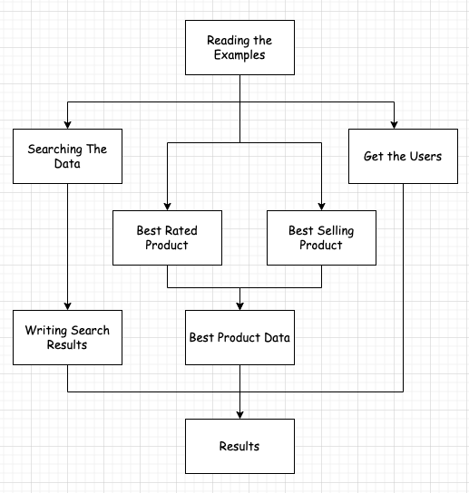

# 线程编排工具类 CompletableFuture     

## 介绍 
CompletableFuture 是 Java 8 并发API 引入的一种新的同步机制。它扩展了 `Future`，具有更多功能和灵活性。它允许你实现一个`事件驱动模型`，连接那些只有在其他任务完成后才会执行的任务。与 Future 接口一样，`CompletableFuture 必须使用将由操作返回的结果类型进行参数化(当你使用 CompletableFuture 时，你需要指定这个 CompletableFuture 将来会返回的结果类型。这个类型通过泛型参数 T 指定。)` 例如：CompletableFuture<T> methodName(T location) ,    

与Future对象一样，CompletableFuture 类代表一个异步计算的结果，但CompletableFuture的结果可以由任何线程确定。它有complete()方法在计算正常结束时确定结果，以及在计算以异常结束时使用的 completeExceptionally() 方法。如果两个或更多的线程对同一个CompletableFuture调用complete()或completeExceptionally()方法，只有第一次调用会生效。      

首先，你可以使用其构造函数创建 CompletableFuture 。在这种情况下，你必须像之前解释的那样使用 complete()方法来确定任务的结果。但是，你也可以使用`runAsync()`或`supplyAsync()`方法来创建一个CompletableFuture。runAsync() 方法执行一个Runnable对象，并返回CompletableFuture<Void>，这样计算就不能返回任何结果。supplyAsync() 方法执行一个参数化为将由此计算返回的类型的 Supplier 接口的实现。Supplier接口提供了get()方法。在这个方法中，我们必须包含任务的代码并返回由它生成的结果。在这种情况下，CompletableFuture 的结果将是 `Supplier 接口的结果 (Supplier<T> 接口是一个功能接口，它具有一个无参数的 get() 方法，用于提供结果，而这个结果的类型是通过泛型参数 T 指定的。当你使用 CompletableFuture.supplyAsync(Supplier<T> supplier) 方法时，你实际上是提供了一个 Supplier 实例，这个实例负责在异步执行环境中计算并提供一个结果,当你在 CompletableFuture.supplyAsync() 中使用 Supplier 时，你在 get() 方法中编写的代码就是异步执行的任务。任务完成后，get() 方法的返回值将成为 CompletableFuture 的结果。这使得 CompletableFuture<T> 的类型参数 T 与 Supplier<T> 的类型参数 T 相匹配，确保类型的一致性和安全性)`。      

## Methods
CompletableFuture 类提供了许多方法，允许你组织任务的执行顺序，实现一个`事件驱动模型`，在这个模型中，一个任务在前一个任务完成之前不会开始执行。`以下是其中的一些方法`：        
`thenApplyAsync()`: 这个方法接受一个函数，这个函数接受前一个 `CompletableFuture` 的结果，并返回一个新的值。这个新的值不是 `CompletableFuture`，它只是一个普通的结果（如 `Integer`、`String` 等）。      
```java
CompletableFuture<String> future = CompletableFuture.supplyAsync(() -> "Hello");
CompletableFuture<Integer> resultFuture = future.thenApplyAsync(s -> s.length());
```
在上面的例子中，`future` 最初的返回值是一个 `String`，然后通过 `thenApplyAsync`，我们将这个字符串转换成它的长度（一个整数），结果是一个直接包含这个整数的 `CompletableFuture<Integer>`。            

`thenComposeAsync()`: 这个方法用于当你的函数本身返回一个 `CompletableFuture` 时。这种情况通常发生在你的函数需要执行另一个异步操作，并且这个操作的结果也是异步提供的。 

```java
CompletableFuture<String> future = CompletableFuture.supplyAsync(() -> "Hello");
CompletableFuture<Integer> resultFuture = future.thenComposeAsync(s -> CompletableFuture.supplyAsync(() -> s.length()));
```
在这个例子中，`future` 返回一个 `String`。我们使用 `thenComposeAsync` 来处理这个字符串，但这次我们返回的是一个 `CompletableFuture`，它异步计算字符串的长度。注意，即使 `supplyAsync` 内部直接计算长度，它仍然返回一个 `CompletableFuture<Integer>`。            

>关键区别
thenApplyAsync() 使用一个函数，该函数返回一个非 CompletableFuture 的结果。它是用于将一个异步操作的结果转换为另一种类型的简单方法。          
thenComposeAsync() 使用一个函数，该函数返回一个新的 CompletableFuture。这允许你创建更复杂的异步操作链，其中一个异步操作的结果是启动另一个异步操作的基础。           
使用 thenComposeAsync() 可以避免出现嵌套的 CompletableFuture<CompletableFuture<T>> 结构，使整个异步流程更加清晰和易于管理。这是在需要将多个依赖于彼此的异步任务串联起来时非常有用的方法。           

`thenAcceptAsync()`: 这个方法与前一个相似，但参数是一个也可以指定为 lambda 表达式的 Consumer接口 的实现；在这种情况下，计算不会返回结果。       

`thenRunAsync()`: 这个方法等同于前一个，但在这种情况下接收一个Runnable对象作为参数。              

`thenCombineAsync()`: 这个方法接收两个参数。第一个是另一个 CompletableFuture 实例。另一个是可以指定为 lambda函数的 BiFunction接口 的实现。当两个 CompletableFuture（调用者和参数）都完成时，这个 BiFunction 将被执行。这个方法将返回 CompletableFuture 以获取 BiFunction 的结果。           

`runAfterBothAsync()`: 这个方法接收两个参数。第一个是另一个CompletableFuture。另一个是Runnable接口的实现，当两个CompletableFuture（调用者和参数）都完成时，将执行此Runnable。               

`runAfterEitherAsync()`: 这个方法与前一个相当，但当其中一个 CompletableFuture 完成时，就会执行Runnable任务。          

`allOf()`: 这个方法接收一个 CompletableFuture 对象的可变参数列表。它将返回一个CompletableFuture<Void>对象，当所有 CompletableFuture 对象都完成时，它将返回其结果。
`anyOf()`: 这个方法与前一个相当，但返回的 CompletableFuture 在其中一个CompletableFuture完成时返回其结果。        


最后，如果你想获得 CompletableFuture 返回的结果，你可以使用 `get()` 或 `join()` 方法。`这两种方法都会阻塞调用线程`，直到 CompletableFuture 完成，然后返回其结果。两种方法的主要区别在于 get() 会抛出ExecutionException（一种检查异常），而join()会抛出 RuntimeException（一种未检查异常）。因此，在不抛出异常的lambda（如Supplier、Consumer或Runnable）中使用join()更加容易。           

`之前解释的大多数方法都有Async后缀。这意味着这些方法将使用ForkJoinPool.commonPool实例以并发方式执行`。`那些没有Async后缀的方法将以串行方式执行（也就是说，在执行CompletableFuture的同一线程中执行），带有Async后缀和作为额外参数的执行器实例`。在这种情况下，CompletableFuture 将在作为参数传递的执行器中异步执行。  

## 使用 CompletableFuture类
在这个示例中，你将学习如何使用CompletableFuture类以并发方式实现一些异步任务的执行。我们将使用我们的20,000个亚马逊产品的集合来实现以下任务树：           
    

首先，我们将使用示例。然后，我们将执行四个并发任务。第一个任务将进行产品搜索。当搜索完成后，我们将结果写入文件。第二个任务将获得评分最高的产品。第三个任务将获得最畅销的产品。当这些都完成后，我们将使用另一个任务来合并它们的信息。最后，第四个任务将获取购买产品的用户列表。main()程序将等待所有任务的完成，然后将写入结果。让我们看看实现的细节。     

在这个示例中，我们将使用一些辅助任务。第一个是 LoadTask，它将从磁盘加载产品信息，并返回一个产品对象列表。    
```java
public class LoadTask implements Supplier<List<Product>> {
    private Path path;

    public LoadTask(Path path) {
        this.path = path;
    }

    @Override
    public List<Product> get() {
        System.out.println(new Date() + ": LoadTast: starting....");
        List<Product> productList = null;
        try {
            productList = Files.walk(path, FileVisitOption.FOLLOW_LINKS).parallel()
                    .filter(f -> f.toString().endsWith(".txt")).map(ProductLoader::load).collect(Collectors.toList());
        } catch (IOException e) {
            e.printStackTrace();
        }
        System.out.println(new Date() + ": LoadTast: end");
        return productList;
    }
}
```
它实现了 `Supplier接口`，以便作为 CompletableFuture 执行。在内部，它使用一个流来处理和解析所有文件，获取一个产品列表。第二个任务是 SearchTask，它将在产品对象列表中实施搜索，寻找标题中包含某个词的产品。这个任务是 Function 接口的一个实现。       
```java
public class SearchTask implements Function<List<Product>, List<Product>> {
    private String query;

    public SearchTask(String query) {
        this.query = query;
    }

    @Override
    public List<Product> apply(List<Product> products) {
        System.out.println(new Date() + ": CompletableTask: start");
        List<Product> ret = products.stream()
                .filter(product -> product.getTitle().toLowerCase().contains(query))
                .collect(Collectors.toList());
        System.out.println(new Date() + ": CompletableTask: end: " + ret.size());
        return ret;
    }
}
``` 
它接收一个包含所有产品信息的 List<Product>，并返回满足条件的产品列表。在内部，它在输入列表上创建一个流，对其进行过滤，并将结果收集到另一个列表中。最后，WriteTask将把搜索任务中获得的产品写入一个文件。在我们的案例中，我们生成一个HTML文件，但你可以随意以你想要的格式写入这些信息。这个任务实现了 Consumer 接口，所以它的代码应该是如下的：   
```java
public class WriteTask implements Consumer<List<Product>> {
    @Override
    public void accept(List<Product> products) {
        Path path = Paths.get("output\\results.html");
        System.out.println(new Date()+": WriteTask: start");
        try (BufferedWriter fileWriter = Files.newBufferedWriter(path,
                StandardOpenOption.CREATE)) {

            fileWriter.write("<HTML>");
            fileWriter.write("<HEAD>");
            fileWriter.write("<TITLE>");
            fileWriter.write("Search Results");
            fileWriter.write("</TITLE>");
            fileWriter.write("</HEAD>");
            fileWriter.write("<BODY>");
            fileWriter.newLine();
            fileWriter.write("<UL>");
            for (Product product : products) {
                fileWriter.write("<LI>"+product.getTitle()+"</LI>");
            }
            fileWriter.write("</UL>");
            fileWriter.write("</BODY>");
            fileWriter.write("</HTML>");
        } catch (Exception e) {
            e.printStackTrace();
            throw new RuntimeException("Testing error management");
        }
        System.out.println(new Date()+": WriteTask: end");
    }
}
```

**main()方法**      
我们在 main() 方法中组织了任务的执行。首先，我们使用CompletableFuture类的 supplyAsync() 方法执行 LoadTask。     
```java
public static void main(String[] args) {
    Path file = Paths.get("data","category");
    System.out.println(new Date() + ": Main: Loading products after three seconds....");
    LoadTask loadTask = new LoadTask(file);
    CompletableFuture<List<Product>> loadFuture = CompletableFuture
            .supplyAsync(loadTask);
    ......
```     
然后，使用得到的 CompletableFuture，我们使用 thenApplyAsync() 方法在加载任务完成后执行搜索任务。        
```java
System.out.println(new Date() + ": Main: Then apply for search....");
        CompletableFuture<List<Product>> completableSearch = loadFuture
                .thenApplyAsync(new SearchTask("love"));
```
一旦搜索任务完成，我们希望将执行结果写入文件。由于这个任务不会返回结果，我们使用 thenAcceptAsync() 方法：       
```java
CompletableFuture<Void> completableWrite = completableSearch
                .thenAcceptAsync(new WriteTask());

        completableWrite.exceptionally(ex -> {
            System.out.println(new Date() + ": Main: Exception "
                    + ex.getMessage());
            return null;
        });
```
我们使用了 exceptionally()方法来指定如果写入任务抛出异常时我们想做的处理。然后，我们在 completableFuture 对象上使用 thenApplyAsync() 方法来执行获取购买产品的用户列表的任务。我们将这个任务指定为一个lambda表达式。请注意，这个任务将与搜索任务并行执行。       
```java
System.out.println(new Date() + ": Main: Then apply for users....");
        CompletableFuture<List<String>> completableUsers = loadFuture
                .thenApplyAsync(resultList -> {

                    System.out.println(new Date()
                            + ": Main: Completable users: start");
                    List<String> users = resultList.stream()
                            .flatMap(p -> p.getReviews().stream())
                            .map(review -> review.getUser())
                            .distinct()
                            .collect(Collectors.toList());
                    System.out.println(new Date()
                            + ": Main: Completable users: end");
                    return users;

                });
```
与这些任务并行地，我们还使用 thenApplyAsync() 方法执行了查找评分最高的产品和最畅销的产品的任务。我们也使用 lambda表达式 定义了这些任务。         
```java
System.out.println(new Date()
                + ": Main: Then apply for best rated product....");
        CompletableFuture<Product> completableProduct = loadFuture
                .thenApplyAsync(resultList -> {
                    Product maxProduct = null;
                    double maxScore = 0.0;

                    System.out.println(new Date()
                            + ": Main: Completable product: start");
                    for (Product product : resultList) {
                        if (!product.getReviews().isEmpty()) {
                            double score = product.getReviews().stream()
                                    .mapToDouble(review -> review.getValue())
                                    .average().getAsDouble();
                            if (score > maxScore) {
                                maxProduct = product;
                                maxScore = score;
                            }
                        }
                    }
                    System.out.println(new Date()
                            + ": Main: Completable product: end");
                    return maxProduct;
                });

System.out.println(new Date()
                + ": Main: Then apply for best selling product....");
        CompletableFuture<Product> completableBestSellingProduct = loadFuture
                .thenApplyAsync(resultList -> {
                    System.out.println(new Date()
                            + ": Main: Completable best selling: start");
                    Product bestProduct = resultList.stream().min(Comparator.comparingLong(Product::getSalesrank)).orElse(null);
                    System.out.println(new Date()
                            + ": Main: Completable best selling: end");
                    return bestProduct;

                });
```
正如我们之前提到的，我们想要合并最后两个任务的结果。我们可以使用 `thenCombineAsync()` 方法来指定一个在两个任务都完成后将执行的任务。        
```java
CompletableFuture<String> completableProductResult = completableBestSellingProduct
                .thenCombineAsync(
                        completableProduct,
                        (bestSellingProduct, bestRatedProduct) -> {
                            System.out
                                    .println(new Date()
                                            + ": Main: Completable product result: start");
                            String ret = "The best selling product is "
                                    + bestSellingProduct.getTitle() + "\n";
                            ret += "The best rated product is "
                                    + bestRatedProduct.getTitle();
                            System.out
                                    .println(new Date()
                                            + ": Main: Completable product result: end");
                            return ret;
                        });
```
最后，我们使用 allOf() 和 join() 方法等待最终任务的结束，并使用get()方法获取结果并写入结果。        
```java
System.out.println(new Date() + ": Main: Waiting for results");
        CompletableFuture<Void> finalCompletableFuture = CompletableFuture
                .allOf(completableProductResult, completableUsers,
                        completableWrite);
        finalCompletableFuture.join();

        try {
            System.out.println("Number of loaded products: "
                    + loadFuture.get().size());
            System.out.println("Number of found products: "
                    + completableSearch.get().size());
            System.out.println("Number of users: "
                    + completableUsers.get().size());
            System.out.println("Best rated product: "
                    + completableProduct.get().getTitle());
            System.out.println("Best selling product: "
                    + completableBestSellingProduct.get().getTitle());
            System.out.println("Product result: "+completableProductResult.get());
        } catch (InterruptedException | ExecutionException e) {
            e.printStackTrace();
        }
```

>注意： main()启动前，调整 data目录的位置， `data.zip` 文件可从`https://github.com/mysky528/Mastering-Concurrency-Programming-with-Java-9-Second-Edition/blob/dacd4d69318a6d961bb84ef98f63b378ba03aba8/Chapter11/Synchronization/data.zip` 获取。       

output log:     
```bash
Sat Apr 13 15:23:02 CST 2024: Main: Loading products after three seconds....
Sat Apr 13 15:23:02 CST 2024: Main: Then apply for search....
Sat Apr 13 15:23:02 CST 2024: LoadTast: starting....
Sat Apr 13 15:23:02 CST 2024: Main: Then apply for users....
Sat Apr 13 15:23:02 CST 2024: Main: Then apply for best rated product....
Sat Apr 13 15:23:02 CST 2024: Main: Then apply for best selling product....
Sat Apr 13 15:23:02 CST 2024: Main: Waiting for results
Sat Apr 13 15:23:03 CST 2024: LoadTast: end
Sat Apr 13 15:23:03 CST 2024: Main: Completable best selling: start
Sat Apr 13 15:23:03 CST 2024: Main: Completable users: start
Sat Apr 13 15:23:03 CST 2024: CompletableTask: start
Sat Apr 13 15:23:03 CST 2024: Main: Completable product: start
Sat Apr 13 15:23:03 CST 2024: Main: Completable best selling: end
Sat Apr 13 15:23:03 CST 2024: CompletableTask: end: 208
Sat Apr 13 15:23:03 CST 2024: WriteTask: start
Sat Apr 13 15:23:03 CST 2024: WriteTask: end
Sat Apr 13 15:23:03 CST 2024: Main: Completable product: end
Sat Apr 13 15:23:03 CST 2024: Main: Completable product result: start
Sat Apr 13 15:23:03 CST 2024: Main: Completable product result: end
Sat Apr 13 15:23:03 CST 2024: Main: Completable users: end
Number of loaded products: 20000
Number of found products: 208
Number of users: 158288
Best rated product: Party Tyme Karaoke CD Kids Songs
Best selling product: The Da Vinci Code
Product result: The best selling product is The Da Vinci Code
The best rated product is Party Tyme Karaoke CD Kids Songs
Sat Apr 13 15:23:03 CST 2024: Main: end
```     

main()方法执行所有配置并等待任务的最终完成。任务的执行遵循我们配置的顺序。                  


refer   
1.Mastering Concurrency Programming with Java 8             
2.https://github.com/PacktPublishing/Mastering-Concurrency-Programming-with-Java-9-Second-Edition               
