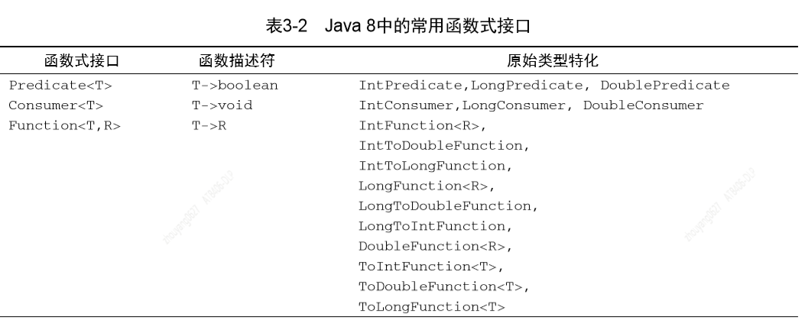
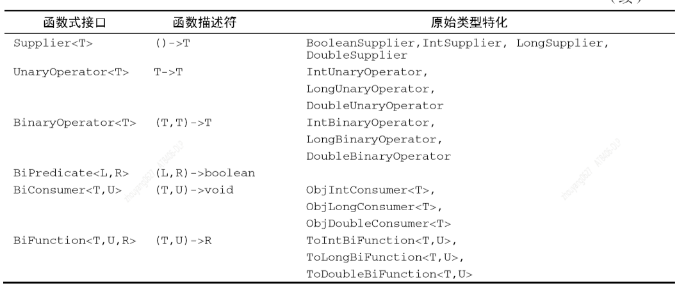

## Function<T>
| 函数式接口      |    函数描述符 | 原始类型特化  |
| :-------- | --------:| :--: |
| Predicate<T>  | T->boolean |  IntFunction<R>,IntToDoubleFunction,IntToLongFunction,LongFunction<R>,LongToDoubleFunction,LongToIntFunction,DoubleFunction<R>,,ToIntFunction<T>,ToDoubleFunction<T>,toLongFunction<T> |

### 介绍函数复合
Function接口所代表的Lambda表达式复合起来。Function接口为此配了andThen和compose两个默认方法，他们都会返回Funcation的一个实例。
andThen方法会返回一个函数，它先对输入应用一个给定函数，再对输出应用另一个函数。比如，假设有一个函数f给数字加1(x->x+1),另一个函数g给数字乘2，你可以将他们组合成一个函数h，先给数字加1，再给结果乘2：
```java
Function<Integer,Integer> f=x->x+1;
Function<Integer,Integer> g=x->x*2;
//数学上会写作g(f(x))
Function<Integer,Integer> h = f.andThen(g);
int result = h.apply(1);
```
你也可以类似地使用compose方法，先把给定的函数用作conpose的参数里面给的那个函数，然后再把函数本身用于结果。比如在上一个例子里面用compose的话，它将意味着f(g(x)),而andThen则意味着g(f(x)):
```java
Function<Integer,Integer> f=x->x+1;
Function<Integer,Integer> g=x->x*2;
//数学上会写作f(g(x))
Function<Integer,Integer> h = f.compose(g);
int result = h.appy(1);
```

### Function<T>实战

1. apply()
作用：将给定的参数应用到函数上，传入的参数类型为T返回类型为R

示例：
```java
public static void main(String[] args) {

    System.out.println(testFunction(2,i -> i * 2 + 1));
}

public static int testFunction(int i, Function<Integer,Integer> function) {

    return function.apply(i);
}
```


> 摘自
     1. 《Java8实战》
