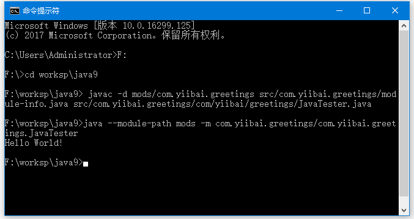

**`正文`**

[TOC]


## 创建模块
按照下面步骤来创建一个模块: `com.yiibai.greetings`。

第1步
创建一个文件夹`F:\worksp\java9\src`。 在这个目录下，创建一个与创建的模块名称相同的文件夹`com.yiibai.greetings`。

第2步
使用以下代码在`F:\worksp\java9\src\com.yiibai.greetings`文件夹中创建一个文件:`module-info.java`，添加以下内容 -
```java
module com.yiibai.greetings { }
```
`module-info.java`是用来创建模块的文件。 在这一步中，我们创建了一个名为com.yiibai.greetings``的模块。 按照惯例，这个文件应该存储在名称与模块名称相同的文件夹中。

第3步
在模块中添加源代码。在`F:\worksp\java9\src\com.yiibai.greetings\com\yiibai\greetings`文件夹中创建一个Java文件:`Java9Tester.java`，其代码如下 -
```java
package com.yiibai.greetings;

public class Java9Tester {
   public static void main(String[] args) {
      System.out.println("Hello World!");
   }
}
```
按照惯例，模块的源代码位于与模块名称相同的目录中。

第4步
创建一个文件夹`F:\worksp\java9\mods`。 现在创建一个与创建的模块名称相同的文件夹`F:\worksp\java9\mods\com.yiibai.greetings`。 现在编译模块到mods目录。如下所示 -
```shell
F:\worksp\java9> javac -d mods/com.yiibai.greetings src/com.yiibai.greetings/module-info.java src/com.yiibai.greetings/com/yiibai/greetings/JavaTester.java
```

第5步
运行模块来查看结果，执行以下命令。
```shell
F:\worksp\java9>java --module-path mods -m com.yiibai.greetings/com.yiibai.greetings.JavaTester
Hello World!
```

这里module-path将mods作为模块位置提供，而-m则表示主模块。

完整的过程如下图所示 - 



>摘自：https://www.yiibai.com/java/java9/module_system.html