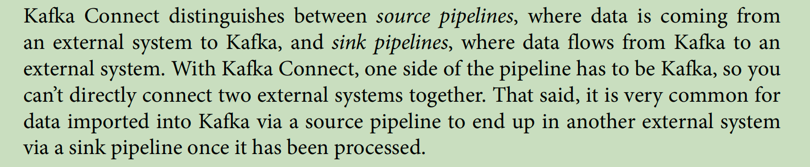

### 引言

今天2023年 农历最后一天，我找到之前藏书 ‘2023.09 kafka Connect’  pdf， 接下来，我们来聊，我怎么看的...

### 模糊的相见

kafka 对于来我，算是再熟悉不过，今天的主角 kafka connect ,我仅在 MM2 场景下投放过一次，那一次伤我挺痛的，它与 kafka 有不同的 "fault tolerance，scale up，scale down，monitor和mangement" 。  当时是 Kafka 2 Kafka ，那么这也算是我第一次相识 Kafka Connect Boy。

### 震惊

2024.02.08 今天书中的一段释义让我没有它的“Motivation” （KIP 第一章节永远是 Motivation）。 

我确实没有 理解到 “one side of the pipeline has to be Kafka” ，

1.若我站在 数据分发平台（DTS） Admin 角度，可能会更好理解的是：它目的是为了符合 Kafka “一写多读 & 一个中间存储介质已达到 存储和流动” ，

2.若我站在 数据治理平台 Admin , 这点让我处于懵逼，原因是真实的需求是 A 2 C，而实际是 A 2 B 2 C，我其实再想它是因为没有 Flink State？  好吧，我知道 Kafka Connect Features 包含 fault tolerance，scale up，scale down，monitor和mangement。 但我仍然打趣那它与 DataX 做比较，

3.若站在今天，将 DataX on K8s 可能看起来会比它都会轻量多了，原因是管理进程比管理线程要简单的多， 我也认为 Akka Cluster 也有实现对 Actor 的管理等特性（我也是Scala 学习者）

我估计 2024.02.08下班前以我资质估计还没看出它的 Motivation， 此处留下占位符，后续再 填充。。。。。。 

log.info("它因为 {}，我为什么用它 !!!");  

