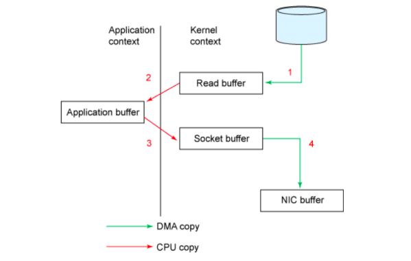
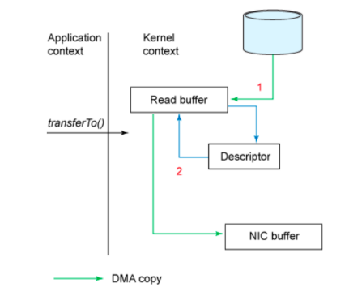

## Kafka 读写数据的⾼性能原理 

## 写⼊数据⽤了MMap技术
MMap虚拟内存映射，能够实现⾮常⾼效的⽂件读写能⼒。

## 消费者拉取数据使⽤了SendFile技术
在 Linux 2.4+ 内核通过 sendfile 系统调⽤，提供了零拷⻉技术实现。磁盘数据通过 DMA 拷⻉到内核态 Buffer
后，直接通过 DMA 拷⻉到 NIC Buffer(socket buffer)，⽆需 CPU 拷⻉。这也是零拷⻉这⼀说法的来
源。            

除了减少数据拷⻉外，因为整个读⽂件 - ⽹络发送由⼀个 sendfile 调⽤完成，整个过程只有两次上下⽂切换，因此⼤⼤提⾼了性能。      

### 示例流程  
Consumer -> broker 读数据（⽹络）（⽹卡接收consumer数据->broker读取数据(mmap定位数据)->
通过⽹络发送给到consumer）              

**传统数据在⽹卡上的发送链路** 
    

**使⽤SendFile技术后，数据在⽹卡端的发送链路**      
     

