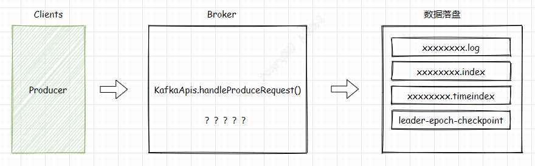

--In Blog
--Tags: Kafka

# Kafka Broker处理ProduceRequest的过程

> 涉及Kafka是2.2.1版本

## 1.引言
`KafkaApis`是Broker处理各种请求类型的入口，这里可以把它当作Spring boot的`Controller`来看。所以它足以引起你的重视了。关于接受的数据是通过`val produceRequest = request.body[ProduceRequest]`解析出来，而ProduceRequest处理过程会涉及到的`ReplicaManager、Partition、Log、LogSegment`相关类，经过它们处理后"数据落盘到 xxxxxx.log文件中"。

> Broker处理ProduceRequest的过程较复杂，这里先列出一些疑惑点：

**1.** 消息的Offset是如何分配的？     
在之前关于[Producer RecordAccumulator消息累加器]()的推文中介绍，每条消息在Producer发送的时候，ProducerBatch分配的是相对Offset并且baseOffset是从0开始，所以消息最终写入时是如何分配Offset的？    
**2.** 处理ProduceRequest时，数据是同步写入磁盘中的xxxxxx.log的吗？       
**3.** 数据是如何顺序写入的？ 
**4.** acks是如何影响Producer数据写入的？  
**5.** 批量写入，若其中一条消息过大，那写入是这一批都失败，还是单条失败？


## 2. ApiKeys.PRODUCE  
根据Producer Sender线程中构建ProduceRequest对象，它在构造方法设置了ApiKeys值等于PRODUCE。
*构造方法如下:*
```java
private ProduceRequest(short version, short acks, int timeout, Map<TopicPartition, MemoryRecords> partitionRecords, String transactionalId) {
        //设置ApiKeys = PRODUCE  ！！！
        super(ApiKeys.PRODUCE, version);
        this.acks = acks;
        this.timeout = timeout;

        this.transactionalId = transactionalId;
        this.partitionRecords = partitionRecords;
        this.partitionSizes = createPartitionSizes(partitionRecords);

        for (MemoryRecords records : partitionRecords.values()) {
            setFlags(records);
        }
    }
```     
KafkaApis.handle()方法针对不同的ApiKeys枚举项，处理不同逻辑。所以 `handleProduceRequest(request)` 是处理Produce请求的方法。 
*接下来，重点分析handleProduceRequest(),它是如何处理的*         


### 3. KafkaApis.handleProduceRequest()

*3.1 KafkaApis.handleProduceRequest() : step01* 
```java
val produceRequest = request.body[ProduceRequest]
val numBytesAppended = request.header.toStruct.sizeOf + request.sizeOfBodyInBytes
```     
**Step01**:  解析request请求体，获取produceRequest对象。    

--- 

*3.2 KafkaApis.handleProduceRequest() : step02* 
```java
val unauthorizedTopicResponses = mutable.Map[TopicPartition, PartitionResponse]()
    val nonExistingTopicResponses = mutable.Map[TopicPartition, PartitionResponse]()
    val invalidRequestResponses = mutable.Map[TopicPartition, PartitionResponse]()
    val authorizedRequestInfo = mutable.Map[TopicPartition, MemoryRecords]()

    for ((topicPartition, memoryRecords) <- produceRequest.partitionRecordsOrFail.asScala) {
      if (!authorize(request.session, Write, Resource(Topic, topicPartition.topic, LITERAL)))
        unauthorizedTopicResponses += topicPartition -> new PartitionResponse(Errors.TOPIC_AUTHORIZATION_FAILED)
      else if (!metadataCache.contains(topicPartition))
        nonExistingTopicResponses += topicPartition -> new PartitionResponse(Errors.UNKNOWN_TOPIC_OR_PARTITION)
      else
        try {
          ProduceRequest.validateRecords(request.header.apiVersion(), memoryRecords)
          authorizedRequestInfo += (topicPartition -> memoryRecords)
        } catch {
          case e: ApiException =>
            invalidRequestResponses += topicPartition -> new PartitionResponse(Errors.forException(e))
        }
    }
```     
**Step02**:     
* 校验Topic权限 
Kafka Broker提供了Topic ACL机制，只需要在Broker的`server.properties` 配置**authorizer.class.name=kafka.security.auth.SimpleAclAuthorizer** ，SimpleAclAuthorizer是Kafka提供的默认ACL的校验实现，同样也可自行实现校验逻辑。      
* TopicPartition的leader是否在当前节点  
在之前介绍Producer相关的推文中，多次提到TopicParition，它包含Topic和Partition信息，Producer是将数据发往Topic的某个Partition的Leader所在的Broker上，因为延迟问题，会出现Producer在发送ProduceRequest途中，Topic的某个Parition发生重新选举。
* 消息(MemoryRecords records)是否合法，主要从是否是空集合，消息MAGIC版本、ZSTD压缩支持最低的version。   
Kafka-Clients，Broker几乎都是向下兼容，所以上面的判断多多少少都无法避免         

最后将符合的数据放入可变Map类型的authorizedRequestInfo中。

--- 

*3.3 Scala局部函数 : step03* 
```java
sendResponseCallback();
processingStatsCallback();
```     
**Step03**:  Scala可以在某个函数内部定义函数，就像局部变量一样，这样的函数称为局部函数，并且它只在包含它的代码块中可见。

---

*3.4 KafkaApis.handleProduceRequest : step04* 
```java
if (authorizedRequestInfo.isEmpty)
      sendResponseCallback(Map.empty)
    else {
      val internalTopicsAllowed = request.header.clientId == AdminUtils.AdminClientId

      // call the replica manager to append messages to the replicas
      replicaManager.appendRecords(
        timeout = produceRequest.timeout.toLong,
        requiredAcks = produceRequest.acks,
        internalTopicsAllowed = internalTopicsAllowed,
        isFromClient = true,
        entriesPerPartition = authorizedRequestInfo,
        responseCallback = sendResponseCallback,
        recordConversionStatsCallback = processingStatsCallback)

      // if the request is put into the purgatory, it will have a held reference and hence cannot be garbage collected;
      // hence we clear its data here in order to let GC reclaim its memory since it is already appended to log
      produceRequest.clearPartitionRecords()
    }
```     
**Step04**: 首先判断当前请求是否是内部Topic，紧接着调用副本管理器来追加消息集合。       

### 接下来开始讲解 replicaManager.appendRecords()方法
*3.5 appendRecords()方法的参数：step05*       
* timeout: produceRequest的超时时间
* requiredAcks：Producer的ack参数项，默认是1
* internalTopicsAllowed: 内部Topic权限，这里是 flase
* isFromClient: 从Clients的Producer发起请求 这里默认是true
* entriesPerPartition: 它是我们要处理的数据 `mutable.Map[TopicPartition, MemoryRecords]()`

*3.6 ReplicaManager.appendRecords : step06*     
```java
if (isValidRequiredAcks(requiredAcks))
```
**step06**: 判断acks值是否有效，处于(-1,0,1)之间，acks是Producer端对于保证消息的可靠性和吞吐量的重要指标。 下面介绍三个不同值得含义：     
* ack=1:  默认值即为1。Producer发送消息之后，只要分区的leader副本成功写入消息，那么它就会收到来自服务端的成功响应。如果消息无法写入leader副本，比如在leader副本崩溃、重新选举新的leader副本的过程中，那么Producer会收到Broker返回的异常Response，并且选择重发消息。如果消息写入leader副本并返回成功返回给Producer，若在被其他follower副本同步消息之前leader副本崩溃，那么消息会被丢失。
* ack=0:  Producer发送消息之后不需要等待Broker的响应。如果在消息从发送到写入Kafka的过程中出现某些异常，导致Kafka并没有收到这条消息，那么Producer也无从得知，消息也就丢失了。在其他配置环境相同的情况下，acks 设置为 0 可以达到最大的吞吐量。
* acks=-1:  生产者在消息发送之后，需要等待ISR中的所有副本都成功写入消息之后才能够收到来自服务端的成功响应。在其他配置环境相同的情况下，acks 设置为-1可以达到最强的可靠性。但这并不意味着消息就一定可靠，因为ISR中可能只有leader副本，这样就退化成了acks=1的情况。要获得更高的消息可靠性需要配合 min.insync.replicas 等参数的联动。

以上表明： acks=0时，producer能达到最大的吞吐量，acks=-1时，需配合min.insync.replicas参数 来达到消息的更高的可靠性，而acks=1 是吞吐量和消息可靠性的中间选择。

---

*3.7 ReplicaManager.appendRecords : step07*     
```java
val sTime = time.milliseconds
  val localProduceResults = appendToLocalLog(internalTopicsAllowed = internalTopicsAllowed,
    isFromClient = isFromClient, entriesPerPartition, requiredAcks)
  debug("Produce to local log in %d ms".format(time.milliseconds - sTime))
```
**step07**:  appendToLocalLog()方法的参数值请`参考3.5`有说明参数含义。

---


遍历`entriesPerPartition`消息集
1. 判断要写入的Topic是否是内部Topic("__consumer_offsets,__transaction_state");

2. 判断要写入的Topic的分区是否在当前brokerId上，并且它还是Leader

3. 判断acks=-1时，比较当前的ISR集合副本个数与"min.insync.replicas"参数值的大小，若小于"min.insync.replicas"参数值，则触发异常，无法满足消息可靠性配置要求。


## Log.appendAsLeader()
4. analyzeAndValidateRecords() 分析和校验消息集
```java
val appendInfo = analyzeAndValidateRecords(records, isFromClient = isFromClient)
```

校验逻辑：
* 当消息格式=V2并且从Clients请求，它的baseOffset != 0;
* 判断每条消息大小是否大于 TopicConfig中的"max.message.bytes" 参数值
* 根据CRC校验码校验数据完整性
将每批消息集(消息集也可能只有1条数据) ：
```java
case class LogAppendInfo(var firstOffset: Option[Long],
                         var lastOffset: Long,
                         var maxTimestamp: Long,
                         var offsetOfMaxTimestamp: Long,
                         var logAppendTime: Long,
                         var logStartOffset: Long,
                         var recordConversionStats: RecordConversionStats,
                         sourceCodec: CompressionCodec,
                         targetCodec: CompressionCodec,
                         shallowCount: Int,
                         validBytes: Int,
                         offsetsMonotonic: Boolean,
                         lastOffsetOfFirstBatch: Long) {
```


5. 判断是否包含有效消息
shallowCount 参数是 DefaultRecordBatch对象的个数，而不是 Record的个数

6. 通过LogAppendInfo中的 validBytes判断 MemoryRecords类型的records是否存在无效字节，若存在就设置limit位置

7. 判断要写入的文件Buffer是否关闭？ 

8. assignOffsets = true , nextOffsetMetadata.messageOffset


case class LogOffsetMetadata(messageOffset: Long,
                             segmentBaseOffset: Long = LogOffsetMetadata.UnknownSegBaseOffset,
                             relativePositionInSegment: Int = LogOffsetMetadata.UnknownFilePosition) 


9. appendInfo.firstOffset = Some(offset.value)


10. validateRecord(batch, record, now, timestampType, timestampDiffMaxMs, compactedTopic)


message.timestamp.difference.max.ms


## LogValidator.validateMessagesAndAssignOffsets(....)
```java
val validateAndOffsetAssignResult = try {
    LogValidator.validateMessagesAndAssignOffsets(validRecords,
      offset,
      time,
      now,
      appendInfo.sourceCodec,
      appendInfo.targetCodec,
      config.compact,
      config.messageFormatVersion.recordVersion.value,
      config.messageTimestampType,   // message.timestamp.type
      config.messageTimestampDifferenceMaxMs,  // message.timestamp.difference.max.ms
      leaderEpoch,
      isFromClient,
      interBrokerProtocolVersion)
  } catch {
    case e: IOException =>
      throw new KafkaException(s"Error validating messages while appending to log $name", e)
  }
```


## validateBatch()
1. 判断batch的消息Offset是否在有效区间 ，而有效的范围是 lastOffset >= baseOffset
2. 消息条数为空，报错
3. 判断lastOffset-baseOffset + 1的差值是否与消息条数相等，注意baseOffset从0开始，而消息条数是从1开始


1. 数据是立马写入文件的segment么？
2. 数据是如何构建 offset索引和timestamp索引
3. 写入过程，发生Leader切换怎么办？ 
4. 消息Offset是如何分配的？
5. 数据写入是如何保证线程安全的？
6. 数据写入是如何保证顺序写入的？
7. LogStartOffset、HW、LEO？


val appendInfo = analyzeAndValidateRecords(records, isFromClient = isFromClient)

/**
 * An append-only log for storing messages.
 *
 * The log is a sequence of LogSegments, each with a base offset denoting the first message in the segment.
 *
 * New log segments are created according to a configurable policy that controls the size in bytes or time interval
 * for a given segment.
 *
 * @param dir The directory in which log segments are created.
 * @param config The log configuration settings
 * @param logStartOffset The earliest offset allowed to be exposed to kafka client.
 *                       The logStartOffset can be updated by :
 *                       - user's DeleteRecordsRequest
 *                       - broker's log retention
 *                       - broker's log truncation
 *                       The logStartOffset is used to decide the following:
 *                       - Log deletion. LogSegment whose nextOffset <= log's logStartOffset can be deleted.
 *                         It may trigger log rolling if the active segment is deleted.
 *                       - Earliest offset of the log in response to ListOffsetRequest. To avoid OffsetOutOfRange exception after user seeks to earliest offset,
 *                         we make sure that logStartOffset <= log's highWatermark
 *                       Other activities such as log cleaning are not affected by logStartOffset.
 * @param recoveryPoint The offset at which to begin recovery--i.e. the first offset which has not been flushed to disk
 * @param scheduler The thread pool scheduler used for background actions
 * @param brokerTopicStats Container for Broker Topic Yammer Metrics
 * @param time The time instance used for checking the clock
 * @param maxProducerIdExpirationMs The maximum amount of time to wait before a producer id is considered expired
 * @param producerIdExpirationCheckIntervalMs How often to check for producer ids which need to be expired
 */
@threadsafe
class Log(@volatile var dir: File,
          @volatile var config: LogConfig,
          @volatile var logStartOffset: Long,
          @volatile var recoveryPoint: Long,
          scheduler: Scheduler,
          brokerTopicStats: BrokerTopicStats,
          val time: Time,
          val maxProducerIdExpirationMs: Int,
          val producerIdExpirationCheckIntervalMs: Int,
          val topicPartition: TopicPartition,
          val producerStateManager: ProducerStateManager,
          logDirFailureChannel: LogDirFailureChannel) extends Logging with KafkaMetricsGroup {

  import kafka.log.Log._

  this.logIdent = s"[Log partition=$topicPartition, dir=${dir.getParent}] "

  /* A lock that guards all modifications to the log */
  private val lock = new Object
  // The memory mapped buffer for index files of this log will be closed with either delete() or closeHandlers()
  // After memory mapped buffer is closed, no disk IO operation should be performed for this log
  @volatile private var isMemoryMappedBufferClosed = false

  /* last time it was flushed */
  private val lastFlushedTime = new AtomicLong(time.milliseconds)


  


