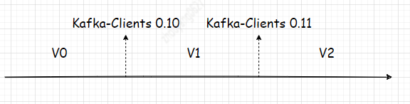
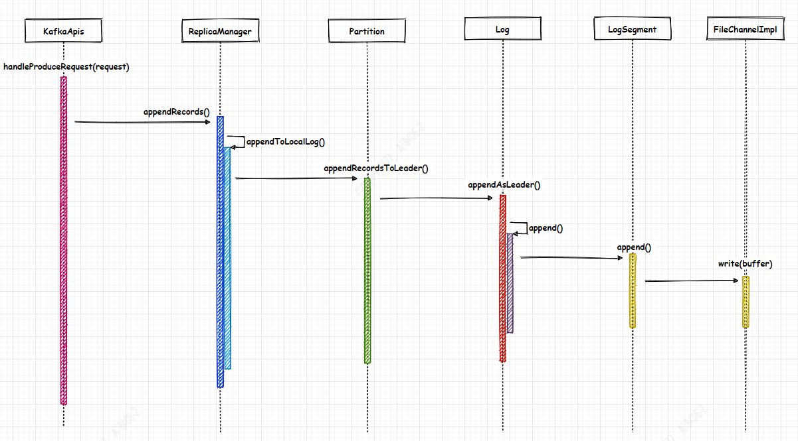
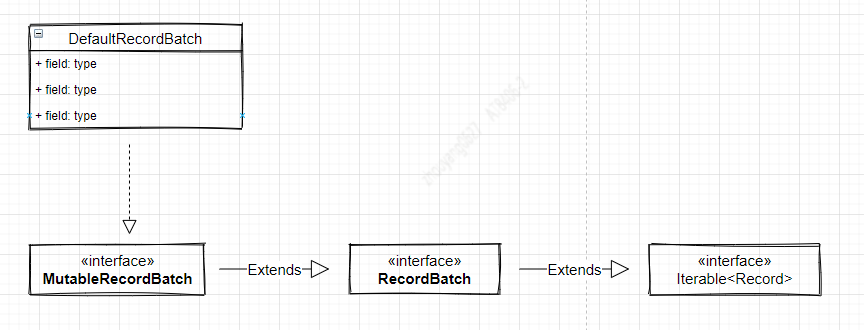
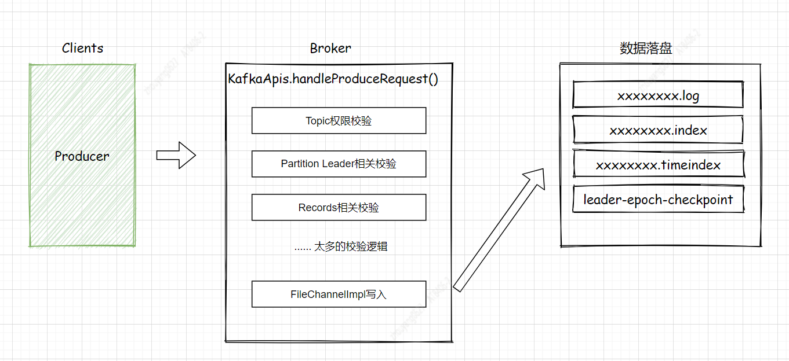

--In Blog
--Tags: Kafka

# Kafka Broker处理ProduceRequest的过程

> 涉及Kafka是2.2.1版本，Producer是2.2.1版本

## 1. 引言
`KafkaApis`是Broker处理各种请求类型的入口类，这里可以把它当作Spring boot的`Controller`来看。所以它足以引起你的重视了。关于接受的数据是通过`val produceRequest = request.body[ProduceRequest]`解析出来，而ProduceRequest处理过程会涉及到的`ReplicaManager、Partition、Log、LogSegment` **等等**相关类，经过它们处理后利用Java NIO FileChannelImpl将"数据落盘到 xxxxxx.log文件中"。 

>Broker处理Produce请求逻辑较复杂，处理方法较多，并且涉及到Broker启动时，各种类的创建和变量的赋值、文件读取及缓存变量等等。无法在一篇推文中详细阐述整个逻辑，后面会分功能模块来更新，所以希望这篇推文能让读者熟悉Broker处理ProduceRequest的大致流程。  

## 2. ApiKeys.PRODUCE  
根据Producer Sender线程中构建ProduceRequest对象，它在构造方法设置了ApiKeys值等于PRODUCE，它也与之对应是KafkaApis.handle()方法所针对不同的ApiKeys枚举项，处理不同的逻辑。
*构造方法如下:*
`Sender`
```java
private ProduceRequest(short version, short acks, int timeout, Map<TopicPartition, MemoryRecords> partitionRecords, String transactionalId) {
        //设置ApiKeys = PRODUCE  ！！！
        super(ApiKeys.PRODUCE, version);
        this.acks = acks;
        this.timeout = timeout;

        this.transactionalId = transactionalId;
        this.partitionRecords = partitionRecords;
        this.partitionSizes = createPartitionSizes(partitionRecords);

        for (MemoryRecords records : partitionRecords.values()) {
            setFlags(records);
        }
    }
```     
`KafkaApis.handle()`
```java
/**
   * Top-level method that handles all requests and multiplexes to the right api
   */
  def handle(request: RequestChannel.Request) {
    try {
      trace(s"Handling request:${request.requestDesc(true)} from connection ${request.context.connectionId};" +
        s"securityProtocol:${request.context.securityProtocol},principal:${request.context.principal}")
      request.header.apiKey match {
        case ApiKeys.PRODUCE => handleProduceRequest(request)
        case ApiKeys.FETCH => handleFetchRequest(request)
        case ApiKeys.LIST_OFFSETS => handleListOffsetRequest(request)
        case ApiKeys.METADATA => handleTopicMetadataRequest(request)
        ... 省略部分代码
```   
所以 `handleProduceRequest(request)` 是处理Produce请求的方法。 
*接下来，重点分析handleProduceRequest(),它是处理的过程*         


## 3. Magic Value
Kafka在开源发展过程中，它的消息格式从开始V0,经过V1 到现在的V2版本。Kafka Broker通过**RecordBatch**中的MAGIC_VALUE_V0、MAGIC_VALUE_V1、MAGIC_VALUE_V2分别表示V0,V1,V2日志格式的消息。 鉴于0.11 Released June 28, 2017，并且推文中的Producer是2.2.1版本,**所以推文针对Broker处理逻辑基于Magic Value =2的**。  
它的具体介绍请查看[Kafka官网DOCS-Message Format](http://kafka.apache.org/22/documentation.html#messageformat)  
`下面是不同消息格式的发布版本图：`   

 

>其实 Magic Value就类似于在接口定义版本 例如： http://xxx.com/v1/queryUserInfo/ 这样的比较，希望读者对它会有熟悉的概念了解。 

## 4. 处理流程图
下面的 5 ~ 10 编号会对处理过程做阐述。每个编号代表某个类的处理方法


## 5. KafkaApis.handleProduceRequest()

### *5.1 KafkaApis.handleProduceRequest() : step01* 
```java
val produceRequest = request.body[ProduceRequest]
val numBytesAppended = request.header.toStruct.sizeOf + request.sizeOfBodyInBytes
```     
**Step01**:  解析request请求体，获取produceRequest对象。    

--- 

### *5.2 KafkaApis.handleProduceRequest() : step02* 
```java
val unauthorizedTopicResponses = mutable.Map[TopicPartition, PartitionResponse]()
    val nonExistingTopicResponses = mutable.Map[TopicPartition, PartitionResponse]()
    val invalidRequestResponses = mutable.Map[TopicPartition, PartitionResponse]()
    val authorizedRequestInfo = mutable.Map[TopicPartition, MemoryRecords]()

    for ((topicPartition, memoryRecords) <- produceRequest.partitionRecordsOrFail.asScala) {
      if (!authorize(request.session, Write, Resource(Topic, topicPartition.topic, LITERAL)))
        unauthorizedTopicResponses += topicPartition -> new PartitionResponse(Errors.TOPIC_AUTHORIZATION_FAILED)
      else if (!metadataCache.contains(topicPartition))
        nonExistingTopicResponses += topicPartition -> new PartitionResponse(Errors.UNKNOWN_TOPIC_OR_PARTITION)
      else
        try {
          ProduceRequest.validateRecords(request.header.apiVersion(), memoryRecords)
          authorizedRequestInfo += (topicPartition -> memoryRecords)
        } catch {
          case e: ApiException =>
            invalidRequestResponses += topicPartition -> new PartitionResponse(Errors.forException(e))
        }
    }
```     
**Step02**:     
* 校验Topic权限 
Kafka Broker提供了Topic ACL机制，只需要在Broker的`server.properties` 配置**authorizer.class.name=kafka.security.auth.SimpleAclAuthorizer** ，SimpleAclAuthorizer是Kafka提供的默认ACL的校验实现，同样也可自行实现校验逻辑。      
* TopicPartition的leader是否在当前节点  
在之前介绍Producer相关的推文中，多次提到TopicParition，它包含Topic和Partition信息，Producer是将数据发往Topic的某个Partition的Leader所在的Broker上，因为延迟问题，会出现Producer在发送ProduceRequest途中，Topic的某个Parition发生重新选举。
* 消息(MemoryRecords records)是否合法，主要从是否是空集合，消息MAGIC版本、ZSTD压缩支持最低的version。   
Kafka-Clients，Broker几乎都是向下兼容，所以上面的判断多多少少都无法避免         

最后将符合的数据放入可变Map类型的authorizedRequestInfo中。

--- 

### *5.3 Scala局部函数 : step03* 
```java
sendResponseCallback();
processingStatsCallback();
```     
**Step03**:  定义Response的回调函数，这里是因为Scala可以在某个函数内部定义函数，就像局部变量一样，这样的函数称为局部函数，并且它只在包含它的代码块中可见。

---

### *5.4 KafkaApis.handleProduceRequest() : step04* 
```java
if (authorizedRequestInfo.isEmpty)
      sendResponseCallback(Map.empty)
    else {
      val internalTopicsAllowed = request.header.clientId == AdminUtils.AdminClientId

      // call the replica manager to append messages to the replicas
      replicaManager.appendRecords(
        timeout = produceRequest.timeout.toLong,
        requiredAcks = produceRequest.acks,
        internalTopicsAllowed = internalTopicsAllowed,
        isFromClient = true,
        entriesPerPartition = authorizedRequestInfo,
        responseCallback = sendResponseCallback,
        recordConversionStatsCallback = processingStatsCallback)

      // if the request is put into the purgatory, it will have a held reference and hence cannot be garbage collected;
      // hence we clear its data here in order to let GC reclaim its memory since it is already appended to log
      produceRequest.clearPartitionRecords()
    }
```     
**Step04**: 首先判断当前请求是否是内部Topic，紧接着调用副本管理器来追加消息集合。       

## 6. ReplicaManager.appendRecords()
`参数介绍`    
* timeout: produceRequest的超时时间
* requiredAcks：Producer的ack参数项，默认是1
* internalTopicsAllowed: 内部Topic权限，这里是 flase
* isFromClient: 从Clients的Producer发起请求 这里默认是true
* entriesPerPartition: 它是我们要处理的数据 `mutable.Map[TopicPartition, MemoryRecords]()`, 请查看`5.2`

### *6.1 ReplicaManager.appendRecords() : step01*     
```java
if (isValidRequiredAcks(requiredAcks))
```
**step01**: 判断acks值是否有效，处于(-1,0,1)之间，acks是Producer端对于保证消息的可靠性和吞吐量的重要指标。 下面介绍三个不同值得含义：     
* ack=1:  默认值即为1。Producer发送消息之后，只要分区的leader副本成功写入消息，那么它就会收到来自服务端的成功响应。如果消息无法写入leader副本，比如在leader副本崩溃、重新选举新的leader副本的过程中，那么Producer会收到Broker返回的异常Response，并且选择重发消息。如果消息写入leader副本并返回成功返回给Producer，若在被其他follower副本同步消息之前leader副本崩溃，那么消息会被丢失。
* ack=0:  Producer发送消息之后不需要等待Broker的响应。如果在消息从发送到写入Kafka的过程中出现某些异常，导致Kafka并没有收到这条消息，那么Producer也无从得知，消息也就丢失了。在其他配置环境相同的情况下，acks 设置为 0 可以达到最大的吞吐量。
* acks=-1:  生产者在消息发送之后，需要等待ISR中的所有副本都成功写入消息之后才能够收到来自服务端的成功响应。在其他配置环境相同的情况下，acks 设置为-1可以达到最强的可靠性。但这并不意味着消息就一定可靠，因为ISR中可能只有leader副本，这样就退化成了acks=1的情况。要获得更高的消息可靠性需要配合 min.insync.replicas 等参数的联动。

以上表明： acks=0时，producer能达到最大的吞吐量，acks=-1时，需配合min.insync.replicas参数 来达到消息的更高的可靠性，而acks=1 是吞吐量和消息可靠性的中间选择。

---

## 7. ReplicaManager.appendRecords()  

### *7.1 ReplicaManager.appendToLocalLog() : step01*     
```java
entriesPerPartition.map { case (topicPartition, records) =>
      brokerTopicStats.topicStats(topicPartition.topic).totalProduceRequestRate.mark()
      brokerTopicStats.allTopicsStats.totalProduceRequestRate.mark()

      // reject appending to internal topics if it is not allowed
      if (Topic.isInternal(topicPartition.topic) && !internalTopicsAllowed) {
        (topicPartition, LogAppendResult(
          LogAppendInfo.UnknownLogAppendInfo,
          Some(new InvalidTopicException(s"Cannot append to internal topic ${topicPartition.topic}"))))
      } else {
        try {
          val partition = getPartitionOrException(topicPartition, expectLeader = true)
    ... 省略部分代码
}
```
**step01**:  
遍历`entriesPerPartition`消息集，先进行一些校验工作，再执行 partition.appendRecordsToLeader() 方法。
`校验工作：`  
**1.** 判断要写入的Topic是否是内部Topic("__consumer_offsets,__transaction_state") 
**2.** 判断要写入的Topic的分区是否在当前brokerId上，并且它还是Leader  
**3.** 判断acks=-1时，比较当前的ISR集合副本个数与"min.insync.replicas"参数值的大小，若小于"min.insync.replicas"参数值，则触发异常，无法满足消息可靠性配置要求


## 8. Partition.appendRecordsToLeader()
`参数介绍`    
* records: 要写入数据，类型：MemoryRecords
* isFromClient: 从Clients的Producer发起请求 这里默认是true
* requiredAcks：Producer的ack参数项，默认是1

### *8.1 Partition.appendRecordsToLeader() : step01*     
```java
leaderReplicaIfLocal match {
        case Some(leaderReplica) =>
          val log = leaderReplica.log.get
          val minIsr = log.config.minInSyncReplicas
          val inSyncSize = inSyncReplicas.size
          // Avoid writing to leader if there are not enough insync replicas to make it safe
          if (inSyncSize < minIsr && requiredAcks == -1) {
            throw new NotEnoughReplicasException(s"The size of the current ISR ${inSyncReplicas.map(_.brokerId)} " +
              s"is insufficient to satisfy the min.isr requirement of $minIsr for partition $topicPartition")
          }
```
**step01**:  获取当前BrokerId下负责该Partition的同步Replica对象、集群"min.insync.replicas"参数值、ISR副本集合Size，再判断acks=-1时，比较当前的ISR集合副本个数与"min.insync.replicas"参数值的大小，若小于"min.insync.replicas"参数值，则触发异常，无法满足消息可靠性配置要求。


## 9. Log.appendAsLeader()
`参数介绍`    
* records: 要写入数据，类型：MemoryRecords
* isFromClient: 从Clients的Producer发起请求 这里默认是true
* interBrokerProtocolVersion: Kafka Broker版本 例如: 2.2-IV1
* assignOffsets: 分配Offset, 默认 true
* leaderEpoch:  待补充！！！

### *9.1 Log.append() : step01*     
```java
 val appendInfo = analyzeAndValidateRecords(records, isFromClient = isFromClient)

      // return if we have no valid messages or if this is a duplicate of the last appended entry
      if (appendInfo.shallowCount == 0)
        return appendInfo

      // trim any invalid bytes or partial messages before appending it to the on-disk log
      var validRecords = trimInvalidBytes(records, appendInfo)
```
**step01**:  
**1.** 校验当消息格式=V2，RecordBatch的baseOffset是否从0开始、判断RecordBatch的消息字节大小是否大于 TopicConfig中的"max.message.bytes"参数值(这里强调 RecordBatch不是Record，它包含1条或者多条消息)、根据CRC校验码校验数据完整性；  

>请特别注意 Partition.analyzeAndValidateRecords()方法， 它的方法返回类型是LogAppendInfo。

**2.** 了解MutableRecordBatch
DefaultRecordBatch是MutableRecordBatch的实现类，并且MutableRecordBatch也继承了RecordBatch。 
 

**3.** LogAppendInfo的构造方法。
`参数`  
firstOffset: MutableRecordBatch的baseOffset。baseOffset默认从0开始 
lastOffset: MutableRecordBatch的lastOffset。  
maxTimestamp: MutableRecordBatch记录消息中最大的时间戳。  
offsetOfMaxTimestamp: MutableRecordBatch记录消息中拥有最大时间戳的Offset。  
logAppendTime： 在analyzeAndValidateRecords()方法中默认 RecordBatch. NO_TIMESTAMP  。
logStartOffset: MutableReocrdBatch的起始Offset，与baseOffset一样
RecordConversionStats：统计消息转换Metric   
sourceCodec: Producer 配置压缩格式
targetCodec： Broker的"compression.type"参数值，默认是producer，意思是参照Producer端定义的压缩格式。  
shallowCount： 是否包含有效数据   
validBytes： 有效字节长度   
offsetsMonotonic： offsets是否是递增  
lastOffsetOfFirstBatch： 第一个MutableRecordBatch的最后Offset。 

analyzeAndValidateRecords()方法的参数只有2个（records、isFromClient）。从这里可以看出 records: MemoryRecords，它的结构复杂性。
```java
case class LogAppendInfo(var firstOffset: Option[Long],
                         var lastOffset: Long,
                         var maxTimestamp: Long,
                         var offsetOfMaxTimestamp: Long,
                         var logAppendTime: Long,
                         var logStartOffset: Long,
                         var recordConversionStats: RecordConversionStats,
                         sourceCodec: CompressionCodec,
                         targetCodec: CompressionCodec,
                         shallowCount: Int,
                         validBytes: Int,
                         offsetsMonotonic: Boolean,
                         lastOffsetOfFirstBatch: Long) 
```
**4.** 根据shallowCount判断，是否包含有效数据，若包含，则根据有效字节，来判断是否需要删除 records.buffer空闲的大小。

### *9.2 Log.append() : step02*     
```java
lock synchronized {
  // assign offsets to the message set
  val offset = new LongRef(nextOffsetMetadata.messageOffset)
  appendInfo.firstOffset = Some(offset.value)
  val now = time.milliseconds
  val validateAndOffsetAssignResult = try {
    LogValidator.validateMessagesAndAssignOffsets(validRecords,
      offset,
      time,
      now,
      appendInfo.sourceCodec,
      appendInfo.targetCodec,
      config.compact,
      config.messageFormatVersion.recordVersion.value, // message.format.version
      config.messageTimestampType,   // message.timestamp.type
      config.messageTimestampDifferenceMaxMs,  // message.timestamp.difference.max.ms
      leaderEpoch,
      isFromClient,
      interBrokerProtocolVersion)
  } catch {
    case e: IOException =>
      throw new KafkaException(s"Error validating messages while appending to log $name", e)
  }
  validRecords = validateAndOffsetAssignResult.validatedRecords
  appendInfo.maxTimestamp = validateAndOffsetAssignResult.maxTimestamp
  appendInfo.offsetOfMaxTimestamp = validateAndOffsetAssignResult.shallowOffsetOfMaxTimestamp
  appendInfo.lastOffset = offset.value - 1
  appendInfo.recordConversionStats = validateAndOffsetAssignResult.recordConversionStats
  if (config.messageTimestampType == TimestampType.LOG_APPEND_TIME)
    appendInfo.logAppendTime = now
```
**step02**:  
**1.** nextOffsetMetadata.messageOffset 获取下一条消息真实的Offset  
**2.** LogValidator.validateMessagesAndAssignOffsets()方法校验数据并分配Offset，最后返回 validateAndOffsetAssignResult。

>请特别注意 LogValidator.validateMessagesAndAssignOffsetsCompressed()方法，它不仅遍历 MutableRecordBatch，还遍历了MutableRecordBatch的Records也就是消息明细。

**3，** for (batch <- records.batches.asScala) RecordBatch遍历，会校验RecordBatch的lastOffset必须是大于baseOffset，且baseOffset默认从0开始。判断RecordBatch的是否包含消息。若包含消息，判断lastOffset-baseOffset+1的值是否与消息条数相等，注意消息条数从1开始，所以左边要+1处理。 ProducerId与事务相关，目前请忽略。

**4.** for (record <- batch.asScala) Record遍历，会校验若Topic的clean策略是"compact",则record必须包含key、若消息时间是创建时间，判断是否在合理区间内，请参考 "message.timestamp.difference.max.ms"取值，默认是Int.MaxValue()。  
接下来就是很重要的，分配Offset：  
之前根据Broker的OffsetMeta缓存(nextOffsetMetadata.messageOffset)获取下一条消息的Offset,  再根据有效消息条数计算出真实的lastOffset，然后将lastOffset更新到 RecordBatch中，RecordBatch的派生类DefaultRecordBatch,它的setLastOffset()，是设置RecordBatch的baseOffset的值，而它的lastOffset()方法是通过baseOffset与lastOffsetDelta()的和，其中lastOffsetDelta()是RecordBatch的baseOffset与lastOffset的差值。
`DefaultRecordBatch`  
```java
@Override
public void setLastOffset(long offset) {
    buffer.putLong(BASE_OFFSET_OFFSET, offset - lastOffsetDelta());
}

@Override
public long lastOffset() {
    return baseOffset() + lastOffsetDelta();
}
```

**5.** lock synchronized：在根据Broker的OffsetMeta缓存(nextOffsetMetadata.messageOffset)获取下一条消息的Offset的时候，及分配的Offset的过程是加了`锁`。这里为了防止Offset出现重复。

### *9.3 Log.append() : step03*     
```java
// update the epoch cache with the epoch stamped onto the message by the leader
  validRecords.batches.asScala.foreach { batch =>
    if (batch.magic >= RecordBatch.MAGIC_VALUE_V2) {
      maybeAssignEpochStartOffset(batch.partitionLeaderEpoch, batch.baseOffset)
    } else {
      ...// 省略部分代码
    }
  }

  // check messages set size may be exceed config.segmentSize
  if (validRecords.sizeInBytes > config.segmentSize) {
    throw new RecordBatchTooLargeException(s"Message batch size is ${validRecords.sizeInBytes} bytes in append " +
      s"to partition $topicPartition, which exceeds the maximum configured segment size of ${config.segmentSize}.")
  }
```
**step03**:  
**1.** Leader Epoch是Kafka Broker在保证副本数据一致性，非常重要的字段信息。 请参考: [ KIP-101 - Alter Replication Protocol to use Leader Epoch rather than High Watermark for Truncation](https://cwiki.apache.org/confluence/display/KAFKA/KIP-101+-+Alter+Replication+Protocol+to+use+Leader+Epoch+rather+than+High+Watermark+for+Truncation), 后面会介绍 Leader Epoch的作用。
**2.** 校验有效`records: MemoryRecords`的字节大小是否大于`segment.bytes`

### *9.4 Log.append() : step04*     
```java
// maybe roll the log if this segment is full
  val segment = maybeRoll(validRecords.sizeInBytes, appendInfo)

  val logOffsetMetadata = LogOffsetMetadata(
    messageOffset = appendInfo.firstOrLastOffsetOfFirstBatch,
    segmentBaseOffset = segment.baseOffset,
    relativePositionInSegment = segment.size)

  segment.append(largestOffset = appendInfo.lastOffset,
    largestTimestamp = appendInfo.maxTimestamp,
    shallowOffsetOfMaxTimestamp = appendInfo.offsetOfMaxTimestamp,
    records = validRecords)
```
**step04**:  
**1.** maybeRoll()方法，首先获取当前分区leader的segment，再根据比较segment的创建时间、大小、offset索引和timestamp索引文件是否满(默认10M大小)来判断是否需要滚动新的segment。LogSegment对象对应的一个segment文件信息，它包含segment的第一条消息的timestamp，利用first record的timestamp与当前RecordBatch的maxTimestamp的计算差值


## 10. LogSegment.append()
```java
@nonthreadsafe
def append(largestOffset: Long,
            largestTimestamp: Long,
            shallowOffsetOfMaxTimestamp: Long,
            records: MemoryRecords): Unit = {
  if (records.sizeInBytes > 0) {
    trace(s"Inserting ${records.sizeInBytes} bytes at end offset $largestOffset at position ${log.sizeInBytes} " +
          s"with largest timestamp $largestTimestamp at shallow offset $shallowOffsetOfMaxTimestamp")
    val physicalPosition = log.sizeInBytes()
    if (physicalPosition == 0)
      rollingBasedTimestamp = Some(largestTimestamp)

    ensureOffsetInRange(largestOffset)

    // append the messages
    val appendedBytes = log.append(records)
    trace(s"Appended $appendedBytes to ${log.file} at end offset $largestOffset")
    // Update the in memory max timestamp and corresponding offset.
    if (largestTimestamp > maxTimestampSoFar) {
      maxTimestampSoFar = largestTimestamp
      offsetOfMaxTimestamp = shallowOffsetOfMaxTimestamp
    }
    // append an entry to the index (if needed)
    if (bytesSinceLastIndexEntry > indexIntervalBytes) {
      offsetIndex.append(largestOffset, physicalPosition)
      timeIndex.maybeAppend(maxTimestampSoFar, offsetOfMaxTimestamp)
      bytesSinceLastIndexEntry = 0
    }
    bytesSinceLastIndexEntry += records.sizeInBytes
  }
}
```
**1.** 判断`records: MemoryRecords`字节大小和消息集中最大的Offset 数值是否在合理区间。
**2.** 将records的ByteBuffer写入到FileChannelImpl管道中，后面只需等待buffer刷入segment文件中。
**3.** 将消息Offset，timestamp写入offset索引和timestamp索引中。


## 总结
以上大概梳理了Broker处理ProduceRequest的过程。很大的篇幅是校验工作，例如RecordBatch消息集是否过大，RecordBatch的baseOffset、lastOffset是否合理、RecordBatch中的record若Topic的clean策略是"compact",则record必须包含key **等等**，给消息分配`真实`Offset，记录Leader Epoch ，再判断segment是否需要滚动等等。 最后通过FileChannelImpl写入文件。     
有以下请注意：  
**1.** 从KafkaApis的ProduceRequest的body解析出来 records: MemoryRecords，一直到最后LogSegment对象写入，都是通过records对象传递。
**2.** LogAppendInfo对象，它是通过解析records对象获取很多重要的信息，例如baseOffset、lastOffset等等。
**3.** 从OffsetMeta获取下一条消息的Offset，是加了lock。
**4.** RecordBatch与Record的关系，在代码中经常出现` for (batch <- records.batches.asScala)` 与`for (record <- batch.asScala)` 请知晓它们遍历谁。



1. 数据是立马写入文件的segment么？
2. 数据是如何构建 offset索引和timestamp索引
3. 写入过程，发生Leader切换怎么办？ 
4. 消息Offset是如何分配的？
5. 数据写入是如何保证线程安全的？
6. 数据写入是如何保证顺序写入的？
7. LogStartOffset、HW、LEO？


