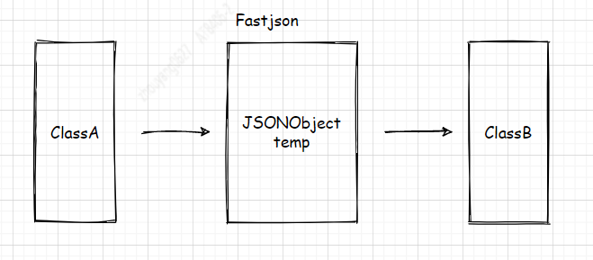
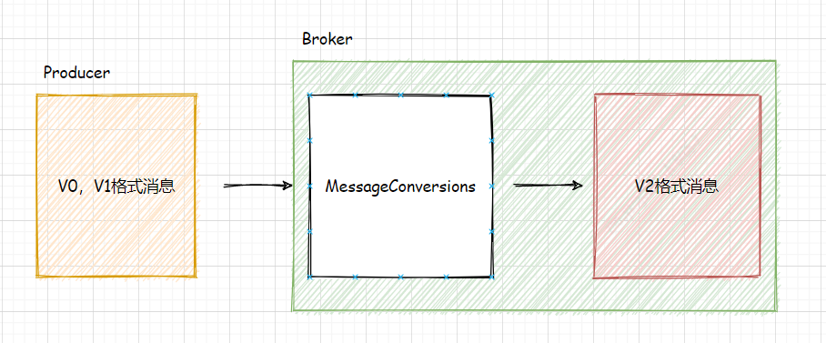
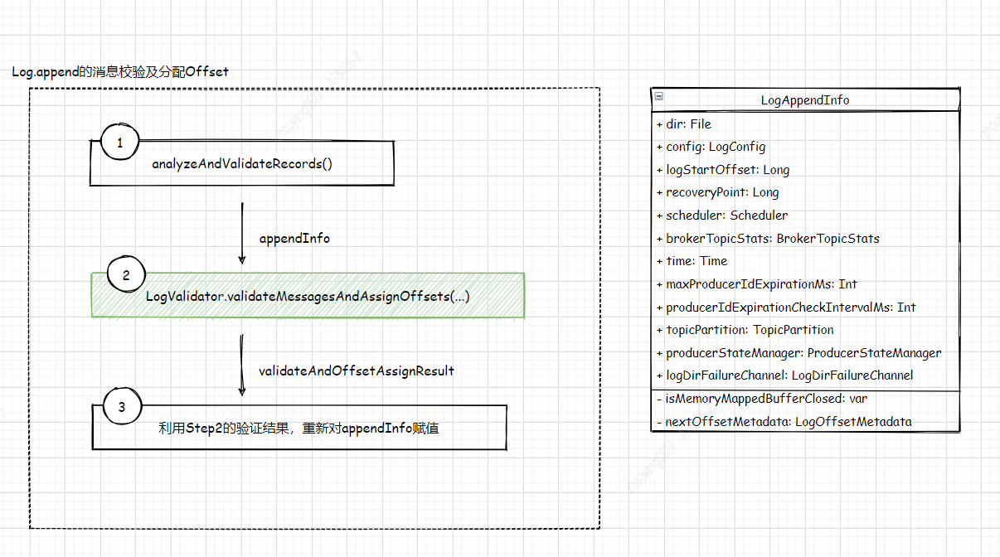
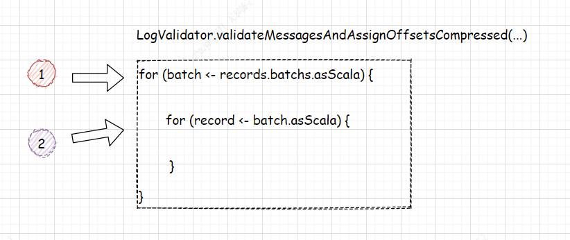

--In Blog
--Tags: Kafka

# Kafka Broker关于处理ProduceRequest的MessageConversions(别忽略它)

> 涉及Kafka是2.2.1版本，Producer(kafka-clients)是0.10.0.0版本并且配置压缩格式为**snappy**

## 1. 前言
在之前的推文["Kafka Broker处理ProduceRequest的过程"](https://mp.weixin.qq.com/s/4siSxGScg1wqI6H7NKLVCw) 中第三章节 **Magic Value**中介绍了Kafka的消息格式的版本发布历程，这篇推文介绍不同版本的差异化。     

**这里提出一个的issue：高版本Kafka Broker如何兼容低版本的produceRequest?** 

## 2. 转换
* 在业务代码中，有时会遇到ClassA的对象使用Fastjson转换成JSONObject temp对象，再将temp转成ClassB(参考图2-1)， 若ClassA的对象字节**较大**，这对于Fastjson的转换来说是耗时的。     
`图2-1`


* 这里可以引出Kafka针对ProduceRequest的消息转换(参考图2-2)，对于Producer来说消息的发送   很多情况下都是批量+压缩，所以若V2以下的消息集**较大**进行解压遍历再压缩转换V2格式的消息集，这同样也是耗时。    
`图2-2`


## 3. LogValidator.validateMessagesAndAssignOffsets(...)
请阅读之前的推文["Kafka Broker处理ProduceRequest的过程"](https://mp.weixin.qq.com/s/4siSxGScg1wqI6H7NKLVCw) ，快速了解它的上下文。 图3-1给出了MessageConversions处理逻辑的地方 **Log.append()方法**，它涉及主要的3个步骤如图3-2，其中 LogValidator.validateMessagesAndAssignOffsets(...)方法，它会涉及到消息的解压和转换。  下面会详细说明validateMessagesAndAssignOffsets()方法的处理过程。    
`图3-1`


`图3-2`


### 3.1 LogValidator.validateMessagesAndAssignOffsets(...)

### *3.1.1 入口*
```java
  private[kafka] def validateMessagesAndAssignOffsets(records: MemoryRecords,
                                                      offsetCounter: LongRef,
                                                      time: Time,
                                                      now: Long,
                                                      sourceCodec: CompressionCodec,
                                                      targetCodec: CompressionCodec,
                                                      compactedTopic: Boolean,
                                                      magic: Byte,
                                                      timestampType: TimestampType,
                                                      timestampDiffMaxMs: Long,
                                                      partitionLeaderEpoch: Int,
                                                      isFromClient: Boolean,
                                                      interBrokerProtocolVersion: ApiVersion): ValidationAndOffsetAssignResult = {
    if (sourceCodec == NoCompressionCodec && targetCodec == NoCompressionCodec) {
     // ...省略部分代码， 假定Producer的压缩格式是snappy
    } else {
      validateMessagesAndAssignOffsetsCompressed(records, offsetCounter, time, now, sourceCodec, targetCodec, compactedTopic,
        magic, timestampType, timestampDiffMaxMs, partitionLeaderEpoch, isFromClient, interBrokerProtocolVersion)
    }
  }
```

### *3.2 LogValidator.validateMessagesAndAssignOffsetsCompressed(...)*
validateMessagesAndAssignOffsetsCompressed()方法,它的功能正如它的名称一样：validate Message And assign Offset。 由于消息是批量发送，请参考**代码3-2-1**、**图3-2-2** 它申明了一个可变数组来存放校验过的消息，用两个for循环遍历消息，最终将record放入可变数组中。  
`代码3-2-1 LogValidator.validateMessagesAndAssignOffsetsCompressed()`
```java
val validatedRecords = new mutable.ArrayBuffer[Record]

for (batch <- records.batches.asScala) {  // AbstractLegacyRecordBatch$BasicLegacyRecordBatch
    // 省略部分代码

    for (record <- batch.asScala) {  // AbstractLegacyRecordBatch$BasicLegacyRecordBatch
      // 省略部分代码

      // No in place assignment situation 4
      if (!record.hasMagic(toMagic))  //AbstractLegacyRecordBatch$BasicLegacyRecordBatch
        inPlaceAssignment = false

      validatedRecords += record
    }
  }
```

`图3-2-2 for循环` 


**3.2.1** 第一个for循环 *records.batches* 将MemoryRecords的ByteBuffer类型的buffer，根据Records.java中(**参考代码3-2-3**) buffer当前的position + SIZE的偏移量(OFFSET_OFFSET+OFFSET_LENGTH)，通过buffer.getInt()固定读取4个长度(SIZE_LENGTH)，。并根据Magic Value判断若大于V1创建DefaultRecrdBatch否则ByteBufferLegacyRecordBatch对象，直到将ByteBuffer读取完(**参考代码3-2-4**)。  

`代码3-2-3 Records`
```java
public interface Records extends BaseRecords {
    int OFFSET_OFFSET = 0;
    int OFFSET_LENGTH = 8;
    int SIZE_OFFSET = OFFSET_OFFSET + OFFSET_LENGTH;
    int SIZE_LENGTH = 4;
    int LOG_OVERHEAD = SIZE_OFFSET + SIZE_LENGTH;

    // the magic offset is at the same offset for all current message formats, but the 4 bytes
    // between the size and the magic is dependent on the version.
    int MAGIC_OFFSET = 16;
    int MAGIC_LENGTH = 1;
    int HEADER_SIZE_UP_TO_MAGIC = MAGIC_OFFSET + MAGIC_LENGTH;
```

`代码3-2-4 ByteBufferLogInputStream.nextBatch()`
```java
public MutableRecordBatch nextBatch() {
    int remaining = buffer.remaining();

    Integer batchSize = nextBatchSize();
    if (batchSize == null || remaining < batchSize)
        return null;

    byte magic = buffer.get(buffer.position() + MAGIC_OFFSET);

    ByteBuffer batchSlice = buffer.slice();
    batchSlice.limit(batchSize);
    buffer.position(buffer.position() + batchSize);

    if (magic > RecordBatch.MAGIC_VALUE_V1)
        return new DefaultRecordBatch(batchSlice);
    else {
        return new AbstractLegacyRecordBatch.ByteBufferLegacyRecordBatch(batchSlice);
    }
}
```

>在本文的第一行就已经特别说明Producer的version是0.10.0.0 且Magic Value=1

**3.2.2** 根据章节3.2.1 第一个for循环会得到**ByteBufferLegacyRecordBatch类型的 batch**, 在第二个for循环 *batch.asScala*，batch继承了AbstractLegacyRecordBatch


`源码3.2.1`
```java
val validatedRecords = new mutable.ArrayBuffer[Record]

for (batch <- records.batches.asScala) {  // AbstractLegacyRecordBatch$BasicLegacyRecordBatch
    // 省略部分代码

    for (record <- batch.asScala) {  // AbstractLegacyRecordBatch$BasicLegacyRecordBatch
      // 省略部分代码

      // No in place assignment situation 4
      if (!record.hasMagic(toMagic))  //AbstractLegacyRecordBatch$BasicLegacyRecordBatch
        inPlaceAssignment = false

      validatedRecords += record
    }
  }
```


>**图3-2**涉及到的2次for循环， 第一次的for是实现Iterator<T>接口, 第二次的for是实现Iterable<T>接口。

#### 3.2.1 batch <- records.batches.asScala
因为Producer(kafka-clients)是0.10.0.0版本 所以 batch的类型是 `AbstractLegacyRecordBatch.ByteBufferLegacyRecordBatch`
```java

// records: MemoryRecords
private final Iterable<MutableRecordBatch> batches = this::batchIterator;

//--------------------------------------------------------------------------

// records.batches
@Override
public AbstractIterator<MutableRecordBatch> batchIterator() {
    return new RecordBatchIterator<>(new ByteBufferLogInputStream(buffer.duplicate(), Integer.MAX_VALUE));
}

//--------------------------------------------------------------------------

// logInputStream的派生类 ByteBufferLogInputStream, 重写makeNext()方法。
RecordBatchIterator(LogInputStream<T> logInputStream) {
    this.logInputStream = logInputStream;
}

@Override
protected T makeNext() {
    try {
        T batch = logInputStream.nextBatch(); // ByteBufferLogInputStream
        if (batch == null)
            return allDone();
        return batch;
    } catch (IOException e) {
        throw new KafkaException(e);
    }
}

//--------------------------------------------------------------------------

// 根据nextBatchSize的字节大小，读取ByteBuffer数据并且根据Magic Value值创建 MutableRecordBatch的派生类。
public MutableRecordBatch nextBatch() {
    int remaining = buffer.remaining();

    Integer batchSize = nextBatchSize();
    if (batchSize == null || remaining < batchSize)
        return null;

    byte magic = buffer.get(buffer.position() + MAGIC_OFFSET);

    ByteBuffer batchSlice = buffer.slice();
    batchSlice.limit(batchSize);
    buffer.position(buffer.position() + batchSize);

    if (magic > RecordBatch.MAGIC_VALUE_V1)
        return new DefaultRecordBatch(batchSlice);
    else 
        return new AbstractLegacyRecordBatch.ByteBufferLegacyRecordBatch(batchSlice);
}
```

#### 3.2.2 record <- batch.asScala
由**章节3.2.2**可知 batch的类型是 `AbstractLegacyRecordBatch.ByteBufferLegacyRecordBatch`， 根据下面的类图得知 ByteBufferLegacyRecordBatch继承父类AbstractLegacyRecordBatch的iterator()方法，所以 
`类图3-2-2`


`AbstractLegacyRecordBatch.iterator()`
```java
@Override
public Iterator<Record> iterator() {
    return iterator(BufferSupplier.NO_CACHING);
}

private CloseableIterator<Record> iterator(BufferSupplier bufferSupplier) {
    if (isCompressed())
        return new DeepRecordsIterator(this, false, Integer.MAX_VALUE, bufferSupplier);
    
    // ...省略部分代码
}
    
```

#### 3.2.3 DeepRecordsIterator


**DeepRecordsIterator()构造方法**


校验
1.判断MagicValue是否在(0,1) 范围内
2.V0,V1格式的消息不支持ZSTD压缩
3.Record的value()不能为null

解压


数据容器
this.innerEntries = new ArrayDeque<>();


**DataLogInputStream.nextBatch()**

do {
    int bytesRead = inputStream.read(array, initialOffset + totalBytesRead, length - totalBytesRead);
    if (bytesRead == -1)
        break;
    totalBytesRead += bytesRead;
} while (length > totalBytesRead);

读取size大小


**makeNext()**


## 3. 

| No. | DESCRIPTION      |    MBEAN NAME | NORMAL VALUE  |
| --- | :-------- | --------:| :--: |
| 1. | Temporary memory size in bytes  | kafka.network:type=RequestMetrics,name=TemporaryMemoryBytes,request={Produce\Fetch} |  Temporary memory used for message format conversions and decompression.  |
| 2. | Message conversion time     |   	kafka.network:type=RequestMetrics,name=MessageConversionsTimeMs,request={Produce\Fetch} |  Time in milliseconds spent on message format conversions.  |
| 3. | Message conversion rate      | kafka.server:type=BrokerTopicMetrics,name={Produce|Fetch}MessageConversionsPerSec,topic=([-.\w]+) | Number of records which required message format conversion.  |


