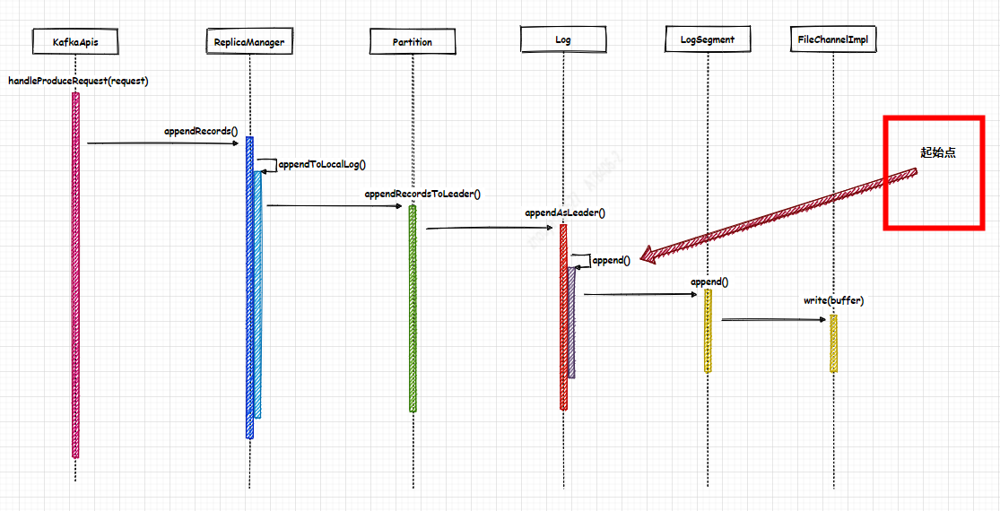

--In Blog
--Tags: Kafka

# Kafka Broker如何兼容低版本的produceRequest

> 涉及Kafka是2.2.1版本，Producer(kafka-clients)是0.10.0.0版本并且配置压缩格式为**snappy**，在这里提它的原因是后面相关compression的逻辑都是遵循压缩的处理场景,毕竟批量+压缩+序列化是优化网络传输法宝。

## 1. 前言
在之前的推文["Kafka Broker处理ProduceRequest的过程"](https://mp.weixin.qq.com/s/4siSxGScg1wqI6H7NKLVCw) 中第三章节 **Magic Value**中介绍了Kafka的消息格式的版本发布历程，这篇推文介绍不同版本的差异化。 **所以这里提出一个很有价值的issue：高版本Kafka Broker如何兼容低版本的produceRequest?** 

## 2. Kafka Message和Message Format


## 3. Log.append(...)
请阅读之前的推文["Kafka Broker处理ProduceRequest的过程"](https://mp.weixin.qq.com/s/4siSxGScg1wqI6H7NKLVCw) ，快速了解它的上下文。
`下图标识出起始点：`  


>接下来主要说明的地方是： LogValidator.validateMessagesAndAssignOffsets(...)


### 3.1 LogValidator.validateMessagesAndAssignOffsets(...)

**3.1.1 入口**
```java
/**
   * Update the offsets for this message set and do further validation on messages including:
   * 1. Messages for compacted topics must have keys
   * 2. When magic value >= 1, inner messages of a compressed message set must have monotonically increasing offsets
   *    starting from 0.
   * 3. When magic value >= 1, validate and maybe overwrite timestamps of messages.
   * 4. Declared count of records in DefaultRecordBatch must match number of valid records contained therein.
   *
   * This method will convert messages as necessary to the topic's configured message format version. If no format
   * conversion or value overwriting is required for messages, this method will perform in-place operations to
   * avoid expensive re-compression.
   *
   * Returns a ValidationAndOffsetAssignResult containing the validated message set, maximum timestamp, the offset
   * of the shallow message with the max timestamp and a boolean indicating whether the message sizes may have changed.
   */
  private[kafka] def validateMessagesAndAssignOffsets(records: MemoryRecords,
                                                      offsetCounter: LongRef,
                                                      time: Time,
                                                      now: Long,
                                                      sourceCodec: CompressionCodec,
                                                      targetCodec: CompressionCodec,
                                                      compactedTopic: Boolean,
                                                      magic: Byte,
                                                      timestampType: TimestampType,
                                                      timestampDiffMaxMs: Long,
                                                      partitionLeaderEpoch: Int,
                                                      isFromClient: Boolean,
                                                      interBrokerProtocolVersion: ApiVersion): ValidationAndOffsetAssignResult = {
    if (sourceCodec == NoCompressionCodec && targetCodec == NoCompressionCodec) {
     // ...省略部分代码， 假定Producer的压缩格式是snappy
    } else {
      validateMessagesAndAssignOffsetsCompressed(records, offsetCounter, time, now, sourceCodec, targetCodec, compactedTopic,
        magic, timestampType, timestampDiffMaxMs, partitionLeaderEpoch, isFromClient, interBrokerProtocolVersion)
    }
  }
```


### 3.2 LogValidator.validateMessagesAndAssignOffsetsCompressed(...)

```java
val validatedRecords = new mutable.ArrayBuffer[Record]

for (batch <- records.batches.asScala) {  // AbstractLegacyRecordBatch$BasicLegacyRecordBatch
    // 省略部分代码

    for (record <- batch.asScala) {  // AbstractLegacyRecordBatch$BasicLegacyRecordBatch
      // 省略部分代码

      // No in place assignment situation 4
      if (!record.hasMagic(toMagic))  //AbstractLegacyRecordBatch$BasicLegacyRecordBatch
        inPlaceAssignment = false

      validatedRecords += record
    }
  }
```

`图3-2 for循环` 


>**图3-2**涉及到的2次for循环， 第一次的for是实现Iterator<T>接口, 第二次的for是实现Iterable<T>接口。

#### 3.2.1 batch <- records.batches.asScala
因为Producer(kafka-clients)是0.10.0.0版本 所以 batch的类型是 `AbstractLegacyRecordBatch.ByteBufferLegacyRecordBatch`
```java

// records: MemoryRecords
private final Iterable<MutableRecordBatch> batches = this::batchIterator;

//--------------------------------------------------------------------------

// records.batches
@Override
public AbstractIterator<MutableRecordBatch> batchIterator() {
    return new RecordBatchIterator<>(new ByteBufferLogInputStream(buffer.duplicate(), Integer.MAX_VALUE));
}

//--------------------------------------------------------------------------

// logInputStream的派生类 ByteBufferLogInputStream, 重写makeNext()方法。
RecordBatchIterator(LogInputStream<T> logInputStream) {
    this.logInputStream = logInputStream;
}

@Override
protected T makeNext() {
    try {
        T batch = logInputStream.nextBatch(); // ByteBufferLogInputStream
        if (batch == null)
            return allDone();
        return batch;
    } catch (IOException e) {
        throw new KafkaException(e);
    }
}

//--------------------------------------------------------------------------

// 根据nextBatchSize的字节大小，读取ByteBuffer数据并且根据Magic Value值创建 MutableRecordBatch的派生类。
public MutableRecordBatch nextBatch() {
    int remaining = buffer.remaining();

    Integer batchSize = nextBatchSize();
    if (batchSize == null || remaining < batchSize)
        return null;

    byte magic = buffer.get(buffer.position() + MAGIC_OFFSET);

    ByteBuffer batchSlice = buffer.slice();
    batchSlice.limit(batchSize);
    buffer.position(buffer.position() + batchSize);

    if (magic > RecordBatch.MAGIC_VALUE_V1)
        return new DefaultRecordBatch(batchSlice);
    else 
        return new AbstractLegacyRecordBatch.ByteBufferLegacyRecordBatch(batchSlice);
}
```

#### 3.2.2 record <- batch.asScala
由**章节3.2.2**可知 batch的类型是 `AbstractLegacyRecordBatch.ByteBufferLegacyRecordBatch`， 根据下面的类图得知 ByteBufferLegacyRecordBatch继承父类AbstractLegacyRecordBatch的iterator()方法，所以 
`类图3-2-2`


`AbstractLegacyRecordBatch.iterator()`
```java
@Override
public Iterator<Record> iterator() {
    return iterator(BufferSupplier.NO_CACHING);
}

private CloseableIterator<Record> iterator(BufferSupplier bufferSupplier) {
    if (isCompressed())
        return new DeepRecordsIterator(this, false, Integer.MAX_VALUE, bufferSupplier);
    
    // ...省略部分代码
}
    
```

#### 3.2.3 DeepRecordsIterator


**DeepRecordsIterator()构造方法**


校验
1.判断MagicValue是否在(0,1) 范围内
2.V0,V1格式的消息不支持ZSTD压缩
3.Record的value()不能为null

解压


数据容器
this.innerEntries = new ArrayDeque<>();


**DataLogInputStream.nextBatch()**


**makeNext()**


