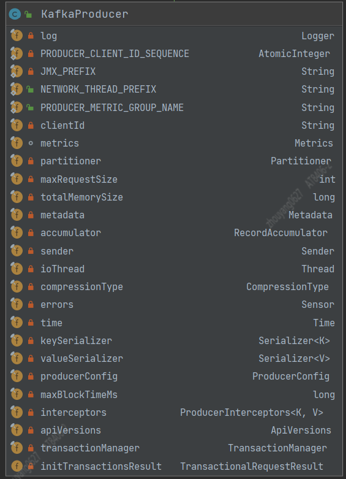
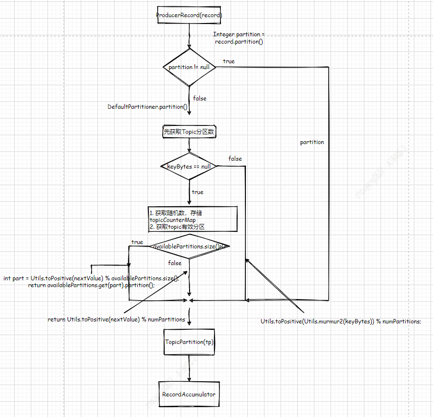
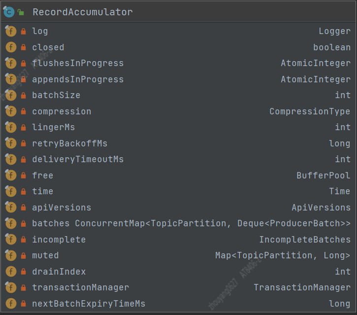

--In Blog
--Tags: Kafka

# Kafka Producer 了解多少?

>涉及Kafka是2.2.1版本

`关键字`
**1.** retries：重试次数    
**2.** batch.size: 发送批次的最大字节数     
**3.** compression.type：消息压缩格式   
**4.** linger.ms：延迟发送毫秒数    
**5.** buffer.memory：消息缓冲区的字节大小      
**6.** request.timeout.ms：发送消息的超时时间   
**7.** max.block.ms：缓存区申请内存块的阻塞时间     
**8** max.inflight.requests：socket发送管道最大个数     

`文章脉络`
1. 介绍Producer架构？
2. 通过Producer源码讲解"配置参数"在发送流程中承接的上下文含义？
3. Producer的"配置参数"该怎么优化？
4. Producer遇到的问题？
5. 我们常用的重试机制是怎么实现？
6. 利用单元测试各个击破？

Kafka的send Record(s)是由Producer来完成的， 而Producer的架构"详细"讲解对于我来说，确实还无法面面俱到，但同时了解Producer的工作原理对于我优化及排查问题是最好的方法，接下来我通过"示例"作为引线来介绍Producer。

`示例`
```java
public static void main(String[] args) throws InterruptedException {
    Properties properties = new Properties();
    properties.put("bootstrap.servers", "xxxxxxxx");
    properties.put("retries", 2); 
    properties.put("batch.size", "1048576"); 
    properties.put("compression.type", "snappy");
    properties.put("linger.ms", "5"); 
    properties.put("buffer.memory", "67108864"); 
    properties.put("key.serializer", "org.apache.kafka.common.serialization.StringSerializer");
    properties.put("value.serializer", "org.apache.kafka.common.serialization.StringSerializer");
    Producer<String, String> producer = new KafkaProducer<String, String>(properties);
    Long i = 0L;
    while (true) {
        producer.send(new ProducerRecord<String, String>("test01", i.toString()), new Callback() {
            @Override
            public void onCompletion(RecordMetadata recordMetadata, Exception e) {
                if (null == recordMetadata) {
                    e.printStackTrace();
                }
            }
        });
        Thread.currentThread().sleep(1000L);
        System.out.println(i);
        i++;
    }
}
```
>面向对象编程，类的职责单一

## 发送消息的整体流程
通过示例代码了解发送消息整体流程是：        
**1.** 通过Producer的properties参数，构造KafkaProducer      
**2.** 将要发送的消息构建成 ProducerRecord      
**3.** 调用send()方法，并且增加异步回调方法来处理消息发送返回结果状态       

###  通过Producer的properties参数，构造KafkaProducer + 将发送消息构建成 ProducerRecord
先利用IDEA的"Diagram"了解KafkaProducer有哪些field   
`重要的field`
```java
private final Partitioner partitioner;
private final RecordAccumulator accumulator;
private final Serializer<K> keySerializer;
private final Serializer<V> valueSerializer;
private final ProducerInterceptors<K, V> interceptors;
private final Sender sender;
private final Thread ioThread;
private final CompressionType compressionType;
private final TransactionManager transactionManager;(事务相关后面对详细介绍)
```



KafkaProducer在构造方法中创建 "拦截器"、"序列化器"、"分区器"、"消息累加器"、"NetworkClient + Send线程" 等等

**1.** ProducerInterceptors 拦截器  
**2.** Serializer Key，Value的序列化器
**3.** Partitioner partitioner


1.1 拦截器的用法
```java
properties.put("interceptor.classes","定义拦截器的class的路径名")
```


1.2 producer执行send()方式，会将ProducerRecord先去执行配置的拦截器集合的onSend()方法，并且返回重新装配的ProducerRecord(若没有，则什么都不做)        
```java
@Override
public Future<RecordMetadata> send(ProducerRecord<K, V> record, Callback callback) {
    ProducerRecord<K, V> interceptedRecord = this.interceptors.onSend(record);
    return doSend(interceptedRecord, callback);
}
```

1.3 这里拿Kafka源码中的单元测试 `MockProducerInterceptor.java`来说明        
```java
@Override
public ProducerRecord<String, String> onSend(ProducerRecord<String, String> record) {
    //记录发送的条数
    ONSEND_COUNT.incrementAndGet();
    //并且在原来的消息中 追加 appendStr的值("mock.interceptor.append"),这样的话，后面要发给Kafka Broker的消息都统一的加上了 "mock.interceptor.append"后缀
    return new ProducerRecord<>(
            record.topic(), record.partition(), record.key(), record.value().concat(appendStr));
}
```
**2.** 序列化器

2.1 将要发送的ProducerRecord对象中的Key，Value序列化,并append到 ProducerBatch中
>注意 ProducerRecord类是提供给用户封装消息的，但Producer只是简单取值，无其他用处

2.2 Kafka自身提供诸如String、ByteArray、ByteBuffer、Bytes、Double、Integer、Long这些类型的Serializer， 若用户不能满足需求也可以选择如Avro、Json、Thrift、ProtoBuf或者Protostuff等通用的序列化工具来实现，也可以使用自定义类型的Serializer来实现。

2.3 序列化 一方面是为了存储在磁盘中，另一个作用是Clients将消息传输给Brokers， 优秀的序列化方式可以减少网络传输的字节大小和节省文件存储大小

**3.** 分区器   

3.1 分区器的用法
```java
properties.put("partitioner.class","定义拦截器的class的路径名")
```   

`分区流程图`


3.2 Partitioner的处理逻辑(默认实现DefaultPartitioner.java)   
Partitioner会根据ProducerRecord的Key是否为null，使用随机数+1对分区个数取余获取指定的Partition， 将Partition值放入新的TopicPartition对象，再根据Partition存储到指定的队列的累加器中。 分区器其实是`软负载`的一种实现方式,Kafka分区写入负载默认是`RoundRobin`(轮询)算法
```java
//DefaultPartitioner.java  partition()方法
public int partition(String topic, Object key, byte[] keyBytes, Object value, byte[] valueBytes, Cluster cluster) {
    List<PartitionInfo> partitions = cluster.partitionsForTopic(topic);
    int numPartitions = partitions.size();
    if (keyBytes == null) {
        int nextValue = nextValue(topic);
        List<PartitionInfo> availablePartitions = cluster.availablePartitionsForTopic(topic);
        if (availablePartitions.size() > 0) {
            int part = Utils.toPositive(nextValue) % availablePartitions.size();
            return availablePartitions.get(part).partition();
        } else {
            // no partitions are available, give a non-available partition
            return Utils.toPositive(nextValue) % numPartitions;
        }
    } else {
        // hash the keyBytes to choose a partition
        return Utils.toPositive(Utils.murmur2(keyBytes)) % numPartitions;
    }
}

//将获取的partition，放入TopicPartition对象 "tp"中
int partition = partition(record, serializedKey, serializedValue, cluster);
tp = new TopicPartition(record.topic(), partition);

//"tp"追加到accumulator，追加到指定分区号的队列中
RecordAccumulator.RecordAppendResult result = accumulator.append(tp, timestamp, serializedKey,
                    serializedValue, headers, interceptCallback, remainingWaitMs);

Deque<ProducerBatch> dq = getOrCreateDeque(tp);

private Deque<ProducerBatch> getOrCreateDeque(TopicPartition tp) {
    Deque<ProducerBatch> d = this.batches.get(tp);
    if (d != null)
        return d;
    d = new ArrayDeque<>();
    Deque<ProducerBatch> previous = this.batches.putIfAbsent(tp, d);
    if (previous == null)
        return d;
    else
        return previous;
}

```

3.3 单元测试 DefaultPartitionerTest.java
测试用例提供了3个方法：testKeyPartitionIsStable() 测试固定Key值，固定分区发送、testRoundRobinWithUnavailablePartitions() 存在不可用分区，发送时候，如何保证发送的是可用分区、testRoundRobin() 测试RoundRobin(轮询算法)


### 调用send()方法，并且增加异步回调方法来处理消息发送返回结果状态(先忽略开启事务)
在KafkaProducer.doSend()方法中 `核心`代码涉及以下核心类：       

**1.** RecordAccumulator accumulator 消息累加器     
**2.** Sender sender (包含NetworkClient)        
**3.** Thread ioThread 发送线程     

```java
RecordAccumulator.RecordAppendResult result = accumulator.append(tp, timestamp, serializedKey,
                    serializedValue, headers, interceptCallback, remainingWaitMs);
if (result.batchIsFull || result.newBatchCreated) {
    log.trace("Waking up the sender since topic {} partition {} is either full or getting a new batch", record.topic(), partition);
    this.sender.wakeup();
}
return result.future;
```

1.1 RecordAccumulator的数据结构
先利用IDEA的"Diagram"了解RecordAccumulator有哪些field   
`重要的field`
```java
private final AtomicInteger flushesInProgress;
private final AtomicInteger appendsInProgress;
private final int batchSize;
private final CompressionType compression;
private final int lingerMs;
private final long retryBackoffMs;
private final int deliveryTimeoutMs;
private final BufferPool free;
private final Time time;
private final ConcurrentMap<TopicPartition, Deque<ProducerBatch>> batches;
private final IncompleteBatches incomplete;
// The following variables are only accessed by the sender thread, so we don't need to protect them.
private final Map<TopicPartition, Long> muted;
private int drainIndex;
```



RecordAccumulator是消息的累加器，所以fields中更在意的数据存储的容器:       
**1.** free = new BufferPool(...);  
```java
this.free=new BufferPool(this.totalMemorySize, config.getInt(ProducerConfig.BATCH_SIZE_CONFIG), metrics, time, PRODUCER_METRIC_GROUP_NAME)
```

1.2 BufferPool的数据结构
先利用IDEA的"Diagram"了解BufferPool有哪些field   
`重要的field`
```java
private final long totalMemory;
private final int poolableSize;
private final ReentrantLock lock;
private final Deque<ByteBuffer> free;
private final Deque<Condition> waiters;
/** Total available memory is the sum of nonPooledAvailableMemory and the number of byte buffers in free * poolableSize.  */
private long nonPooledAvailableMemory;
private final Metrics metrics;
private final Time time;
private final Sensor waitTime;
```


Deque容器为一个给定类型的元素进行线性处理，像向量一样，它能够快速地随机访问任一个元素，并且能够高效地插入和删除容器的尾部元素。但它又与vector不同，deque支持高效插入和删除容器的头部元素，因此也叫做双端队列


**2.** ConcurrentMap<TopicPartition, Deque<ProducerBatch>> batches容器


## 


`可能会出现的超时`
**1.** java.lang.Exception: Failed to send data to Kafka: Failed to allocate memory within the configured max blocking time 60000 ms.
**2.** java.lang.Exception: Failed to send data to Kafka: Expiring [XXXXX] record(s) for [Topic]-[Partition]:120000 ms has passed since batch creation


https://cwiki.apache.org/confluence/display/KAFKA/KIP-91+Provide+Intuitive+User+Timeouts+in+The+Producer