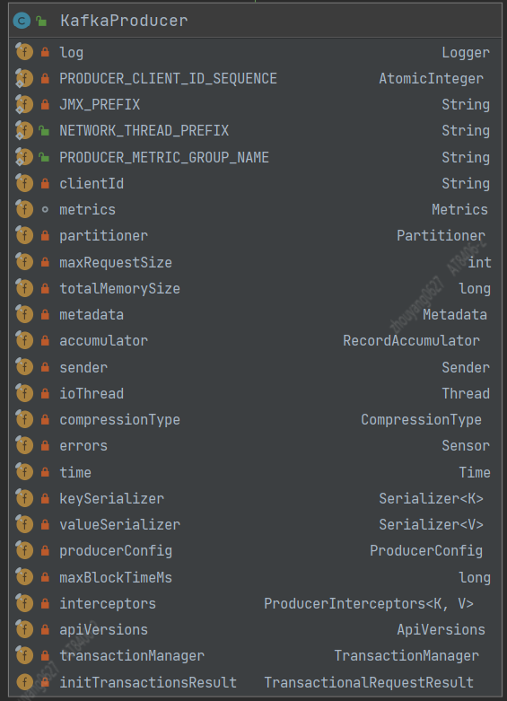

--In Blog
--Tags: Kafka

# Kafka Producer-拦截器,序列化器,分区器

>涉及Kafka是2.2.1版本

`关键字`      
**1.** private final ProducerInterceptors<K, V> interceptors; 拦截器对象
**2.** private final Partitioner partitioner; 分区器对象

Kafka的send Record(s)是由Producer来完成的， 而Producer的架构"详细"讲解对于我来说，确实还无法面面俱到，但同时了解Producer的工作原理对于我优化及排查问题是最好的方法，接下来我通过"示例"作为引线来介绍Producer相关的组件。

`示例`
```java
public static void main(String[] args) throws InterruptedException {
    Properties properties = new Properties();
    properties.put("bootstrap.servers", "xxxxxxxx");
    properties.put("retries", 2); 
    properties.put("batch.size", "1048576"); 
    properties.put("compression.type", "snappy");
    properties.put("linger.ms", "20"); 
    properties.put("buffer.memory", "67108864"); 
    properties.put("key.serializer", "org.apache.kafka.common.serialization.StringSerializer");
    properties.put("value.serializer", "org.apache.kafka.common.serialization.StringSerializer");
    Producer<String, String> producer = new KafkaProducer<String, String>(properties);
    Long i = 0L;
    while (true) {
        producer.send(new ProducerRecord<String, String>("test01", i.toString()), new Callback() {
            @Override
            public void onCompletion(RecordMetadata recordMetadata, Exception e) {
                if (null == recordMetadata) {
                    e.printStackTrace();
                }
            }
        });
        Thread.currentThread().sleep(1000L);
        System.out.println(i);
        i++;
    }
}
```
>面向对象编程，类的职责单一

## 发送消息的整体流程
通过示例代码了解发送消息整体流程是：        
**1.** 通过Producer的properties参数，构造KafkaProducer      
**2.** 将要发送的消息构建成 ProducerRecord      
**3.** 调用send()方法，并且增加异步回调方法来处理消息发送返回结果状态       

###  通过Producer的properties参数，构造KafkaProducer + 将发送消息构建成 ProducerRecord
先利用IDEA的"Diagram"了解KafkaProducer有哪些field   
`重要的field`
```java
private final Partitioner partitioner;
private final RecordAccumulator accumulator;
private final Serializer<K> keySerializer;
private final Serializer<V> valueSerializer;
private final ProducerInterceptors<K, V> interceptors;
private final Sender sender;
private final Thread ioThread;
private final CompressionType compressionType;
private final TransactionManager transactionManager;(事务相关后面对详细介绍)
```



KafkaProducer在构造方法中创建 "拦截器"、"序列化器"、"分区器"、"消息累加器"、"NetworkClient + Send线程" 等等

**1.** ProducerInterceptors 拦截器  
**2.** Serializer Key，Value的序列化器
**3.** Partitioner partitioner 分区器


1.1 拦截器的用法
```java
properties.put("interceptor.classes","定义拦截器的class的路径名")
```


1.2 producer执行send()方式，会将ProducerRecord先去执行配置的拦截器集合的onSend()方法，并且返回重新装配的ProducerRecord(若没有，则什么都不做)        
```java
@Override
public Future<RecordMetadata> send(ProducerRecord<K, V> record, Callback callback) {
    ProducerRecord<K, V> interceptedRecord = this.interceptors.onSend(record);
    return doSend(interceptedRecord, callback);
}
```

1.3 这里拿Kafka源码中的单元测试 `MockProducerInterceptor.java`来说明        
```java
@Override
public ProducerRecord<String, String> onSend(ProducerRecord<String, String> record) {
    //记录发送的条数
    ONSEND_COUNT.incrementAndGet();
    //并且在原来的消息中 追加 appendStr的值("mock.interceptor.append"),这样的话，后面要发给Kafka Broker的消息都统一的加上了 "mock.interceptor.append"后缀
    return new ProducerRecord<>(
            record.topic(), record.partition(), record.key(), record.value().concat(appendStr));
}
```

1.4 拦截器的实现：根据配置的类的路径名，通过反射实例化对象 `return c.getDeclaredConstructor().newInstance();`  
学习Demo:  https://github.com/xinzhuxiansheng/javamain-services/blob/main/javamain-kafkaClient/src/main/java/com/javamain/kafkaClient/reflect/TestMain.java

**2.** 序列化器

2.1 将要发送的ProducerRecord对象中的Key，Value序列化,并append到 ProducerBatch中
>注意 ProducerRecord类是提供给用户封装消息的，但Producer只是简单取值，无其他用处

2.2 Kafka自身提供诸如String、ByteArray、ByteBuffer、Bytes、Double、Integer、Long这些类型的Serializer， 若用户不能满足需求也可以选择如Avro、Json、Thrift、ProtoBuf或者Protostuff等通用的序列化工具来实现，也可以使用自定义类型的Serializer来实现。

2.3 序列化 一方面是为了存储在磁盘中，另一个作用是Clients将消息传输给Brokers， 优秀的序列化方式可以减少网络传输的字节大小和节省文件存储大小

2.4 序列化工具jar，太多也太优秀，在开发中，都是直接拿过来用即可

**3.** 分区器   

3.1 分区器的用法
```java
properties.put("partitioner.class","定义拦截器的class的路径名")
```   

`分区流程图`


3.2 Partitioner的处理逻辑(默认实现DefaultPartitioner.java)   
Partitioner会根据ProducerRecord的Key是否为null，使用随机数+1对分区个数取余获取指定的Partition， 将Partition值放入新的TopicPartition对象，再根据Partition存储到指定的队列的累加器中。 分区器其实是`软负载`的一种实现方式,Kafka分区写入负载默认是`RoundRobin`(轮询)算法
```java
//DefaultPartitioner.java  partition()方法
public int partition(String topic, Object key, byte[] keyBytes, Object value, byte[] valueBytes, Cluster cluster) {
    List<PartitionInfo> partitions = cluster.partitionsForTopic(topic);
    int numPartitions = partitions.size();
    if (keyBytes == null) {
        int nextValue = nextValue(topic);
        List<PartitionInfo> availablePartitions = cluster.availablePartitionsForTopic(topic);
        if (availablePartitions.size() > 0) {
            int part = Utils.toPositive(nextValue) % availablePartitions.size();
            return availablePartitions.get(part).partition();
        } else {
            // no partitions are available, give a non-available partition
            return Utils.toPositive(nextValue) % numPartitions;
        }
    } else {
        // hash the keyBytes to choose a partition
        return Utils.toPositive(Utils.murmur2(keyBytes)) % numPartitions;
    }
}

//将获取的partition，放入TopicPartition对象 "tp"中
int partition = partition(record, serializedKey, serializedValue, cluster);
tp = new TopicPartition(record.topic(), partition);

//"tp"追加到accumulator，追加到指定分区号的队列中
RecordAccumulator.RecordAppendResult result = accumulator.append(tp, timestamp, serializedKey,
                    serializedValue, headers, interceptCallback, remainingWaitMs);

Deque<ProducerBatch> dq = getOrCreateDeque(tp);

private Deque<ProducerBatch> getOrCreateDeque(TopicPartition tp) {
    Deque<ProducerBatch> d = this.batches.get(tp);
    if (d != null)
        return d;
    d = new ArrayDeque<>();
    Deque<ProducerBatch> previous = this.batches.putIfAbsent(tp, d);
    if (previous == null)
        return d;
    else
        return previous;
}

```

3.3 单元测试 DefaultPartitionerTest.java
测试用例提供了3个方法：testKeyPartitionIsStable() 测试固定Key值，固定分区发送、testRoundRobinWithUnavailablePartitions() 存在不可用分区，发送时候，如何保证发送的是可用分区、testRoundRobin() 测试RoundRobin(轮询算法)

3.4 软负载经常是面对1:n的场景，`轮询`是我们业务场景最常用的软负载，它最大的缺点是 当个别服务或者机器出现不稳定，则轮询到它的节点的请求，会产生积压。 
`下面介绍几种软负载`
* 随机数
实现简单，当调用次数过少，Random产生的随机数可能会比较集中，这样会出现个别机器的请求次数会明显多于其他机器。不过当调用量越大，请求分布约均匀。
* 轮询
实现简单，若出现服务或者机器不稳定，容易出现请求积压，服务繁忙的问题
* 一致性Hash(ConsistentHashLoadBalance)
相同参数的请求总是发到同一提供者，当某一台提供者挂时，原本发往该提供者的请求，基于虚机节点，平摊到其他提供者，不会引起剧烈变动
参考Dubbo：https://github.com/apache/dubbo/blob/576b3abbe4ad73ab7aad666ab405691b7aff707e/dubbo-cluster/src/main/java/org/apache/dubbo/rpc/cluster/loadbalance/ConsistentHashLoadBalance.java
* 最少活跃调用数(LeastActiveLoadBalance)
最少活跃调用数，相同活跃数的随机，活跃数指调用前后计数差；使慢的提供者收到更少请求，因为越慢的提供者的调用前后计数差会越大
参考Dubbo： https://github.com/apache/dubbo/blob/576b3abbe4ad73ab7aad666ab405691b7aff707e/dubbo-cluster/src/main/java/org/apache/dubbo/rpc/cluster/loadbalance/LeastActiveLoadBalance.java
* 最短时间调用数(ShortestResponseLoadBalance)
预估出来每个处理完请求的提供者所需时间，然后又选择最少最短时间的提供者进行调用
参考Dubbo：https://github.com/apache/dubbo/blob/576b3abbe4ad73ab7aad666ab405691b7aff707e/dubbo-cluster/src/main/java/org/apache/dubbo/rpc/cluster/loadbalance/ShortestResponseLoadBalance.java

>若debug，可以调试各个负载类的单元测试类