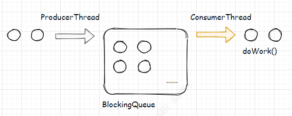
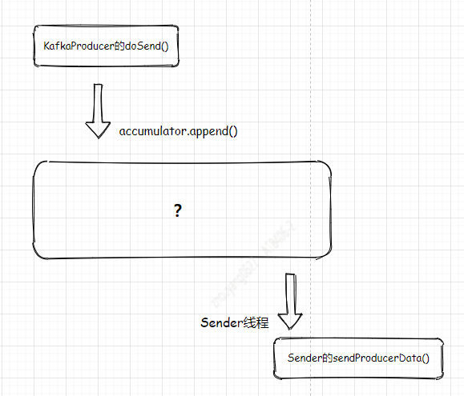
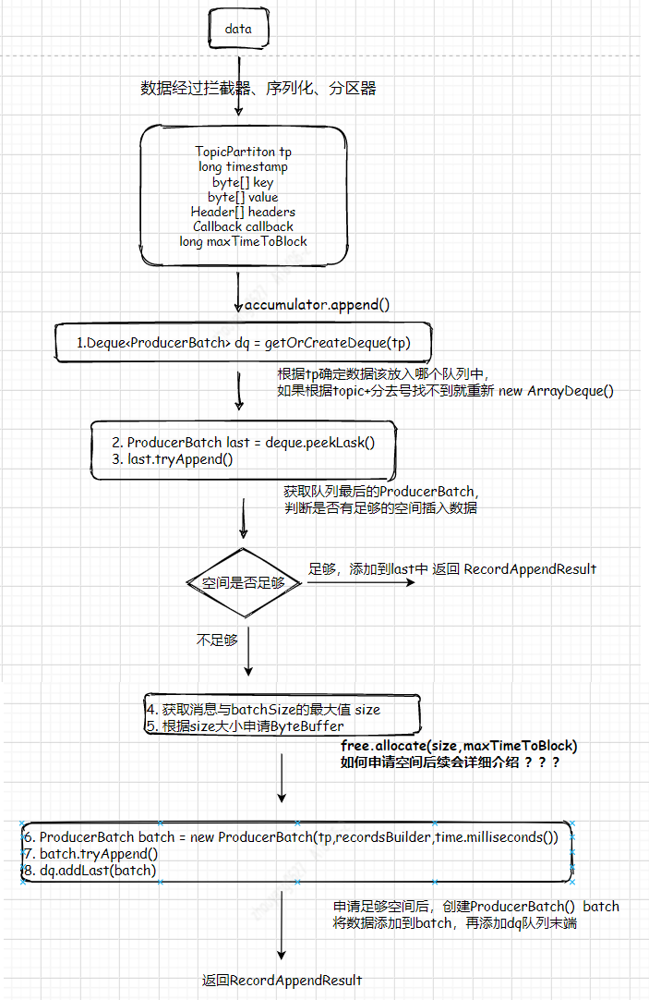
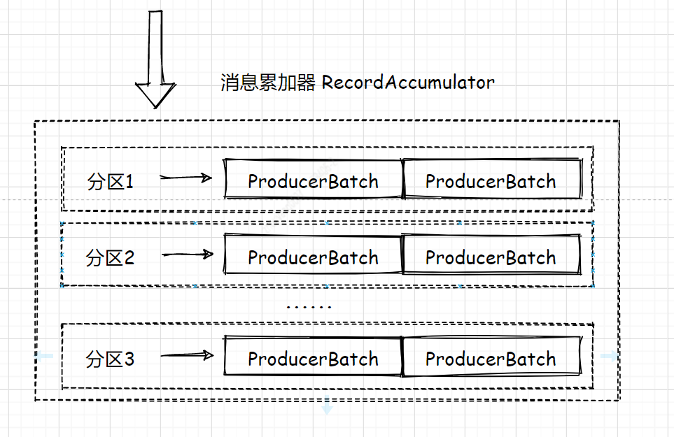
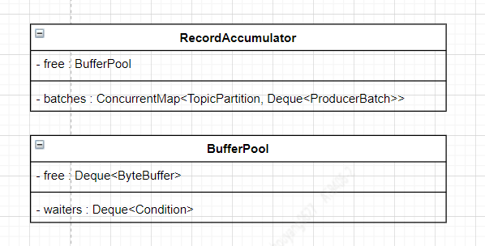

--In Blog
--Tags: Kafka

# Kafka Producer-消息累加器

>涉及Kafka是2.2.1版本

在没有说到消息累加器之前，这里先阐述一个经常会用到的场景"异步处理"或者"削峰"
## 异步处理

这里有两个线程分别是ProducerThread、ConsumerThread，有一个队列是BlockingQueue，ProducerThread的任务是将接受到的数据丢到队列中而ConsumerThread的任务消费队列中的数据去做逻辑处理。   
假设这个队列足够大，并且不阻塞，这样的话，ProducerThread只会把时间消耗在接受到更多的数据，并不会让上游一直处于阻塞状态，由于ConsumerThread是独立的线程并不会阻塞ProducerThread，所以我们只要提高ConsumerThread处理能力，尽可能让队列处理`未满`状态。写和读是并行处理的，所以这种方式也叫做`削峰`。     

**其实，Kafka的Producer也不例外**   

## 容器-消息累加器(Accumulator)

Producer线程的doSend()与Sender线程的sendProducerData()也是同样并行的处理，Producer的Accumulator作用于上面的BlockQueue的一样都是`数据容器`。只是Accumulator的比BlockingQueue的结构要复杂的多。   
`下面就探讨下 数据是如何存储在Accumulator里面的？`


**Accumulator追加消息的流程图**      

`说明点`    
**1.** 发送数据时，创建的ProducerRecord对象经过拦截器，序列化，分区器后拆分 key，value，headers。tp对象存储的数据要发送的Topic和分区号。    
**2.** Acumulator用到的队列是 Deque<T> dp = new ArrayDeque();   
**3.** 流程图中的4,5 是如何申请的内存？ 
假设ByteBuffer足够大或者Sender线程消费数据足够快？ 看来现实与`骨感`。


**Accumulator结构图**      

`首先讨论下几个问题？`        
**3.1** 向free申请ByteBuffer的时候，为什么要计算batchSize与消息两者的最大字节数？       
**3.2** RecordAccumulator中的append()的形参maxTimeToBlock作用？     
**3.3** RecordAccumulator中的append()调用了3次 tryAppend()， 如果第一的tryAppend()返回空间不够，但是已经申请好了ByteBuffer，第二次的调用是为了什么？            

下面是申请ByteBuffer的方法调用：
```java
//获取 batchSize和消息两者最大的字节数
//maxTimeToBlock是 max.block.ms的参数值
int size = Math.max(this.batchSize, AbstractRecords.estimateSizeInBytesUpperBound(maxUsableMagic, compression, key, value, headers));
log.trace("Allocating a new {} byte message buffer for topic {} partition {}", size, tp.topic(), tp.partition());
buffer = free.allocate(size, maxTimeToBlock);
```     
下面是free相关的类的类图

有free相关类的依赖关系，接着看 free.allocate()方法  
```java
public ByteBuffer allocate(int size, long maxTimeToBlockMs) throws InterruptedException {
    if (size > this.totalMemory)
        throw new IllegalArgumentException("Attempt to allocate " + size
                                            + " bytes, but there is a hard limit of "
                                            + this.totalMemory
                                            + " on memory allocations.");

    ByteBuffer buffer = null;
    this.lock.lock();
    try {
        // 标记点@1
        // check if we have a free buffer of the right size pooled
        if (size == poolableSize && !this.free.isEmpty())
            return this.free.pollFirst();

        // now check if the request is immediately satisfiable with the
        // memory on hand or if we need to block
        // 标记点@2
        int freeListSize = freeSize() * this.poolableSize;
        if (this.nonPooledAvailableMemory + freeListSize >= size) {
            // we have enough unallocated or pooled memory to immediately
            // satisfy the request, but need to allocate the buffer
            freeUp(size);
            this.nonPooledAvailableMemory -= size;
        } else {
            // 标记点@3
            // we are out of memory and will have to block
            int accumulated = 0;
            Condition moreMemory = this.lock.newCondition();
            try {
                long remainingTimeToBlockNs = TimeUnit.MILLISECONDS.toNanos(maxTimeToBlockMs);
                this.waiters.addLast(moreMemory);
                // loop over and over until we have a buffer or have reserved
                // enough memory to allocate one
                while (accumulated < size) {
                    long startWaitNs = time.nanoseconds();
                    long timeNs;
                    boolean waitingTimeElapsed;
                    try {
                        waitingTimeElapsed = !moreMemory.await(remainingTimeToBlockNs, TimeUnit.NANOSECONDS);
                    } finally {
                        long endWaitNs = time.nanoseconds();
                        timeNs = Math.max(0L, endWaitNs - startWaitNs);
                        recordWaitTime(timeNs);
                    }

                    if (waitingTimeElapsed) {
                        throw new TimeoutException("Failed to allocate memory within the configured max blocking time " + maxTimeToBlockMs + " ms.");
                    }

                    remainingTimeToBlockNs -= timeNs;

                    // check if we can satisfy this request from the free list,
                    // otherwise allocate memory
                    if (accumulated == 0 && size == this.poolableSize && !this.free.isEmpty()) {
                        // just grab a buffer from the free list
                        buffer = this.free.pollFirst();
                        accumulated = size;
                    } else {
                        // we'll need to allocate memory, but we may only get
                        // part of what we need on this iteration
                        freeUp(size - accumulated);
                        int got = (int) Math.min(size - accumulated, this.nonPooledAvailableMemory);
                        this.nonPooledAvailableMemory -= got;
                        accumulated += got;
                    }
                }
                // Don't reclaim memory on throwable since nothing was thrown
                accumulated = 0;
            } finally {
                // When this loop was not able to successfully terminate don't loose available memory
                this.nonPooledAvailableMemory += accumulated;
                this.waiters.remove(moreMemory);
            }
        }
    } finally {
        // signal any additional waiters if there is more memory left
        // over for them
        try {
            if (!(this.nonPooledAvailableMemory == 0 && this.free.isEmpty()) && !this.waiters.isEmpty())
                this.waiters.peekFirst().signal();
        } finally {
            // Another finally... otherwise find bugs complains
            lock.unlock();
        }
    }

    if (buffer == null)
        return safeAllocateByteBuffer(size);
    else
        return buffer;
}
```
**@1** 判断要申请的size与`poolableSize`是否相等，并且free队列是否存在可用空间。        
从free类图及下面两个类的构造函数知晓 poolableSize= ProducerConfig.BATCH_SIZE_CONFIG的值，也就是batch.size的参数值       
```java
//RecordAccumulator的构造函数
this.accumulator = new RecordAccumulator(logContext,
                    //...省略无用代码
                    new BufferPool(this.totalMemorySize, config.getInt(ProducerConfig.BATCH_SIZE_CONFIG), metrics, time, PRODUCER_METRIC_GROUP_NAME));
//BufferPool的构造函数
public BufferPool(long memory, int poolableSize, Metrics metrics, Time time, String metricGrpName) {
        this.poolableSize = poolableSize;
        //...省略无用代码
    }
```
BufferPool的free是Deque<ByteBuffer> free = new ArrayDeque(); free队列指的是大小已经申请好了，但是没有用的队列。重点：这里一定要结合上面提到3次的tryAppend()的第二次。当ByteBuffer空间申请好了，还是tryAppend()，若第二次成功后，那么申请的空间就存在free队列中，用于下一次的使用。注意看 finally逻辑，当buffer!=null时，并且判断buffer的size等于batchSize时候，就添加到free队列中去，为了空间最大化复用。       
`这里解答了3.3 提出来的问题`

```java
public RecordAppendResult append(TopicPartition tp,
                                     long timestamp,
                                     byte[] key,
                                     byte[] value,
                                     Header[] headers,
                                     Callback callback,
                                     long maxTimeToBlock) throws InterruptedException {
    //...省略代码
    try {
        //...省略代码
        // we don't have an in-progress record batch try to allocate a new batch
        byte maxUsableMagic = apiVersions.maxUsableProduceMagic();
        int size = Math.max(this.batchSize, AbstractRecords.estimateSizeInBytesUpperBound(maxUsableMagic, compression, key, value, headers));
        log.trace("Allocating a new {} byte message buffer for topic {} partition {}", size, tp.topic(), tp.partition());
        buffer = free.allocate(size, maxTimeToBlock);
        synchronized (dq) {
            // Need to check if producer is closed again after grabbing the dequeue lock.
            if (closed)
                throw new KafkaException("Producer closed while send in progress");

            RecordAppendResult appendResult = tryAppend(timestamp, key, value, headers, callback, dq);
            if (appendResult != null) {
                // Somebody else found us a batch, return the one we waited for! Hopefully this doesn't happen often...
                return appendResult;
            }
        //...省略代码
        }
    } finally {
        if (buffer != null)
            free.deallocate(buffer);
        appendsInProgress.decrementAndGet();
    }
}
```

**@2** 剩余空间和 = freeListSize+nonPooledAvailableMemory,若 nonPooledAvailableMemory空间大小无法装下ByteBuffer的size，就将free队列的空间释放，而this.free.pollLast()是删除队列末尾，一直到free空间为空或者 nonPooledAvailableMemory空间大小大于申请ByteBuffer的size
```java
if (this.nonPooledAvailableMemory + freeListSize >= size) {
    // we have enough unallocated or pooled memory to immediately
    // satisfy the request, but need to allocate the buffer
    freeUp(size);
    this.nonPooledAvailableMemory -= size;
}

//this.free.pollLast() 删除队列末尾，一直free空间为空或者 nonPooledAvailableMemory空间大小大于ByteBuffer的size
private void freeUp(int size) {
    while (!this.free.isEmpty() && this.nonPooledAvailableMemory < size)
        this.nonPooledAvailableMemory += this.free.pollLast().capacity();
}
```

**@3** 剩余空间和 < ByteBuffer的size，这里使用重入锁ReentrantLock，它是一种递归无阻塞的同步机制，不过具体细节还请自行了解，这里不过多篇幅介绍。这里只是比 @2 增加了锁和while (accumulated < size), 而while循环的break有2个条件，第一个是 accumulated>size ,第二个是 等待时间超过 maxTimeToBlockMs，会报出 `throw new TimeoutException`  。      
`这里解答了3.2 提出来的问题`

```java
if (waitingTimeElapsed) {
    throw new TimeoutException("Failed to allocate memory within the configured max blocking time " + maxTimeToBlockMs + " ms.");
}
```

经过上面的代码分析，至于 3.1的问题:向free申请ByteBuffer的时候，为什么要计算batchSize与消息两者的最大字节数？ 
`下面是本人的理解，若有不同，请留言告诉我`      
这里的目的是： 增设一个标准的ByteBuffer的大小，最好是能容纳下多条消息。这样会2个好处：1 不用每条消息都去申请ByteBuffer，毕竟申请内存是耗时的；2 第二次的tryAppend()，毕竟申请内存是阻塞的方法，发送消息是并行的，必然会经常出现申请好内存后，数据队列的数据已经发送了，队列是空闲的。所以又重新tryAppend()
                


`可能会出现的超时`
**1.** java.lang.Exception: Failed to send data to Kafka: Failed to allocate memory within the configured max blocking time 60000 ms.
**2.** java.lang.Exception: Failed to send data to Kafka: Expiring [XXXXX] record(s) for [Topic]-[Partition]:120000 ms has passed since batch creation


https://cwiki.apache.org/confluence/display/KAFKA/KIP-91+Provide+Intuitive+User+Timeouts+in+The+Producer