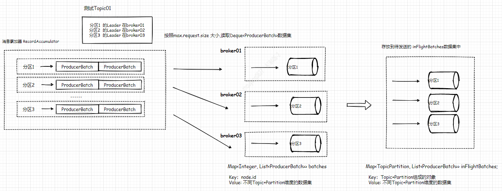

--In Blog
--Tags: Kafka

# Kafka Broker的Leader Epoch

>涉及Kafka是2.2.1版本

## 1. Sender线程的定义
在KafkaProducer的构造方法中会启动一个守护线程`KafkaThread` 称为Sender线程，线程名称为"kafka-producer-network-thread|"+clientId，通过创建Sender对象来处理该线程的run()方法。 它负责从RecordAccumulator中获取消息并将其发送到Kafka Broker中。
```java
this.sender = newSender(logContext, kafkaClient, this.metadata);
String ioThreadName = NETWORK_THREAD_PREFIX + " | " + clientId;
this.ioThread = new KafkaThread(ioThreadName, this.sender, true);
this.ioThread.start();
```

## 2. KafkaThread与Sender的关系
**2.1.** KafkaThread 继承了Thread，并且在自身的构造方法中，调用了父类的构造方法
```java
public KafkaThread(final String name, Runnable runnable, boolean daemon) {
    super(runnable, name);
    configureThread(name, daemon);
}
```     
**2.2** Sender 实现了 Runnable的run()。创建KafkaThread对象将Sender对象赋值给父类Thread的`target`字段
```java
 private Runnable target;
```

## 3. Sender的run()
当KafkaThread的守护线程启动后，会执行Sender的run()方法，进入while(running)循环。当running=true时，会循环执行runOnce()。接下来我们来了解runOnce()方法。          
**runOnce()**
在runOnce()方法大篇幅的涉及到事务(Transaction)的逻辑处理,后续会推送Kafka的Producer事务的讲解，这里就不过多阐述。 除事务相关，只剩下3行代码。
`接下来，重点分析前2行代码，client.poll()涉及到Java NIO知识，博主对java NIO知识缺乏，对Kafka的网络通信梳理不够仔细，这里避免误导大家，先跳过这块介绍，后面会补充这里`
```java
void runOnce() {
    if (transactionManager != null) {
        //...省略事务处理逻辑
    }

    long currentTimeMs = time.milliseconds();
    long pollTimeout = sendProducerData(currentTimeMs);
    client.poll(pollTimeout, currentTimeMs);
}
```

### 4. long currentTimeMs = time.milliseconds()
time是接口，而它的派生类是 SystemTime，所以在Kafka的源码中涉及time.milliseconds(),只是为了获取当前时间戳(long)
```java
@Override
public long milliseconds() {
    return System.currentTimeMillis();
}
```

`由于代码篇幅过长，之前的推文粘贴大部分代码，并且在代码中增加标记点, 紧接着下面会通过标记点来讲解每段代码的逻辑， 博主发现，代码片断过多整合在一起，代码与讲解文字离的太远，无法让读者有很好的阅读体验。所以这里调整为 代码拆成小片断，每个小片段统一加上片断所属的方法名,并且将每个小片断再加上 步骤编号`      

>面向对象编程、查看方法注释     

### 5. long pollTimeout = sendProducerData(currentTimeMs)
之前我在讲解MemoryRecordsBuilder的推文中涉及到 sendProducerData()方法，在这里再详细的补充这里面的处理逻辑。         

*5.1 Sender.sendProducerData() : step01* 
```java
Cluster cluster = metadata.fetch();
// get the list of partitions with data ready to send
RecordAccumulator.ReadyCheckResult result = this.accumulator.ready(cluster, now);
```

**Step01**:     
根据RecordAccumulator的batches集合，遍历判断是否存在分区副本的Leader为unknow的集合和ProducerBatch数据已经准备好可以发送的Nodes。    
*5.1.1.* batches的数据结构是 ConcurrentMap<TopicPartition, Deque<ProducerBatch>>， so batches的Keys包含了topic和partition信息  
*5.1.2.* 子项中的value，都读取Deque队列中的第一个元素，根据多种因素来判断第一个元素是否可以发送。   
它判断的标准是：是否存在数据或者buffer满了、ProducerBatch延迟发送时间linger.ms或者重试间隔、RecordAccumulator关闭状态等     
这里特意说明到 "linger.ms"与是否重试及重试间隔时间的判断。所以适当增加linger.ms，可以提高Producer发送性能。当然也必须承受延迟发送所带来的风险。    
```java
boolean backingOff = batch.attempts() > 0 && waitedTimeMs < retryBackoffMs;
long timeToWaitMs = backingOff ? retryBackoffMs : lingerMs;
```

--- 
*5.2 Sender.sendProducerData() : step02* 
```java
// if there are any partitions whose leaders are not known yet, force metadata update
if (!result.unknownLeaderTopics.isEmpty()) {
    // The set of topics with unknown leader contains topics with leader election pending as well as
    // topics which may have expired. Add the topic again to metadata to ensure it is included
    // and request metadata update, since there are messages to send to the topic.
    for (String topic : result.unknownLeaderTopics)
        this.metadata.add(topic);

    log.debug("Requesting metadata update due to unknown leader topics from the batched records: {}",
        result.unknownLeaderTopics);
    this.metadata.requestUpdate();
}
```

**Step02**: 根据未知Leader的分区个数，判断是否要需要标记更新元数据

--- 
*5.3 Sender.sendProducerData() : step03* 
```java
// remove any nodes we aren't ready to send to
Iterator<Node> iter = result.readyNodes.iterator();
long notReadyTimeout = Long.MAX_VALUE;
while (iter.hasNext()) {
    Node node = iter.next();
    if (!this.client.ready(node, now)) {
        iter.remove();
        notReadyTimeout = Math.min(notReadyTimeout, this.client.pollDelayMs(node, now));
    }
}
```

**Step03**: 遍历`Step01`所获取的可以发送数据Nodes，将网络连接不可用的Node移除，并且根据当前时间计算等待连接建立的时间间隔，so 这段时间会一直处于未准备状态(notReady)，ready()方法里面涉及到KafkaChannel的注册到Selector。

--- 
*5.4 Sender.sendProducerData() : step04* 
```java
// create produce requests
Map<Integer, List<ProducerBatch>> batches = this.accumulator.drain(cluster, result.readyNodes, this.maxRequestSize, now);
addToInflightBatches(batches);
if (guaranteeMessageOrder) {  // yzhou max.in.flight.requests.per.connection 判断是否 == 1
    // Mute all the partitions drained
    for (List<ProducerBatch> batchList : batches.values()) {
        for (ProducerBatch batch : batchList)
            this.accumulator.mutePartition(batch.topicPartition);
    }
}
```

**Step04**:     
**drain()流程图**      

*5.4.1.* drain()方法根据已经准备好Nodes来获取消息累加器中的数据集，这里传入的maxRequestSize是Producer的max.request.size参数值。     
* RecordAccumulator.drainBatchesForOneNode(Cluster cluster, Node node, int maxSize, long now)方法 首先获取Node下的所有分区的Leader，遍历每个Leader的PartitionInfo构造TopicPartition获取消息累加器的Deque数据集，这里特别注意 deque.peekFirst()和deque.pollFirst()。peekFirst()获取队列的第一个元素，若队列是空是返回null，但不会删除元素，它是用来判断当前ProducerBatch发生重试时，是否达到重试间隔时间和判断已经读取队列的数据大小+当前ProducerBatch字节的和是否大于要求的maxRequestSize。pollFirst()将经过之前的判断可以读取队列的第一个元素并且从队列删除它，添加到ready队列中。 size变量是用来累加发送的ProducerBatch集合的字节大小。

*5.4.2* addToInflightBatches()方法将从消息累加器中读取的数据集，放入要发送的数据集中 Map<TopicPartition, List<ProducerBatch>> inFlightBatches 。        


*5.4.3* guaranteeMessageOrder 它是Producer的max.in.flight.requests.per.connection参数与1的判断结果

Kafka 可以保证同一个分区中的消息是有序的。如果生产者按照一定的顺序发送消息，那么这些消息也会顺序地写入分区，进而消费者也可以按照同样的顺序消费它们。但Producer发送消息过程发生重试时，而max.in.flight.requests.per.connection参数配置为大于1的值，那么就会出现错序的现象：如果第一批次消息写入失败，而第二批次消息写入成功，那么生产者会重试发送第一批次的消息，此时如果第一批次的消息写入成功，那么这两个批次的消息就出现了错序。一般而言，在需要保证消息顺序的场合建议把参数max.in.flight.requests.per.connection配置为1。


--- 
*5.5 Sender.sendProducerData() : step05* 
```java
accumulator.resetNextBatchExpiryTime();
List<ProducerBatch> expiredInflightBatches = getExpiredInflightBatches(now);
List<ProducerBatch> expiredBatches = this.accumulator.expiredBatches(now);
expiredBatches.addAll(expiredInflightBatches);
```

**Step05**:     
从待发送的数据集inflightBatches中获取过期数据集，从消息累加器中获取过期数据集。在2.2.x版本中，Producer默认的重试次数为Long.MAX_VALUE,其实这样的数值不合理，所以在这里引入了"delivery.timeout.ms"参数，它默认时间是120s。 这里可以参考`Kafka KIP-91` https://cwiki.apache.org/confluence/display/KAFKA/KIP-91+Provide+Intuitive+User+Timeouts+in+The+Producer


--- 
*5.6 Sender.sendProducerData() : step06* 
```java
if (!expiredBatches.isEmpty())
    log.trace("Expired {} batches in accumulator", expiredBatches.size());
for (ProducerBatch expiredBatch : expiredBatches) {
    String errorMessage = "Expiring " + expiredBatch.recordCount + " record(s) for " + expiredBatch.topicPartition
        + ":" + (now - expiredBatch.createdMs) + " ms has passed since batch creation";
    failBatch(expiredBatch, -1, NO_TIMESTAMP, new TimeoutException(errorMessage), false);
    if (transactionManager != null && expiredBatch.inRetry()) {
        // This ensures that no new batches are drained until the current in flight batches are fully resolved.
        transactionManager.markSequenceUnresolved(expiredBatch.topicPartition);
    }
}
sensors.updateProduceRequestMetrics(batches);
```

**Step06**:     
*5.6.1* failBatch()根据已过期的ProducerBatch 来处理以下逻辑:    
* 处理当前过期ProducerBatch的回调结果 ProduceRequestResult,并且设置超时异常 `new TimeoutException(errorMessage)`。
* 在待发送的inflightBatches将ProducerBatch移除
* 在消息累加器RecordAccumulator中释放缓存空间，若ProducerBatch的ByteBuffer大小等于batch.size大小，就将buffer清除并直接添加到空闲的free队列中。 在之前的关于消息累加器的推文中说到，free是已申请标准空间大小，但未使用的缓存队列。若不等于batch.size大小，会将ByteBuffer大小添加到 除free空间外可用的nonPooledAvailableMemory中。

*5.6.2* sensors.updateProduceRequestMetrics(batches); 将已读取的batches相关Metrics更新到sensors中。     

--- 
*5.7 Sender.sendProducerData() : step07* 
```java
long pollTimeout = Math.min(result.nextReadyCheckDelayMs, notReadyTimeout);
pollTimeout = Math.min(pollTimeout, this.accumulator.nextExpiryTimeMs() - now);
pollTimeout = Math.max(pollTimeout, 0);
if (!result.readyNodes.isEmpty()) {
    log.trace("Nodes with data ready to send: {}", result.readyNodes);
    //... 省略注释
    pollTimeout = 0;
}
```

**Step07**:     
当node节点已准备，就会立即发送数据，若没有就等待，具体等待时间要比较 connection重新建联的等待时间，消息累加器的数据过期时间，以及边界值问题。 `这里的逻辑 请参考Selector.select()`  
*5.7.1 Selector.select()*
在kafka的源码，这样的时间大小判断，在经常不过了，它存在不同维度的数据时间临界值。 当上面的 pollTimeout=0时，会告诉nioSelector立即发送，其他则通过等待node节点建立连接。所以这里提出等待时间重叠，减少因为等待时间不合理问题，导致其他数据过期问题。 
```java
/**
    * Check for data, waiting up to the given timeout.
    *
    * @param timeoutMs Length of time to wait, in milliseconds, which must be non-negative
    * @return The number of keys ready
    */
private int select(long timeoutMs) throws IOException {
    if (timeoutMs < 0L)
        throw new IllegalArgumentException("timeout should be >= 0");

    if (timeoutMs == 0L)
        return this.nioSelector.selectNow();
    else
        return this.nioSelector.select(timeoutMs);
}
```


--- 
*5.8 Sender.sendProducerData() : step08* 
```java
//Map<Integer, List<ProducerBatch>> batches
sendProduceRequests(batches, now);
```

**Step08**:     
batches的数据结构是Map<Integer,List<ProducerBatch>> ，key是node id(brokerId) value是每个节点待发送的数据集，sendProducerRequests方法遍历节点集合，根据List<ProducerBatch>数据集以Topic+Parition为key，将ProducerBatch的MemoryRecordsBuilder用来构建MemoryRecords对象，存入Map<TopicPartition, MemoryRecords> produceRecordsByPartition对象中; 这里可以参考之前的推文 [Kafka Producer的MemoryRecordsBuilder 别忽略它](https://mp.weixin.qq.com/s/Bb1rtJwFRWw7YyCwA66E0w) ,这里面介绍了 MemoryRecordsBuilder构建ProducerRequest的过程。

>博主对java NIO知识缺乏，对Kafka的网络通信梳理不够仔细，这里避免误导大家，先跳过这块介绍，后面会补充这里。  

*5.8.1* NetworkClient.doSend()方法讲解
```java
private void doSend(ClientRequest clientRequest, boolean isInternalRequest, long now, AbstractRequest request) {
    String destination = clientRequest.destination();
    RequestHeader header = clientRequest.makeHeader(request.version());
    if (log.isDebugEnabled()) {
        int latestClientVersion = clientRequest.apiKey().latestVersion();
        if (header.apiVersion() == latestClientVersion) {
            log.trace("Sending {} {} with correlation id {} to node {}", clientRequest.apiKey(), request,
                    clientRequest.correlationId(), destination);
        } else {
            log.debug("Using older server API v{} to send {} {} with correlation id {} to node {}",
                    header.apiVersion(), clientRequest.apiKey(), request, clientRequest.correlationId(), destination);
        }
    }
    Send send = request.toSend(destination, header);
    InFlightRequest inFlightRequest = new InFlightRequest(
            clientRequest,
            header,
            isInternalRequest,
            request,
            send,
            now);
    this.inFlightRequests.add(inFlightRequest);
    selector.send(send);
}
```

#### RequestHeader      
**RequestHeader类图**      

* API_KEY_FIELD_NAME: 请求类型,请参考 `AbstractRequest类`中的parseRequest()方法, 发送数据所定义的apikey=PRODUCE;
* API_VERSION_FIELD_NAME: 发送数据的日志版本；
* CLIENT_ID_FIELD_NAME: Producer的client.id参数或者producer 生成的clientId "producer-" + PRODUCER_CLIENT_ID_SEQUENCE.getAndIncrement();
* CORRELATION_ID_FIELD_NAME: 它是这次请求的id，broker端在处理完请求后会把同样的CorrelationId返回，这样Clients端可以把这次的响应与请求对应起来;

#### NetworkSend    
**NetworkSend类图** 
    
下面是NetworkSend对象创建:  
```java
Send send = request.toSend(destination, header);
```
NetworkSend继承了ByteBufferSend类，
* 构造方法中创建4个字节的ByteBuffer，再putInt(size)，写入header的字节大小
* 将新创建的4个字节的ByteBuffer与header ByteBuffer组成 ByteBuffer[]。并且累计两个ByteBuffer剩余的字节大小和(remaining += buffer.remainning)。
* destination是nodeId

#### InFlightRequests   
**InFlightRequests类图**     
    

* maxInFlightRequestsPerConnection 它是Producer的`max.in.flight.requests.per.connection`参数值，默认是5。 根据node节点获取待发送的InFlightRequest数据，
* queue.peekFirst().send.completed()是为了确定队列中的第一个元素的请求是否已经发送完成，如果没有则不继续向这个node发送消息
* queue.size() < this.maxInFlightRequestsPerConnection 为了每个node节点最多只能缓存5个未响应或待发送的请求，超过该数值之后，就不能再向这个node节点发送更多的请求。
```java
public boolean canSendMore(String node) {
    Deque<NetworkClient.InFlightRequest> queue = requests.get(node);
    return queue == null || queue.isEmpty() ||
            (queue.peekFirst().send.completed() && queue.size() < this.maxInFlightRequestsPerConnection);
}
```

* Producer也通过上报InFlightRequests的inFlightRequestCount，收集当前Clients等待响应的请求次数
```java
this.metrics.addMetric(metrics.requestsInFlight, (config, now) -> client.inFlightRequestCount());
```
