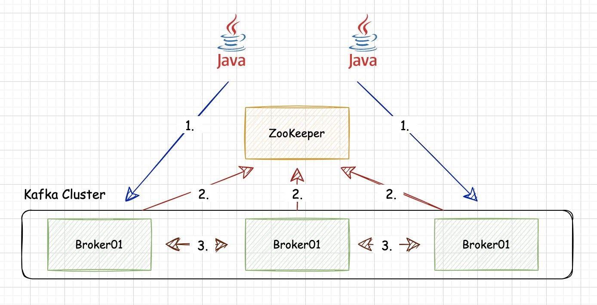

# Kafka 基于SASL/SCRAM动态认证集群部署

## 1. Kafka认证介绍
在企业级Kafka集群存在资源共享方式使用，为了防止出现`乱写，乱读`情况,需要提供有效的权限机制验证客户端的`写，读`是否有权限。避免出现业务脏数据和数据不安全等等。早在Kafka0.9.0.0版本开始，Kafka就推出认证机制，根据Kafka官网介绍Kafka支持SASL的四种认证方式：
* SASL/GSSAPI (Kerberos) - starting at version 0.9.0.0
* SASL/PLAIN - starting at version 0.10.0.0
* SASL/SCRAM-SHA-256 and SASL/SCRAM-SHA-512 - starting at version 0.10.2.0
* SASL/OAUTHBEARER - starting at version 2.0

**对比表格**   
| 认证方式    |   说明 |
| -------- | -------- |
| SASL/GSSAPI  | 主要是给 Kerberos 用户使用的，如果当前已经有了Kerberos认证，只需要给集群中每个Broker和访问用户申请Principals，然后在Kafka的配置文件中开启Kerberos的支持即可 官方参考：[Authentication using SASL/Kerberos](http://kafka.apache.org/documentation/#security_sasl_kerberos) |
| SASL/PLAIN     |  是一种简单的用户名/密码身份验证机制，通常与TLS/SSL一起用于加密，以实现安全身份验证。是一种比较容易使用的方式，但是有一个很明显的缺点，这种方式会把用户账户文件配置到一个静态文件中，每次想要添加新的账户都需要重启Kafka去加载静态文件，才能使之生效，十分的不方便，官方参考：[Authentication using SASL/PLAIN](http://kafka.apache.org/documentation/#security_sasl_plain) |
| SASL/SCRAM(-SHA-256/-SHA-512)      | 通过将认证用户信息保存在 ZooKeeper 里面，从而动态的获取用户信息，相当于把ZK作为一个认证中心使用了。这种认证可以在使用过程中，使用 Kafka 提供的命令动态地创建和删除用户，无需重启整个集群，十分方便。官方参考：[Authentication using SASL/SCRAM](http://kafka.apache.org/documentation/#security_sasl_scram) |
| SASL/OAUTHBEARER      |  kafka 2.0 版本引入的新认证机制，主要是为了实现与 OAuth 2 框架的集成。Kafka 不提倡单纯使用 OAUTHBEARER，因为它生成的不安全的 Json Web Token，必须配以 SSL 加密才能用在生产环境中。官方参考：[Authentication using SASL/OAUTHBEARER](http://kafka.apache.org/documentation/#security_sasl_oauthbearer) |

如果使用SASL/GSSAPI那么需要新搭建Kerberos不太划算；SASL/PLAIN的方式可能会在使用过程中频繁的重启，非常的繁琐；而SASL/OAUTHBEARER属于Kafka新提供的，而且也没有这方面的需求，可以等等市场反应再说。因此综合来说最终选择了SASL/SCRAM的认证方法增强Kafka的安全功能  
`对比信息来自`[该blog](https://blog.csdn.net/Smallc0de/article/details/113866633)   


## 2. 部署基于SASL/SCRAM(-SHA-256/-SHA-512)Kafka集群(v2.7.1)
**集群认证脉络**  
   

Kafka集群认证3种关系：   
1.Client与Broker之间  
2.Broker与ZooKeeper之间   
3.Broker与Broker之间      

### 2.1 ZooKeeper集群配置
ZooKeeper version:3.5.9, 针对集群提供SASL/SCRAM认证机制，并且用户的SCRAM存储在ZooKeeper中(The default SCRAM implementation in Kafka stores SCRAM credentials in Zookeeper and is suitable for use in Kafka installations where Zookeeper is on a private network.)。很多时候ZooKeeper集群是内部访问，所以ZooKeeper集群可以不用开启SASL认证访问。   

>ZooKeeper集群无需SASL配置    

**若需要配置ZooKeeper的SASL，请参考以下操作:** 

* 给zoo.cfg 添加SASL认证,新添加的两行，用来支持SASL认证 
```shell

```

### 2.2 kafka集群配置

**Broker配置kafka_server_jaas.conf**  
在每个broker的服务器上创建jaas文件，尽量将文件放在Kafka的安装包路径内。一定要注意password后面的`;`号不能少。   
`kafka_server_jaas.conf:`  
```shell
kafkaServer {
   org.apache.kafka.common.security.scram.ScramLoginModule required
   username="admin"     // super:user
   password="adminpwd"; // super:user passwordß
};
```

**修改server.properties配置文件**
```shell
#监听地址
listeners=SASL_PLAINTEXT://hostname:9092


#scram相关
sasl.enabled.mechanisms=SCRAM-SHA-256
sasl.mechanism.inter.broker.protocol=SCRAM-SHA-256
#inter.broker.listener.name 只能配置一个，否则报错
security.inter.broker.protocol=SASL_PLAINTEXT
authorizer.class.name=kafka.security.auth.SimpleAclAuthorizer
#此处必须设置false，否则用户直接可以访问
allow.everyone.if.no.acl.found=false
#super.users设置admin，可密码是Kafka管理员自定义的，所以不用担心
super.users=User:admin
```

**修改kafka-server-start.sh启动脚本**   
在kafka-server-start.sh脚本中添加`kafka_server_jaas.conf`文件路径,这里就类似于开启Kafka的JMX_PORT一样
```shell
export KAFKA_OPTS=-Djava.security.auth.login.config=/data/installDirs/kafka_2.13-2.7.1/kafka_server_jaas.conf
export JMX_PORT="9999"
```

>需要注意，针对很多情况需要手动指定jmx的hostname: -Djava.rmi.server.hostname=xxx.xxx.xxx.xxx  

具体修改参考`JMX settings`
```shell
# JMX settings
if [ -z "$KAFKA_JMX_OPTS" ]; then
  KAFKA_JMX_OPTS="-Dcom.sun.management.jmxremote -Djava.rmi.server.hostname=xxx.xxx.xxx.xxx  -Dcom.sun.management.jmxremote.authenticate=false  -Dcom.sun.management.jmxremote.ssl=false "
fi
```

**启动各个Broker节点**

### 2.3 根据SCRAM创建admin用户及密码
```shell
# adminpwd是密码，请根据需要填写即可
./kafka-configs.sh --zookeeper localhost:2181/devtest --alter --add-config 'SCRAM-SHA-256=[password=adminpwd],SCRAM-SHA-512=[password=adminpwd]'  --entity-type users --entity-name admin

# 查看SCRAM证书
./kafka-configs.sh --zookeeper localhost:2181/devtest --describe --entity-type users --entity-name admin
```

**此时配置的super:users已配置好**

## 3. 用户及授权相关脚本操作

### 3.1 SCRAM操作
注意：adminpwd是admin用户的密码，请记住
```shell
# 创建用户
# 脚本不区分普通/超级用户，这里仅通过创建的用户名称与kafka的super:users是否一致即可
./kafka-configs.sh --zookeeper localhost:2181/devtest --alter --add-config 'SCRAM-SHA-256=[password=密码],SCRAM-SHA-512=[password=密码]'  --entity-type users --entity-name [用户名]


# 查看用户，正如上文提到，用户密码是存储在ZooKeeper中
./kafka-configs.sh --zookeeper localhost:2181/devtest --describe --entity-type users --entity-name [用户名]


# 删除用户
# 在创建用户时，分别指定了256/512机密,所以也要注意Client的sasl.mechanism参数是否对应上。
# 若针对即将要删除的用户已经设置ACL权限，这里需要区分认证和授权是独立的，即使设置该用户的授权也可以删除该用户。
./kafka-configs.sh --zookeeper localhost:2181/devtest --alter --delete-config 'SCRAM-SHA-256' --entity-type users --entity-name [用户名]


# 查看所有用户

```

**以上执行结果会在zookeeper上创建/config/users/[用户名]路径**   
内容：  
{"version":1,"config":{"SCRAM-SHA-512":"salt=MTcxbDF6aGNxOWgwajB2ZG1uOW83c3h6bm4=,stored_key=cmc413tGXiD7hFkdZHiVS7WzAUsC+mRQGyazJnC7S4a/w8ZrFuk/0cCsVtvWT13qob3QKJpk/pdWq2ODRMQEHw==,server_key=bcXtlsvRZGNqRBUai1TLWe2BIsOLHhTrunVt1OciDRvX2ZccDxFP7uxVZAa8NAInMkciqFyZB6KS9SxfX1XBug==,iterations=4096","SCRAM-SHA-256":"salt=a3N5aG4xcTRlc2JieGZ6azZzZHAxMmpmZQ==,stored_key=AWAeqyMrcJZfKwk1OD0VeKA63sd6h1IHPLBPhtpqhmg=,server_key=QR8pt51dmlL08Oqp/s2lo7YtqQXofYIN6pACn8eAdog=,iterations=4096"}}

### 3.2 ACL操作
注意`[]`表示参数占位符，针对具体各个参数的含义及设值范围，请详细查看 **./kafka-acls.sh --help**
```shell
# 查看所有权限
./kafka-acls.sh --authorizer-properties zookeeper.connect=localhost:2181/devtest --list


# 写权限
./kafka-acls.sh --authorizer kafka.security.auth.SimpleAclAuthorizer --authorizer-properties zookeeper.connect=localhost:2181/devtest --add --allow-principal User:[用户] --operation [操作] --topic [Topic名称]

# 读权限 区分Topic维度/Group维度


# 1. Topic维度，针对某个用户授权该Topic的读权限，不限制Group，用'*'进行模糊匹配即可
# 此处特别注意 脚本参数 --group ‘*’, 在shell中*需要特殊处理。 一定要注意，要注意，要注意
./kafka-acls.sh --authorizer kafka.security.auth.SimpleAclAuthorizer --authorizer-properties zookeeper.connect=localhost:2181/devtest --add --allow-principal User:[用户] --operation Read --topic [Topic名称] --group '*'


# 2. Group维度 指定明确的消费组名称即可
./kafka-acls.sh --authorizer kafka.security.auth.SimpleAclAuthorizer --authorizer-properties zookeeper.connect=localhost:2181/devtest --add --allow-principal User:[用户] --operation Read --topic [Topic名称] --group [GroupId]


# 删除权限 
./kafka-acls.sh --authorizer-properties zookeeper.connect=localhost:2181/devtest --remove --allow-principal User:[用户] --operation [操作] --topic [Topic名称] 

# 若删除读权限，请加上 --group参数
--group '*' / --group '[明确的Group名称]'

```

