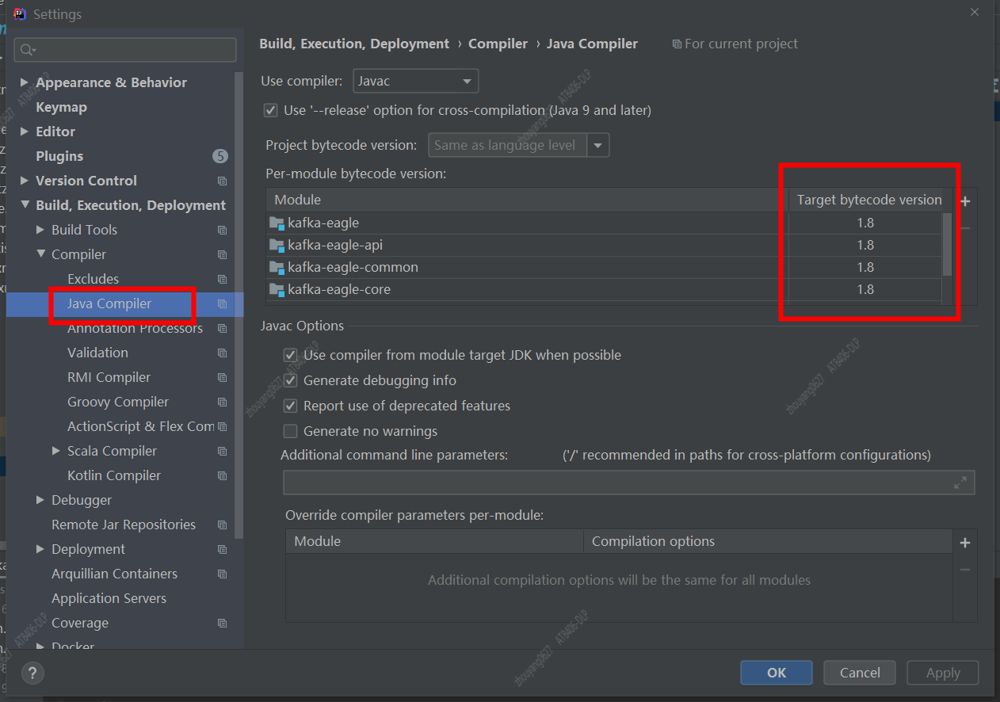
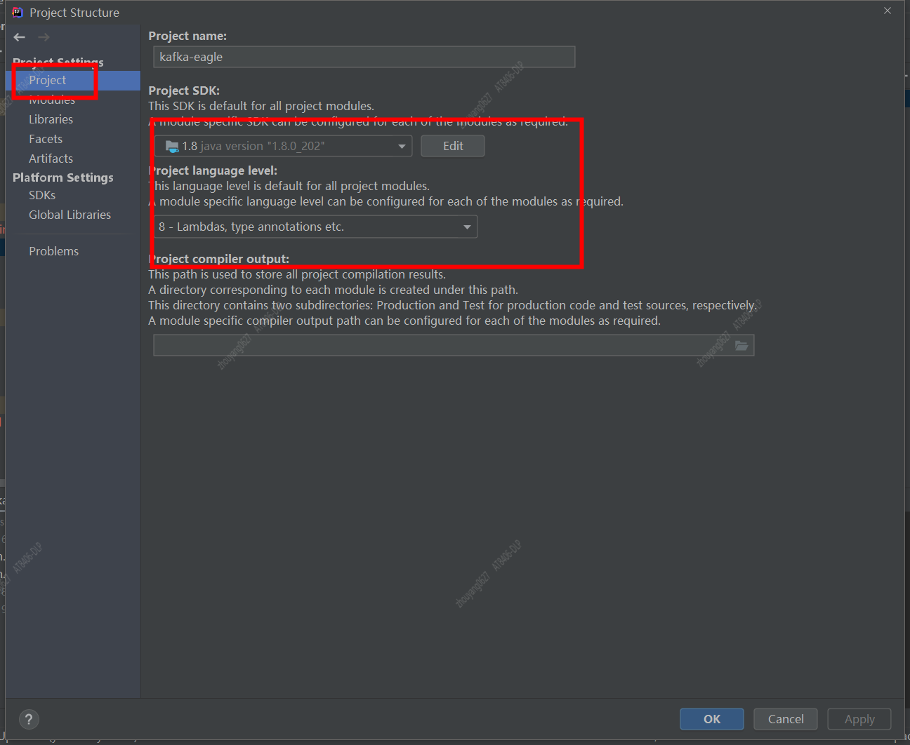
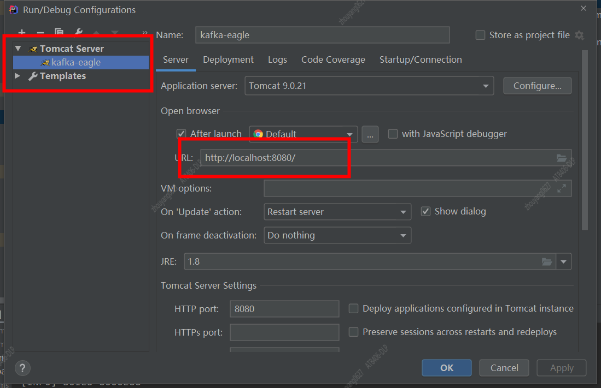
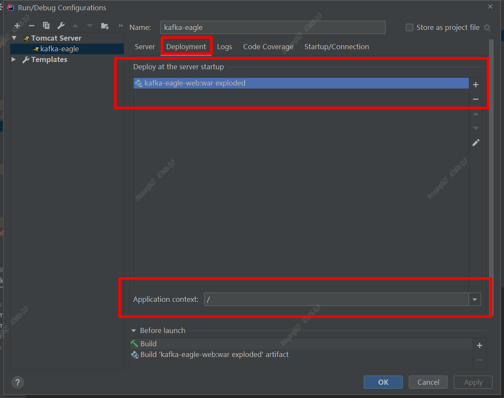

## git clone
```
git clone git@github.com:smartloli/kafka-eagle.git
```
## IDEA 导入eagle

项目的各个模块没有在pom.xml指定jdk编译版本,所以配置或者在pom.xml添加build
1. 指定jdk编译版本
方式一：
打开IDEA的"Settings的 Java Compiler"


方式二： 
在各个模块中添加
```
<build>
        <plugins>
            <plugin>
                <groupId>org.apache.maven.plugins</groupId>
                <artifactId>maven-compiler-plugin</artifactId>
                <version>3.1</version>
                <configuration>
                    <source>1.8</source>
                    <target>1.8</target>
                </configuration>
            </plugin>
        </plugins>
    </build>
```

2. Project Settings 配置
Project 指定1.8


## 配置Tomcat运行环境
1. 新建Tomcat Server

2. 配置Deployment


## eagle配置文件
在debug过程中，使用的是kafka-eagle-common模块下的`system-config.properties`
在部署中，使用的是kafka-eagle-web模块下的，请注意

初步调整的地方: 

1) 配置集群信息
kafka.eagle.zk.cluster.alias=204cluster
204cluster.zk.list=xxx.xxx.66.204:2181/xxxxx

2) 配置mysql
kafka.eagle.driver=com.mysql.cj.jdbc.Driver
kafka.eagle.url=jdbc:mysql://127.0.0.1:3306/ke?useUnicode=true&characterEncoding=UTF-8&zeroDateTimeBehavior=convertToNull&serverTimezone=Asia/Shanghai
kafka.eagle.username=root
kafka.eagle.password=123456

3) 减少zk seesion初始化个数
kafka.zk.limit.size=3


## 修改代码及打包部署(windows dev，linux deploy)
修改代码，执行 `mvn clean package` 

>注意：windows打包的shell脚本，需要通过dos2unix 转换脚本文件格式(原因是windows与linux的换行符编码不一致)

```
#安装dos2unix
yum -y install dos2unix

#转换格式
dos2unix xxx.sh
```

