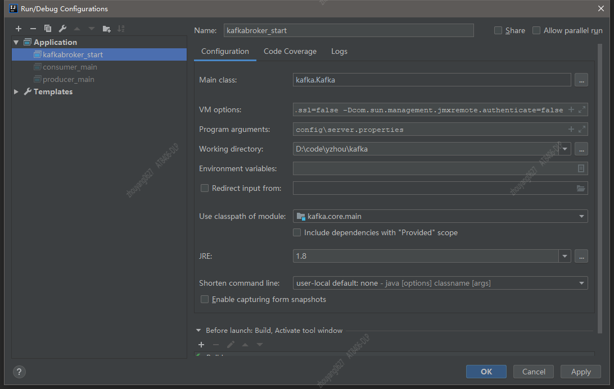

**`正文`**
[TOC]

## 安装kafka
* 安装zookeeper集群
* 将配置文件拷贝多份
```shell
cp config/server.properties config/server-1.properties
cp config/server.properties config/server-2.properties
cp config/server.properties config/server-3.properties
```
* 配置server-x.properties
```xml
broker.id=0  #当前机器在集群中的唯一标识，和zookeeper的myid性质一样
port=19092 #当前kafka对外提供服务的端口默认是9092
host.name=机器ip #这个参数默认是关闭的，在0.8.1有个bug，DNS解析问题，失败率的问题。
num.network.threads=3 #这个是borker进行网络处理的线程数
num.io.threads=8 #这个是borker进行I/O处理的线程数
log.dirs=/opt/kafka/kafkalogs/ #消息存放的目录，这个目录可以配置为“，”逗号分割的表达式，上面的num.io.threads要大于这个目录的个数这个目录，如果配置多个目录，新创建的topic他把消息持久化的地方是，当前以逗号分割的目录中，那个分区数最少就放那一个
socket.send.buffer.bytes=102400 #发送缓冲区buffer大小，数据不是一下子就发送的，先回存储到缓冲区了到达一定的大小后在发送，能提高性能
socket.receive.buffer.bytes=102400 #kafka接收缓冲区大小，当数据到达一定大小后在序列化到磁盘
socket.request.max.bytes=104857600 #这个参数是向kafka请求消息或者向kafka发送消息的请请求的最大数，这个值不能超过java的堆栈大小
num.partitions=1 #默认的分区数，一个topic默认1个分区数
log.retention.hours=168 #默认消息的最大持久化时间，168小时，7天
message.max.byte=5242880  #消息保存的最大值5M
default.replication.factor=2  #kafka保存消息的副本数，如果一个副本失效了，另一个还可以继续提供服务
replica.fetch.max.bytes=5242880  #取消息的最大直接数
log.segment.bytes=1073741824 #这个参数是：因为kafka的消息是以追加的形式落地到文件，当超过这个值的时候，kafka会新起一个文件
log.retention.check.interval.ms=300000 #每隔300000毫秒去检查上面配置的log失效时间（log.retention.hours=168 ），到目录查看是否有过期的消息如果有，删除
log.cleaner.enable=false #是否启用log压缩，一般不用启用，启用的话可以提高性能
zookeeper.connect=zk地址  #设置zookeeper的连接端口，多个ip用"," 隔开
delete.topic.enable=true #可删除topic
```
重点配置项：
```shell
broker.id=1
port=9092
host.name=xxx.xxx.xxx.xxx

log.dirs= 别忘记配置多个地址
zookeeper.connect=zk地址,zk地址

# 可删除topic
delete.topic.enable=true
```
* 启动集群
`kafka后台启动方式`: JMX_PORT=9999 bin/kafka-server-start.sh -daemon config/server.properties

```shell
#!/bin/bash

cd /data/apps/kafka/kafka_2.10-0.10.0.0
bin/kafka-server-start.sh -daemon config/server-1.properties
bin/kafka-server-start.sh -daemon config/server-2.properties
bin/kafka-server-start.sh -daemon config/server-3.properties
```


### 源码环境搭建

```shell
#1. git地址：https://github.com/apache/kafka    2.3分支
#2. 阅读 kafka的README.md
Kafka requires Gradle 5.0 or higher
Java 8 should be used for building in order to support both Java 8 and Java 11 at runtime
Scala 2.12 is used by default, see below for how to use a different Scala version or all of the supported Scala versions

#3. 配置scala ， java  ， gradle
#4. 导入idea中即可,并且安装scala插件和配置gradle
#5. 配置启动环境
配置log4j.properties，将config目录下的log4j.properties文件复制到 core/src/main/scala目录下，这样可以让kafka在运行时能够输出日志信息
配置server.properties文件，一般只需要修改一下配置项：


配置Main.class为 kafka.kafka，并指定启动时需要的配置文件地址，即config/server.properties。并且还在vm options中配置 
-Dcom.sun.management.jmxremote.port=9999
-Dcom.sun.management.jmxremote.ssl=false
-Dcom.sun.management.jmxremote.authenticate=false
```

`SLF4J: Failed to load class "org.slf4j.impl.StaticLoggerBinder`




配置文件：
# Licensed to the Apache Software Foundation (ASF) under one or more
# contributor license agreements.  See the NOTICE file distributed with
# this work for additional information regarding copyright ownership.
# The ASF licenses this file to You under the Apache License, Version 2.0
# (the "License"); you may not use this file except in compliance with
# the License.  You may obtain a copy of the License at
#
#    http://www.apache.org/licenses/LICENSE-2.0
#
# Unless required by applicable law or agreed to in writing, software
# distributed under the License is distributed on an "AS IS" BASIS,
# WITHOUT WARRANTIES OR CONDITIONS OF ANY KIND, either express or implied.
# See the License for the specific language governing permissions and
# limitations under the License.
# see kafka.server.KafkaConfig for additional details and defaults

############################# Server Basics #############################

# The id of the broker. This must be set to a unique integer for each broker.
broker.id=0
port=9093
############################# Socket Server Settings #############################

# The address the socket server listens on. It will get the value returned from 
# java.net.InetAddress.getCanonicalHostName() if not configured.
#   FORMAT:
#     listeners = security_protocol://host_name:port
#   EXAMPLE:
#     listeners = PLAINTEXT://your.host.name:9092
listeners=PLAINTEXT://:9093

# Hostname and port the broker will advertise to producers and consumers. If not set, 
# it uses the value for "listeners" if configured.  Otherwise, it will use the value
# returned from java.net.InetAddress.getCanonicalHostName().
advertised.listeners=PLAINTEXT://localpc.com:9093

# The number of threads handling network requests
num.network.threads=3

# The number of threads doing disk I/O
num.io.threads=8

# The send buffer (SO_SNDBUF) used by the socket server
socket.send.buffer.bytes=102400

# The receive buffer (SO_RCVBUF) used by the socket server
socket.receive.buffer.bytes=102400

# The maximum size of a request that the socket server will accept (protection against OOM)
socket.request.max.bytes=104857600


############################# Log Basics #############################

# A comma seperated list of directories under which to store log files
log.dirs=D:\\data\\kafkakafka-logs010

# The default number of log partitions per topic. More partitions allow greater
# parallelism for consumption, but this will also result in more files across
# the brokers.
num.partitions=1

# The number of threads per data directory to be used for log recovery at startup and flushing at shutdown.
# This value is recommended to be increased for installations with data dirs located in RAID array.
num.recovery.threads.per.data.dir=1

############################# Log Flush Policy #############################

# Messages are immediately written to the filesystem but by default we only fsync() to sync
# the OS cache lazily. The following configurations control the flush of data to disk.
# There are a few important trade-offs here:
#    1. Durability: Unflushed data may be lost if you are not using replication.
#    2. Latency: Very large flush intervals may lead to latency spikes when the flush does occur as there will be a lot of data to flush.
#    3. Throughput: The flush is generally the most expensive operation, and a small flush interval may lead to exceessive seeks.
# The settings below allow one to configure the flush policy to flush data after a period of time or
# every N messages (or both). This can be done globally and overridden on a per-topic basis.

# The number of messages to accept before forcing a flush of data to disk
#log.flush.interval.messages=10000

# The maximum amount of time a message can sit in a log before we force a flush
#log.flush.interval.ms=1000

############################# Log Retention Policy #############################

# The following configurations control the disposal of log segments. The policy can
# be set to delete segments after a period of time, or after a given size has accumulated.
# A segment will be deleted whenever *either* of these criteria are met. Deletion always happens
# from the end of the log.

# The minimum age of a log file to be eligible for deletion
log.retention.hours=168

# A size-based retention policy for logs. Segments are pruned from the log as long as the remaining
# segments don't drop below log.retention.bytes.
#log.retention.bytes=1073741824

# The maximum size of a log segment file. When this size is reached a new log segment will be created.
log.segment.bytes=1073741824

# The interval at which log segments are checked to see if they can be deleted according
# to the retention policies
log.retention.check.interval.ms=300000

############################# Zookeeper #############################

# Zookeeper connection string (see zookeeper docs for details).
# This is a comma separated host:port pairs, each corresponding to a zk
# server. e.g. "127.0.0.1:3000,127.0.0.1:3001,127.0.0.1:3002".
# You can also append an optional chroot string to the urls to specify the
# root directory for all kafka znodes.
zookeeper.connect=vm01.com:2181/vmkafka010

# Timeout in ms for connecting to zookeeper
zookeeper.connection.timeout.ms=6000

delete.topic.enable=true
auto.create.topics.enable=false

replica.fetch.backoff.ms=100000

//******************************************************************

log4j.properties

# Licensed to the Apache Software Foundation (ASF) under one or more
# contributor license agreements.  See the NOTICE file distributed with
# this work for additional information regarding copyright ownership.
# The ASF licenses this file to You under the Apache License, Version 2.0
# (the "License"); you may not use this file except in compliance with
# the License.  You may obtain a copy of the License at
#
#    http://www.apache.org/licenses/LICENSE-2.0
#
# Unless required by applicable law or agreed to in writing, softwarekafka.logs.dir
# distributed under the License is distributed on an "AS IS" BASIS,
# WITHOUT WARRANTIES OR CONDITIONS OF ANY KIND, either express or implied.
# See the License for the specific language governing permissions and
# limitations under the License.

# Unspecified loggers and loggers with additivity=true output to server.log and stdout
# Note that INFO only applies to unspecified loggers, the log level of the child logger is used otherwise
log4j.rootLogger=INFO, stdout, kafkaAppender

log4j.appender.stdout=org.apache.log4j.ConsoleAppender
log4j.appender.stdout.layout=org.apache.log4j.PatternLayout
log4j.appender.stdout.layout.ConversionPattern=[%d] %p %m (%c)%n

log4j.appender.kafkaAppender=org.apache.log4j.DailyRollingFileAppender
log4j.appender.kafkaAppender.DatePattern='.'yyyy-MM-dd-HH
log4j.appender.kafkaAppender.File=D:\\data\\kafka\\applogs\\server.log
log4j.appender.kafkaAppender.layout=org.apache.log4j.PatternLayout
log4j.appender.kafkaAppender.layout.ConversionPattern=[%d] %p %m (%c)%n

log4j.appender.stateChangeAppender=org.apache.log4j.DailyRollingFileAppender
log4j.appender.stateChangeAppender.DatePattern='.'yyyy-MM-dd-HH
log4j.appender.stateChangeAppender.File=D:\\data\\kafka\\applogs\\state-change.log
log4j.appender.stateChangeAppender.layout=org.apache.log4j.PatternLayout
log4j.appender.stateChangeAppender.layout.ConversionPattern=[%d] %p %m (%c)%n

log4j.appender.requestAppender=org.apache.log4j.DailyRollingFileAppender
log4j.appender.requestAppender.DatePattern='.'yyyy-MM-dd-HH
log4j.appender.requestAppender.File=D:\\data\\kafka\\applogs\\kafka-request.log
log4j.appender.requestAppender.layout=org.apache.log4j.PatternLayout
log4j.appender.requestAppender.layout.ConversionPattern=[%d] %p %m (%c)%n

log4j.appender.cleanerAppender=org.apache.log4j.DailyRollingFileAppender
log4j.appender.cleanerAppender.DatePattern='.'yyyy-MM-dd-HH
log4j.appender.cleanerAppender.File=D:\\data\\kafka\\applogs\\log-cleaner.log
log4j.appender.cleanerAppender.layout=org.apache.log4j.PatternLayout
log4j.appender.cleanerAppender.layout.ConversionPattern=[%d] %p %m (%c)%n

log4j.appender.controllerAppender=org.apache.log4j.DailyRollingFileAppender
log4j.appender.controllerAppender.DatePattern='.'yyyy-MM-dd-HH
log4j.appender.controllerAppender.File=D:\\data\\kafka\\applogs\\controller.log
log4j.appender.controllerAppender.layout=org.apache.log4j.PatternLayout
log4j.appender.controllerAppender.layout.ConversionPattern=[%d] %p %m (%c)%n

log4j.appender.authorizerAppender=org.apache.log4j.DailyRollingFileAppender
log4j.appender.authorizerAppender.DatePattern='.'yyyy-MM-dd-HH
log4j.appender.authorizerAppender.File=D:\\data\\kafka\\applogs\\kafka-authorizer.log
log4j.appender.authorizerAppender.layout=org.apache.log4j.PatternLayout
log4j.appender.authorizerAppender.layout.ConversionPattern=[%d] %p %m (%c)%n

# Change the two lines below to adjust ZK client logging
log4j.logger.org.I0Itec.zkclient.ZkClient=INFO
log4j.logger.org.apache.zookeeper=INFO

# Change the two lines below to adjust the general broker logging level (output to server.log and stdout)
log4j.logger.kafka=INFO
log4j.logger.org.apache.kafka=INFO

# Change to DEBUG or TRACE to enable request logging
log4j.logger.kafka.request.logger=WARN, requestAppender
log4j.additivity.kafka.request.logger=false

# Uncomment the lines below and change log4j.logger.kafka.network.RequestChannel$ to TRACE for additional output
# related to the handling of requests
#log4j.logger.kafka.network.Processor=TRACE, requestAppender
#log4j.logger.kafka.server.KafkaApis=TRACE, requestAppender
#log4j.additivity.kafka.server.KafkaApis=false
log4j.logger.kafka.network.RequestChannel$=WARN, requestAppender
log4j.additivity.kafka.network.RequestChannel$=false

log4j.logger.kafka.controller=TRACE, controllerAppender
log4j.additivity.kafka.controller=false

log4j.logger.kafka.log.LogCleaner=INFO, cleanerAppender
log4j.additivity.kafka.log.LogCleaner=false

log4j.logger.state.change.logger=TRACE, stateChangeAppender
log4j.additivity.state.change.logger=false

# Access denials are logged at INFO level, change to DEBUG to also log allowed accesses
log4j.logger.kafka.authorizer.logger=INFO, authorizerAppender
log4j.additivity.kafka.authorizer.logger=false


 No such property: useAnt for class: org.gradle.api.tasks.scala.ScalaCompileOptions


ScalaCompileOptions.metaClass.daemonServer = true
ScalaCompileOptions.metaClass.fork = true
ScalaCompileOptions.metaClass.useAnt = false
ScalaCompileOptions.metaClass.useCompileDaemon = false


### debug 过程
./kafka-topics.sh --create --zookeeper vm01.com:2181/vmkafka010 --replication-factor 2 --partitions 3 --topic yzhoutest01

./kafka-topics.sh --zookeeper vm01.com:2181/vmkafka010 --topic yzhoutest01 --describe


### 异常复现 
#replica.fetch.backoff.ms=100000
replica.fetch.wait.max.ms=30000
#replica.socket.timeout.ms=100000
replica.lag.time.max.ms=30000

java.io.IOException: Connection to 1 was disconnected before the response was read


