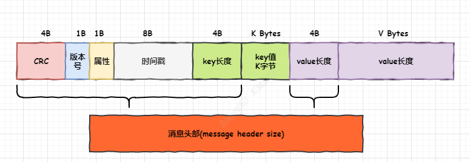
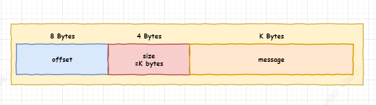
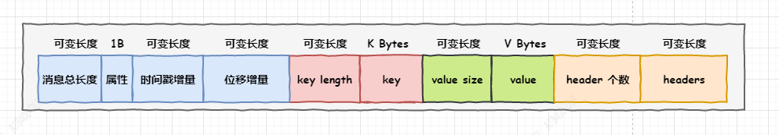
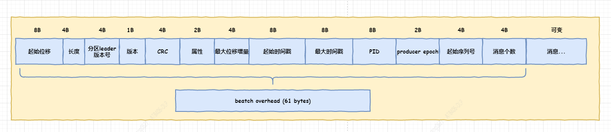

    1.1 v1格式
    1.2 v2格式

　　Kafka 0.11版本增加了很多新功能，包括支持事务、精确一次处理语义和幂等producer等，而实现这些新功能的前提就是要提供支持这些功能的新版本消息格式，同时也要维护与老版本的兼容性。本文将详细探讨Kafka 0.11新版本消息格式的设计，其中会着重比较新旧两版本消息格式在设计上的异同。毕竟只有深入理解了Kafka的消息设计，我们才能更好地学习Kafka所提供的各种功能。 


## 1. Kafka消息层次设计
　　不管是0.11版本还是之前的版本，Kafka的消息层次都是分为两层：消息集合(message set)以及消息(message)。一个消息集合中包含若干多条日志项，而每个日志项封装了消息以及其他一些元数据。Kafka底层的消息日志则由一系列消息集合日志项组成的。Kafka不会在消息这个层面上直接操作，它总是在消息集合这个层面上进行写入操作。
　　新旧两个版本对这两个层次的设计都有很大区别，我们下面分开来说。不过在深入到具体版本之前，我们先要明确一些基本术语。
　　首先，我会遵循Kafka社区的规范，称老版本消息格式为v1，新版本格式为v2。另外这里所指的老版本是指包含了时间戳(timestamp)字段的消息格式，更早之前的消息格式不在本文讨论的范围。其次，消息集合和消息在新旧版本对应的类名也有些许区别：

## 1.1 v1格式
　　在0.11版本之前，消息集合对应的类是org.apache.kafka.common.record.Records，消息是o.a.k.common.record.Record。消息集合中的每一项被称为日志项(log entry)，你可以理解每个日志项都是一个batch。

## 1.2 v2格式
　　0.11版本中消息集合对应的类是o.a.k.common.record.RecordBatch，消息依然是o.a.k.common.record.Record。特别注意这里的RecordBatch，如果你在之前的Kafka版本中搜寻RecordBatch类，你会发现在老版本中它指代的是Java producer端的消息batch——java producer将待发送消息收集起来，然后根据topic分区执行分组操作，其分组结果就保存在多个RecordBatch中。但是在新版本中，RecordBatch指的是普通的消息集合，producer端的分组batch由类o.a.k.clients.producer.internals.ProducerBatch来负责。各位千万不要混淆！
　　okay，了解了基本的术语，我们分别讨论下老版本、新版本的消息格式。

 ## 2. v1消息格式
　　在0.11版本之前，Kafka的消息格式如下图所示： 


图中各个字段的含义很清晰，这里不再赘述。从上图中我们可以计算出来一条普通的Kafka消息的头部开销——这里姑且称为头部，header，但不要和新版本的header混淆！下面会讨论新版本的header。此版本的消息头部开销等于4 + 1 + 1 + 8 + 4 + 4 = 22字节，也就是说一条Kafka消息长度再小，也不可以小于22字节，否则会被Kafka视为corrupted。另外根据这张图展示出来的格式，我们能够很容易地计算每条Kafka消息的总长度。注意，这里我们讨论的未压缩消息。已压缩消息的计算会复杂一些，故本文暂且不讨论。
　　下面我们来做一些计算。假设有一条Kafka消息，key是“key”，value是“hello”，那么key的长度就是3，value的长度就是5，因此这条Kafka消息需要占用22 + 3 + 5 = 30字节；倘若另一条Kafka消息未指定key，而value依然是“hello”，那么Kafka会往key长度字段中写入-1表明key是空，因而不再需要保存key信息，故总的消息长度= 22 + 5 = 27字节。当然value字段也可能是null——Kafka的log cleaner会定期地写入这种被称为tombstone消息，不过计算方法与key为空时是相同的。总之单条Kafka消息长度的计算是很简单的，下面我们来说说消息集合日志项的计算。
　　老版本消息集合中的每一项的格式如下图所示: 


如图所示，每个消息集合中的日志项由日志项头部+一条“浅层”消息构成。

 * 浅层(shallow)消息：如果是未压缩消息，shallow消息就是消息本身；如果是压缩消息，Kafka会将多条消息压缩再一起封装进这条浅层消息的value字段。这条浅层消息也被称为wrapper消息，里面包含的消息被称为内部消息，即inner message。由此可见，老版本的message batch中通常都只包含一条消息，即使是对于已压缩消息而言，它也只是包含一条shallow消息。
 * 日志项头部(log entry header)：8字节的offset字段 + 4个字节的size字段，共计12个字节。其中offset保存的是这条消息的位移。对于未压缩消息，它就是消息的位移；如果是压缩消息，它表示wrapper消息中最后一条inner消息的位移。由此可见，给定一个老版本的消息集合倘若要寻找该消息集合的起始位移(base offset或starting offset)是一件很困难的事情，因为这通常都需要深度遍历整个inner消息，这也就是意味着broker端需要执行解压缩的操作，因此代价非常高。

 　　下面我们来看下如何计算消息集合大小，还是拿之前的两条Kafka消息为例。第一条消息被封装进一个消息集合，那么该消息集合总的长度 = 12 + 30 = 42字节，而包含第二条未指定key消息的消息集合总长度 = 12 + 27 = 39字节。我们做个试验来验证下：
1 创建一个测试topic，1个分区，replication-factor = 1，然后使用console-producer脚本发送一条消息，key=“key”，value=“hello”，然后验证下底层文件日志大小是42字节。
```shell
bogon:kafka_0.10.2.1 huxi$ bin/kafka-topics.sh --zookeeper localhost:2181 --create --partitions 1 --replication-factor 1 --topic test
Created topic "test".
bogon:kafka_0.10.2.1 huxi$ bin/kafka-console-producer.sh --broker-list localhost:9092 --topic test --property parse.key=true --property key.separator=:
key:hello
```
输出结果:
```shell
bogon:test-0 huxi$ pwd
/Users/huxi/SourceCode/testenv/datalogs/kafka_1/test-0
bogon:test-0 huxi$ ll *.log
-rw-r--r--  1 huxi  staff  42 Jul  6 11:36 00000000000000000000.log
```
可见，我们的计算是正确的。
2 再使用console-producer脚本发送另一条消息，不指定key，value依然是“hello”，然后验证下底层文件日志大小是42 + 39 = 81字节。
```shell
bogon:test-0 huxi$ ll *.log
-rw-r--r--  1 huxi  staff  81 Jul  6 11:39 00000000000000000000.log
```
结果再次证明我们的计算方法是正确的。不过，老版本的消息集合在设计上有一些弊端，包括：

    对空间的利用率不高，比如不论key和value的长度是多少，老版本消息都是用固定的4个字节来保存长度信息，比如value是100字节还是1000字节，v1消息都需要花费4个字节来保存整个值，但其实保存100这个值只需要7个比特就够了，也就是说只用1个字节就可以，另外3个字节都是浪费的。如果你的系统中这种情况很常见的话，那么对于磁盘/内存空间的浪费是十分可观的。
    老版本设计中的offset是消息集合的最后一条消息的offset，如果用户想要获取第一条消息的位移，必须要把所有消息解压全部装入内存然后反向遍历才能获取到。显然这个代价是很大的
    CRC的计算有些鸡肋。老版本设计中每条消息都需要执行CRC校验。但有些情况下我们不能想认为producer端发送的消息的CRC到consumer端消息时是不变的。比如如果用户指定的时间戳类型是LOG_APPEND_TIME，那么在broker端会对消息时间戳字段进行更新，那么重新计算之后的CRC值就会发生变化；再比如broker端进行消息格式转换也会带来CRC的变化。鉴于这些情况，再对每条消息都执行CRC校验就有点没必要了，不仅浪费空间还耽误CPU时间
    每次需要单条消息的总长度信息时都需要计算而得出，没有使用一个字段来保存下来，解序列化效率不高。

 　　鉴于以上这些弊端以及对0.11版本新功能支持的需要， Kafka社区重新设计了v2版本的消息来解决以上的问题。

 ## 3. v2消息格式
　　v2版本依然分消息与消息集合两个维度，只不过消息集合这个提法被消息batch所取代。v2版本的术语叫RecordBatch。我们先来看v2消息的格式，如下图所示： 


这里的"可变长度"表示Kafka会根据具体的值来确定到底需要几个字节来保存。为了序列化时降低所需的字节数，0.11版本借鉴了Google PB的Zig-zag编码方式，使得绝对值较小的整数占用比较少的字节。这是符合Kafka消息使用场景的，毕竟在实际使用过程中，key或value很大的可能性并不高。比如key如果是一个有业务含义的字符串(这是很常见的使用方法)，那么这个字符串的长度通常都不会太长，这样大部分情况下只需要1~2个字节就可以保存了。这比v1版本中固定使用4个字节来保存要节省得多。如果要深入了解pb的编码方式请参考：https://developers.google.com/protocol-buffers/docs/encoding
　　总之v2版本的消息格式比起v1有很大的变化。除了可变长度这一点，v2版本的属性字段被弃用了，CRC被移除了，另外增加了消息总长度、时间戳增量(timestamp delta)、位移增量(offset delta)和headers信息。我们分别说下：

    消息总长度：直接计算出消息的总长度并保存在第一个字段中，而不需要像v1版本时每次需要重新计算。这样做的好处在于提升解序列化的效率——拿到总长度后，Kafka可以直接new出一个等长度的ByteBuffer，然后装填各个字段。同时有了这个总长度，在遍历消息时可以实现快速地跳跃，省去了很多copy的工作。
    时间戳增量：消息时间戳与所属record batch起始时间戳的差值，保存差值可以进一步节省消息字节数
    位移增量：消息位移与所属record batch起始位移的差值，保存差值可以进一步节省消息字节数
    headers：这和本文之前提到的所有header都无关。这是0.11版本引入的新字段。它是一个数组，里面的Header只有两个字段：key和value，分别是String和byte[]类型。
    v2版本不在对每条消息执行CRC校验，而是针对整个batch
    v2版本不在使用属性字节，原先保存在属性字段中的诸如压缩类型、时间戳类型等信息都统一保存在外层的batch中

 　　下面我们依然拿上面的Kafka消息举例计算下0.11版本的消息长度是多少。假设这条Kafka消息的key是“key”，value是“hello”，同时假设这是batch中的第一条消息，因此时间戳增量和位移增量都是0，另外我们还假设没有指定任何header，因此header数组个数是0。结合上图我们可以计算这条消息的长度 = 总长度值占用的字节数 + 1 + 1 + 1 + 1 + 3 + 1 + 5 + 1 =  总长度值占用的字节数 + 14，由于14小于64，因此总长度值只需1个字节，故消息总长度是15字节。同时消息的第一个字节保存的值就是15。这里提一句为什么是64？ 先前提到的Zigzag编码会将有符号32位整数编码成一个无符号整数，大致的思想是：

 ```java
0　　 ---> 0
-1　　---> 1
1 　　---> 2
-2 　  ---> 3
2 　　---> 4
...
 ```
 这样做，我们不再需要为-1去保存32位的补码，只需要1个字节就能保存-1，但是zigzag会将每个字节的第一个比特作为特殊之用，故每个字节只能有7位来做实际的编码任务，也就是表示从0~127。上面的编码表中我们可以发现正数都会被编码成其2倍的数字，因此如果一旦上面例子中的长度超过了128/2=64，长度信息就需要用2个字节来保存。这就是上面64这个数字出现的原因。（希望我解释清楚了。。。。） 我们再举个例子，假设某条Kafka消息未指定key，value是“hello”，该消息在整个batch中的第100条且时间戳增量也是100，那么该消息总的字节数是=总长度值占用的字节数 + 1 + 2 + 2 + 1 + 1 + 5 + 1 = 总长度值占用的字节数 + 13 = 14字节。
 　　谈完了消息格式，我们终于可以说说record batch了。v2的batch格式非常复杂，不废话了， 直接上图： 

　显然这比v1版本的batch要复杂得多，简单解释一下它和v1的主要区别：

    CRC被移动batch这一层，而非消息这一层
    属性字段被扩充为2个字节，而不是之前的一个字节，其中第一个字节的低3位比特保存压缩类型，第4个比特保存时间戳类型，第5个比特保存消息的事务类型(事务型消息和非事务型消息)，第6个比特指定batch是否是control batch(control batch以及control message用于支持事务)
    PID、producer epoch、序列号等信息都是为了实现幂等producer之用，故本文不做详细展开（其实我也不会😭）
    总的overhead是61个字节，看上去比v1大了不少。但v2版本支持batch中包含多条消息，所以引入新字段的开销被摊薄到每条消息上，整体节省了空间

 　　和v2版本一样，我们来看下如何计算消息集合大小，还是以上面的两条Kafka消息为例。第一条消息被封装进一个batch，那么该batch总的长度 = 61 + 15 = 76字节。我们做个试验来验证下：
 ```shell
bin/kafka-topics.sh --create --topic test --zookeeper localhost:2181 --partitions 1 --replication-factor 1
Created topic "test".
    
bin/kafka-console-producer.sh --topic test --broker-list localhost:9092 --property parse.key=true --property key.separator=:
>key:hello

bogon:test-0 huxi$ pwd
/Users/huxi/SourceCode/newenv/datalogs/kafka_1/test-0
bogon:test-0 huxi$ ll *.log
-rw-r--r--  1 huxi  staff  76 Jul  6 14:38 00000000000000000000.log
 ```
## 4. 测试对比
　　如果拿v1和v2的测试结果来看，似乎v2版本占用的磁盘空间反而增加了，这是因为我们的试验中每个batch只有一条消息，如果我们改用java API程序来批量发送消息的话，我们就会发现两者的不同, 在未有任何调优的情况下，v2版本消息格式确实可以节省磁盘空间。我们可以说0.11版本的Kafka消息在支持事务、幂等producer的同时还一定程度上减少了网络IO和磁盘IO的开销


摘自 https://www.cnblogs.com/huxi2b/p/7126410.html