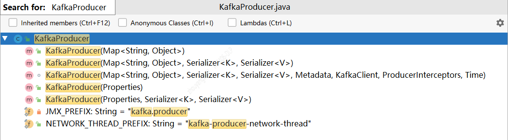

## 源码分析 KafkaProducer对象实例化

>上一篇blog 《(1)Producer 发送消息代码示例》, 了解如何使用Java编写Producer。    

本篇主要讲解 new Producer(...)  做了哪些工作？ 
```java
Producer<String,String> producer = new KafkaProducer<String, String>(properties);
```

### KafkaProducer

1）KafkaProducer 重点字段
```java
//client.id参数
private final String clientId;
// Visible for testing
final Metrics metrics;
//分区器
private final Partitioner partitioner;
//最大请求字节大小
private final int maxRequestSize;
//缓存池大小
private final long totalMemorySize;
//元数据信息
private final Metadata metadata;
//记录收集器
private final RecordAccumulator accumulator;
//数据发送线程
private final Sender sender;
//压缩格式
private final CompressionType compressionType;
//KafkaProducer配置信息
private final ProducerConfig producerConfig;
//最大阻塞时间
private final long maxBlockTimeMs;
//拦截器
private final ProducerInterceptors<K, V> interceptors;
//api版本
private final ApiVersions apiVersions;
```
`部分没有涉及的字段，不说明它不重要，请同样关注 `


2）KafkaProducer 构造方法



KafkaProducer的构造方法最终调用的是
```java
// visible for testing
    @SuppressWarnings("unchecked")
    KafkaProducer(Map<String, Object> configs,
                  Serializer<K> keySerializer,
                  Serializer<V> valueSerializer,
                  Metadata metadata,
                  KafkaClient kafkaClient,
                  ProducerInterceptors interceptors,
                  Time time) {
        // 将用户自定义的参数以及其他参数的缺省值 构建config
        ProducerConfig config = new ProducerConfig(ProducerConfig.addSerializerToConfig(configs, keySerializer,
                valueSerializer));
        try {
            // 用户配置的参数
            Map<String, Object> userProvidedConfigs = config.originals();
            this.producerConfig = config;
            this.time = time;  //time 后面会说明kafka的时间轮
            // 判断client.id用户是否配置参数，没有的话则按照默认的value规则赋值
            String clientId = config.getString(ProducerConfig.CLIENT_ID_CONFIG);
            if (clientId.length() <= 0)
                clientId = "producer-" + PRODUCER_CLIENT_ID_SEQUENCE.getAndIncrement();
            this.clientId = clientId;

            // TODO 事务暂时不过多介绍，后面会单独说明
            String transactionalId = userProvidedConfigs.containsKey(ProducerConfig.TRANSACTIONAL_ID_CONFIG) ?
                    (String) userProvidedConfigs.get(ProducerConfig.TRANSACTIONAL_ID_CONFIG) : null;
            LogContext logContext;
            if (transactionalId == null)
                logContext = new LogContext(String.format("[Producer clientId=%s] ", clientId));
            else
                logContext = new LogContext(String.format("[Producer clientId=%s, transactionalId=%s] ", clientId, transactionalId));
            log = logContext.logger(KafkaProducer.class);
            log.trace("Starting the Kafka producer");

            // 设置metric tags及config 配置信息
            Map<String, String> metricTags = Collections.singletonMap("client-id", clientId);
            MetricConfig metricConfig = new MetricConfig().samples(config.getInt(ProducerConfig.METRICS_NUM_SAMPLES_CONFIG))
                    .timeWindow(config.getLong(ProducerConfig.METRICS_SAMPLE_WINDOW_MS_CONFIG), TimeUnit.MILLISECONDS)
                    .recordLevel(Sensor.RecordingLevel.forName(config.getString(ProducerConfig.METRICS_RECORDING_LEVEL_CONFIG)))
                    .tags(metricTags);
            // 获取用户是否传入的"metric.reporters",作用是，可以自己处理将Producer的metrics上报到哪里
            List<MetricsReporter> reporters = config.getConfiguredInstances(ProducerConfig.METRIC_REPORTER_CLASSES_CONFIG,
                    MetricsReporter.class,
                    Collections.singletonMap(ProducerConfig.CLIENT_ID_CONFIG, clientId));
            reporters.add(new JmxReporter(JMX_PREFIX));
            this.metrics = new Metrics(metricConfig, reporters, time);
            // 设置分区器
            this.partitioner = config.getConfiguredInstance(ProducerConfig.PARTITIONER_CLASS_CONFIG, Partitioner.class);
            // 重试时间 retry.backoff.ms 默认是100ms
            long retryBackoffMs = config.getLong(ProducerConfig.RETRY_BACKOFF_MS_CONFIG);
            // 设置序列化器
            if (keySerializer == null) {
                this.keySerializer = config.getConfiguredInstance(ProducerConfig.KEY_SERIALIZER_CLASS_CONFIG,
                                                                                         Serializer.class);
                this.keySerializer.configure(config.originals(), true);
            } else {
                config.ignore(ProducerConfig.KEY_SERIALIZER_CLASS_CONFIG);
                this.keySerializer = keySerializer;
            }
            if (valueSerializer == null) {
                this.valueSerializer = config.getConfiguredInstance(ProducerConfig.VALUE_SERIALIZER_CLASS_CONFIG,
                                                                                           Serializer.class);
                this.valueSerializer.configure(config.originals(), false);
            } else {
                config.ignore(ProducerConfig.VALUE_SERIALIZER_CLASS_CONFIG);
                this.valueSerializer = valueSerializer;
            }

            // load interceptors and make sure they get clientId
            userProvidedConfigs.put(ProducerConfig.CLIENT_ID_CONFIG, clientId);
            // 设置拦截器
            ProducerConfig configWithClientId = new ProducerConfig(userProvidedConfigs, false);
            List<ProducerInterceptor<K, V>> interceptorList = (List) configWithClientId.getConfiguredInstances(
                    ProducerConfig.INTERCEPTOR_CLASSES_CONFIG, ProducerInterceptor.class);
            if (interceptors != null)
                this.interceptors = interceptors;
            else
                this.interceptors = new ProducerInterceptors<>(interceptorList);
            ClusterResourceListeners clusterResourceListeners = configureClusterResourceListeners(keySerializer,
                    valueSerializer, interceptorList, reporters);
            // 获取用户配置参数或者参数缺省值 赋值字段
            this.maxRequestSize = config.getInt(ProducerConfig.MAX_REQUEST_SIZE_CONFIG);
            this.totalMemorySize = config.getLong(ProducerConfig.BUFFER_MEMORY_CONFIG);
            this.compressionType = CompressionType.forName(config.getString(ProducerConfig.COMPRESSION_TYPE_CONFIG));

            this.maxBlockTimeMs = config.getLong(ProducerConfig.MAX_BLOCK_MS_CONFIG);
            //TODO 事务相关后面介绍
            this.transactionManager = configureTransactionState(config, logContext, log);
            // 消息延迟发送 最大的超时时间
            int deliveryTimeoutMs = configureDeliveryTimeout(config, log);

            this.apiVersions = new ApiVersions();
            // 创建数据收集器
            this.accumulator = new RecordAccumulator(logContext,
                    config.getInt(ProducerConfig.BATCH_SIZE_CONFIG),
                    this.compressionType,
                    lingerMs(config),
                    retryBackoffMs,
                    deliveryTimeoutMs,
                    metrics,
                    PRODUCER_METRIC_GROUP_NAME,
                    time,
                    apiVersions,
                    transactionManager,
                    new BufferPool(this.totalMemorySize, config.getInt(ProducerConfig.BATCH_SIZE_CONFIG), metrics, time, PRODUCER_METRIC_GROUP_NAME));
            // 校验 bootstrap.servers 和生成SocketAddress
            List<InetSocketAddress> addresses = ClientUtils.parseAndValidateAddresses(
                    config.getList(ProducerConfig.BOOTSTRAP_SERVERS_CONFIG),
                    config.getString(ProducerConfig.CLIENT_DNS_LOOKUP_CONFIG));
            if (metadata != null) {
                this.metadata = metadata;
            } else {
                // 生产者每隔一段时间都要去更新集群的元数据(元数据过期时间)
                this.metadata = new Metadata(retryBackoffMs, config.getLong(ProducerConfig.METADATA_MAX_AGE_CONFIG),
                    true, true, clusterResourceListeners);
                this.metadata.bootstrap(addresses, time.milliseconds());
            }
            this.errors = this.metrics.sensor("errors");
            // // sender对象构建，包含NetworkClient ，主要用于发送消息
            this.sender = newSender(logContext, kafkaClient, this.metadata);
            String ioThreadName = NETWORK_THREAD_PREFIX + " | " + clientId;
            this.ioThread = new KafkaThread(ioThreadName, this.sender, true);
            // 启动网络发送线程
            this.ioThread.start();
            // 未使用参数提示
            config.logUnused();
            AppInfoParser.registerAppInfo(JMX_PREFIX, clientId, metrics);
            log.debug("Kafka producer started");
        } catch (Throwable t) {
            // call close methods if internal objects are already constructed this is to prevent resource leak. see KAFKA-2121
            close(Duration.ofMillis(0), true);
            // now propagate the exception
            throw new KafkaException("Failed to construct kafka producer", t);
        }
    }
```

