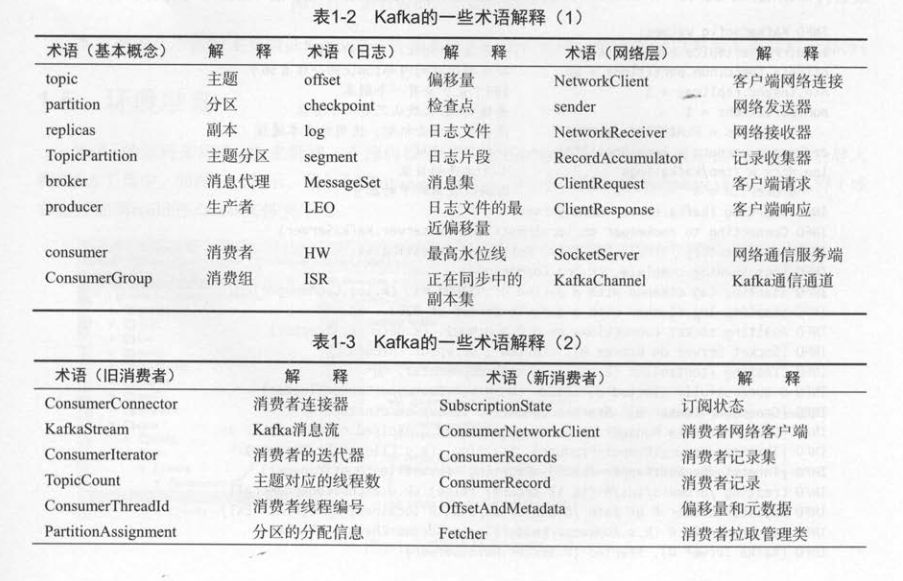

**正文**

[TOC]

### 问题？
1. Kafka的主题与分区内部是如何存储的，它有什么特点？
2. 与传统的消息系统相比，Kafka的消费模型有什么优点？
3. Kafka如何实现分布式的数据存储与数据读取？


4. 如何利用操作系统的优化技术来高效地持久化日志文件和加快数据传输效率？
5. Kafka的生产者如何批量地发送消息，消费者采用拉取模型带来的优点都有哪些？
6. Kafka的副本机制如何工作，当故障发生时，怎么确保数据不会丢失？


7. 使用"零拷贝技术(zero-copy)"只需将磁盘文件的数据复制到页面缓存中一次？


### 分布式模型
Kafka每个主题的多个分区日志分布式地存储在Kafka集群上，同时为了故障容错，每个分区都会以副本的方式复制到多个消息代理节点上。其中一个节点会作为主副本(Leader)，其他节点作为备份副本(Follower,也叫作从副本)。主副本会负责所有的客户端读写操作，备份副本仅仅从主副本同步数据。当主副本出现故障时，备份副本中的一个副本会被选择为新的副本。因为每个分区的副本中只有主副本接受读写，所以每个服务端都会作为某些分区的主副本，以及另外一些分区的备份副本，这样Kafka集群的所有服务端整理上对客户端是负载均衡的。


### kafka producer
生产者采用批量发送消息集的方式解决网络请求过多的问题。生产者会尝试在内存中收集足够数据，并在一个请求中一次性发送一批数据。另外，我们还可以为生产者客户端设置"在指定的时间内收集不超过指定数量的消息"。比如，设置消息大小上限等于64字节，延迟时间等于100毫秒，表示在100毫秒内消息大小达到64字节要立即发送；如果在100毫秒时还没达到64字节，也要把已经收集的消息发送出去。客户端采用这种缓冲机制，在发送消息前会收集尽可能多的数据，通过每次牺牲一点点额外的延迟来换取更高的吞吐量。相应地，服务端的I/O消耗也会大大降低


### 背景

kafka的消息传输保障有3个层级,分别如下：
1. at most once: 至多一次，消息可能会丢失，但绝对不会重复传输
* 如果消费者在拉完消息之后，应用逻辑先提交消息位移后进行消息处理，那么在位移提交之后且在消息处理完成之前消费者宕机了，待它重新上线之后，会从已经提交的位移处开始重新消费，但之前尚有部分消息未进行消费，如此就会发生消息丢失，此时就对应`at most once`

2. at least once：最少一次，消息绝不会丢失，但可能会重复传输

* 对消费者而言，消费者处理消息和提交消息位移的顺序在很大程序上决定了消费者提供哪一种消息传输保障。如果消费者在拉取完消息之后，应用逻辑先处理消息后提交位移，那么在消息处理之后且在位移提交之前消费者宕机了，待它重新上线之后，会从上一次位移提交的位置拉取，这样就出现了重复消费，因为有部分消息已经处理过了只是还没来得及提交消费位移，此时就对应`at least once`

* 当生产者向kafka发送消息时，一旦消息被成功提交到日志文件，由于多副本机制的存在，这条消息就不会丢失。如果生产者发送消息到kafka之后，遇到了网络问题而造成通信中断，那么生产者就无法判断该消息是否已经提交。虽然kafka无法确定网络故障期间发生了什么，但生产者可以进行多次重试来确保消息已经写入kafka，这个重试的过程中有可能会造成消息的重复写入，所以这里kafka提供的消息传输保障为 `at least once`。

NetworkException表示网络异常，这个有可能是由于网络瞬时故障而导致的异常，可以通过重试解决，又比如LeaderNotAvailableException表示分区的leader副本不可用，这个异常通常发生在leader副本下线而新的leader副本选举完成之前，重试之后可以重新恢复。不可重试的异常，比如RecordToolLargeException异常，暗示了所发送的消息太大，KafkaProducer对此不会进行任何重试，直接抛出异常。
对于可重试的异常，如果配置了`retries`参数，那么只要在规定的重试次数内自行恢复了，就不会抛出异常。`retries参数的默认值为0，配置方式参考如下`
```java
props.put(ProducerConfig.RETRIES_CONFIG,10);
```
示例中配置了10次重试。如果重试了10次之后还没有恢复，那么仍会抛出异常，进而发送的外层逻辑就要处理这些异常了。

### kafka事务和幂等
`exactly once` : 恰好一次，每条消息肯定会被传输一次且仅传输一次
kafka从0.11.0.0版本开始引入了幂等和事务这两个特性，以此来实现EOS(exactly once semantics,精准一次处理语义)

#### 幂等
所谓的幂等，简单地说就是对接口的多次调用所产生的结果和调用一次是一致的。生产者在进行重试的时候有可能会重复写入消息，而使用kafka的幂等性功能之后就可以避免这种情况。

开启幂等性功能的方式很简单，只需要显示地将生产者客户端参数`enable.idempotence`设置为true即可(这个参数的默认值为false),参考如下：
```java
properties.put(ProducerConfig.ENABLE_IDEMPOTENCE_CONFIG,true);
或者
properties.put("enable.idempotence",true);
```
  不过如果要确保幂等性功能正常，还需要确保生产者客户端的 `retries` ,`acks` ,`max.in.flight.requests.per.connection`这个几个参数不被配置错。实际上在使用幂等性功能的时候，用户完全可以不用配置(也不建议配置)这几个参数。

**retries**
  如果用户显示地指定了retries参数，那么这个参数值必须要大于0，否则会报出`ConfigException`：
  ```java
  org.apache.kafka.common.config.ConfigException: Must set retries to non-zero when using the idempotent producer.
  ```
  如果用户没有显示地指定retries参数，那么KafkaProducer会将它置为`Integer.MAX_VALUE`。
  
**max.in.flight.requests.per.connection**
  同时还需要保证`max.in.flight.requests.per.connection`参数的值不能大于5(这个参数的值默认为5)，否则也会报出`ConfigException`：
  ```java
  org.apache.kafka.common.config.ConfigException:Must set max.in.flight.requests.per.connection to at most 5 to use the idempotent producer.
  ```
**acks**
如果用户显示地指定了acks参数，那么还需要保证这个参数的值为-1(all)，如果不为-1(这个参数的值默认为1)，那么也会报出`ConfigException`：
```java
 org.apache.kafka.common.config.ConfigException:Must set acks to all in order to at most 5 to use the idempotent producer.
```
如果用户没有显式地指定这个参数，那么KafkaProducer会将它置为-1。开启幂等性功能之后，生产者就可以如同未开启幂等时一样发送消息了。

为了实现生产者的幂等性，kafka为此引入了 producer id(以下简称PID)和序列化(sequence number)这两个概念。
每个新的生产者实例在初始化的时候都会被分配一个PID，这个PID对用户而言是完全透明的。对于每个PID，消息发送到的每个分区都有对应的序列号，这些序列号从0开始单调递增。生产者每发送一次消息就会将<PID,分区>对应的序列号的值加1.
  broker端会在内存中每一对<PID，分区>维护一个序列号。对于收到的每一条消息，只有当它的序列号的值(SN_new)比broker端中维护的对应的序列号的值(SN_old)大1(即SN_new=SN_old+1)时，broker才会接受它。如果SN_new<SN_old+1，那么说明消息被重复写入，broker可以直接将其丢弃。如果SN_new>SN_old+1，那么说明中间有数据尚未写入，出现了乱序，暗示可能有消息丢失，对应的生产者会抛出`OutOfOrderSequenceException`，这个异常是一个严重的异常，后续的诸如send(),beginTransaction(),commitTransaction()等方法的调用都会抛出IllegalStateException异常。
  引入序列号来实现幂等也只是针对每一个<PID,分区>而言的，也就是说，kafka的幂等只能保证单个生产者会话(session)中单分区的幂等。
  ```java
ProducerRecord<String,String> record = new ProducerRecord<>(topic,"key","msg");
producer.send(record);
producer.send(record);
  ```
  注意，上面示例中发送了两条相同的消息，不过这仅仅是指消息内容相同，但对kafka而言是两条不同的消息，因为会为这两条消息分配不同的序列号。kafka并不会保证消息内容的幂等。

#### 事务
幂等性并不能跨多个分区运作，而`事务`可以弥补这个缺陷。事务可以保证对多个分区写入操作的原子性。操作的原子性是指多个操作要么全部成功，要么全部失败，不存在部分成功、部分失败的可能。

对流失应用(Stream Processing Applications)而言，一个典型的应用模式为"consume-transform-produce"。在这种模式下消费和生产并存：应用程序从某个主题中消费消息，然后经过一系列转换后写入另一个注入，消费者可能在提交消费位移的过程中出现问题而导致重复消费，也可能生产者重复生产消息。kafka中的事务可以使应用程序将消费消息、生产消息、提交消息位移当作原子操作来处理，同时成功或失败，即使该生产或消费会跨多个分区。

为了实现事务，应用程序必须提供唯一的transactionalId，这个transactionalId通过客户端参数`transactional.id`来显示设置，参数如下：
```java
properties.put(ProducerConfig.TRANSACTIONAL_ID_CONFIG,"transactionId");
或者
properties.put("transactional.id","transactionId");
```
事务要求生产者开启幂等特性，因此通过将transactional.id参数设置为非空从而开启事务特性的同时需要将 `enable.idempotence`设置为true(如果未显示设置，则KafkaProducer默认会将它的值设置为true)，如果用户显示地将`enable.idempotence`设置为flase，则会报出`ConfigException`:
```java
 org.apache.kafka.common.config.ConfigException:Must set a transactional.id without also enabling idempotent.
```
transactionlId与PID一一对应，两者之间所不同的是transactionalId由用户显示设置，而PID是有kafka内部分配的，另外，为了保证新的生产者启动后具有相同transactionlId的旧生产者能够立即失效，每个生产者通过transactionalId获取PID的同时，还会获取一个单调递增的producer epoch(对应下面要讲述的KafkaProducer.initRransactions()方法)。如果使用同一个transactionlId开启两个生产者，那么前一个开启的生产者会报出如下的错误：
```java
org.apache.kafka.common.errors.ProducerFencedException:Producer attempted an operation with an old epoch. Either there is a newer producer with the same transactionalId, or the producer's transaction has been expired by the broker.
```

从生产者的角度分析，通过事务，kafka可以保证跨生产者会话的消息幂等发送，以及跨生产者会话的事务恢复。前者表示具有相同transactionalId的新生产者实例被创建且工作的时候，旧的且拥有transactionalId的生产者实例将不再工作。后者指当某个生产者实例宕机后，新的生产者实例可以保证任何未完成的旧事务要么被提交，要么被中止，如此可以使新的生产者实例从一个正常的状态开始工作。

而从消费者的角度分析，事务能保证的语义相对偏弱。出于以下原因，kafka并不能保证已提交的事务中的所有消息都能够被消费：
* 对采用日志压缩策略的主题而言，事务中的某些消息有可能被清理(相同key的消息，后写入的消息会覆盖前面写入的消息)
* 事务中消息可能分布在同一个分区的多个日志分段(LogSegment)中，当老的日志分段删除时，对应的消息可能会丢失
* 消费者可以通过seek()方法访问任意offset的消息，从而可能遗漏事务中的部分消息
* 消费者在消费时可能没有分配到事务内的所有分区，如此它也就不能读取事务中的所有消息

```java
void initRransactions();
void beginTransaction() throws ProducerFencedExcetion;
void sendOffsetsToTransaction(Map<TopicPartition,OffsetAndMetadata> offsets,String consumerGroupId) throws ProducerFencedException;
void commitTransaction() throws ProducerFencedException;
void abortTransaction() throws ProducerFencedException;
```

initRransactions()方法用来初始化事务，这个方法能够执行的前提是配置了transactionalId，如果没有则会报出`IllegalStateException`：
```java
java.lang.IllegalStateException:Cannot use transactional methods without enabling transactions by setting the transactional.id configuration property
```
beginTransaction()方法用来开启事务：sendOffsetsToTransaction()方法为消费者提供在事务内的位移提交的操作；commitTransaction()方法用来提交事务；abortTransaction()方法用来中止事务，类似于事务回滚。


### 事务隔离级别
在消费端有一个参数`isolation.level`，与事务有着莫大的关联，这个参数的默认值为“ read uncommitted ”， 意思是说消费端应用可以看到（消费到）未提交的事务，当然对于己提交的事务也是可见的。这个参数还可以设置为“ read committed ”，表示消费端应用不可以看到尚未提交的事务内的消息。举个例子，如果生产者开启事务并向某个分区值发送 3 条消息 msgl 、msg2 和 msg3 ，在 执行 commitTransaction （） 或 abortTransaction （）方法前，设置为“ read_committed” 的消费端应用是消费不到这些消息的，不过在 Kafka Consumer 内部会缓存这些消息，直到生产者执行 commitTransaction （）方法之后它才能将这些消息推送给消费端应用。反之，如果生产者执行了 abortTransaction （）方法，那么 Kafka Consumer 会将这些缓存的消息丢弃而不推送给消费
端应用。
日志文件中除了普通的消息，还有一种消息专门用来标志一个事务的结束，它就是控制消息(ControlBatch)。控制消息一共有两种类型：COMMIT和ABORT，分别用来表征事务已经成功提交或已经被成功中止。KafkaConsumer可以通过这个控制消息来判断对应的事务是被提交了还是被中止了，然后结合参数isolation.level配置的隔离级别来决定是否将相应的消息返回给消费端应用.


### Leader
1. Kafka每个主题的多个分区日志分布式地存储在Kafka集群上，同时为了故障容错，每个分区都以副本的方式复制到多个消息代理节点上。其中一个节点会作为主副本(Leader)，其他节点作为备份副本(Follower,也叫作从副本)。主副本会负责所有的客户端读写操作，备份副本仅仅从主副本同步数据。当主副本出现故障时，备份副本中的一个副本会选择为新的主副本。因为每个分区的副本中只有主副本接受读写，所以每个服务端都会作为某些分区的主副本，以及另外一些分区的备份副本，这样kafka集群的所有服务端整体上对客户端是负载均衡的。

```shell
bin/kafka-topics.sh --describe --zookeeper localhost:2181 --topic topic-name
```


在zookeeper中AR 副本的信息
/brokers/topics/[topic]/partitions/[partition]/state --> {leaderAndlsr}

### kafka术语解释



《深入理解kafka：核心设计与实践原理》
### 分区重分配

#### 背景
当集群中的一个节点突然宕机下线时，如果节点上的分区是单副本的，那么这些分区就变的不可用了，在节点恢复前，相应的数据也就是处于丢失状态；如果节点上分区是多副本，那么位于这个节点上的leader副本的角色会转交到集群的其他follower副本中。总而言之，这个节点上的分区副本都已经处于功能失效的状态，kafka并不会将这些失效的分区副本自动地迁移到集群中剩余的可用broker节点上，如果放任不管，则不仅会影响整个集群的均衡负载，还会影响整理服务的可用性和可靠性。
1. 当要对集群中的一个节点进行有计划的下线操作时，为了保证分区及副本的合理分配，我们也希望通过某种方式能够将该节点上的分区副本迁移到其他的可用节点上。
2. 当集群中新增broker节点时，只有新创建的主题分区才可能被分配到这个节点上，而之前的主题分区并不会自动分配到新加入的节点中，因为在它们被创建时还没有这个新节点，这样新节点的负载和原先节点的负载之间严重不均衡

kafka提供了 kafka-reassign-partitions.sh 脚本来执行分区重分配的工作，也可以在集群扩容、broker节点失效的场景下对分区进行迁移。   
kafka-reassign-partitions.sh 脚本的使用分为3个步骤：首先创建需要一个包含主题清单的JSON文件，其次根据主题清单和broker节点清单生成一份重分配方案，最后根据这份方案执行具体的重分配动作。

```shell
bin/kafka-reassign-partitions.sh --zookeeper localhost:2181/kafka --generate --topics-to-move-json-file reassign.json --broker-list 0,2
```
上面的示例中包含4个参数，其中zookeeper已经很常见了，用来指定zookeeper的地址，generate是kafka-reassign-partitions.sh脚本中指令类型的参数，可以类比与kafka-topics.sh脚本中的create，list等，它用来生成一个重分配的候选方案。topic-top-move-json用来指定分区重分配对应的主题清单文件的路径，该清单文件的具体格式可以归纳为`{"topics":[{"topic":"foo"},{"topic":"fool"}],"version":1} `.broker-list用来指定所要分配的broker节点列表，比如示例中的"0,2"。


### 复制限流

#### 背景
分区重分配本质在于数据复制，先增加新的副本，然后进行数据同步，最后删除旧的副本来达到最终的目的。数据复制会占用额外的资源，如果重分配的量太大必然会严重影响整体的性能，尤其是处于业务高分期的时候。减少重分配的粒度，以小批次的方式来操作是一种可行的解决思路。如果集群中某个主题或某个分区的流量在某段时间内特别大，那么只靠减少粒度是不足已应对的，这时就需要有一个限流的机制，可以对副本间的复制流量加以限制来保证重分配期间整体服务不会受太大的影响。

副本间的复制限流有两种实现方式：kafka-config.sh 脚本和kafka-reassign-partitions.sh


### 解决： 
max.connections.per.ip	The maximum number of connections we allow from each ip address	int	2147483647	[1,...]	medium
max.connections.per.ip.overrides	Per-ip or hostname overrides to the default maximum number of connections	string	""		medium