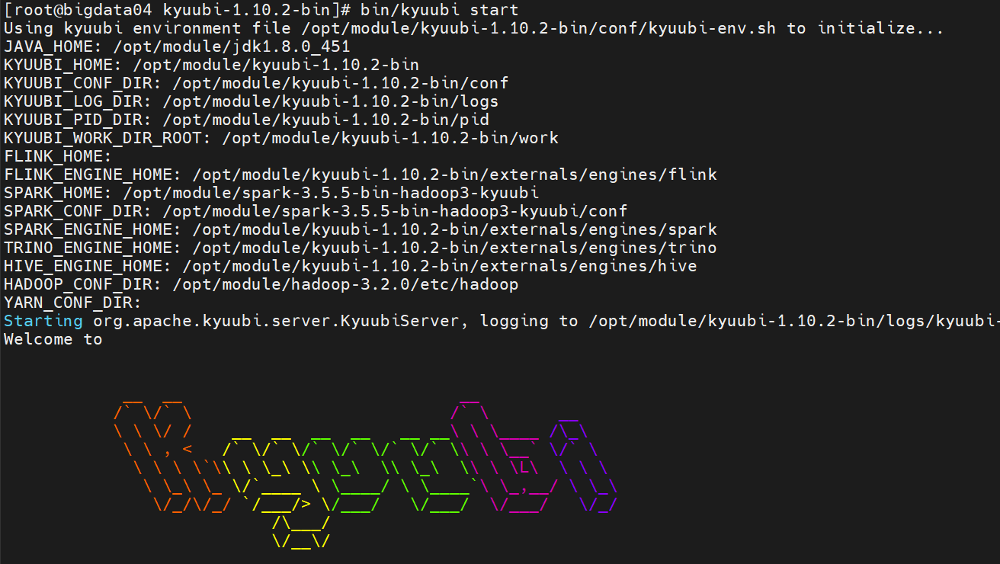

# Kyuubi - 基础环境部署  

>Kyuubi version: 1.10.2, Spark version: 3.5.5 

## 安装 Spark 环境 
访问 `https://archive.apache.org/dist/spark/spark-3.5.5/spark-3.5.5-bin-hadoop3.tgz` 下载 Spark 3.5.5 安装包   

### 修改 conf/spark-env.sh 配置文件  
```bash
# 重命名 spark-env.sh.template 为 spark-env.sh  
mv conf/spark-env.sh.template conf/spark-env.sh

# 修改 spark-env.sh 文件 
vim conf/spark-env.sh 
# 内容如下：  
export JAVA_HOME=/opt/module/jdk1.8.0_451
export HADOOP_CONF_DIR=/opt/module/hadoop-3.2.0/etc/hadoop
```  

## 部署 Kyuubi 服务 
访问 `https://www.apache.org/dyn/closer.lua/kyuubi/kyuubi-1.10.2/apache-kyuubi-1.10.2-bin.tgz` 下载 Kyuubi 1.10.2 安装包  

```bash
# 解压并且指定目录
tar -zxvf apache-kyuubi-1.10.2-bin.tgz -C /opt/module  

# 重命名
mv apache-kyuubi-1.10.2-bin  kyuubi-1.10.2-bin 
```

### 修改 conf/kyuubi-env.sh 配置文件  
```bash
# 重命名 kyuubi-env.sh.template 为 kyuubi-env.sh 
mv conf/kyuubi-env.sh.template conf/kyuubi-env.sh   

vim conf/kyuubi-env.sh 
# 内容如下：
export JAVA_HOME=/opt/module/jdk1.8.0_451
export SPARK_HOME=/opt/module/spark-3.5.5-bin-hadoop3-kyuubi  
export HADOOP_CONF_DIR=/opt/module/hadoop-3.2.0/etc/hadoop
```

### 修改 conf/kyuubi-defaults.conf 配置文件  
```bash
# 重命名 kyuubi-defaults.conf.template 为 kyuubi-defaults.conf 
mv conf/kyuubi-defaults.conf.template conf/kyuubi-defaults.conf
```

### 修改 conf/log4j2.xml 配置文件
```bash
# 重命名 log4j2.xml.template 为 log4j2.xml  
mv conf/log4j2.xml.template conf/log4j2.xml
```

## 启动 Kyuubi 服务
```bash
bin/kyuubi start 
```

输出结果如下：  


## 创建 Kyuubi Engine 
执行 beeline 命令   
注意：jdbc:hive2://bigdata04:10009/ 指向的是 Kyuubi 服务的端口  
```bash
bin/beeline -u 'jdbc:hive2://bigdata04:10009/;#kyuubi.engine.type=SPARK_SQL;spark.master=yarn;spark.submit.deployMode=cluster' -n root
```

启动完后，可以看到 `0: jdbc:hive2://bigdata04:10009/>` 待输入的提示符。 示例输出如下：    
```bash
2025-09-12 02:55:13.313 INFO KyuubiSessionManager-exec-pool: Thread-67 org.apache.kyuubi.shaded.zookeeper.ZooKeeper: Session: 0x100002266820001 closed
2025-09-12 02:55:13.316 INFO KyuubiSessionManager-exec-pool: Thread-67 org.apache.kyuubi.operation.LaunchEngine: Processing root's query[e4421b0e-4123-40ec-b614-7564266e42ed]: RUNNING_STATE -> FINISHED_STATE, time taken: 47.994 seconds
Connected to: Spark SQL (version 3.5.5)
Driver: Kyuubi Project Hive JDBC Client (version 1.10.2)
Beeline version 1.10.2 by Apache Kyuubi
0: jdbc:hive2://bigdata04:10009/>        
```

注意：当 Cli 终端结束后，Seesion 会立马结束，但是 engine 还会再运行一段时间（默认会存活 30分钟）。    

kyuubi.session.idle.timeout.ms=1800000 若需要修改 engine 存活时间，可修改 Kyuubi 配置文件 `kyuubi-defaults.conf`  


>kyuubi 默认是内存元数据模式。   
