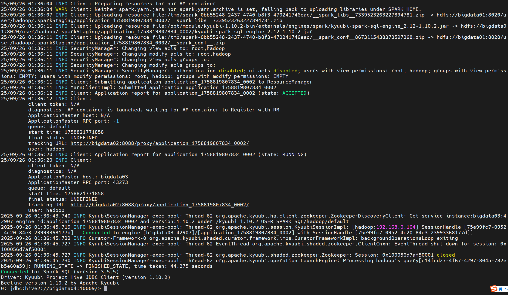

# Kyuubi - beeline 客户端的基本操作  

>Kyuubi version: 1.10.2, Spark version: 3.5.5   

## 前提 
启动 Hadoop 服务（包含 Yarn） 和 Kyuubi Server 环境。 

## 创建 Kyuubi Engine 
执行 beeline 命令 ，-n 用于指定用户，因为 Hadoop 集群使用 hadoop 用户启动，则 -n 为 hadoop 。   
注意：jdbc:hive2://bigdata04:10009/ 指向的是 Kyuubi 服务的端口  
```bash
bin/beeline -u 'jdbc:hive2://bigdata04:10009/;#kyuubi.engine.type=SPARK_SQL;spark.master=yarn;spark.submit.deployMode=cluster' -n hadoop
```

启动完后，可以看到 `0: jdbc:hive2://bigdata04:10009/>` 待输入的提示符。 示例输出如下：      
```bash
2025-09-26 01:36:43.740 INFO KyuubiSessionManager-exec-pool: Thread-62 org.apache.kyuubi.ha.client.zookeeper.ZookeeperDiscoveryClient: Get service instance:bigdata03:42907 engine id:application_1758819807834_0002 and version:1.10.2 under /kyuubi_1.10.2_USER_SPARK_SQL/hadoop/default
2025-09-26 01:36:45.719 INFO KyuubiSessionManager-exec-pool: Thread-62 org.apache.kyuubi.session.KyuubiSessionImpl: [hadoop:192.168.0.164] SessionHandle [75e99fc7-0952-4c20-84e3-23993368177d] - Connected to engine [bigdata03:42907]/[application_1758819807834_0002] with SessionHandle [75e99fc7-0952-4c20-84e3-23993368177d]]
2025-09-26 01:36:45.722 INFO Curator-Framework-0 org.apache.kyuubi.shaded.curator.framework.imps.CuratorFrameworkImpl: backgroundOperationsLoop exiting
2025-09-26 01:36:45.727 INFO KyuubiSessionManager-exec-pool: Thread-62-EventThread org.apache.kyuubi.shaded.zookeeper.ClientCnxn: EventThread shut down for session: 0x100056d7af50001
2025-09-26 01:36:45.727 INFO KyuubiSessionManager-exec-pool: Thread-62 org.apache.kyuubi.shaded.zookeeper.ZooKeeper: Session: 0x100056d7af50001 closed
2025-09-26 01:36:45.730 INFO KyuubiSessionManager-exec-pool: Thread-62 org.apache.kyuubi.operation.LaunchEngine: Processing hadoop's query[c14fcd27-4f67-4297-8045-782eb5e60a59]: RUNNING_STATE -> FINISHED_STATE, time taken: 44.375 seconds
Connected to: Spark SQL (version 3.5.5)
Driver: Kyuubi Project Hive JDBC Client (version 1.10.2)
Beeline version 1.10.2 by Apache Kyuubi
0: jdbc:hive2://bigdata04:10009/>  
```

  

注意：当 Cli 终端结束后，Seesion 会立马结束，但是 engine 还会再运行一段时间（默认会存活 30分钟）。    

若需要修改 engine 存活时间，可修改 Kyuubi 配置文件 `kyuubi-defaults.conf`,添加一下配置：  
```bash
kyuubi.session.idle.timeout.ms=1800000 
```

>需要特别注意的是 kyuubi 默认是内存元数据模式。   
