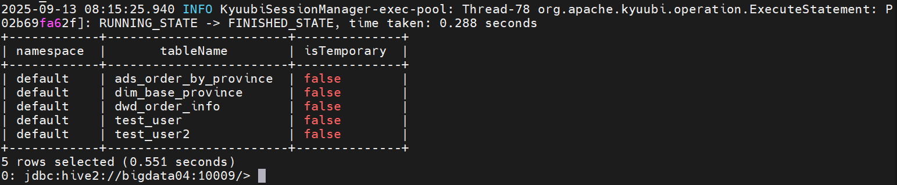

# Kyuubi - Kyuubi 集成 Hive Metastore

## 引言  
Kyuubi 默认引擎是 Spark SQL，默认元数据模式是内存模式。我们也可以给 Kyuubi 引擎指定 Hive Metastore 地址。    

## 启动 Hive Metastore  
在 hive 目录下执行以下命令，启动 Metastore    
```bash
nohup bin/hive --service metastore -p 9083 2>&1 >/dev/null &
```

## 启动 Kyuubi Server
在 kyuubi 目录下执行以下命令，启动 Kyuubi Server  
```bash
bin/kyuubi start
```

## 启动 Kyuubi Engine, 进入 CLI  
添加 `hive.metastore.uris=thrift://bigdata04:9083` 参数指定 hive metastore 的地址。jdbc:hive2://... 指向的 Kyuubi 端口
```bash
bin/beeline -u 'jdbc:hive2://bigdata04:10009/;#kyuubi.engine.type=SPARK_SQL;spark.master=yarn;spark.submit.deployMode=cluster;hive.metastore.uris=thrift://bigdata04:9083' -n root
```  

启动成功后，可以看到 `0: jdbc:hive2://bigdata04:10009/>` 待输入的提示符。 

此时输入 `show tables` 命令，查看表；示例输出如下：     
   

