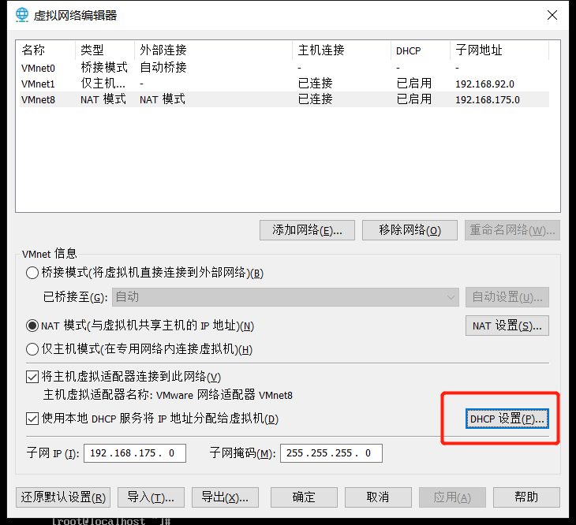
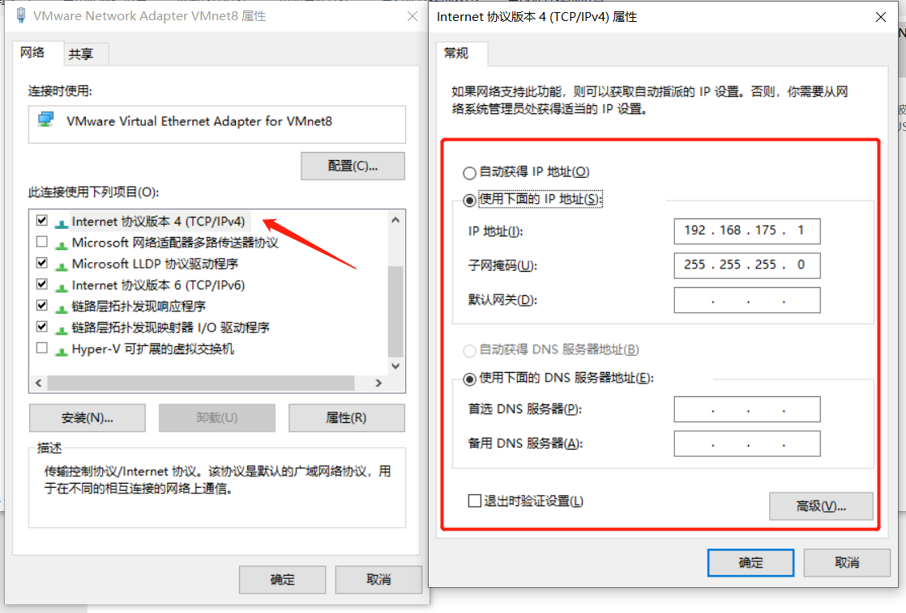

## VMware虚机配置固定ip


>本文要达到的效果是： 主机和虚拟机之间可以互相ping通，若主机可以上网则虚拟机也可以正常上网，并且在任意办公地点接入其他网络后，虚机的IP保持不变。    
需注意： 若满足以上需求，则与当前主机处于同一个局域网的其他主机是不能访问当前主机上的虚拟机的

### 设置VMnet8网络 NAT模式
打开“VMware Workstation” 从菜单栏“编辑” -> “虚拟网络编辑器” 设置Vmnet8。

需做到以下几项：

**1.基础配置，满足红框部分**    


**2.查看NAT配置，设置网关IP(保持默认即可)**


>注意 网关IP地址后续要配置在Centos系统中

**3.查看DHCP设置，知晓IP地址区间范围**


>注意 Centos系统ip配置需在区间范围内

### Windows关闭访问墙


### Windows配置vmnet8虚拟网卡静态IP



### 配置虚机(centos7)的网卡信息
```shell
3.1 编辑centos7的网卡信息
vim /etc/sysconfig/network-scripts/ifcfg-eth0 (具体网卡名称 查看 ifconfig,windows机器使用ipconfig/all 全部信息)

编辑ifcfg-xxx 网卡文件：
TYPE="Ethernet"
BOOTPROTO="static" #修改项
DEFROUTE="yes"
PEERDNS="yes"
PEERROUTES="yes"
IPV4_FAILURE_FATAL="no"
IPV6INIT="yes"
IPV6_AUTOCONF="yes"
IPV6_DEFROUTE="yes"
IPV6_PEERDNS="yes"
IPV6_PEERROUTES="yes"
IPV6_FAILURE_FATAL="no"
IPV6_ADDR_GEN_MODE="stable-privacy"
NAME="eth0"
UUID="4cf6c015-f0df-4b9e-ba24-d9ed76dd4848"
DEVICE="eth0"
ONBOOT="yes"    #修改项
IPADDR=IP #添加项
NETMASK="255.255.255.0" #添加项
GATEWAY=网关IP  #添加项
DNS1=网关IP     #添加项

重启网卡服务
service network restart
```