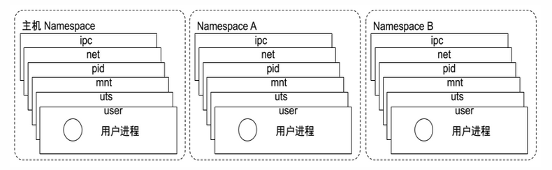

## Linux 内核之 Namespace       

### Namespace 介绍    
* Linux Namespace 是一种 Linux Kernel 提供的资源隔离方案    
* 系统可以为进程分配不同的 Namespace        
* 并保证不同的 Namespace 资源独立分配、进程彼此隔离，即不同的 Namespace 下的进程互不干扰      

### Namespace 分类   
#### Linux 内核代码中 Namespace 的实现       

* 进程数据结构    
```c
struct task_struct {
...
/* namespaces */
struct nsproxy *nsproxy;
...
```

* Namespace 数据结构            
```c
struct nsproxy 
	{ atomic_t count;
	struct uts_namespace *uts_ns; 
	struct ipc_namespace *ipc_ns; 
	struct mnt_namespace *mnt_ns; 
	struct pid_namespace
*pid_ns_for_children;
 struct net *net_ns;
}
```

    

>从上图可了解到，Namespace 可以区分为以下类型。         

#### pid namespace   
- 不同用户的进程就是通过 pid namespace 隔离开的，且不同 namespace 中可以有相同 pid。        
- 有了 pid namespace, 每个 namespace 中的 pid 能够相互隔离。            

#### net namespace 
- 网络隔离是通过 net namespace 实现的， 每个 net namespace 有独立的 network devices, IP addresses, IP routing tables, /proc/net 目录。      
- Docker 默认采用 veth 的方式将 container 中的虚拟网卡同 host 上的一个 docker bridge: docker0 连接
在一起。            

#### ipc namespace   
- Container 中进程交互还是采用 linux 常见的进程间交互方法 （interprocess communication – IPC）, 包括常见的信号量、消息队列和共享内存。          
- container 的进程间交互实际上还是 host上 具有相同 Pid namespace 中的进程间交互，因此需要在 IPC
资源申请时加入 namespace 信息 - 每个 IPC 资源有一个唯一的 32 位 ID。            

#### mnt namespace 
mnt namespace 允许不同 namespace 的进程看到的文件结构不同，这样每个 namespace 中的进程所看
到的文件目录就被隔离开了。  

#### uts namespace   
UTS(“UNIX Time-sharing System”) namespace允许每个 container 拥有独立的 hostname 和 domain name, 使其在网络上可以被视作一个独立的节点而非 Host 上的一个进程。            

#### user namespace  
每个 container 可以有不同的 user 和 group id, 也就是说可以在 container 内部用 container 内部的用户执行程序而非 Host 上的用户。      

### 关于 namespace 的常用操作 

#### lsns 查看当前系统 不同类型的 namespace 
```shell
lsns -t <namespace type 参考上面的 namespace分类>
# eg: 查看 net namespace 
lsns -t net 
```

#### ls 查看某个进程的 namespace 
```shell
# 查看某进程的 namespace： 
ls -la /proc/<pid>  
```

### nsenter 进入 某个 namespace，运行命令  
```shell   
# 进入某 namespace 运行命令：  
nsenter -t <pid> -n ip addr  
```


refer   
1.https://www.l6bj.com/post/cloudnative/docker/02-namespace/        