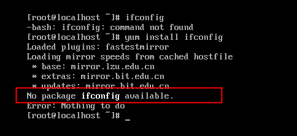
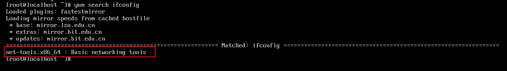

**正文**

[TOC]

>centos7 最小化安装，缺少很多依赖包，这些都需要自己操作

## 配置 ifconfig
1. ifconfig: command not found ,再通过yum安装 ，提示 No package ifconfig available .

2. 提示没有ifconfig安装包，再使用yum search ifconfig 来搜索与ifconfig相关的包

3. 查看ifconfig匹配的是 net-tools.x86_64包，安装net-tools.x86_64包 `yum -y install net-tools.x86_64`

