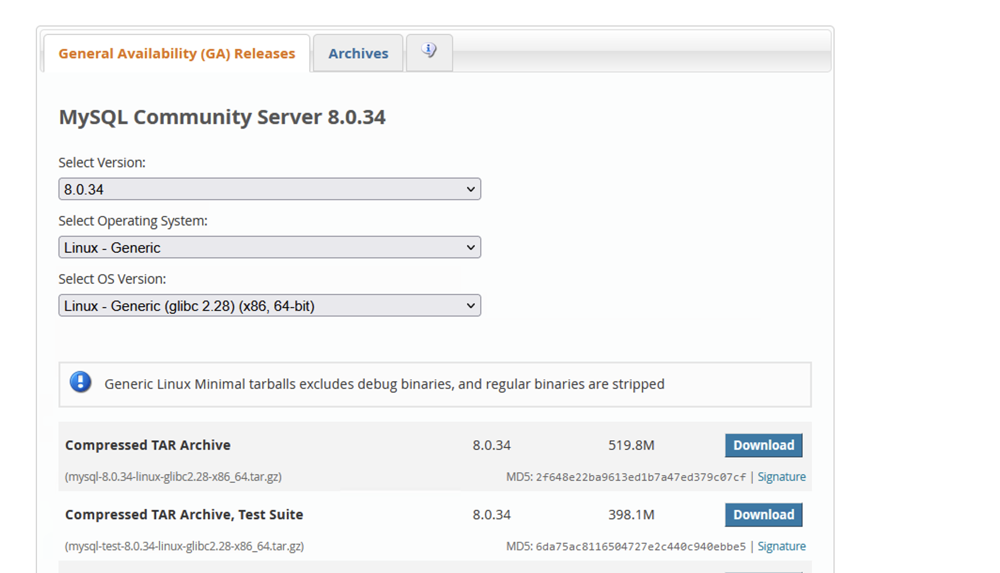

## CentOS7 安装 MySQL8  

### 卸载系统自带 MySQL（MariaDB）   
```shell
# 查看安装过的 MySQL和MariaDB
yum list installed | grep mariadb && yum list installed | grep mysql

# 卸载
yum -y remove mariadb-libs.x86_64
```

### 下载 MySQL 安装包   
下载地址： https://dev.mysql.com/downloads/mysql/   

      


1. 下载mysql rpm
```shell
wget https://dev.mysql.com/get/mysql80-community-release-el7-6.noarch.rpm
``` 

2. 安装
```shell
yum -y install mysql80-community-release-el7-6.noarch.rpm
```

3. 查看rpm安装效果
```shell
yum repolist enabled | grep mysql.* 
```

4. 安装Mysql
```shell
yum -y install mysql-community-server
```

5. 启动mysql
```

systemctl start mysqld
systemctl status mysqld

```

6. 查找初识密码
```
grep "temporary password" /var/log/mysqld.log
```

> 背景是root密码忘记
### 1.Operation ALTER USER failed for 'root'@'%'

进入mysql库
use mysql；

刷新权限
mysql> flush privileges;

清空密码
mysql> UPDATE user SET authentication_string="" WHERE user=“root”;

刷新权限
mysql> flush privileges;

设置root的新的密码
mysql>alter user’root’@’%’ IDENTIFIED BY 'test123 ';

刷新权限
mysql> flush privileges;

退出mysql，清除vim /etc/my.cnf的skip-grant-tables后重启mysql
systemctl restart mysqld.service